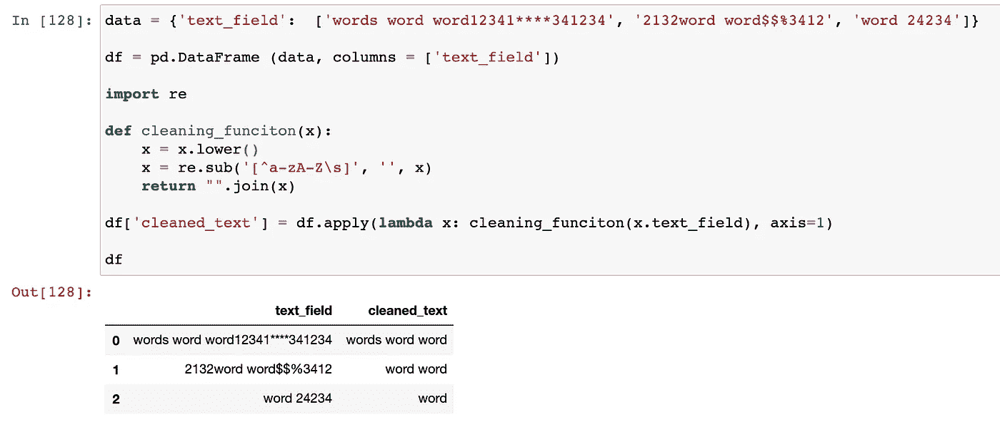

# 软件工程是数据科学的先决条件吗？

> 原文：<https://towardsdatascience.com/is-software-engineering-a-prerequisite-for-data-science-1be744b1195c?source=collection_archive---------39----------------------->

## 在这里找到答案。


照片由 [ThisisEngineering RAEng](https://unsplash.com/@thisisengineering?utm_source=unsplash&utm_medium=referral&utm_content=creditCopyText) 在[un splash](https://unsplash.com/s/photos/software-engineering?utm_source=unsplash&utm_medium=referral&utm_content=creditCopyText)【1】上拍摄。

# 目录

1.  介绍
2.  软件工程
3.  数据科学
4.  摘要
5.  参考

# 介绍

虽然数据科学工作描述需要一系列不同的技能，但有一些具体的先决条件可以帮助您成为一名成功的数据科学家。这些技能包括但不限于:沟通，统计，组织，最后，编程。编程可能会非常模糊，例如，一些公司在面试中可能会要求数据科学家用 Python 编写一个常见的熊猫功能，而其他公司可能会要求完全采用带类的软件工程。

由于我在许多不同的公司担任过不同的职位，我遇到过数据科学家和软件工程师，因此我对成为一名成功的数据科学家需要什么有了很好的认识。下面，我将概述软件工程和数据科学，并回答这个问题:“*软件工程是数据科学的先决条件吗？*”。

# 软件工程

就像数据科学一样，计算机科学中的这个领域可以包括几种不同的技能。然而，这些角色中的大多数都需要你精通至少一门编程语言，并且了解软件开发的生命周期。软件工程师经常使用的编程和编码语言有[2]:

```
JavaPythonC#/.NetRuby
```

其中一个突出的主要语言是 Python。这是因为这种语言也经常被数据科学家使用。

另一组技能是知道如何用这些特定的概念实践面向对象设计(OOD ):

```
AbstractionEncapsulationInheritancePolymorphism
```

或许，这些概念在数据科学岗位上的应用并不那么广泛；然而，它们可以提供更好的建模过程，具有高效的自动化和可伸缩性。随着机器学习模型的出现，出现了大量需要不断监控、更改、转换、删除等的数据。在 Python 编程语言中使用这些概念不仅会给你的工程部门留下深刻印象，还会让你更加独立地工作。类似地，当不仅与数据科学家合作，还与软件工程师合作时，构建模型及其部署的过程将更加健壮和高效。

> ***举例***

下面的例子展示了如何使用一个类来访问你的机器学习模型的 sklearn 库。也可以通过在管道中引用该类来访问它，该管道将为您的 pandas 数据帧适当地转换您的文本和数字特征。虽然这可以在没有软件工程或 OOD 的情况下完成，但在下面的格式中，它要快得多，更容易，并且可伸缩。下面是示例的代码和要点(*相同的代码，不同的视觉效果*):

```
# text and numeric classes that use sklearn base libaries
class TextTransformer(BaseEstimator, TransformerMixin):
    """    Transform text features    """    
    def __init__(self, key):
        self.key = key    
    def fit(self, X, y=None, *parg, **kwarg):        
        return self    
    def transform(self, X):        
        return X[self.key] class NumberTransformer(BaseEstimator, TransformerMixin):    
    """    Transform numeric features    """    
    def __init__(self, key):        
        self.key = key    
    def fit(self, X, y=None):        
        return self    
    def transform(self, X):        
        return X[[self.key]]
```

GitHub gist [3]上作者的代码。

# 数据科学



作者截图[4]。

如果你还不知道，我支持作为一名数据科学家学习软件工程。软件工程不仅有助于提高机器学习模型的可扩展性，而且还有助于集成。使用 Python 函数，您可以读入数据、训练您的模型并将其部署到新环境中，以便您的建议或预测将输出到最终用户的最佳位置。一般来说，使用软件工程或者简单地实践 OOD 和 Python 函数的最重要、也是最简单的方法可能是大大减少执行某项任务所需的时间和代码。许多探索性的数据分析和模型构建可能涉及一行又一行的冗余代码，但通过一些简单的功能，数据科学家可以接收数据帧并对其进行操作，以便使用某些行值或获取某些列作为特征。

> ***例子***

虽然一些数据科学家更喜欢用 R 编写代码，但我相信 Python 更好，原因有很多(*参见下面的链接了解更多信息*)。下面是一个使用 Python 对 pandas 数据帧中的文本列执行自然语言处理(NLP)的简单方法的例子。在这段代码中，您可以看到' *text_field* 中的数据由字符串、数字和特殊字符组成。要从列中删除这些不需要的脏数据，您可以使用逐行执行每个列的任务的技术，但是在本例中，开发了一个清理功能，以便可以从一个位置访问所有使用的清理方法。您还可以通过创建另一个函数来进一步改进这个示例，该函数将应用于循环的*中的 dataframe 列列表。此外，您可以添加更多的清理步骤，最终满足清理杂乱文本数据的目标。下面是示例的代码和要点(*相同的代码，不同的视觉效果*):*

```
data = {'text_field':  ['words word word12341****341234', '2132word word$$%3412', 'word 24234']} df = pd.DataFrame (data, columns = ['text_field']) import re def cleaning_funciton(x):
    x = x.lower()    
    x = re.sub('[^a-zA-Z\s]', '', x)    
    return "".join(x) df['cleaned_text'] = df.apply(lambda x: cleaning_funciton(x.text_field), axis=1)
```

GitHub gist [5]上作者的代码。

# 摘要

> 软件工程是数据科学的先决条件吗？

答案是*是的*。数据科学家常常会在职业生涯中苦苦挣扎，尤其是大学毕业后，因为他们必须与软件工程师合作，并部署自己的模型。虽然你可以成为一名数据科学家，在小公司专注于统计数据和一次性任务(也同样受人尊敬和常见)，但最好潜心学习面向对象设计，这样你才能最终成为最优秀、最成功的数据科学家。通过软件工程，你将能够与其他工程师交流，部署复杂的模型，并将你强大而有用的机器学习模型扩展到越来越多的业务中。

如果你过去主要关注的是数据科学、统计学和小规模的编程，那么提高你的整体编码技能，使之类似于软件工程师，永远都不晚。

*我希望你觉得这篇文章既有趣又有用。感谢您的阅读！*

# 参考

[1]照片由[在](https://unsplash.com/@thisisengineering?utm_source=unsplash&utm_medium=referral&utm_content=creditCopyText)[Unsplash](https://unsplash.com/s/photos/software-engineering?utm_source=unsplash&utm_medium=referral&utm_content=creditCopyText)(2020)上拍摄

[2] Daniel Bortz，Monster 撰稿人，[当今就业市场的顶级软件工程师技能](https://www.monster.com/career-advice/article/software-engineer-skills)，(2020)

[3] M.Przybyla， [GitHub 类要诀](https://gist.github.com/mprzybyla123/79047d1ca660b5dafd11c18911965d35)，(2020)

[4] M.Przybyla，清理功能截图，(2020)

[5] M.Przybyla， [GitHub 清洁要点](https://gist.github.com/mprzybyla123/fd891e476cd8b9563d3552d74c5cf7db)，(2020)

[6] M.Przybyla， [Python 比 R.](/python-is-better-than-r-f7bb963a1c85) ，(2020)

[](/python-is-better-than-r-f7bb963a1c85) [## Python 比 r 好。

### 原因如下。

towardsdatascience.com](/python-is-better-than-r-f7bb963a1c85)