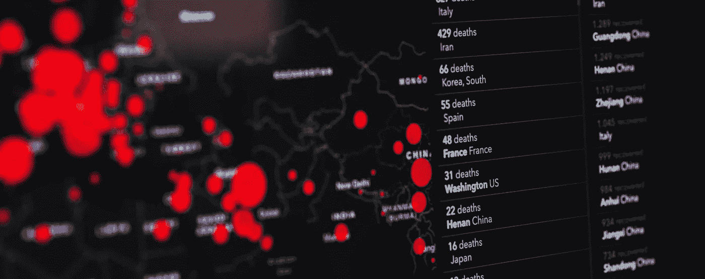
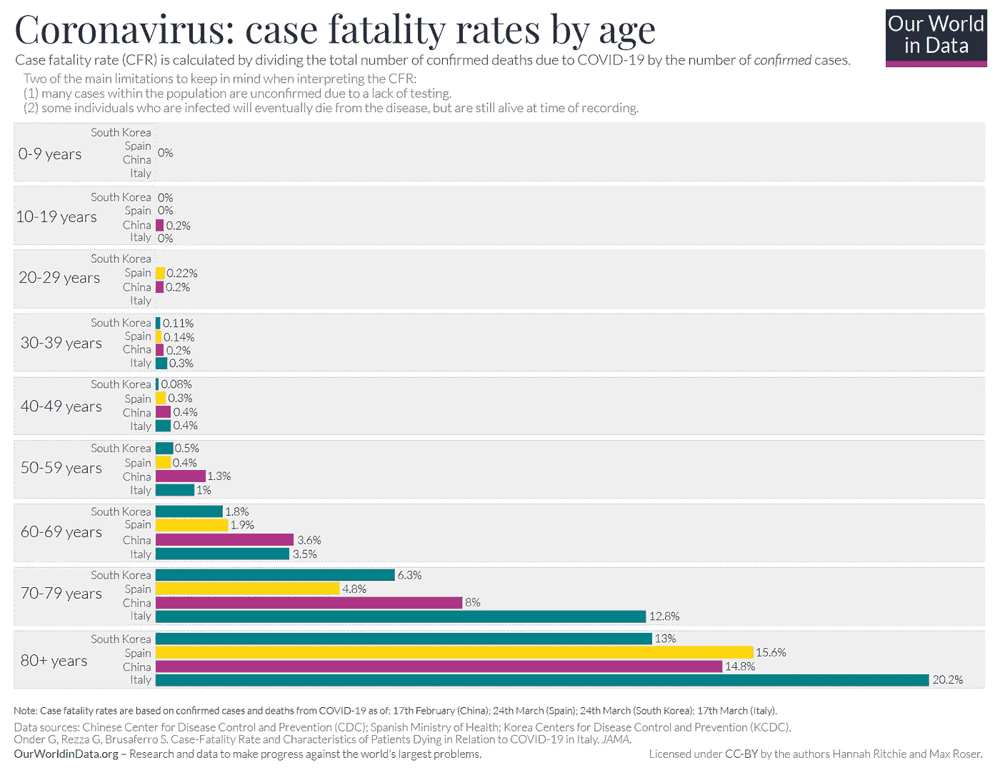
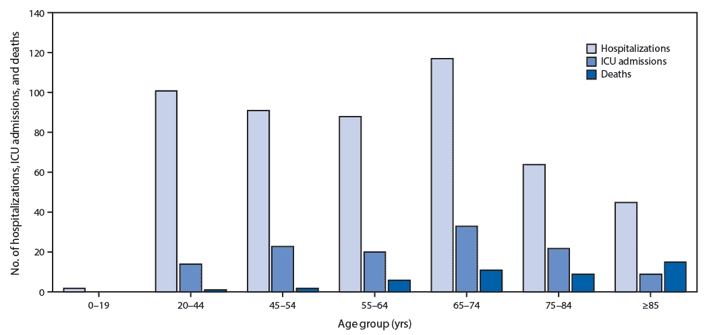
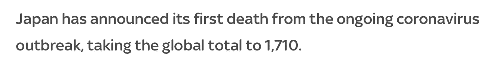
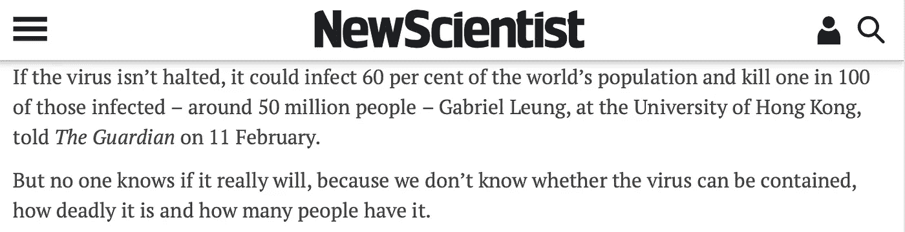
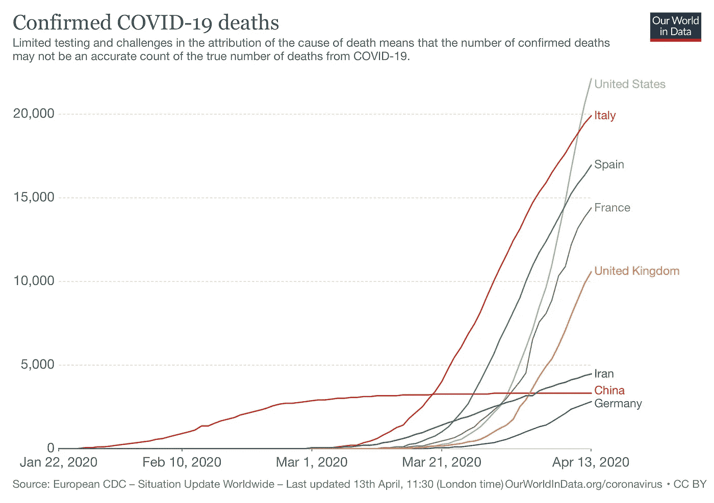
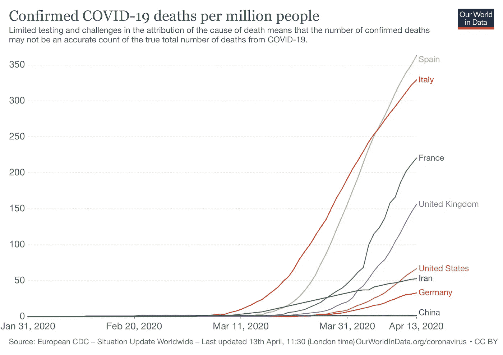
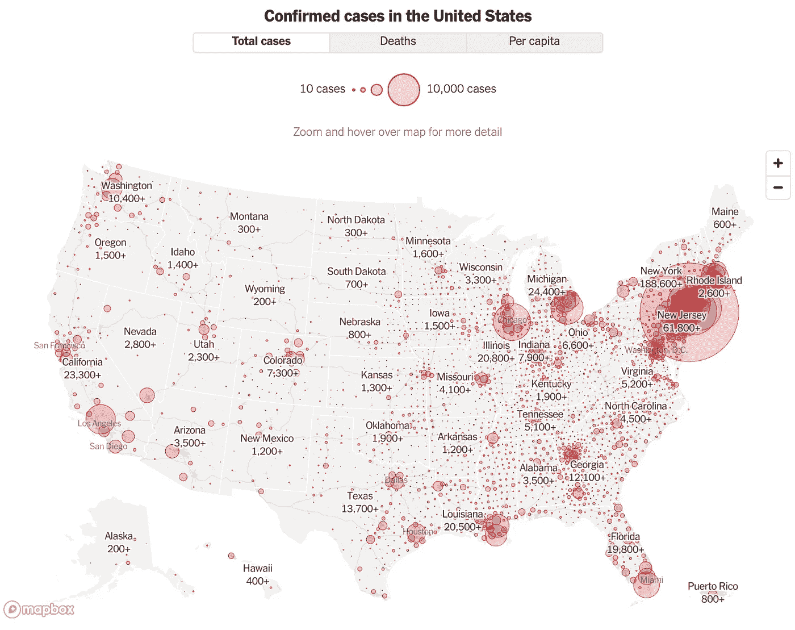
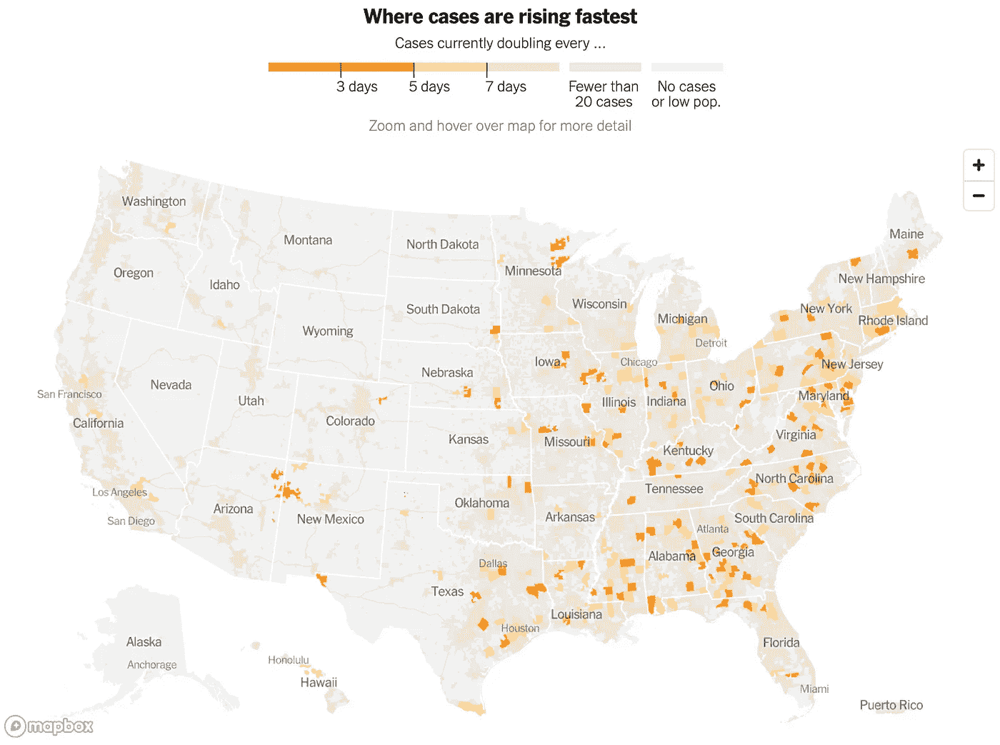

# 新冠肺炎数据仪表板做得好吗？还是实际上比没有更糟？

> 原文：<https://towardsdatascience.com/is-that-covid-19-data-dashboard-doing-good-or-is-it-actually-worse-than-nothing-de43da1c98be?source=collection_archive---------42----------------------->

## 数据可视化如何在疫情中误导或误导公众，以及为什么领域专业知识很重要。#负责任地

马库斯·斯皮斯克在 [Unsplash](https://unsplash.com/s/photos/coronavirus?utm_source=unsplash&utm_medium=referral&utm_content=creditCopyText) 上的照片

这几天世界上的一切似乎都颠倒了。

我们过去习以为常的简单日常活动——出去吃顿饭、喝杯咖啡或看望朋友和家人——即使没有完全停止，也已经发生了巨大的变化。

我们仍然可以进行的极少数活动，如购物、购买必需品，已经变成了一场*游戏，外面的世界是(看不见的)熔岩。*

有鉴于此，当人们被困在家里或离家很近时，看到他们的焦虑和厌倦感逐渐增加(包括我自己)也就不足为奇了。对一些人来说，这意味着用可笑的拼图游戏来惩罚自己，或者在动物穿越天堂寻求安慰。

对于许多美国统计和数据爱好者来说，他们一直在关注新冠肺炎的数据仪表板，这些仪表板基于来自《纽约时报》或欧盟的数据集。

说实话，我不记得在一个主题上见过像新冠肺炎那样多的数据面板。虽然它们中的许多信息非常丰富，但我认为值得考虑我们的观想向读者传递了什么信息。特别是在一个正在进行的疫情，人们的行动会极大地影响当地和全球范围的结果。

首先，让我们来看看一些可能的意外或无意的结果。

# 意想不到的后果

正如《魔鬼经济学》的作者所说，意想不到的后果无处不在——数据可视化也不例外。在某些情况下，即使是最善意的准确数据呈现也可能导致误解，进而导致糟糕的决策。这里有一个。

## 按年龄分列的死亡率

从一开始，像这样的图表就成了新闻，表明新冠肺炎老年人的死亡率比年轻人高得多。

*(明确地说，我认为***数据中的我们的世界是惊人的——我只是指一些人可能会如何解读这些数据。)**

**

*按年龄划分的病死率— [数据中的世界](https://ourworldindata.org/coronavirus#case-fatality-rate-of-covid-19-by-age)*

*另一方面，看看下面的图表。根据美国的早期数据，就绝对数字而言，20-44 岁的人比 75-85 岁的人住院的多！*

**

*来源:[疾病预防控制中心](https://www.cdc.gov/mmwr/volumes/69/wr/mm6912e2.htm?s_cid=mm6912e2_w#F1_down)*

*与上面显示死亡率的图表相比，你会从中得出一个非常不同的结论。*

*哪个更准确？当然，他们都是对的。它们只是显示了疾病及其影响的不同方面。我确信大多数读者能够很容易地将这两者调和起来。*

*但是对于一个不经意的读者来说，他们会怎么看呢？对一些人来说，看到这样或那样的图表可能会导致关于不同人口统计学风险的大相径庭的结论。*

*在疫情进展的早期，从这种类型的数据中得出的简单理解是，年轻人没有太大的病毒风险。*

*我们还看到了一系列随后的新闻，关于年轻人无视封锁和社交距离的命令，去参加聚会，涌向海滩。他们有关系吗？当然，这很难说。(两种方式都没有数据！)但不难想象这样的图表会产生影响。*

*更具体地说，上面的例子是一个简单的图表可以用相同的数据显示的消息传递的清晰缩影。这是另一个例子，简单地展示了在讨论死亡事故时语言的力量，当前死亡事故与预计死亡事故。*

## *死亡总数*

*我怀疑我们许多人都记得今年 1 月、2 月甚至 3 月的声音——认为新冠肺炎死亡总人数仍然只有几十、几百、几千人，而且这只是流感季节或甚至每天道路死亡人数的一小部分。*

*撇开对人类生命难以置信的冷酷不谈，这种说法没有抓住警钟的要点。严肃对待新型冠状病毒是基于它可能造成的潜在破坏，而不仅仅是当时不小的损失。*

*但是，这样的标题可能对事情没有帮助:*

**

*天空新闻头条([文章](https://news.sky.com/story/coronavirus-more-than-14-800-new-cases-reported-yesterday-11932787))*

*这篇特别的文章没有提供任何背景——为什么这种病毒如此可怕，它的传染性如何，以及如果它进入世界各地的社区会有什么样的预测。当然，如果读者一直关注新闻，他们可能会听说所有这些，但不是每个人都有时间这样做，或者倾向于一篇接一篇地阅读文章。*

*另一方面，上一篇文章三天前发表的下一篇文章传递了一个完全不同的信息。*

**

*来自《新科学家》的预测，发表于同一时间([文章](https://www.newscientist.com/article/2233269-how-bad-is-the-covid-19-coronavirus-outbreak-likely-to-get/#))*

*这篇文章的主要观点是新冠肺炎可以杀死*数千万*人！再说一次，即使在同一时间，用同样的基本事实，仅仅通过提出一个预测而不是目前的数字，就会得出一个非常不同的基调。*

*现在，让我们来看看，对于相应的不同解释，同一个数据集是如何以非常不同的方式可视化的。*

# *画什么，怎么画？*

*即使不考虑误解的风险，呈现与快速传播、高繁殖数的传染病相关的数据也不是一件容易的事情。*

*就拿这两张图表来说吧，取自[我们的世界数据](https://ourworldindata.org/coronavirus)。第一张图显示了受此影响最严重的国家的总死亡人数。*

**

*。新冠肺炎确诊死亡总数(来源: [OurWorldinData](https://ourworldindata.org/coronavirus)*

*在这张图表中，美国的总数和斜率似乎非常惊人，而中国由于其最初的爆发而出现的早期数字在所有曲线中非常突出。*

*与此同时，下一张图展示了完全相同的数据，但每个国家每百万人的标准化数据。*

**

*每百万人确诊的新冠肺炎死亡总数(来源: [OurWorldinData](https://ourworldindata.org/coronavirus)*

*这描绘了一幅截然不同的画面。就人均而言，中国的数据甚至从未超出 y 轴太多，美国的数据似乎也不像之前的数据那样令人担忧，西班牙和意大利的数据突然看起来是最差的。*

*如果你想知道这有什么大惊小怪的，为什么这个世界基本上已经关闭了，后一张图会对他们说什么？每个图表暗示了哪个国家在这方面做得最好/最差？*

*因此，有人可能会问——什么更合适？*

*鉴于新冠肺炎是一种传染病，因此它在一个特定国家内的分布并不均匀，那么总体人口是合适的分母吗？总数是更好的衡量标准吗？它应该被看作是震中数量的函数吗？或者考虑到它的传染性，也许它应该基于人口密度。*

*最重要的是，组织、政府甚至地方层面的决策者将如何解读图表并据此采取行动？*

*没有领域专业知识，像我这样的人就无法判断这些事实。此外，我甚至不知道如何开始解释这些数字，或者像泰勒和桑斯坦可能会说的那样，什么可能导致最有利的“T0”推动“T1”。*

*最后，让我们看看一些映射的数据:*

*甚至绘制数据也不是一项简单的任务。让我们看看美国。这张图片来自《纽约时报》优秀的[新冠肺炎追踪页面](https://www.nytimes.com/interactive/2020/us/coronavirus-us-cases.html)。*

**

*来源:纽约时报的[新冠肺炎追踪页面](https://www.nytimes.com/interactive/2020/us/coronavirus-us-cases.html)美国*

*上图显示了截至 2020 年 4 月 13 日的病例总数，以县为单位进行汇总和呈现。这描绘了一幅令人担忧的画面，你很难在美国找到许多没有爆发疫情的地方。*

*但是，下一张图片展示了一个对比鲜明的快照。*

**

*来源:纽约时报的新冠肺炎追踪页面*

*这张图显示了新病例的增长率。对我来说，最突出的是新冠肺炎的增长在西海岸急剧放缓，而在东海岸和南部却保持快速增长。*

*考虑到像加利福尼亚这样的州迄今为止相对较大的感染人数，这个数字对许多人来说是相当令人吃惊的。同样的数据集，截然不同的结果和收获。*

*例如，有人在看这张地图时，可能会试着找出为什么会这样，以及如何在东海岸复制这个结果。而从第一个图中可能没有这样的指示。*

> *在选择、过滤、处理和呈现数据的过程中，我们做出了无数的选择——这些选择极大地影响了输出和读者的印象*

*我在这里想表达的观点是很明显的。我们这些呈现数据或创造数据可视化的人不能假装他们的解释是不可知的，不知道创造可视化的工作。*

*是的，数据仍然是数据，但是在选择、过滤、操作和呈现数据的过程中，我们做出了无数的选择。反过来，这些选择极大地影响了作品的输出和读者的印象。*

*数据可视化仅仅是一个服务于一个目的的工具。它不是为自身而存在的东西。更具体地说，观想需要符合潜在的意图——也就是，一个人试图传达的信息，并且有效地做到这一点。作者需要考虑这个信息是什么，它的目的是什么。*

*在当前的气候下，我们正在经历的疫情已经导致数百万人失业、流离失所、失去医院护理，并可能导致数十万人丧生，因此，风险从未如此之大。*

*正如阿曼达·马库雷克在《T2》中完美地说的那样，让我们负责任。*

*注意安全，各位。*

*如果你喜欢这个，比如说👋/关注[推特](https://twitter.com/_jphwang)，或点击此处获取更新。此外，ICYMI，我在这里写了不同国家的医疗保健能力:*

* [## 各个国家的医疗保健能力是什么样的？

### 鉴于冠状病毒(新冠肺炎)，按国家可视化和比较医疗保健数据和指标。

towardsdatascience.com](/what-do-various-countries-healthcare-capacities-look-like-1581896a0601)* 

****编者按:*** [*走向数据科学*](http://towardsdatascience.com/) *是一份以数据科学和机器学习研究为主的中型刊物。我们不是健康专家或流行病学家，本文的观点不应被解释为专业建议。想了解更多关于疫情冠状病毒的信息，可以点击* [*这里*](https://www.who.int/emergencies/diseases/novel-coronavirus-2019/situation-reports) *。**