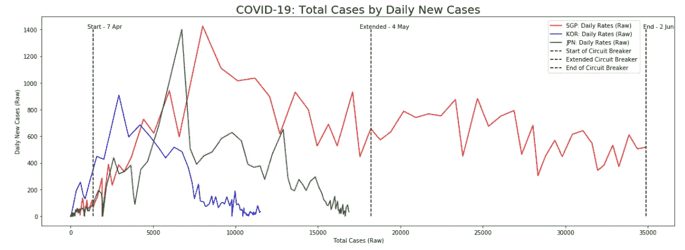
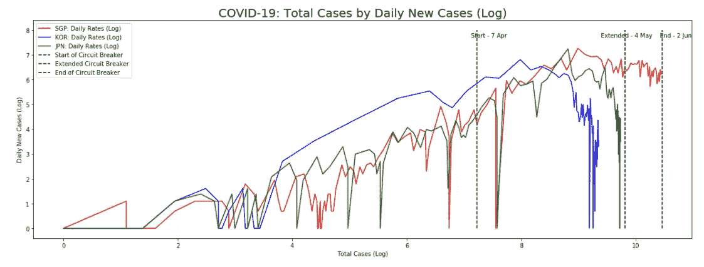
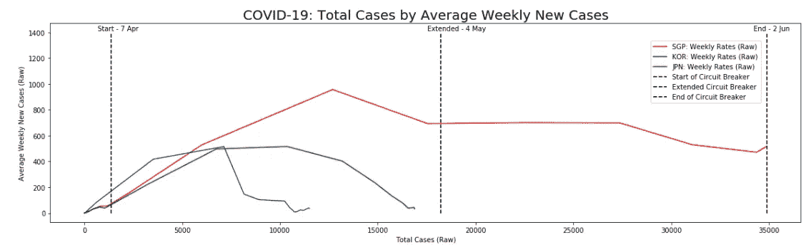
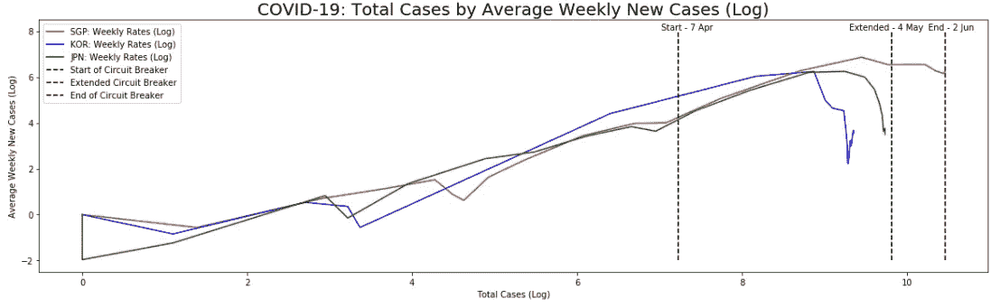
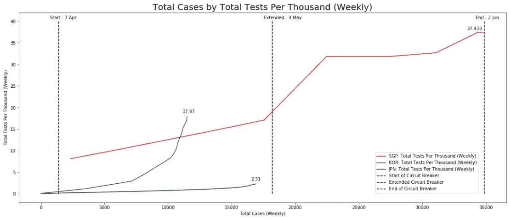

# 新加坡的新冠肺炎曲线变平了吗？

> 原文：<https://towardsdatascience.com/is-the-covid-19-curve-flattening-in-singapore-857219f72f1?source=collection_archive---------58----------------------->

格伦·卡丽在 [Unsplash](https://unsplash.com?utm_source=medium&utm_medium=referral) 拍摄的照片

***编者按:*** [*走向数据科学*](http://towardsdatascience.com/) *是一份以数据科学和机器学习研究为主的中型刊物。我们不是健康专家或流行病学家，本文的观点不应被解释为专业建议。想了解更多关于疫情冠状病毒的信息，可以点击* [*这里*](https://www.who.int/emergencies/diseases/novel-coronavirus-2019/situation-reports) *。*

“断路器”——换句话说，锁定——已经过去 2 个月了，今天是它的结束！(有点)😃

GIPHY Studios Originals 制作的快乐无比激动 GIF，2016 年 11 月 18 日([来源](https://giphy.com/gifs/studiosoriginals-3oz8xRF0v9WMAUVLNK))

然而，在这两个月里，最让我困惑的是，我们在新闻上看到的所有新冠肺炎图表为什么没有提到一张标明病毒检测率的图表。

这使得新加坡人很难很好地衡量我们和其他国家的实际情况。

一个国家检测得越多，发现的病例就越多，这是有道理的，因此，从视觉上扭曲了国家在“拉平曲线”方面的实际表现。

这些曲线真的变平了，还是这些国家测试得不够？

在时间轴上绘制每日价格的确讲述了一个故事，但那只是故事的一部分。

它们是描述性的吗？

肯定是的！

它们是否有助于告诉我们曲线是否接近平坦？

**不完全是…**

所以对我来说更大的问题是…

> 新加坡**真的**做的怎么样？

曲线变平了吗？我们怎样才能最好地想象这一点？我们如何添加关于测试率的信息？

为了回答所有这些迫切的问题，我谷歌了其他人是如何可视化他们的 COVD-19 数据的。

还有…

我找到了金子。

这个视频值得你花每一分钟的时间。

1.  这些图像非常有用，可以告诉我们曲线是否会变平。
2.  然而，他们仍然没有参考测试率。(让我们稍后将这些信息绘制出来，以获得完整的图片)

看过这个视频后，我决定获取最新的新冠肺炎数据，并尝试按照这个视频中的分析，并加入我们的测试率数据，以更好地了解新加坡的实际情况。

我们开始吧！

# 获取数据

最初，我想靠自己搜集数据，但意识到已经有成千上万的人在这么做了。

为什么要重新发明轮子？😉

数据集可以在这个公共存储库中找到

 [## owid/新冠肺炎数据

### 关于新冠肺炎(冠状病毒)确诊病例、死亡和检测的数据*所有国家*由我们的世界在数据中每日更新…

github.com](https://github.com/owid/covid-19-data) 

多亏了 ourworldindata.org，我可以很快获得数据进行分析。

# 新冠肺炎可视化

对于每个可视化，我都标注了断路器周期的开始、延长和结束时间。

另外，请注意日期是隐藏变量。

为了不那么拥挤，我只用韩国和日本作为参考，看看新加坡的情况。

这里的目标是绘制发现新病例的**率**，以直观地表示曲线是否即将变平。

## 每日新增病例的新增病例总数

新冠肺炎-每日新增病例的新增病例总数

在此图中，您可以看到新加坡、韩国和日本的总病例数与原始新病例数的对比。

使用原始值的问题在于很难看出是否有“变平”效应发生。

因此，观察这种效应的一种方法是用轴的对数变换来放大变化率，如下所示:

新冠肺炎-按每日新病例统计的新病例总数(日志)

注意韩国和日本的曲线是如何变平的？

不幸的是，对新加坡来说，我们的曲线还没有变平，或者至少开始变平了。

现在，让我们通过平均每周的案例来平滑上面的图，以获得更好的视觉效果。

## 按每周平均新增病例统计的新增病例总数

新冠肺炎-按每周新增病例统计的新增病例总数

新冠肺炎-按每周新病例列出的新病例总数(日志)

请注意这里的一些有趣的事情，用周平均值而不是每日案例来绘图显示了更好的视觉效果和更容易检测到第二波**的能力。**

韩国显然正在进入第二波疫情。

日本的曲线肯定变平了。

新加坡的曲线开始变平。(我希望)

值得注意的是，到目前为止我展示的所有这些图表都没有考虑到测试率。

我没有为测试率绘制第二个 y 轴，而是觉得最好将它们分开，不要挤在上面的视图中。

## 按每千例总测试数列出的总病例数(每周)

我在处理这些数据时遇到的一个问题是不同的国家如何报告他们的测试率。

对于新加坡，我们每周报道一次。

一些国家，如韩国或日本，他们每天都有报道。

有些国家甚至根本不报告。

为了公平比较，由于新加坡每周报告，我对韩国和日本进行了平均每周测试计数。

此外，我直接在图上标注了最后的“每千测试总数”数字。

新冠肺炎-按每千人总检测数列出的总病例数(每周)

从图中可以立即看出，新加坡对**的测试非常多**。

比较每千人的测试总数，新加坡每千人测试的*比日本多近 18 倍，新加坡每千人测试的 ***比南韩多 2 倍*** 。*

*所以，是的，新加坡曲线可能看起来还没有变平，病例似乎每天都在增加，但这是因为我们的测试非常严格。*

# *结尾注释*

*我意识到，如果测试率如此不同，很难真正与其他国家进行比较。*

*我想尝试找到一种方法来规范测试率的影响，但很快意识到这不是一个好主意。*

*存在固有的采样偏差。*

*新加坡知道应该在哪些集群上增加测试。*

*韩国、日本或其他国家就不一样了。*

*这也意味着，与没有进行目标检测的其他国家相比，新加坡的数字可能会高得多。*

*也就是说，我们检测出阳性病例的几率比其他进行随机检测的国家要高。*

*我想，这里的要点是:*

> *让我们不要喋喋不休地谈论每天病例的绝对数字。与其他国家相比，新加坡的测试非常严格，所以不要比较。*

*相反，我们应该感谢新加坡正在进行严格的测试！*

*如果您想访问我的代码进行自己的分析，请随意克隆我的存储库:*

* [## 廷坦-吉图布/新冠肺炎-新加波

### 扩展可视化以检查新加坡-廷坦-吉图布/新冠肺炎-新加坡的新冠肺炎曲线是否变平

github.com](https://github.com/timtan-github/COVID-19-Singapore) 

无论如何，我希望这篇文章是有见地的！😃

就这样，我们在邮局见！

再见！

LinkedIn 简介:[蒂莫西·谭](https://www.linkedin.com/in/timothy-tan-97587190/)*