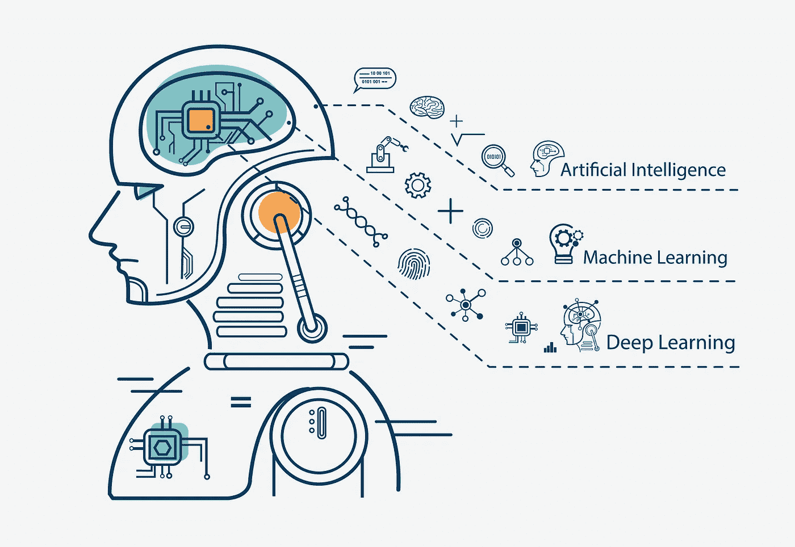
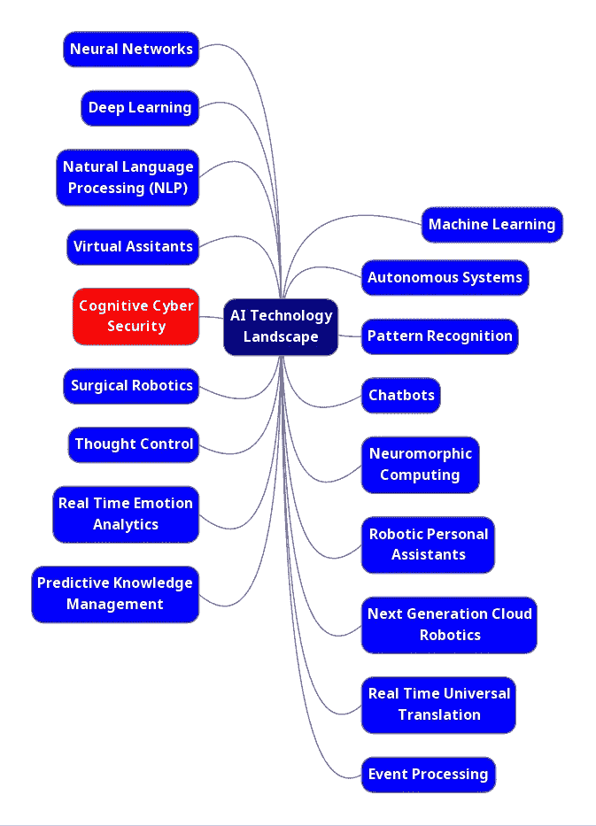
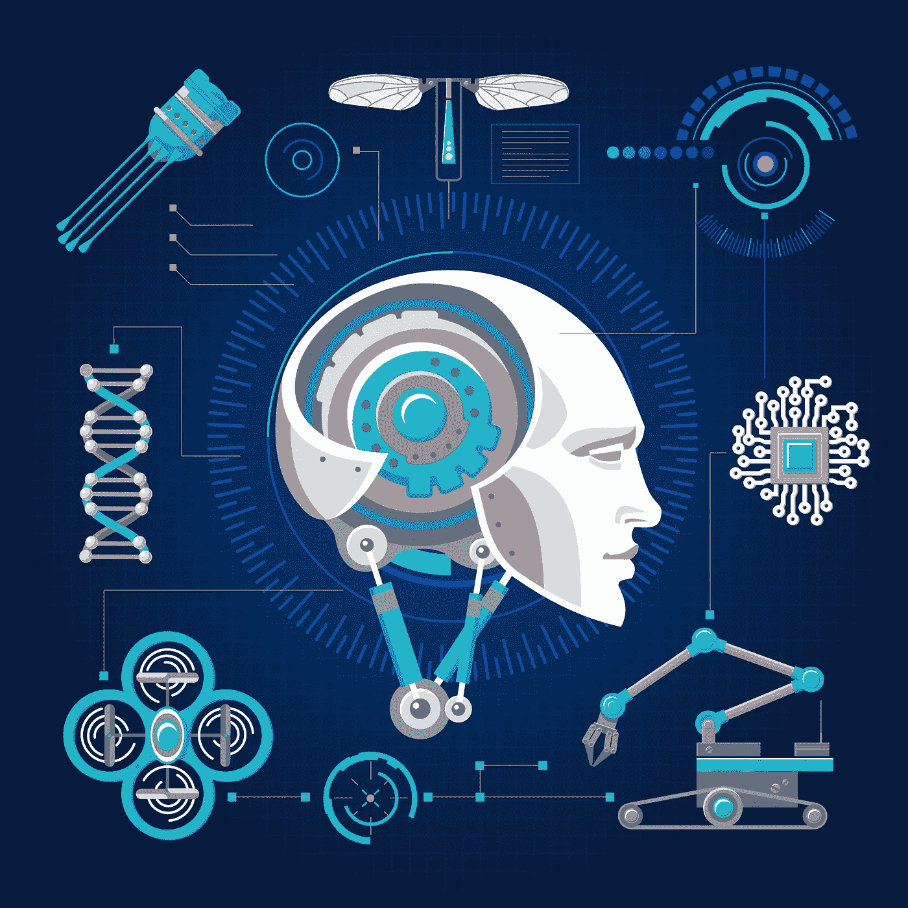

# 网络安全的未来是否掌握在人工智能(AI)手中？— 1

> 原文：<https://towardsdatascience.com/is-the-future-of-cyber-security-in-the-hands-of-artificial-intelligence-ai-1-2b4bd8384329?source=collection_archive---------33----------------------->

## 事实上，近年来机器学习已经取得了很大的进步，从自主工具到虚拟助手，从聊天机器人到人脸/物体识别。网络安全呢？

中国哲学阴阳代表了看似相反的两极如何互补并达到和谐。

在网络安全中，这种古老的哲学完美地代表了有监督和无监督机器学习之间的关系。例如，受监控的机器学习过程可以用于检测，而无监督的机器学习使用聚类。在网络安全和数据安全研发的情况下，受监控的机器学习通常以机器学习算法的形式实现。

描述人工智能(AI)并不容易。它没有明确的定义。现有的大多数定义都试图将 AI 表达为模仿人类智能和行为并智能行动的计算机进程。但是这种情况带来了更多的问题比如什么是智能？人们总是表现得聪明而有逻辑吗？这是人工智能的理想成果吗？或者说计算机能比人类表现得更好吗？将人工智能基于理性行为的方法的定义是指计算机做难以做的事情。然而，在本文中，采用了一种实用主义的方法来简化问题，并将人工智能定义为负责为人类难以找到解决方案的复杂问题提供基于计算机的解决方案的科学领域。

人工智能技术前景

人工智能在网络安全中的应用相对较新。尽管一些网络安全专家认为，网络安全的答案是机器学习，以检测复杂的违规行为，并且只有在基于人工智能的解决方案的帮助下确保 IT 环境的安全，网络安全才能继续取得成功。其他人认为，尽管机器学习非常擅长寻找相似之处，但它在检测异常方面不够好，因此不适合网络安全。

除了这些讨论，事实是，近年来机器学习已经取得了很大的进步，从自主工具到虚拟助手，从聊天机器人到人脸/物体识别。随着我们迈向网络安全更加融入我们日常生活的未来，重要的是要了解基于机器和深度学习的不同方法，以便更好地保护网络和数据安全，抵御日益复杂和高级的攻击。

正如你可能已经知道的，有四种类型的机器学习算法来训练机器神经网络:监督学习，非监督学习，半监督学习(也称为主动学习)，强化学习。有监督的学习是从训练数据集进行学习，而无监督的机器从检测威胁的能力有限的数据本身进行学习，因为它只寻找以前看到和标记的细节，而无监督的学习不断扫描网络并发现异常。然而，无监督学习不需要标记的训练数据，更适合检测可疑活动，包括检测以前从未观察到的攻击。

监督学习是从训练数据集中学习。受监督的机器从数据本身学习，这仅受限于它在搜索它之前看到并标记的细节时检测威胁的能力。对于无人值守学习，不需要标记的训练数据，更适合检测可疑活动，包括检测以前从未观察到的攻击。无监督学习不断扫描网络，发现异常。

机器学习算法

机器学习已经被用来减少攻击检测和预防工具作为网络安全系统的一部分可以处理的负载。类似于真实人类决策机制的人工智能算法试图对决策机制进行建模。

已经有许多尝试来覆盖无人值守的机器学习安全解决方案，导致了针对各种安全问题的大量未经测试的解决方案。这些早期尝试中的许多都难以生成足够的数据来有效检测复杂的违规行为，如身份欺诈和高级网络攻击。

相比之下，无监督机器学习是关于寻找和描述数据中的隐藏结构。这个问题与定义距离函数的问题有关，因为大多数(如果不是全部的话)聚类算法都是基于数字和非分类数据的，因此我们听到的聚类算法和分类一样多。

在网络安全的背景下，人工智能试图通过权衡表明对系统构成威胁的行为模式来保护系统。从这个角度来看，机器学习就是学习导致恶意行为的模式的过程。

在信息安全领域，人工智能解决方案通常以分析师为导向，以无监督的机器学习为重点。使用无监督的机器学习来检测罕见或异常的模式可以增加对新攻击的检测。但是，它也可能触发更多的误报和警告。这需要大量的分析工作来调查这些假阳性的准确性。这种错误警报会导致警报疲劳和不安全，随着时间的推移，会导致其返回到以分析为中心的解决方案，并由此产生弱点。信息安全行业面临的三大挑战，每个都可以通过机器学习解决方案来解决，现已确定如下[2]:

*   缺少标记数据:许多组织缺乏使用标记示例和以前攻击的监督学习模型的能力。
*   不断发展的攻击:即使受控学习模型是可能的，攻击者也可以改变他们的行为并覆盖它们。
*   研究或调查的时间和预算有限:向分析师申请调查攻击既费钱又费时。

然而，由于该行业仍在将该技术作为概念验证进行试验，因此在安全解决方案是机器学习的情况下，信任的想法是理想的。它可以帮助改善打击网络犯罪的斗争，而人工智能可以通过自动化模式识别过程来推动人类的努力。机器学习系统根据类别报告有用的数据，而分析师们公开谈论机器学习如何成为安全的黑盒解决方案，而 CISOs 们并不太确定引擎盖下是什么。

今天，人工智能还没有准备好取代人类，但通过自动化模式识别过程，它可以增强人类的努力。这里有一个无法否认的真理，因为机器学习在网络防御中有非常不同的用途。

考虑到所有的使用领域，可以分两类评价 AI 在网络空间的使用情况；人工智能在网络防御中的应用以及人工智能在网络进攻中的应用。

在第二部分，我们将讨论人工智能在网络防御中的应用…

**来源**

[1] K.R. Chowdhary，《人工智能基础》，施普林格印度公司，2020 年。

[2] K. Veeramachaneni，I. Arnaldo，a .-Infante，V. Korrapati，C. Bassias，K. Li，《:训练一台大数据机器进行防御》，IEEE 大数据安全国际会议，纽约市，2016 年。