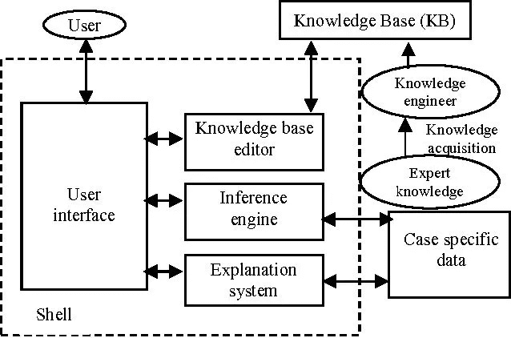
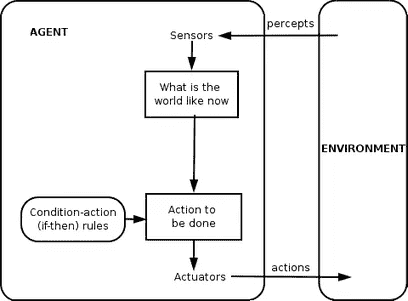
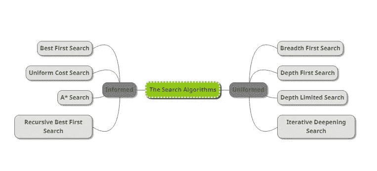

# 网络安全的未来是否掌握在人工智能(AI)手中？— 2

> 原文：<https://towardsdatascience.com/is-the-future-of-cyber-security-in-the-hands-of-artificial-intelligence-ai-2-4befa4aabd12?source=collection_archive---------52----------------------->

## 事实上，近年来机器学习已经取得了很大的进步，从自主工具到虚拟助手，从聊天机器人到人脸/物体识别。网络安全呢？

**利用人工智能进行网络防御**

传统的固定算法(如决策层的硬连线逻辑)无法有效应对动态变化的网络攻击。因此，需要更多创新的方法，例如使用提供灵活性和学习能力的人工智能方法和实践，特别是在网络防御方面。

图片来自 [Pixabay](https://pixabay.com/?utm_source=link-attribution&utm_medium=referral&utm_campaign=image&utm_content=3041437) 的 [xresch](https://pixabay.com/users/xresch-7410129/?utm_source=link-attribution&utm_medium=referral&utm_campaign=image&utm_content=3041437)

考虑到网络防御，现有的人工智能方法和架构可以列举如下；

**A.** **神经网络:**神经网络历史悠久，始于 1957 年弗兰克·罗森布拉特(Frank Rosenblatt)发现“感知机”(perceptron)。在机器学习中，感知器是一种为二进制分类器(决定由向量数字表示的输入是否属于特定类别的函数)的监督学习而开发的算法。这些神经网络中最受欢迎的元素之一是人工神经元[3，4]。少量的感知机一起工作可以学习和解决问题。但是神经网络可以由大量的人工神经元组成。由大量人工神经元组成的神经网络可以提供大规模并行学习和决策功能。这些网络最突出的特点是它们的运行速度。它们非常适合于模式识别、学习、分类和对攻击的响应。它们可以应用于硬件和软件[5]。

神经网络也适用于入侵检测和预防[6，7，8，9]。科学研究显示了使用这些网络进行 DoS 检测[10]、计算机蠕虫检测[11]、垃圾邮件检测[12]、僵尸检测[13]、恶意软件分类[14]和数字取证研究[15]是多么有效。

神经网络在网络防御中受欢迎的一个原因是，如果它们可以在硬件中实现并在图形处理器中使用，它们的速度会很高。第三代神经网络——更真实地模拟生物神经元的脉冲神经网络的应用是神经网络技术的新发展。FPGA(现场可编程门阵列)提供的系统允许神经网络快速发展并适应不断变化的威胁，为网络防御做出了重大贡献[16]。

神经网络

**B.** **专家系统:**专家系统是使用最多的人工智能工具。专家系统是在一些应用程序的活动领域中使用的软件，用于寻找用户或另一个软件提出的问题的答案。它可以直接用于支持医疗诊断、金融或网络空间等领域的决策。有各种各样的专家系统来解决问题，从小型技术诊断系统到复杂的、非常大的和复杂的混合系统。从概念上讲，专家系统包括一个关于特定应用领域的专家知识数据库。空知识库和提取引擎统称为专家系统外壳。要被使用，它必须充满信息。专家系统外壳应该能够由软件支持，以向知识库添加信息，并且对于用户交互和可以在混合专家系统中使用的其他程序是可扩展的。开发专家系统首先意味着选择/修改专家系统外壳，其次是获取专家知识并用信息或数据集填充知识库。第二步比第一步复杂得多，花费的时间也多得多。专家系统可以用于网络防御的一个例子是安全规划[17]。在该领域中使用的专家系统大大简化了选择安全措施的任务，并为有限资源的最佳使用提供了指导。此外，专家系统在入侵检测中的使用可以追溯到过去[18，19]。

专家系统

**C.** **智能代理:**智能代理是具有一些智能行为特征的软件组件，这些特征使其变得特殊(主动性、理解和响应代理通信语言)。这些软件组件具有计划性、可变性和深度思考能力。它已经作为一个概念被采用在软件工程中，软件代理被认为是主动的和代理的通信语言。但是，当比较代理和对象时，可以表现为对象可以是被动的，并且不需要理解任何语言(尽管它接受具有良好定义的语法的消息)[17]。

有研究表明，在网络防御中如何使用有效的智能代理来抵御 DDoS 攻击[20，21]。其中一些研究还指出，在解决一些法律和商业问题后，有可能开发出由移动智能代理组成的“网络警察”[22]。此外，混合多代理、基于神经网络的入侵检测系统[23]和基于代理的分布式入侵检测系统[24]是这方面的其他科学研究。

智能代理

**D.** **搜索:**搜索几乎存在于每一个各种形状和格式的智能程序中，其效率往往对整个程序的性能至关重要。在满足解决方案要求的同时，可以使用附加信息来指导研究，这样可以显著提高搜索效率。许多搜索方法已经在人工智能中开发出来，虽然它们在许多软件中使用，但这通常不被视为人工智能的使用。例如，动态编程[25，26]专门用于解决最优安全问题，但嵌入式搜索似乎不是人工智能应用。与或树(Andor trees)、αβ搜索、极大极小搜索和随机搜索广泛应用于游戏应用中，尤其适用于网络防御决策。最初为计算机象棋游戏开发的αβ搜索算法在解决问题方面非常成功，尤其是在评估和决定两次攻击的最佳可能行动方面。使用最少获胜和最多失败的预测，该算法允许通过忽略大量选项来加速搜索。

搜索算法

**E.** **学习:**学习通过扩展或重新安排知识库或通过开发推理机来开发信息系统[27]。机器学习包括获取新信息的计算方法、新技能和组织现有信息的新方法。学习问题与简单参数学习的复杂性(符号学习的复杂值，如学习某些参数的值和学习概念、语言结构、函数，甚至行为学习)有很大的不同。

人工智能提供了监督学习和非监督学习的方法。如果有大量数据，无监督学习特别有用，这种方法在可以收集大量日志的网络防御中很常见。数据挖掘最初是出于人工智能中的无监督学习[6，28]。

适合在并行硬件上执行的并行学习算法已经创建了一个优秀的学习类。这些学习方法以遗传算法和神经网络为代表。遗传算法和模糊逻辑方法已被用于网络防御，例如，威胁检测系统[29]。

图片由 [Philipp Marquetand](https://pixabay.com/users/marquetand-3570369/?utm_source=link-attribution&utm_medium=referral&utm_campaign=image&utm_content=5076887) 来自 [Pixabay](https://pixabay.com/?utm_source=link-attribution&utm_medium=referral&utm_campaign=image&utm_content=5076887)

**F.** **约束求解:**约束求解是利用人工智能(逻辑表达式、表格、方程、不等式等)发展起来的技术。)在解决所提出的问题时，通过对解决方案给出一系列的约束条件[30]。问题的解决方案是满足所有限制的值的集合(一系列)。事实上，有许多不同类型的约束，这取决于约束的性质(例如，有限集上的约束、函数约束、有理树)。在非常抽象的层次上，几乎任何问题都可以表示为约束满足的问题。由于需要大量的调用，这些问题的解决方案通常是困难的。它可以用于约束，逻辑编程，以及情况分析和决策支持[31，32]。

在第三部分，我们将讨论早期预警系统(EWS)和人工智能在网络犯罪中的应用…

**来源**

[3]罗森布拉特。“感知机——感知和识别自动机”，康奈尔航空实验室，1957 年。

[4] Y. A. Freund，R. E. Schapire，“使用感知器算法的大幅度分类，机器学习”，37(3):277–296，1999 年。

[5] G. Klein，A. Ojamaa，P. Grigorenko，M. Jahnke，E. Tyugu，“加强影响评估方法中的反应选择”，军事通信和信息系统会议，波兰弗罗茨瓦夫，2010 年。

[6]白，吴，王，杨，邱，“一种基于多层自组织映射和主成分分析的入侵检测模型，神经网络研究进展”，施普林格，2006 .

[7] F. Barika，K. Hadjar，N. El-Kadhi，“用于移动 IDS 解决方案的人工神经网络”，安全与管理，2009 年。

[8] D. A. Bitter，t .埃利宗多，“人工神经网络和相关技术在入侵检测中的应用”，IEEE 计算智能世界大会，CCIB，2010 年。

[9]张瑞仪，赖立波，苏伟德，王俊春，高俊生，“基于样本查询和属性查询的反向传播神经网络入侵检测”，计算智能研究国际期刊，2007 .

[10] B. Iftikhar，A. S. Alghamdi，“人工神经网络在检测 DOS 攻击中的应用”，第二届信息与网络安全国际会议论文集。纽约州纽约市，2009 年。

[11] D. Stopel，Z. Boger，R. Moskovitch，y .沙哈尔和 Y. Elovici，“人工神经网络技术在计算机蠕虫检测中的应用”，国际神经网络联合会议，2006 年。

[12] C. H. Wu，“基于规则技术和神经网络混合方法的垃圾邮件行为检测”，专家系统与应用，2009。

[13] P. Salvador 等，“利用神经网络进行僵尸检测的框架”，第四届互联网监测与保护国际会议，2009 年。

[14] M. Shankarapani，K. Kancherla，S. Ramammoorthy，R. Movva，S. Mukkamala，“用于恶意软件分类和相似性分析的核心机器”，IEEE 计算智能世界大会。2010 年，西班牙巴塞罗那。

[15] B. Fei，J. Eloff，M. S. Olivier，H. Venter，“在数字调查中异常行为检测的自组织图的使用”，法医科学国际，2006 年。

[16] E. Tyugu，“网络防御中的人工智能”，第三届网络冲突国际会议，2011 年。

[17] J. Kivimaa，A. Ojamaa，E. Tyugu，“分级安全专家系统”，Springer，2009 年。

[18] D. Anderson，T. Frivold，A. Valdes，“下一代入侵检测专家系统(NIDES)”，SRI 国际，计算机科学实验室，1995 年。

[19] T. F. Lunt，R. Jagannathan，“一个原型实时入侵检测专家系统”，IEEE 安全和隐私研讨会，1988 年。

[20] I .科滕科，a .乌兰诺夫，“模拟自适应合作防御互联网攻击的多智能体框架”，自主智能系统国际研讨会:智能体和数据挖掘，施普林格。

[21] I .科滕科、a .科诺瓦洛夫、a .肖罗夫，“僵尸网络和僵尸网络防御的基于代理的建模和模拟”，网络冲突会议，欧洲防治荒漠化公约出版物，爱沙尼亚塔林，2010 年。

[22] B. Stahl，d .，M. Carroll-Mayer，Y. Zheng，K. Wakunuma，“在计算机安全和计算机取证中使用计算智能技术的伦理和法律问题”，IEEE 世界计算智能大会，西班牙巴塞罗那，2010 年。

[23] E .赫雷罗，m .科尔查多，a .佩里塞尔，a .亚伯拉罕，“混合多智能体-神经网络入侵检测与移动可视化”，混合智能系统创新，2007 年。

[24] V. Chatzigiannakis，G. Androulidakis，B. Maglaris，“使用安全代理的分布式入侵检测原型”。惠普 OpenView 大学协会，2004 年。

[25] J. Kivimaa，A. Ojamaa，E. Tyugu，“选择安全措施的帕累托最优情况分析”，MilCom，2008 年。

[26] J. Kivimaa，A. Ojamaa，E. Tyugu，“管理不断变化的安全局势”，MilCom，2009 年。

[27] P. Norvig，S. Russell，“人工智能:现代方法”，Prentice Hall，2000 年。

[28] V. K. Pachghare，P. Kulkarni，D. M. Nikam，“使用自组织映射的入侵检测系统”，智能代理和多媒体代理系统国际会议，2009 年。

[29] R. Hosseini，J. Dehmeshki，S. Barman，M. Mazinani，S. Qanadli，“用于计算机辅助检测系统中模式识别的遗传 2 型模糊逻辑系统”，IEEE 计算智能世界大会。2010 年，西班牙巴塞罗那。

[30] B. Mayoh，E. Tyugu，J. Penjam，“约束程序设计”，北约 ASI 丛书，施普林格出版社。1994.

[31] I. Bratko，《人工智能的 PROLOG 程序设计》，Addison-Wesley，2001 年。

[32]欧，“网络安全分析的逻辑程序设计方法”，普林斯顿大学博士论文，2005 年。