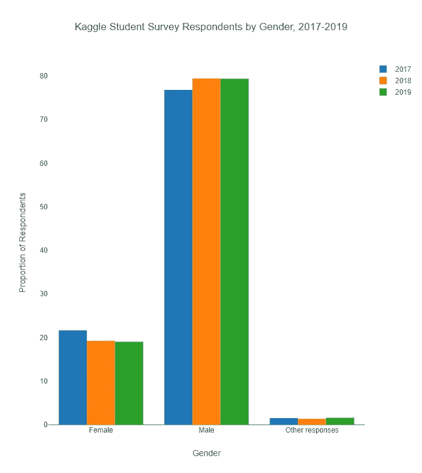
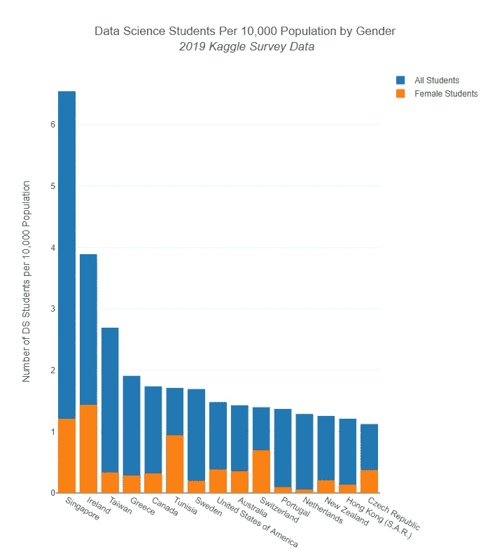
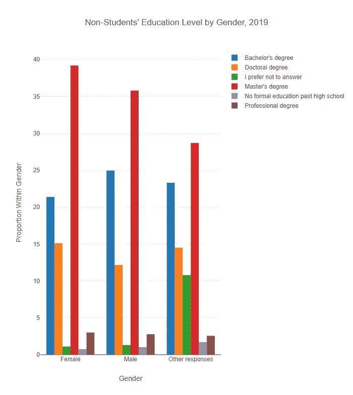

# 数据科学的未来是女性吗？

> 原文：<https://towardsdatascience.com/is-the-future-of-data-science-female-42ce043cecd7?source=collection_archive---------72----------------------->

## Kaggle 的调查数据揭示了关于数据职业未来多样性的有趣(尽管有限)见解。

凯瑟琳·汉隆在 [Unsplash](https://unsplash.com/s/photos/women?utm_source=unsplash&utm_medium=referral&utm_content=creditCopyText) 上的照片

本周的[改变一切播客](https://community.alteryx.com/t5/Alter-Everything-Podcast/65-Uncomfortable-conversations/ba-p/597677)专题讨论了职业道路和成功。讨论的一个关键点是，在人们如何对待导师以及在工作中寻求支持或晋升方面，性别之间存在差异，以及促进不同声音和观点的重要性。考虑到这个问题，我想进一步研究数据科学中关于性别多样性的现有数据。

关于在该领域工作的各种人的一个信息来源是 [2019 Kaggle ML & DS 调查](https://www.kaggle.com/c/kaggle-survey-2019)，该调查要求专业人士和学生回答一系列(数据科学双关语)关于他们的性别、职称、收入、国籍等问题。(种族不是包含的问题之一。)2017[2017](https://www.kaggle.com/kaggle/kaggle-survey-2017)和 2018[2011](https://www.kaggle.com/kaggle/kaggle-survey-2018/)的调查数据也有了，所以这是一个很好的纵向分析的机会。

我想我应该用 Alteryx Designer 仔细看看 Kaggle 的数据，看看是否有任何值得注意的性别模式出现，特别是在学习数据科学的学生周围。毕竟，今天的学生将帮助决定这个领域多元化的未来。

# 随时间变化

我最初认为，在 Kaggle 调查的三年中，看看学生的性别多样性是否有任何变化会很有趣。我发现，从 2017 年到 2019 年，学生调查受访者中认为女性的比例实际上略有下降。认为自己是男性的受访者人数和提供其他答案(可能包括“不愿意回答”或“更愿意自我描述”)的受访者人数保持稳定。至少在这些数据中，性别之间并没有向更公平的方向转变。

# 性别和国籍

哪些国家培养了**最多的女性数据科学学生**？我只看了 2019 年 Kaggle 的回复，并按国籍和性别进行了细分。然后，我将这些数据与各国的人口数据结合起来，计算出每个国家每 10，000 人中有多少数据科学专业的学生，以及有多少是女性。(当然，这些只是 Kaggle 调查的受访者，提出了我将在下面讨论的复杂问题。)

下表列出了数据科学学生人数最多的 15 个国家，同时也显示了女学生的人数。即使在接受调查的学生人数最多的国家，女生的比例也相对较低。

# 调查对象的性别和教育

数据科学专业的学生可以追求各种证书。再次使用 2019 年的调查数据集，我按性别检查了*非学生*受访者中**教育水平的差异**。女性受访者拥有硕士或博士学位的比例略高于男性受访者。

虽然差别不是很大，但考虑一下它的潜在原因还是很有趣的。女性获得高等学位的比率比男性高吗？不管出于什么原因，高学历女性更有可能完成调查吗？招聘经理是否要求女性接受更高的教育标准以获得职位？

# 数据限制

使用 Kaggle 数据来研究这些问题并不是一个理想的方法，但它本身提出了一些有趣的问题。这项调查是自愿的，而且(据我所知)只有英文版，尽管受访者来自 171 个不同的国家，所以参与人数有限。此外，Kaggle 在很大程度上是一个竞争网站，用户在这里应对各种挑战，以证明他们的数据能力。这种形式可能对所有性别和背景的数据科学学生和专业人员没有同等的吸引力。

向调查受访者询问性别问题本身就很困难，我自己的分析也有缺陷，因为“其他回答”(我将“不愿意说”和“愿意自我描述”的回答归为一类)包括了调查中性别问题的所有其他回答。此外，该问题的答案选项在 2017 年版本的调查中有所不同。

# 未来的外卖

来自国家和全球教育和专业机构的其他数据将提供额外的见解，也许更可靠。但是，当我们探索在数据职业中实现更大多样性的途径时，观察这些模式并考虑如何解决它们是很有趣的。

对于那些寻求进入数据职业的人来说，Alteryx [ADAPT(共同提升数据&分析潜力)计划](https://pages.alteryx.com/adapt)是一个免费的在线培训机会，包括在该计划中使用的软件许可证、协作讨论、数据科学资源和认证。该计划适用于任何就业受到新冠肺炎疫情影响的人，包括失业或休假的人，或失去实习或毕业后机会的人。主题包括数据基础介绍、Alteryx Designer 的核心认证和业务预测分析。该项目的自定进度结构非常适合不同背景的人，包括那些可能发现寻求其他提升技能机会具有挑战性的人。

这需要我们所有人共同努力，相互支持，以提高数据专业的多样性。关于我们如何在这一领域相互支持的更多见解和第一手经验，请查看本周的 Alter Everything 播客。

**原载于** [**Alteryx 社区**](https://community.alteryx.com/t5/Data-Science/Sources-Agree-Data-Science-Skills-Go-Beyond-Data/ba-p/613738) **。在** [**Alteryx 数据科学门户**](https://community.alteryx.com/t5/Alteryx-Data-Science-Portal/ct-p/ds-portal) **找到更多资源。**