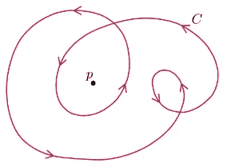
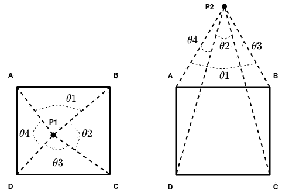
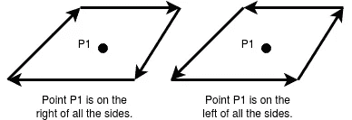

# 点在多边形里面吗？

> 原文：<https://towardsdatascience.com/is-the-point-inside-the-polygon-574b86472119?source=collection_archive---------7----------------------->

> 在计算几何中，**多边形中的点** ( **点**)问题询问平面中的给定点是位于多边形的内部、外部还是边界上维基百科。

一种快速简单的算法来确定一个点是位于多边形内部、之上还是之外，在各种应用中非常有用，如计算机图形学、地理信息系统(GIS)、运动规划、CAD、计算机视觉等。

作为一名计算机视觉工程师，我看到的一些直接应用是:

1.  **车道检测**:由于车道可以用梯形来表示，因此 **PIP** 可以用来判断像素是否位于梯形(车道)内。
2.  **使用边缘检测计算对象的面积:**任何对象的面积都可以通过对其执行边缘检测来计算，然后通过检查像素是否位于对象边缘形成的多边形内来计算面积。

解决画中画问题的一些方法是通过使用 [**光线投射算法**](https://en.wikipedia.org/wiki/Point_in_polygon#cite_note-5) 和 [**缠绕数算法**](https://en.wikipedia.org/wiki/Point_in_polygon#cite_note-5) **。**需要注意的一点是，对于真正靠近多边形的点，缠绕数算法比光线投射更精确。此外，在较新的实现中，它也比光线投射算法更快。对于凸多边形，PIP 问题被进一步简化，我们将讨论一种这样的方法来解决它。

> ***在这篇文章中我将解释解决任意多边形画中画的缠绕数算法。然后，我将介绍一种解决凸多边形 PIP 的简化方法。这两种方法的 C++代码都可以在这里找到***[](https://github.com/anirudhtopiwala/OpenSource_Problems/tree/master/point_in_polygon)****。****

# ***绕组数量算法***

*缠绕次数由曲线围绕一个点逆时针旋转的次数来定义。*

**

*点 p 的绕组数是 2。(来源:维基百科)*

> ***该算法规定，对于多边形内的任何一点，缠绕数都不为零。因此它也被称为非零规则算法。***

**

*来源:作者*

*计算缠绕数的一种方法是计算多边形的每条边与查询点所成的角度。这分别由 AB 边、BC 边、CD 边和 DA 边的角度θ1、θ2、θ3 和θ4 表示。如果这些角度的总和为 2 **π** ，则该点位于多边形内部，如果总和为 0，则该点位于多边形外部。*

```
*sum_of_angles = θ1 + θ2 + θ3 + θ4 = 2 π **-> Point is inside** sum_of_angles = θ1 + θ2 + θ3 + θ4 = 0 **-> Point is outside.***
```

*类似于光线投射算法，该算法的时间复杂度将是 O(n ),但是它将涉及反三角函数(如 atan2)的重复计算，以获得多边形的边与查询点所对的角度。*

*如 [W. Randolph Franklin](https://wrf.ecse.rpi.edu//Research/Short_Notes/pnpoly.html) 所述，降低复杂性的一种方法是简单地观察实际上围绕查询点的边，而所有其他边可以忽略。*

> ***算法:**对于任意多边形，求该多边形所有与通过查询点的直线相交且平行于 y _ 轴的边。对于这些边，检查当逆时针方向看所有边时，查询点是在边的左侧还是右侧。如果查询点位于向上交叉路口的左侧，则绕组数(wn)值增加 1，如果查询点位于向下交叉路口的右侧，则 wn 值减少 1。如果最终缠绕数不为零，则该点位于多边形内部。*

```
***Example:
For part a) in the figure below:**
Initially wn = 0
Only edges CD and AB cut the line passing through P1 and parallel to y axis.
1) wn++ for CD as it is an upward crossing for which P1 is left of CD
2) wn wont be changed as P1 is on left of AB (downward crossing).
**As final winding number wn = 1 which is not equal to zero point P1 lies inside the polygon.****A similar case can be made for b) part of the figure.** Although it should be noted that we are avoiding the added complexity of the polygon and hence make the algorithm more efficient.**For c) part in the figure below:**
Initially wn = 0
Only edges DE and BC cut the line passing through P1 and parallel to y axis.
1) wn++ for DE as it is upward crossing for which P1 is left of CD
2) wn-- for BC as it is downward crossing for which P1 is right of BC
**As final winding number wn = 0 point P1 lies outside the polygon.***
```

**

***a)** wn = 1，因为 P1 在上边缘 CD **b)** wn = 1 的左边，因为 P1 在上边缘 FG **c)** wn = 0 的左边，因为 P1 在上边缘 DE 的左边但在下边缘 BC 的右边。**注意:对于 a)和 b ),点 p1 在多边形内，如 wn！= 0，不考虑 b)中多边形的附加复杂性。(**来源:作者)*

*[**Cpp 代码:(GitHub 句柄)**](https://github.com/anirudhtopiwala/OpenSource_Problems/tree/master/point_in_polygon)*

1.  ****substitute _ point _ in _ line():***该函数计算点位于直线的哪一侧。*
2.  ***is _ point _ inside _ polygon*():***这是完整的算法，计算一个点是否在内**、在**外**或在**上**，给定逆时针方向的多边形顶点。通过按逆时针方向列出顶点来固定边的方向有助于锁定线段的左侧和右侧(多边形边)。***

# ***多边形中的点为凸多边形***

*凸多边形是指所有内角都小于 180°的多边形，这意味着所有顶点都指向远离多边形内部的方向。*

*我们单独讨论这一点，因为在计算机视觉中遇到的最常见的多边形类型是凸多边形。这些包括所有的三角形、正方形、平行四边形、梯形等。*

> ***算法:**对于一个凸多边形，如果多边形的边可以认为是从任意一个顶点开始的路径。然后，如果查询点位于构成路径的所有线段的同一侧，则称该点位于多边形内部。这可以从下图中看出。*

**

*点 P1 位于上面显示的两个多边形内，因为 P1 位于两个多边形所有边的同一侧。(来源:作者)*

*要找出该点位于线段的哪一侧，我们可以简单地将该点代入线段方程。例如，对于由(x1，y1)和(x2，y2)形成的线，查询点(xp，yp)可以被替换如下:*

```
***result = (yp - y1) * (x2 -x1) - (xp - x1) * (y2 - y1)***
```

*当逆时针方向看线段时，如果结果是:*

1.  *结果> 0:查询点位于行的左侧。*
2.  *结果= 0:查询点位于直线上。*
3.  *结果< 0: Query point lies on right of the line.*

*[**Cpp 代码:(GitHub 句柄)**](https://github.com/anirudhtopiwala/OpenSource_Problems/tree/master/point_in_polygon)*

1.  ****substitute _ point _ in _ line():***该函数计算点位于直线的哪一侧。*
2.  ****is _ point _ inside _ convex _ polygon():***这是完整的算法，计算给定顺时针或逆时针方向的多边形顶点，一个点是否在凸多边形的内**、**外**或**上**。***

*如前所述，凸多边形中的点也包括以下情况*

1.  *梯形中的点*
2.  *平行四边形中的点*
3.  *矩形中的点*

> *总而言之，我们讲述了如何找到一个多边形的缠绕数，并用它来确定这个点是在多边形的内部、上面还是外部。我们还看到了一个更简单的解决方案，可以应用于凸多边形来解决画中画。*

*如果你有任何问题，请联系我，希望你喜欢这个数学。*

# *参考资料:*

1.  *[https://en.wikipedia.org/wiki/Point_in_polygon#cite_note-5](https://en.wikipedia.org/wiki/Point_in_polygon#cite_note-5)*
2.  *[http://www . eecs . umich . edu/courses/eecs 380/讲义/PROJ2/InsidePoly.html](http://www.eecs.umich.edu/courses/eecs380/HANDOUTS/PROJ2/InsidePoly.html)*
3.  *[http://geomalgorithms.com/a03-_inclusion.html](http://geomalgorithms.com/a03-_inclusion.html)*
4.  *Wm。Randolph Franklin，[“多边形测试中的点包含”](https://wrf.ecse.rpi.edu//Research/Short_Notes/pnpoly.html)*