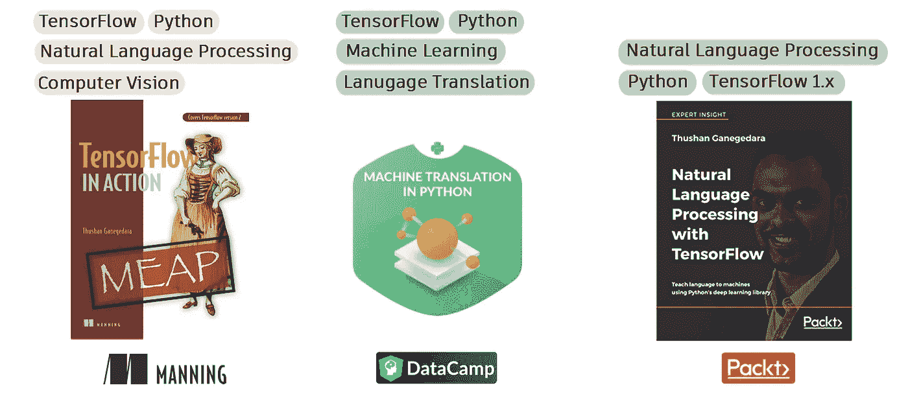

# Seq2Seq 车型的竞赛结束了吗？

> 原文：<https://towardsdatascience.com/is-the-race-over-for-seq2seq-models-adef2b24841c?source=collection_archive---------17----------------------->


在 [Unsplash](https://unsplash.com/s/photos/connected?utm_source=unsplash&utm_medium=referral&utm_content=creditCopyText) 上由 [Kaley Dykstra](https://unsplash.com/@kaleyloved?utm_source=unsplash&utm_medium=referral&utm_content=creditCopyText) 拍摄的照片

Seq2Seq 或序列到序列模型的概念来自 Ilya Sutskever 等人在“[用神经网络进行序列到序列学习](https://papers.nips.cc/paper/5346-sequence-to-sequence-learning-with-neural-networks.pdf)”中的一篇论文。它们本质上是深度序列模型的某种组织(也称为基于 RNN 的模型)(例如 LSTMs/GRUs)[ [1](https://colah.github.io/posts/2015-08-Understanding-LSTMs/) ](稍后讨论)。这些模型解决的主要问题是，

> 将任意长度的序列映射到另一个任意长度的序列

我们在哪里会遇到这样的问题？几乎任何地方。的应用，

*   机器翻译
*   文本摘要
*   问题回答

很少有例子可以利用这种模式。这些应用有一个非常独特的问题公式，要求能够将任意长的源序列映射到任意长的目标序列。例如，如果你想象一个英语到法语的翻译，在两种语言的单词之间没有一对一的映射。通常，从一种语言翻译到另一种语言需要学习大量复杂的特性(一对多、多对一、多对多映射、词汇依赖、[单词对齐](https://en.wikipedia.org/wiki/Bitext_word_alignment)【2】等)。

这与图像分类(即固定大小输入→类/标签)或情感分析问题(即任意长度输入→类/标签)有很大不同。

# 你好！欢迎学习机器翻译 101

在深入研究之前，你必须清楚地了解机器翻译问题是如何被表述为机器学习问题的。

您有属于两种语言的数据；源语言(翻译源语言)和目标语言(翻译目标语言)。例如，如果您要从英语翻译成法语，英语将是源语言，法语将是目标语言。

接下来，您有一个由`n_s`个元素组成的长文本序列(例如句子)，从一个`V_s`大小的词汇表(英语)中抽取单词。在模型训练期间，你也有一个`n_t`元素长文本序列，从`V_t`大小的词汇(法语)中抽取单词。每个单词被表示为一个`d_w`大小的向量。这可以使用[一个热编码](https://en.wikipedia.org/wiki/One-hot)或字向量(例如 [Word2vec](/light-on-math-machine-learning-intuitive-guide-to-understanding-word2vec-e0128a460f0f?source=your_stories_page---------------------------) 或 [GloVe](/light-on-math-ml-intuitive-guide-to-understanding-glove-embeddings-b13b4f19c010?source=your_stories_page---------------------------) )。最后，在预测过程中，模型对`V_t`词汇进行`n_t`次连续预测。下图说明了该过程。


机器翻译过程

# 深入到 Seq2Seq 模型

在开始了解这些模型的命运之前，让我们更详细地了解一下它们是做什么的。在这里，我从我在 DataCamp 的 Python 课程中的[机器翻译中汲取了大部分视觉帮助和概念。如果你想在这个话题上了解更多，我邀请你去尝试这个课程。](https://datacamp.com/courses/machine-translation-in-python)

如果你看一个 seq2seq 模型，眯着眼睛模糊细节，你会看到它实际上是两个组件；编码器和解码器。你在日常生活中使用编码器-解码器的概念比你意识到的要多。举一个简单的例子，老师解释大象长什么样。


编码过程类似于老师向你解释大象的样子，然后你在脑海中创造出一个形象。如果你的一个朋友问大象长什么样，解码过程就会发生。(来源:[Python 中的机器翻译](https://datacamp.com/courses/machine-translation-in-python))

当你听老师讲课时，编码就发生了，你对大象的心理图像进行了编码。然后当你缺课的朋友问大象是什么的时候，你将会开始通过口头向朋友解释或者画一幅画来解码这个心理图像。

从更技术性的角度来看，这是一个用于机器翻译的 seq2seq 模型的样子。


编码器解码器模型概述(来源:[Python 中的机器翻译](https://datacamp.com/courses/machine-translation-in-python))

编码器接收一个英语句子并创建一个上下文向量(也称为思维向量)，然后解码器使用该上下文向量解码正确的法语翻译。

## 快速游览格鲁什

编码器和解码器由什么组成？它们包括深度序列模型(或者几层这样模型)。我们将很快掩饰一个这样的深度序列模型的细节；门控循环单元(GRU)。这个想法是，

```
h(0) = {0}^n # A zero vector
for each **i**^th word **w** in sequence (e.g. sentence):
    h(i) = GRU(f(w), h(i-1))
```

`f(w)`是单词的一些数字表示(例如一个热编码/单词向量)。我不会在代码中解释`GRU`函数中发生了什么。重要的是，GRU 单元接受当前输入和先前输出，并产生当前输出。我强烈建议阅读所提供的参考资料，以便深入理解[ [1](https://colah.github.io/posts/2015-08-Understanding-LSTMs/) ][ [3](https://arxiv.org/pdf/1406.1078.pdf) ]下图说明了 GRUs 如何处理文本序列。


门控循环单元(GRU)如何工作(来源:[Python 中的机器翻译](https://datacamp.com/courses/machine-translation-in-python)

# 变形金刚的盛大入场

像 LSTMs 和 GRUs 这样的递归神经网络(rnn)在相当长的一段时间里都沉浸在自己应得的声誉中，直到最近它们受到了一个新成员的挑战；一种叫做变压器的东西。

[变压器](https://arxiv.org/pdf/1706.03762.pdf)型号在 [5](https://arxiv.org/pdf/1706.03762.pdf) 中介绍。这是一个非常创新的概念，解决了 rnn 的两个主要弱点:

*   rnn 是不可并行化的，因为`t^th`步骤的输出取决于`(t-1)^th`步骤的输出(因此称为递归神经网络)
*   RNNs 努力保持语言的长期依赖性，因为它只看到前一步的记忆

为了更好地理解 Transformer 模型，我们将假设一个从英语到法语的翻译任务。模型被训练完成的任务是，给定一个英语句子，找到正确的法语翻译。

我们现在来看看 Transformer 模型的主要特色。请注意，我不会讨论 Transformer 模型的所有错综复杂之处，但足以理解它与 Seq2Seq 模型的不同之处。转换器也是一个编码器-解码器模型。


抽象出细节，转换器与抽象的 Seq2Seq 模型非常相似

编码器有几层，解码器有几层。每层由两种类型的子层组成，

*   自我关注层
*   全连接层

最终的解码器层需要包括 softmax 层，因为它需要为每个位置产生目标语言词汇的概率。


详细的变压器模型。编码器由几层组成。每层由两个子层组成；自关注子层和全连接子层。解码器也由几层组成，每层由两个自关注子层和一个全连接子层组成。该图还显示了在输入和子图层之间创建的连接类型。自我关注子层在给定时间查看所有单词，而全连接子层单独处理单词。

## 自我关注层

自我关注层是 Transformer 模型的开创性概念。基本上，自我注意层在处理序列中的单个单词时，使模型能够查看所有其他单词。为什么这很重要？想象一下下面这句话，

> 那只狗跑过马路去捡球

现在想象一个模型从一个单词到另一个单词的顺序。当模型看到单词“它的”时，它有助于知道“它的”指的是狗。这适用于任何机器学习任务，无论是机器翻译、依存解析还是语言建模。

自我关注层使 transformer 能够准确地做到这一点。在处理单词“its”时，模型可以查看所有其他单词，并自行决定哪些单词对于“*将*混合到输出中是重要的，以便转换器可以有效地解决任务。此外，这是一个“加权组合”，权重是在训练过程中学习的。下图显示了这一过程。


当处理“它”这个词时，自我注意是如何工作的。注意力层对每个单词都有权重，使该层能够创建单词的“加权混合”作为输出。本质上，灰盒编码了关于单词“its”和“dog”的信息。

***注*** :你也可以看到解码器里有一个被掩盖的自我关注层。这本质上是为了掩盖在模型训练中可能发生的任何前瞻(那将是欺骗)。换句话说，解码器不应该知道目前已经看到的东西前面是什么。有关这方面的更多信息，请参考[原始文件](https://arxiv.org/pdf/1706.03762.pdf)。

## 全连接层

围绕全连接层没有太多的谜团。它采用独立的自我注意层输出，并使用全连接层为每个单词产生潜在的(即隐藏的)表示。并且这个完全连接的层在不同的时间步长上共享。然而，每一层都有一组完全连接的权重。

## 变压器的优点

如您所见，没有一个子层包含等待上一步输出的顺序计算(如 LSTMs/GRUs)。这减轻了模型维护类似 LSTMs 的状态/记忆的需要。因此，变压器可以同时并行计算所有时间步长的输出。

此外，如您所见，在给定的时间步长，自我关注子层会看到所有其他输入。由于这个原因，在长文本序列中保持长期依赖变得微不足道。

# 最终结论:Seq2Seq 车型还有希望吗？

现在让我们来讨论迫切的问题。Seq2Seq 型号会很快过时吗？个人认为不是！由于几个原因

## 是的:Seq2Seq 模型对于低资源环境仍然是一个很好的选择

原变压器型号比较大，如([伯特](https://arxiv.org/pdf/1810.04805.pdf) — 300M 参数、 [GPT](https://cdn.openai.com/research-covers/language-unsupervised/language_understanding_paper.pdf) — 110M 参数、 [XLNET](https://arxiv.org/pdf/1906.08237.pdf) )。这限制了在嵌入式设备或物联网设备等限制性环境中使用这些模型的能力。你可以有一个简单的 LSTM/GRU 模型，其占用的内存只是这些大型模型的一小部分。

注意:值得强调的是，人们一直在尝试推出更小的型号，但仍能提供与原始型号相当的性能。值得注意的是[蒸馏器](https://medium.com/huggingface/distilbert-8cf3380435b5)。但是与简单的 RNN 模型相比，这些仍然非常大(例如，DistilBert 有大约 66M 的参数)。

## 是:易于原型化/理解

假设您遇到一个 NLP 问题，并被要求评估使用 Seq2Seq/Transformer 模型的可行性。与 Transformer 相比，Seq2Seq 模型可以快速启动并运行，因为 Seq2Seq 模型更简单、更容易理解。如果你热衷于学习如何实现 Seq2Seq 模型并理解它们如何工作，你可以试试我在 DataCamp 上的课程“[Python 中的机器翻译](https://datacamp.com/courses/machine-translation-in-python)”。

## 是的:rnn 正在发展

人们一直在研究改进基于 RNN 的模型，提高它们保持长期依赖性的能力。一个特别的例子出现在报纸上[莫格里菲耶 LSTM](https://arxiv.org/pdf/1909.01792.pdf) [ [6](https://arxiv.org/pdf/1909.01792.pdf) 。

## 否:Transformer 模型在许多 NLP 任务中提供了更好的性能

毫无疑问，事实已经不断证明，变压器模型几乎总是优于顺序模型。因此，如果你只关心性能，不需要担心内存，变形金刚将是一个不错的解决方案。

## 不:变形金刚模型对恶意攻击更强

改进模型对抗[对抗性攻击](https://openai.com/blog/adversarial-example-research/)是机器学习的一个重要研究领域。已经有研究评估了变形金刚/RNNs[抵御敌对攻击的能力](http://web.cs.ucla.edu/~chohsieh/papers/Robustness_of_transformers.pdf)[7](https://www.aclweb.org/anthology/D19-5627.pdf)。看起来变形金刚模型对对抗性攻击更强。

## 必须是是或不是吗？

我们不应该忘记，这并不一定是是或不是，事实上我们可以利用两个世界的优势。虽然基于变压器的模型具有优越的性能，但基于 RNN 的模型在内存消耗方面较低。也许有可能通过将它们组合成一个单一的模型来实现两者之间的平衡。

希望将来我们会看到一些令人兴奋的研究，试图将这两种超能力结合成一个令人敬畏的模型！

# 想在深度网络和 TensorFlow 上做得更好？

检查我在这个课题上的工作。



[1] [(书)TensorFlow 2 在行动——曼宁](https://www.manning.com/books/tensorflow-in-action)

[2] [(视频教程)Python 中的机器翻译](https://www.datacamp.com/courses/machine-translation-in-python) — DataCamp

[3] [(书)TensorFlow 中的自然语言处理 1](https://www.amazon.com.au/Natural-Language-Processing-TensorFlow-Ganegedara/dp/1788478312/ref=sr_1_25?dchild=1&keywords=nlp+with+tensorflow&qid=1603009947&sr=8-25) — Packt

如果你喜欢我分享的关于数据科学和机器学习的故事，考虑成为会员吧！

[](https://thushv89.medium.com/membership) [## 通过我的推荐链接加入媒体

### 作为一个媒体会员，你的会员费的一部分会给你阅读的作家，你可以完全接触到每一个故事…

thushv89.medium.com](https://thushv89.medium.com/membership) 

# 参考资料:

[1][https://colah.github.io/posts/2015-08-Understanding-LSTMs/](https://colah.github.io/posts/2015-08-Understanding-LSTMs/)

[2]https://en.wikipedia.org/wiki/Bitext_word_alignment

[3]https://arxiv.org/pdf/1406.1078.pdf

[https://datacamp.com/courses/machine-translation-in-python](https://learn.datacamp.com/courses/machine-translation-in-python)

[https://arxiv.org/pdf/1706.03762.pdf](https://arxiv.org/pdf/1706.03762.pdf)

[https://arxiv.org/pdf/1909.01792.pdf](https://arxiv.org/pdf/1909.01792.pdf)

[https://www.aclweb.org/anthology/D19-5627.pdf](https://www.aclweb.org/anthology/D19-5627.pdf)