# 新冠肺炎疫情是否扰乱了意大利的房地产市场？

> 原文：<https://towardsdatascience.com/is-the-real-estate-market-in-milan-disrupted-due-to-the-covid-19-outbreak-kijiji-web-scraping-c9d046eecc55?source=collection_archive---------39----------------------->

## 网页抓取

## 米兰案例研究——易贝旗下的网络抓取网站 kijiji.it


新冠肺炎将如何影响义大利的房地产市场很难预测。房地产行业正在遭受冠状病毒的打击，在好转之前还会变得更糟。对房地产的影响因行业和市场而异，影响的程度取决于经济衰退的持续时间。

到目前为止，受打击最大的房地产行业是酒店、餐馆、酒吧和其他娱乐场所，紧随其后的是零售和住宅。

在这个项目中，我们将调查冠状病毒爆发前后，特别是 2 月 21 日前后，意大利米兰住宅房地产行业的趋势。住宅部门侧重于购买、出售和出租用作住宅或非专业用途的房产。住宅房地产行业包括独栋住宅、公寓、共管公寓、规划单元开发等。

从 1 月 1 日到 4 月 15 日，我们将从 kijiji.it 上删除所有可用的租赁公寓产品或平台发布的数据。kijiji 是一个在线广告服务的全资子公司，易贝于 2005 年 2 月推出。加拿大和意大利的 100 多个城市都有 Kijiji 网站。

让我们开始吧。

*注:如果你对代码感兴趣，请访问我在* [*github*](https://github.com/YasserElsedawy/real_estate_scraping) *上的简介。*

我们设法收集了 461 处房产用于出租。我们要做的第一件事是清理数据，我们可以删除没有价格的任何值和一月份之前的任何值。我们还将删除欧元符号和任何阻止列被视为数字而不是文本的内容。

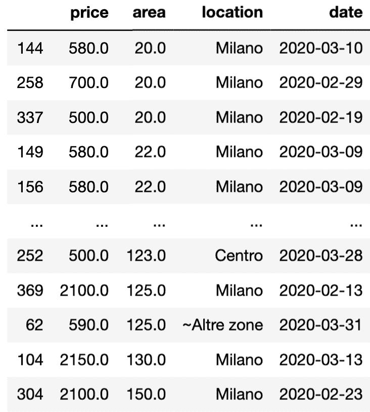

现在是处理异常值的时候了，使用[四分位间距规则](https://www.thoughtco.com/what-is-the-interquartile-range-rule-3126244)，我们总共能够移除 25 个值。

# 数据探索和可视化

现在，在将数据集分为冠状病毒爆发前后之前，让我们首先对整个数据集进行一些数据探索，以便我们可以先熟悉我们所拥有的数据。

*   检查价格平均值以及价格和面积之间的相关性

```
Price mean = 955.4214876033058
          price      area
price  1.000000  0.261033
area   0.261033  1.000000
```

所有公寓的平均价格是 955，而 26%的价格和面积之间的相关性实际上不是很好，这是值得调查的。

*   现在，我们来看看米兰每个地点的平均价格和面积的变化。

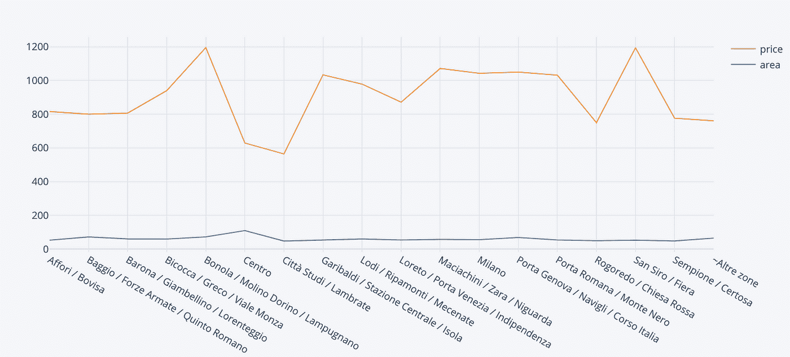

我们可以注意到，最昂贵的地区是(Bonola / Molino Dorino / Lampugnano)(圣西罗/ Fiera)，而最便宜的地区是(Città Studi / Lambrate)，非常奇怪的是(Centro)，这将在我们拆分数据的下一步中进行调查。

#注:米兰区域是基于用户提交的不指定自动分配给自治市名称的区域。

*   现在让我们分割数据集。

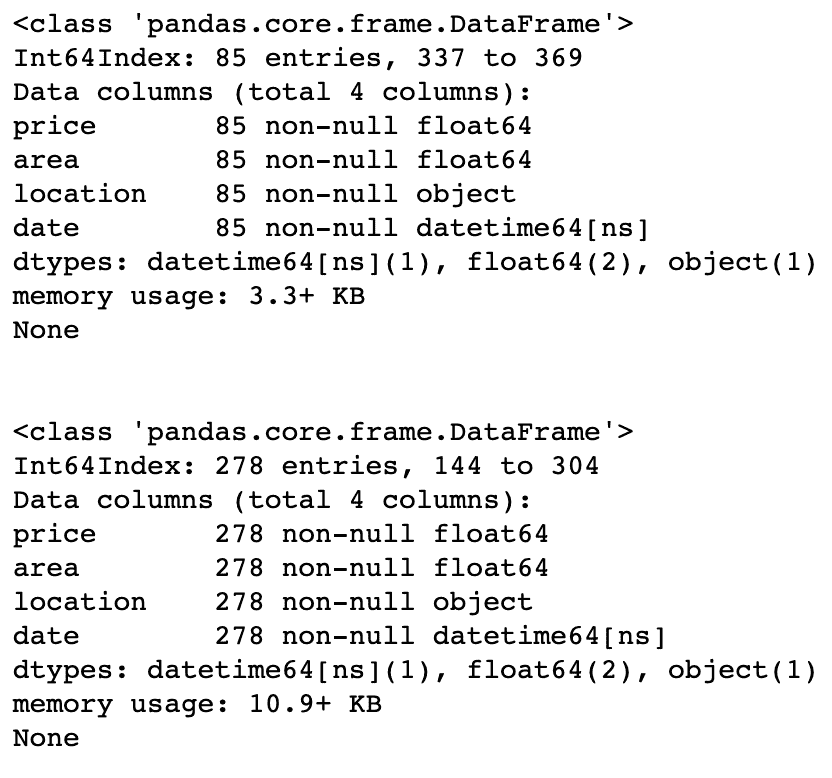

在疫情爆发前，我们有 85 个在线租房帖子，而奇怪的是，在同一时期后，我们的数量增加了两倍多。这可能预示着销售额的大幅下降。

*   用相关性检查爆发前后的平均价格。

```
Price mean before = 1141.8235294117646
Price mean after = 898.4280575539568
```

疫情爆发前的平均价格比预期的要高。

让我们检查并打印相关性并解释它。

```
price      area
price  1.000000  0.555945
area   0.555945  1.000000
          price      area
price  1.000000  0.176422
area   0.176422  1.000000
```

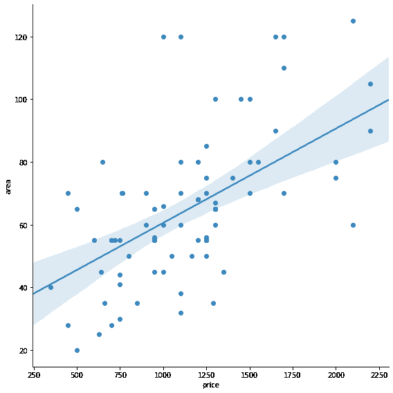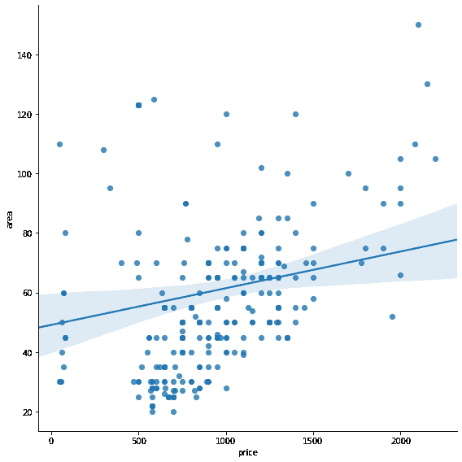

疫情爆发前，价格与地区之间存在 55%的正相关关系，而疫情爆发后，这一关系几乎为零，这表明人们的定价行为发生了变化。还值得一提的是，价格和面积之间 55%的相关性并不是那么强，它表明了许多租户可以收取比他们所得到的更多的费用，还值得一提的是，房价不仅仅取决于这些特征。

*   疫情爆发前后各地价格的变化。

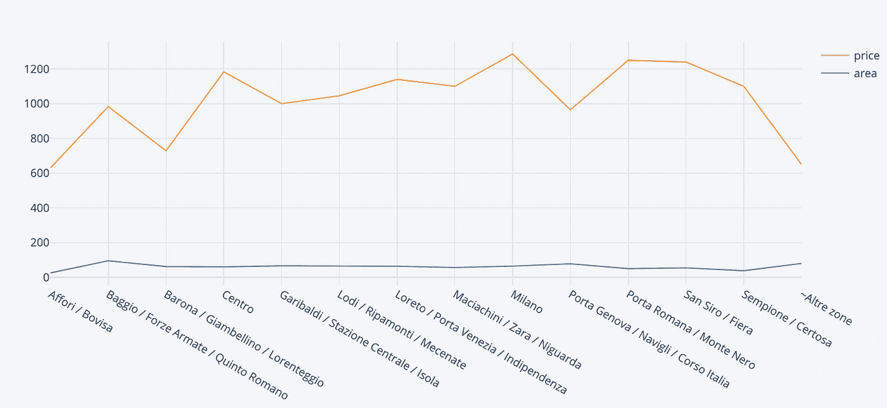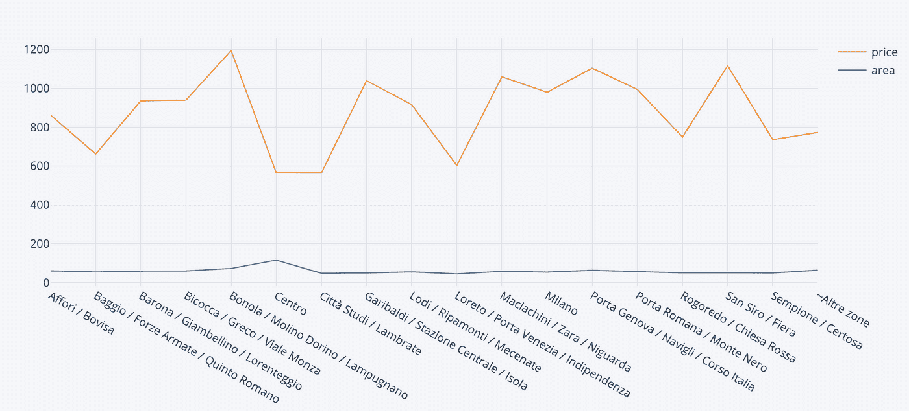

在这里，我们可以清楚地看到趋势的变化，在疫情爆发前，圣西罗地区和中心的价格最高(~1200)，然而在疫情爆发后，中心和洛雷托地区的价格下降到近一半，达到~600，其他地区有小到中等的下降，但是我们可以注意到 Bonola / Molino Dorino / Lampugnano 等地区的价格有所上升。

*   基于爆发前每个地点平均面积的价格变化。

像我们在(巴乔/弗兹·阿玛特/金托·罗马诺)或市中心看到的那样，在相同的位置相同的功能有相同的价格应该是正常的，但是在像(热那亚门/纳威格利/意大利科尔索)或(圣西罗/菲拉)这样的地区，价格有很大的变化，这肯定解释了以前的低相关数，我们应该预计在以后的数据中会有更大的变化。

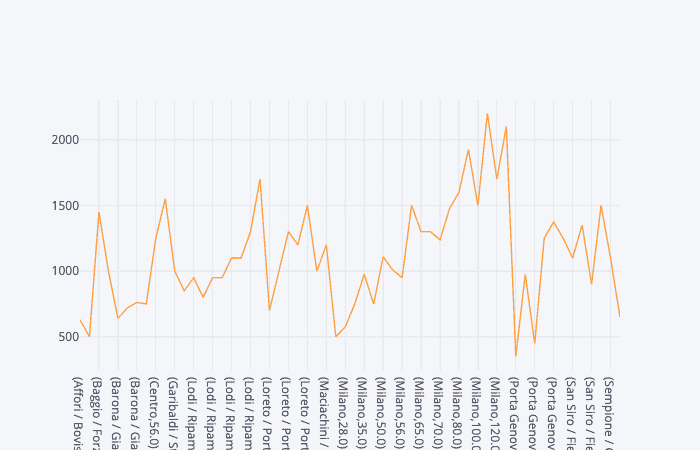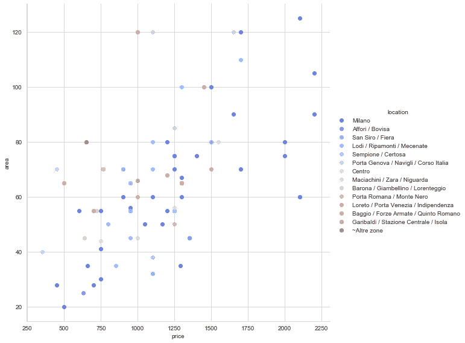

*   基于疫情爆发后每个地点平均面积的价格变化。

正如预期的那样，价格混乱可能是由于工人呆在家里对国家封锁的恐惧，以及由于企业关闭、检疫和宵禁。大量裁员将导致消费支出进一步收缩，这将迫使房东降低价格，一些房东已经开始适应新的形势，一些房东仍然提供相同的正常价格，同时也要记住短期租赁市场正在大幅放缓。

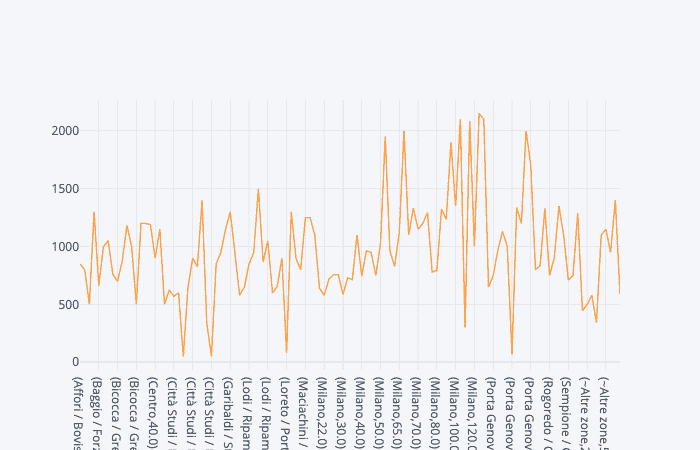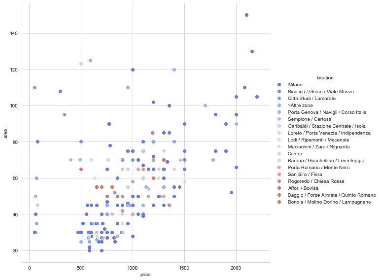

# 使聚集

在这一部分，我们将尝试根据面积和价格将市场划分为不同的公寓子集。

我们将使用一个名为[minmax scaler(](https://www.google.com/search?rlz=1C5CHFA_enIT873IT873&sxsrf=ALeKk01dgpEONB5oEMbbIMDC3tz5KKyUmA%3A1587315688528&ei=6IOcXszxH8yChbIPpLmNgAE&q=Min+Max+Scaler+what+is&oq=Min+Max+Scaler+what+is&gs_lcp=CgZwc3ktYWIQAzIHCCMQsAIQJzIGCAAQCBAeMgUIABDNAjIFCAAQzQIyBQgAEM0COgQIABBHUM8QWNsWYI4YaABwAngAgAGMAYgBjAGSAQMwLjGYAQCgAQGqAQdnd3Mtd2l6&sclient=psy-ab&ved=0ahUKEwjMhYve-_ToAhVMQUEAHaRcAxAQ4dUDCAw&uact=5)feature _ range =(0，1))的方法，在范围[0，1]内按比例变换列中的每个值。我们将此作为变换要素的首选缩放器，因为它将保留数据集的形状(无失真)。

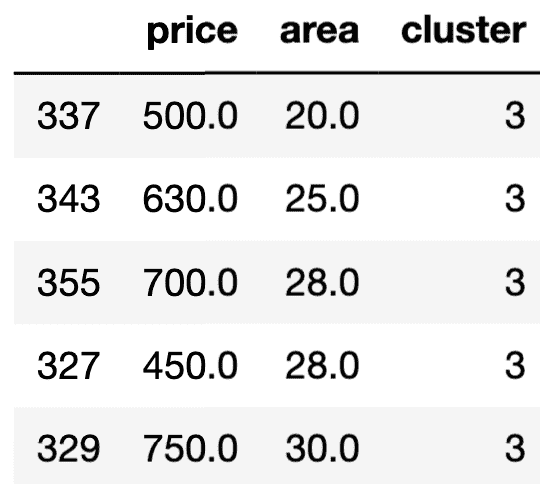

*   让我们想象一下爆发前的集群

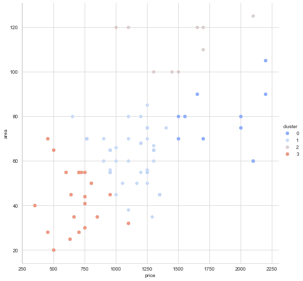

集群 0:价格(1500–2250)€，面积(60–105)平方米，这个集群有价格高的小公寓，这些公寓通常集中在昂贵的社区或中心。

集群 1:价格(625-1500)€，面积(35-86)MQ，这是中等集群，为了更好的邻里关系，你可以拥有价格比集群 3 高的小公寓。

集群 2:价格(1000-2200)€，面积(100-130)MQ，这个集群有点相关的关系，高价格的大公寓。

集群 3:价格(375-1100)€，面积(20-70)MQ，这个集群也有一个积极的关系，价格范围低的小公寓，这通常是在远离中心的地区。

*   让我们将位置加入到聚类数据中，并打印基于位置聚类的价格，也包括疫情爆发前的数据。

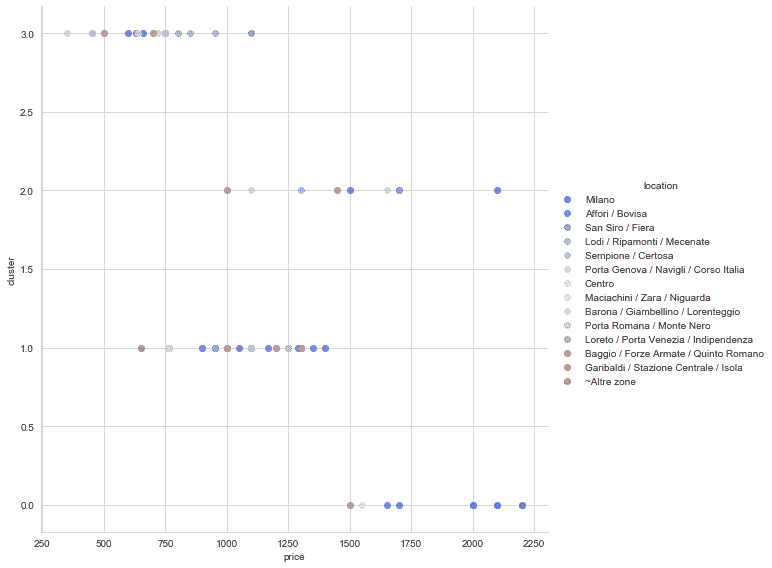

聚类和以前一样，只是在这里我们可以看到每个聚类包含城市中哪些区域的帖子，聚类 0 如预测的那样在中心有公寓，我们还可以从这个结果中假设米兰细分市场与中心和昂贵的社区相关联。

*   疫情爆发后，对数据进行同样的处理

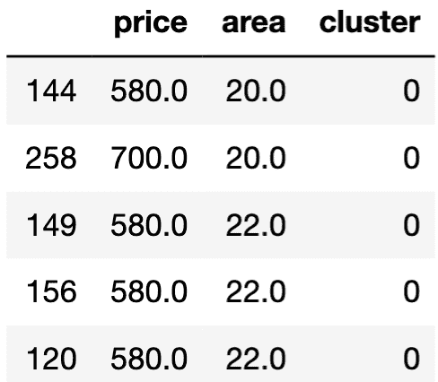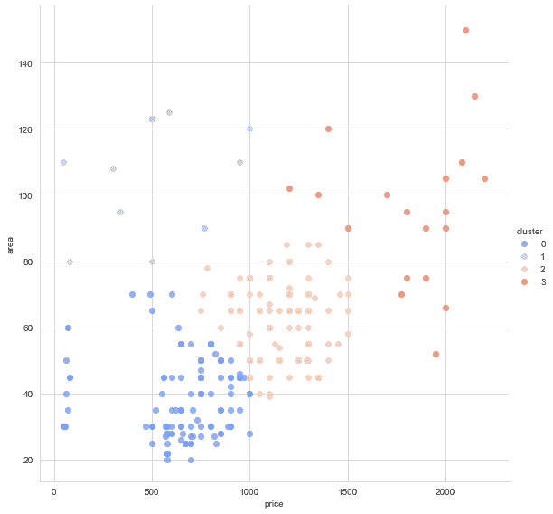

集群 0:价格(100–1000)€，面积(20–70)平方米，该集群拥有价格范围非常低的小型公寓，通常位于远离中心的区域。

聚类 1:价格(100-1000)€，面积(80-125)MQ，该聚类有更大的公寓，价格范围与以前相同，这表明在疫情爆发后，可能有些公寓不得不降低价格范围。

集群 2:价格(750-1500)€，面积(40-86)MQ，这是一个中等集群，为了更好的社区，你可以拥有价格比集群 3 更高的小公寓。

第三类:价格(1200-2250)€，面积(55-150)平方米，这个群体有从小公寓到大公寓的很大范围，但是价格很高，通常集中在昂贵的社区或中心。

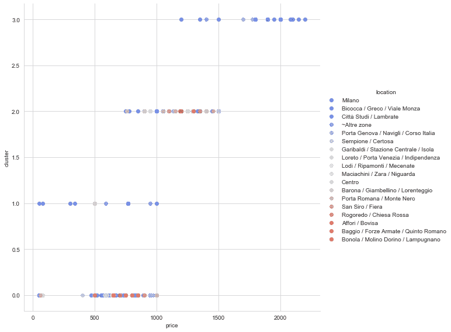

在最后一个表示中，如前所示，聚类 3 的价格最高，但是，价格不再是爆发前的中心，而是集中在 Bicocca 和 Citta Studi 等地区，集中在大学附近，而中心价格出现了大幅下降。

# 使用 ArcGis 进行探索

*供参考:*[*【https://github.com/Esri/arcgis-python-api】*](https://github.com/Esri/arcgis-python-api)

我们将采取原始数据帧后，修复日期栏，我们将手动插入谷歌地图的坐标，然后我们将删除未标识的地方' ~Altre zone '。

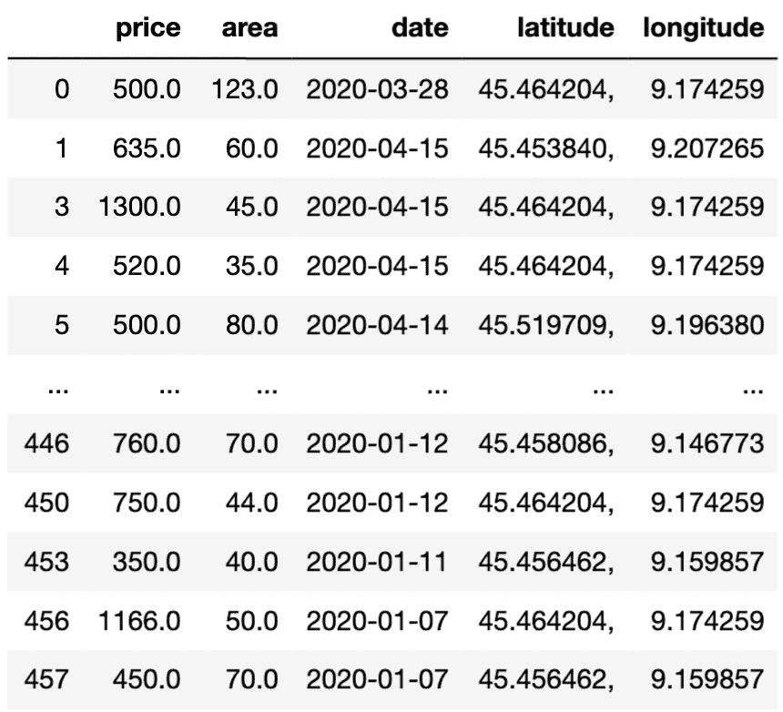

*   我们将再次分割数据，然后打印我们的第一张地图。这张地图显示了爆发前(青色)和爆发后(红色)的属性

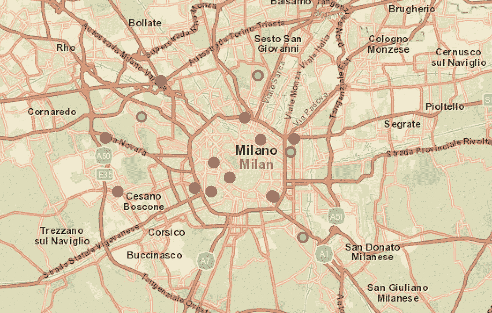

*   让我们使用热图来可视化房产(房屋)的空间密度

首先，对于之前的数据

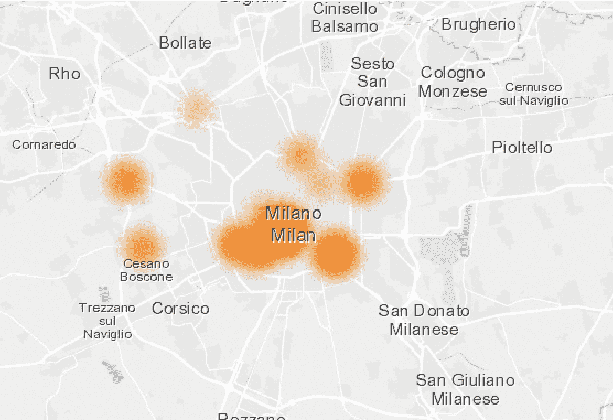

第二，对于之后的数据

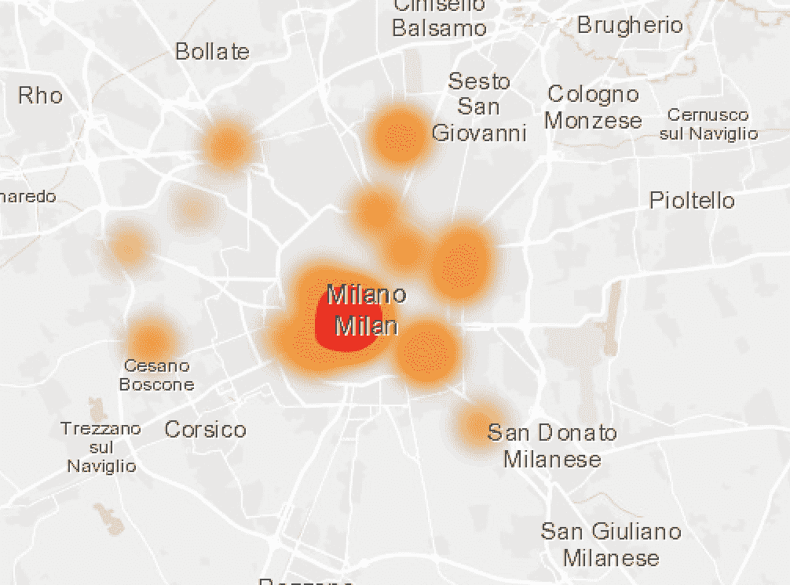

*   现在，让我们通过价格来可视化空间分布。

首先是疫情爆发前的数据。

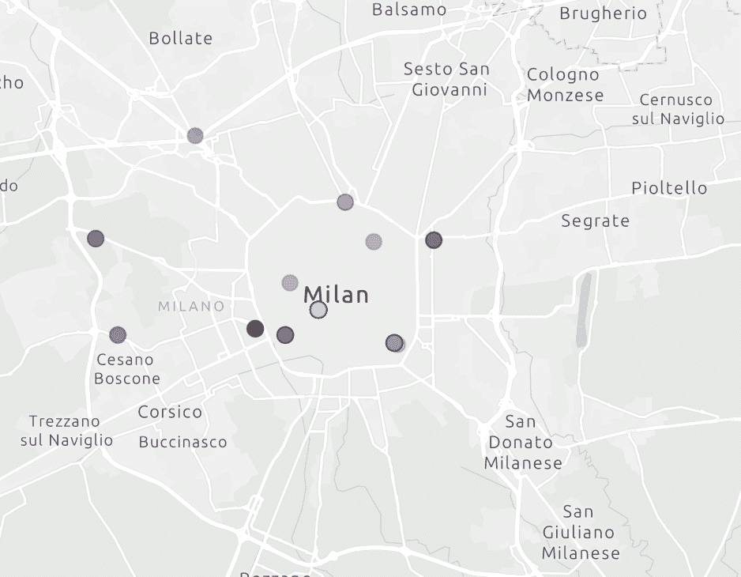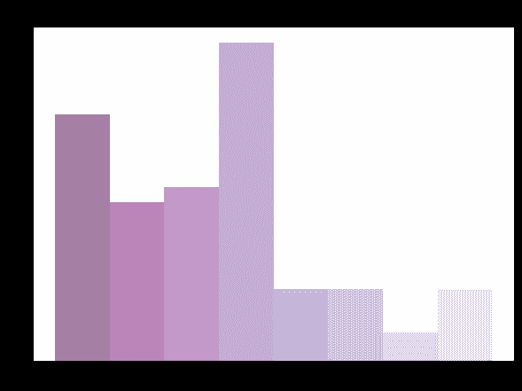

其次是疫情爆发后的数据。

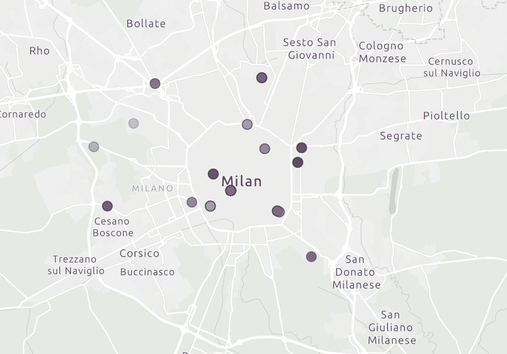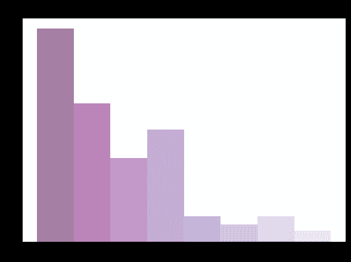

*   你有了想法，现在让我们做同样的事情，并设想按面积的空间分布

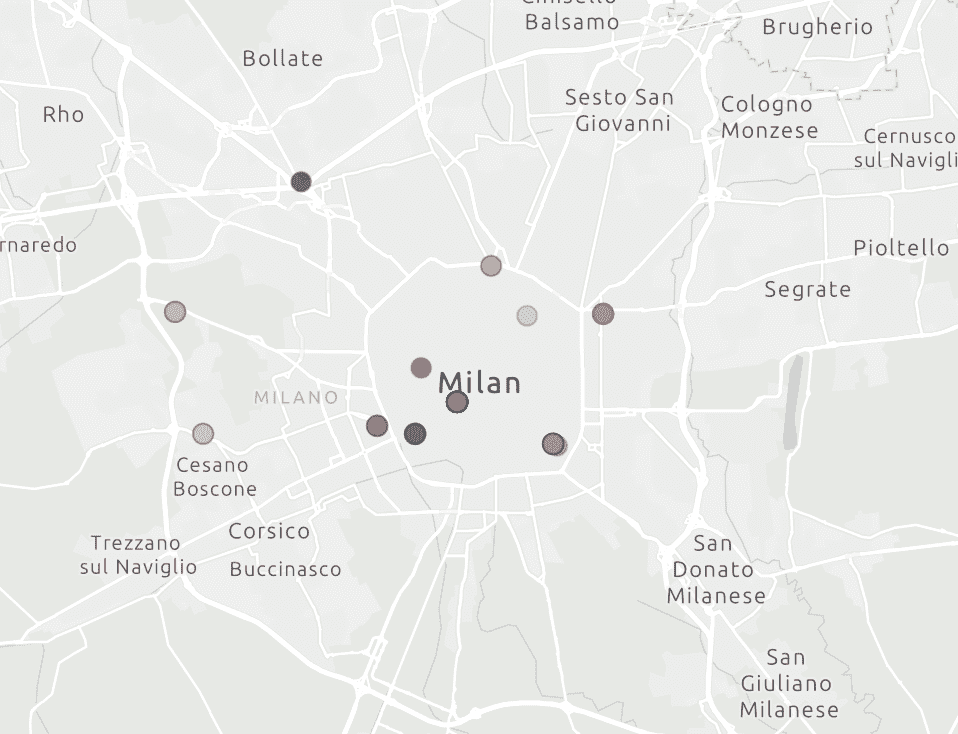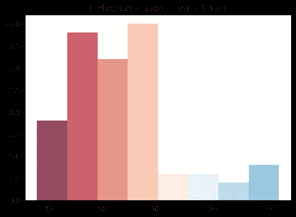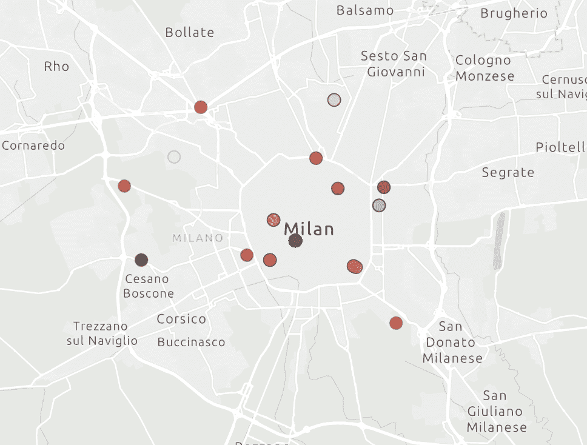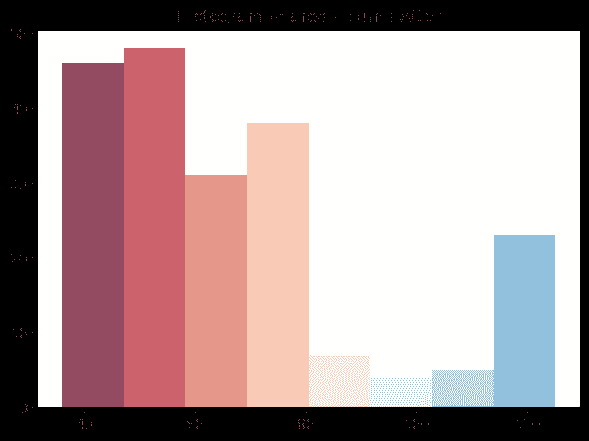

# 结论

我们可以注意到，与疫情爆发前的数据集相比，价格范围有所下降，500€下降表明价格下降，可能没有销售额下降那么大。

我们的数据和分析显示，市场行为确实发生了变化，一些房东已经开始降低他们公寓的租金，数据还显示，疫情爆发后的帖子数量是之前的三倍，这表明销售额大幅下降。

房产租赁和购买平台 Idealista.com 在 4 月初报告称，冠状病毒危机的影响尚未在市场上引起注意，尽管他们警告说，下一季度可能会对形势有更多的了解。

根据他们 2020 年第一季度的数据，意大利全国的房价下跌了 0.4%，二手房产的平均价格目前为每平方米 1699€(年跌幅为 2%)。

# 未来的工作

如果你喜欢调查市场趋势的想法，绝对建议每个公寓有更多的功能，玩虚拟变量将位置变成可测量的变量可能是一个有趣的想法，几个月后收集更多的数据以进行更深入的研究也是建议。

如果你想查看完整的代码，并知道如何自己收集数据或下载这个项目中的数据集，请查看我在 github 上的简介。

谢谢:)

***编者按:*** [*走向数据科学*](http://towardsdatascience.com/) *是一份以数据科学和机器学习研究为主的中型刊物。我们不是健康专家或流行病学家，本文的观点不应被解释为专业建议。想了解更多关于疫情冠状病毒的信息，可以点击* [*这里*](https://www.who.int/emergencies/diseases/novel-coronavirus-2019/situation-reports) *。*