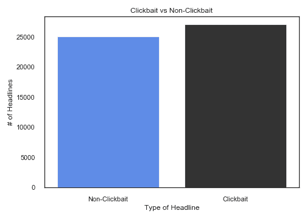
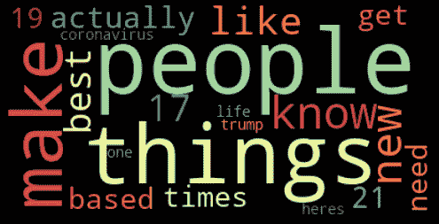
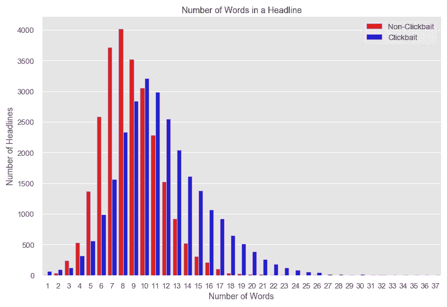
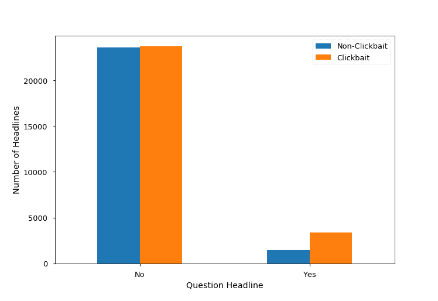
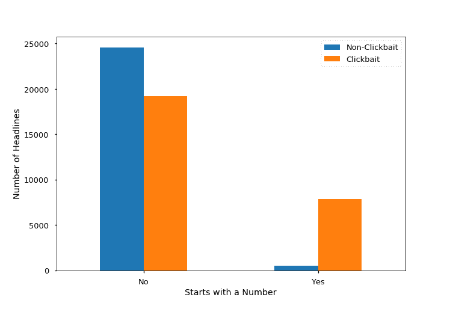
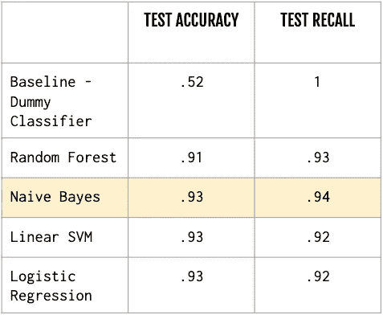
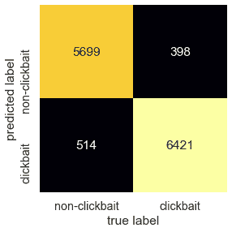
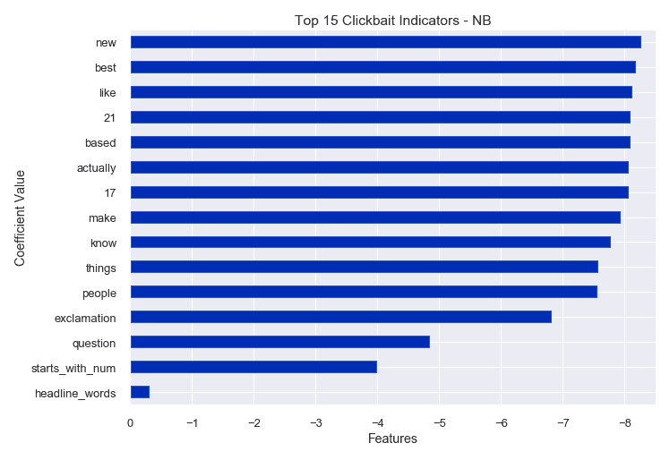

# 这个标题是 Clickbait 吗？

> 原文：<https://towardsdatascience.com/is-this-headline-clickbait-86d27dc9b389?source=collection_archive---------31----------------------->

## 使用机器学习检测点击诱饵

资料来源:Pexels

术语“点击诱饵”指的是一篇文章标题，其唯一目的是使用耸人听闻的语言来引诱浏览者点击进入某个网页。然后，网页通过用户的点击产生广告收入，或者将用户的活动数据货币化。这篇文章本身并不具有新闻的完整性，也没有研究或真正追求任何更深层次的意义——它只是一个将用户点击和数据货币化的工具。

随着社交媒体、智能手机的爆炸式增长和日益数字化的世界，不缺少争夺我们注意力的*内容*。在社交媒体上分享和转发的便利性让 clickbait 这样的杂乱信息泛滥成灾。

随着 clickbait 在网络上变得越来越流行(还记得当你滚动你的 Twitter feed，只能看到*正版*内容吗？)—我想看看是否可以使用机器学习对标题进行分类，以及这个过程是什么样子的。我这个项目的目标是为在社交媒体或各种出版商网站上大规模实施“点击诱饵拦截器”(想想“广告拦截器”)提供证据，在观众看到它之前，点击诱饵可以被标记或过滤掉！

# 数据

对于这个项目，我的数据由大约 2007-2020 年间来自各种点击诱饵和非点击诱饵来源的 52，000 个标题组成。我最终的数据集是从 Kaggle 上的[数据集](https://www.kaggle.com/amananandrai/clickbait-dataset)以及我自己对 Twitter 和各种在线出版物的抓取和 API 调用中编译的。数据根据来源被标记为点击诱饵或非点击诱饵，我的最终数据集大体上是平衡的(见下面的分布)。

**Clickbait 来源:** Buzzfeed、Upworthy、ViralNova、BoredPanda、Thatscoop、Viralstories、PoliticalInsider、Examiner、TheOdyssey

非点击诱饵来源:纽约时报，华盛顿邮报，卫报，彭博，印度教徒报，维基新闻，路透社

标签分布，用 Seaborn 绘制。

# 数据处理和特征工程

由于我最初只是处理每个标题的文本数据，下面描述了所采取的清理和特征工程步骤。

**清洁和处理**

*   使用正则表达式删除了标题中的标点、链接和非字母/非数字字符。数字没有被删除，因为我想说明一个数字的存在。
*   使用 NLTK 删除了英语停用词。
*   每一个标题都被转换成小写和符号化——最初的 EDA 使用的是 unigram，建模和后来的 EDA 使用的是 unigram 和 bigrams。
*   在我最初的 EDA 中使用了词频，但是我的模型依赖于 TF-IDF 分数，使用 NLTK 的实现来处理每个单字和双字。

**附加功能工程**

我创建了以下功能来评估标题文本数据:

*   **headline_words** :标题中的字数(在停用词被删除之前创建)。
*   **问题** : 1 表示是& 0 表示否，如果标题以一个疑问词开始并且/或者包含一个“？”(在停用词和标点符号被删除之前创建)。
*   **感叹号**:如果标题包含感叹号，则为 1；如果不包含感叹号，则为 0(在删除标点符号之前创建)。
*   **starts_with_num** :如果标题以数字开头，则为 1，否则为 0。

# 电子设计自动化(Electronic Design Automation)

在运行任何模型之前，我分析了点击诱饵标题和非点击诱饵标题的词频。词汇上有一些明显的区别，也有一些重叠，如下面的单词云所示。在 clickbait cloud 中，数字和模糊的术语一起流行。例如，利用这些词的 clickbait 标题可能是“人们实际需要的 19 样最好的东西”,因此读者会想点击阅读特定的*人或事……*

用 WordCloud 和 Matplotlib 绘制的 clickbait 标题中的前 20 个单词。

非点击诱饵标题中的前 20 个单词，用 WordCloud 和 Matplotlib 绘制。

我还分析了我的工程特性的类分布以及它们在每个类中的相关性。如下图所示，平均而言，点击诱饵标题比非点击诱饵标题略长。

与 Seaborn 密谋。

点击诱饵标题通常也以数字开头，或者在标题中提出一个问题。

与 Seaborn 密谋。

与 Seaborn 密谋。

# 建模

我训练并测试了以下模型——预测多数类的基线虚拟分类器、朴素贝叶斯分类器、随机森林分类器、线性 SVM 分类器和逻辑回归模型。我用来衡量性能的评估指标是准确率和召回率。我稍微强调了召回，以尽量减少误判，例如将一篇点击诱饵文章归类为非点击诱饵。以下是我的测试预测的准确性和召回分数的快照:

使用 sklearn 对结果建模。

使用 sklearn 的朴素贝叶斯混淆矩阵图。

如上所示，朴素贝叶斯在召回率和准确率得分方面表现最好，但其他模型也相差不远。朴素贝叶斯也是一个很好的最终模型，因为它比其他模型运行得快得多，这将在现实世界的场景中与更多的数据一起工作。

通过评估系数，我能够更仔细地查看模型的过程，并且我获得了关于模型使用什么特征和词来进行分类的有用见解。

# 总结想法和要点

我能够使用机器学习算法，如朴素贝叶斯、逻辑回归和 SVM，来准确地对点击诱饵和非点击诱饵标题进行分类。结果相当不错——准确率在 90–93%之间，召回率在 90–93%之间。我稍微优先考虑了召回，因为我认为最大限度地减少假阴性(将点击诱饵分类为非点击诱饵)会更有价值。

由于机器学习能够如此有效地工作，因此在读者甚至必须亲自可视化和评估标题之前，部署机器学习解决方案来过滤或标记 clickbait 肯定是一个真实的用例！

通过分析表现最好的模型的系数，我能够解释并深入了解模型如何决定一个标题是否是点击诱饵。

# 演示

我用 Streamlit 组装了一个简单的 web 应用程序来演示和测试我的带有新标题的模型。

使用 Streamlit 创建的 Web 应用程序。

请随意在 Heroku 上尝试部署版本，并提交您选择的分类标题: [clickbait detector](https://cb-detector.herokuapp.com/) 。

如果你对这个项目背后的代码感兴趣——看看我的 Github:【https://github.com/AlisonSalerno/clickbait_detector 