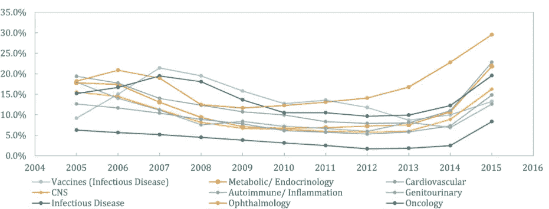
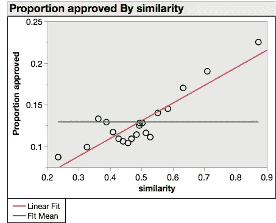
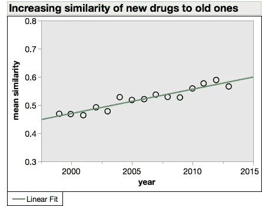
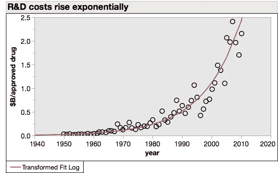

# 这家初创公司会是下一个 Theranos 吗？

> 原文：<https://towardsdatascience.com/is-this-startup-the-next-theranos-9e8208c9976f?source=collection_archive---------29----------------------->

## 有社会意识的炒作还是炒作

有了足够的热空气，你可以超越尘世的束缚。由 [Unsplash](https://unsplash.com?utm_source=medium&utm_medium=referral) 上的 [Farshad Rezvanian](https://unsplash.com/@farshadrezvanian?utm_source=medium&utm_medium=referral) 拍摄的照片

十年来最受关注的生物技术创业公司的候选人已经出现。是的，现在才一月，但这一年太棒了。

EQRx 刚刚筹集了 2 亿美元，承诺开发比传统制药公司更快、更便宜的药物。这种说法并不新颖。每一种基于工具或技术的生物技术都能制造它。[人工智能是这类炒作的热门话题。](/ai-is-not-going-to-revolutionize-drug-discovery-c41df686732d)

EQRx 还声称，它们将扰乱当前的药品定价机制。他们的药品价格会比竞争对手便宜很多。他们要求我们“想象一个人们可以专注于治疗而不是价格标签的世界”。

而且还能大赚一笔。他们将把廉价药物带给大众，不是通过放弃利润，而是通过利用市场的强大力量。那是一个新的。

## 更多的嫌隙？

像这样的声明应该让你的狗屁探测器高度警惕。当然，Theranos 是医疗保健颠覆宣传的黄金标准。EQRx 比较怎么样？

像 Theranos 一样，EQRx 声称对一个老问题提出了新的解决方案(血液的手指测试；药物开发成本高)。和 Theranos 一样，EQRx 的目标是增加患者获得医疗保健的机会和负担能力。两家公司都在没有概念验证演示的情况下筹集了数亿美元。两者都有魅力非凡的创始人。两者都是由在各自领域没有经验的风险投资人投资的。

但 Theranos 的创始人是一个毫无头绪的新手。她和她的副手们从未建立过任何东西，也没有他们想要破坏的行业的经验。EQRx 由一个拥有数十年生物技术经验和成功的团队领导。他们可以更认真地对待。

你可以看出这个人是认真的，因为他双臂交叉。来自 [Pixabay](https://pixabay.com/illustrations/forex-money-profits-earning-3205565/) ，免费用于商业用途。

## 让我们开始吃吧

EQRx 的价值主张由两部分组成:

*   以比现有公司低得多的成本开发药物
*   将节省的费用与患者分成，从而在保持高药品利润的同时降低药品价格。

这样看来，这听起来很学究气，而不是破坏性的。仔细观察就会发现它非常有野心。

将药物推向市场的平均成本[现在是 26 亿美元](https://www.ncbi.nlm.nih.gov/pubmed/26928437)。推动这一成本的不是临床前开发，临床前开发主要是药物发现和动物试验。那最多花几百万或者几千万美元。成本也不是由临床试验推动的，临床试验耗资数千万至数亿美元。成功的药物开发只需要两个逗号。

药物开发成本是由失败推动的。大约有六分之一的候选药物通过了临床测试并获得了 FDA 的批准。对于肿瘤学来说，这个数字更像是 1/20。每一种成功的药物都要付出五次失败的代价。消除这些失败，你就可以将产品价格减半，同时还能获得利润。

候选药物成功的概率。2015 年的利率可能会被边界效应夸大。来自[对临床试验成功率和相关参数的估计](https://academic.oup.com/biostatistics/article/20/2/273/4817524)。[知识共享协议 CC BY](https://creativecommons.org/licenses/) 许可

EQRx 计划如何减少故障？主要是通过追求有效的药物靶点。药物靶标是被假设导致疾病的细胞蛋白质。候选药物结合并阻断药物靶标的活性，并且在临床前研究中证实了这一点。但这并不能证明他们能治愈疾病。在临床试验中会发生这种情况。如果一种已知能与靶标结合的药物也能治愈某种疾病*，它就被认为是有效的。

## 制药界的我也是

EQRx 的计划是让其他公司来承担验证药物靶点的重任，然后快速配制结合已验证靶点的新药。这就是众所周知的“快速跟随者”策略，而且[并不是新的](https://www.evaluate.com/vantage/articles/data-insights/other-data/pharmas-fastest-followers-revealed)。最畅销的降胆固醇药物立普妥就是一个很好的例子。事实上，大多数新药都是“人云亦云”的药物。它们的工作原理与一流药物的作用靶点相同，但略有不同。

模仿药物确实有更高的成功率。新药与现有药物越相似，越有可能被批准。

1999-2014 年与现有药物的化学相似性和批准可能性之间的关系。自己的工作，数据来自[药物开发中缺失的新颖性](https://www.nber.org/papers/w24595)

最相似的药物获得批准的可能性几乎是普通药物的两倍(绿线)。制药公司注意到了这一点，新药与旧药越来越相似。

药物越来越像它们的前辈。自己的工作，数据来自[药物开发中缺失的新颖性](https://www.nber.org/papers/w24595)

仿制药物出现的平均时间是其前身出现后 2.5 年[。为什么这个数字意义重大？因为从最初的药物发现到批准](https://www.ncbi.nlm.nih.gov/pubmed/27617627)[的平均时间是 7 年](https://www.ncbi.nlm.nih.gov/pubmed/27617627)。当第一个同类药物被批准时，大多数模仿药物已经处于临床试验阶段。模仿药物研发者在开始研发前不会等待目标验证。他们刚刚输掉了争夺第一的比赛。

## 这都是关于专利寿命的

制药公司不会等到一流药物获得批准后才开始研究追随者。他们不能。现在专利有效期是 20 年。在那之后，药物就成了仿制药。当他们这样做时，价格在一年内下跌超过 50%。

回想一下，从一种药物被发现(并获得专利)到获得批准大约需要 7 年时间。那就剩下 13 年的专利时间。在此期间，药厂收取溢价。这些高昂的价格为药物的开发、失败药物的成本，当然还有利润买单。

EQRx 计划在投资药物开发项目之前等待验证。这意味着一流的药物将在 13 年后成为仿制药。如果 EQRx 再花 7 年时间获得批准，那么在面临仿制药竞争之前，它将只剩下 6 年时间。仿制药不必为 R&D 或失败的临床试验买单。没有一家制药公司能在价格上与他们竞争。

## MBA 梦遗

唯一可行的方法是缩短开发时间，降低失败率。两者兼而有之。这些并不是什么新目标。几乎每个制药公司的高管都曾经尝试过。都失败了。

药物开发成本不可阻挡地上升。这种增长是如此有规律——每年 9%——以至于它有一个名字:Eroom 定律(摩尔定律的反向)。数以千计非常聪明的 MBA 认为他们有补救办法。他们中没有人知道。

自 20 世纪 50 年代以来，药品上市成本每年复合增长 9%。自那以后，技术、管理或监管方面的变革都没有改变这一轨迹。自己的工作，数据来自[诊断药物研发效率&下降](https://www.nature.com/articles/nrd3681)

也许 EQRx 的人会在其他人失败的地方取得成功。但是他们这样做的计划听起来并不乐观。[根据创始人](https://cen.acs.org/pharmaceuticals/EQRx-launches-developdrugs-steep-discount/98/web/2020/01)Alex Borisy 的说法，“今天，你可以对十亿种化合物进行虚拟筛选，按需合成所有这些化合物，而且你可以在云中一夜之间完成。”

啊，是的，虚拟生物技术公司。在那里，你可以省去 R&D 的所有麻烦和费用，计算或外包你的问题。德瑞克·洛夫[详细剖析了这个幻想](https://blogs.sciencemag.org/pipeline/archives/2020/01/15/eqrxs-challenge-and-my-challenge-to-them)。我要指出的是，我工作过的每家公司都沉迷于此。从来没成功过。

EQRx 不仅承诺在其他人失败的地方取得成功，他们还将大规模地这样做。该计划是在 10 年内推出 10 种药物。

## 坚果

概括来说，EQRx 将

*   创造新药的速度比以往任何人都要快
*   以更高的临床成功率去做
*   不要侵犯现有专利
*   以前所未有的规模去做
*   做得又快又便宜，这样他们就可以和仿制药竞争了

希望 EQRx 成功。十年内以低廉的价格开发出十种突破性药物，将会真正造福人类。但这是不可能的。

预测 EQRx 的失败既容易又便宜。超过 90%的生物技术创业公司最终都倒闭了。如果你预测每一次冒险都会失败，即使你只是一个反对者，你也会看起来像一个预言家。我不想成为那样的人。但是，这里的难度太大了。

EQRx 不是骗局，只是幻想。但是 Theranos 也是这样开始的。让我们希望 EQRx 带着尊严(也许在将一两种药物推向市场后)而不是凶残地倒下。

*尽管并不总是如此。有时[药物也会结合*其他*靶标](https://stm.sciencemag.org/content/11/509/eaaw8412)，结果发现这些其他靶标才是致病的靶标。药品行业没有消除风险的方法。

*披露:自 1999 年吉利德收购我的雇主(NeXstar Pharma)以来，我一直持有该公司的股票，自 2000 年我帮助创立 SomaLogic 以来，我一直持有该公司的股票。*