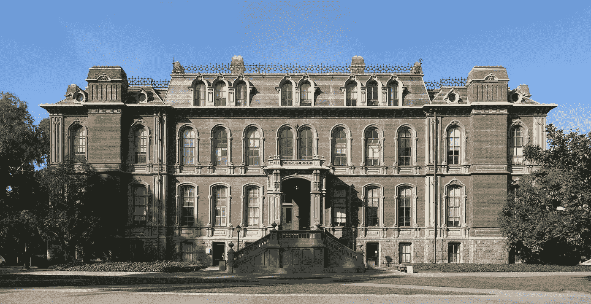

# 加州大学伯克利分校 MIDS 分校值得吗？

> 原文：<https://towardsdatascience.com/is-uc-berkeley-mids-worth-it-5ac645aa79f8?source=collection_archive---------6----------------------->

## 我是如何在 MOOCs、证书和其他大学中选择这个数据科学硕士项目的，是否值得。

本周有人联系我，询问我对加州大学伯克利分校信息与数据科学硕士(MIDS)项目的看法。这是我过去一年一直在积极追求的非全日制在线硕士课程。“总的来说，我感兴趣的是，你是否会从价格和价值的角度推荐它，”他问道，“如果你研究了其他项目，你最终是如何选择 MIDS 的？”

*(也见我入节目两年更新:* [*一个非全日制数据科学硕士项目如何改变我的人生*](/striving-for-a-work-life-school-balance-in-uc-berkeley-mids-b1bdc0220fc9)*)*

南大厅，加州大学伯克利分校信息学院的所在地。[图片由维基共享，用户:Falcorian](https://commons.wikimedia.org/wiki/User:Falcorian#/media/File:South_Hall--UC_Berkeley--Panoramic.jpg)/[CC BY-SA](https://creativecommons.org/licenses/by-sa/4.0/)

> “总的来说，我感兴趣的是，你是否会从价格和价值的角度推荐它——如果你探索了其他项目，你最终是如何选择 MIDS 的？”

两年前，当我评估包括伯克利在内的各种数据科学项目选项时，我也有同样的问题。在 MOOCs 和自学的时代，为什么有人要付出更高的成本去攻读正式的硕士课程？在硕士项目中，伯克利也不是最便宜的。伊利诺伊大学厄巴纳-香槟分校(UIUC)提供类似的课程，费用仅为 2 万美元，而伯克利的课程费用接近 7 万美元。那么是否情有可原呢？当我在网上搜索答案时，我只能找到一些过时的 Quora 帖子，这些帖子没有什么有用的信息。我今天快速搜索了一下，看到了同样的帖子。所以我想给你一个内幕消息，截止到 2020 年夏天。

这篇文章的目的是描述为什么我选择了这个项目，为什么它对我来说是值得的，作为一个已经完成了一半多一点的学生。这个项目对你是否有价值取决于你的个人情况和目标，但在分享我的情况时，我希望能让你的决定更容易。

我从数据分析师做起。在 [Unsplash](https://unsplash.com?utm_source=medium&utm_medium=referral) 上由 [Carlos Muza](https://unsplash.com/@kmuza?utm_source=medium&utm_medium=referral) 拍摄的照片

# 为什么我想学习数据科学

关于我:我的职业生涯一直处于商业判断和数据分析的交汇点。作为毕马威风险咨询业务和优步内部审计团队(财务和会计)中少数精通 SQL 的人之一，我将法律术语翻译成查询，从支持审计建议的数据中提炼故事。我使用本福德定律、关键词搜索和基本统计来识别欺诈计划和其他风险，并以用数据解决复杂难题为荣。

然而，我发现仅仅诊断过去的事件从长远来看是没有效率的，在智力上也是不令人满意的。到 2017 年，我已经尝到了学习基本 Python 给我的工作流带来的额外灵活性，这使我能够扩展到关系数据库之外。我亲眼目睹了我那才华横溢的同事[丹尼尔·皮尔斯](https://twitter.com/danielpiers)，用人工智能算法为一项调查提供了一个关键的证据。传统上专注于描述性或诊断性分析的风险管理行业正在适应更具预测性和规范性的分析。最新的欺诈监控工具利用机器学习来检测伪造文件或可疑的费用报销。我想站在这场革命的最前沿。

我开始通过 MOOC 在数据科学方面训练自己，但很快意识到它的局限性。首先，我必须建立自己的课程，但问题是我不知道自己不知道什么。我也很难找到高质量的内容来映射到我的学习计划中，因为我不知道如何评估它们。我尝试的课程往往侧重于工具，而我需要更多一点的帮助来培养数据科学思维。最后，我没有足够的动力或压力来让自己负责并完成我开始的课程。所以我决定寻找替代方案——数据科学硕士项目。

我要做一些决定。照片由[莱蒂齐亚·博尔多尼](https://unsplash.com/@letyi?utm_source=medium&utm_medium=referral)在 [Unsplash](https://unsplash.com?utm_source=medium&utm_medium=referral) 上拍摄

# 我需要从数据科学项目中得到什么

## 具有品牌价值和信誉的合法硕士学位

如果我要奉献时间和金钱，这对我来说是不够的，但是其他人可以告诉我学到了一些东西。我考虑过更短、更便宜的 DS 证书课程，但我不知道它们会给我的简历增加多少可信度。因此，我决定专注于知名高等教育机构的硕士项目。

## 兼职和远程

我在优步的职业轨迹很棒，我不打算放弃。虽然发展 DS 技能很重要，但发展领导技能和领域专业知识也很重要。一个兼职项目将允许我保持我的收入，继续我目前的职业轨迹，并继续深造。

我不在乎学校在哪里，只要我能从旧金山的家里到学校。这就排除了芝加哥大学和华盛顿大学，这两所大学有兼职项目，但只在校园内。

## 技术技能进入门槛较低，但有机会学习

我主修商科，对分析略知一二。当然，在我的生活中，我写过一些关于循环的*，但是我不能评论任何数据结构和算法。我最后一次接受统计学的正规教育是在大学三年级，最后一次是数学，高中 IB 微积分。对我来说不幸的是，一些项目要求申请者熟悉线性代数。我想我可以从路易斯安那州立大学或其他地方自学，但我渴望开始学习，所以我很快排除了那些课程。这些包括 UIUC，UCLA 和约翰霍普金斯大学。*

我也不想太深入另一端，也就是商业分析。我已经知道商业分析。所以我排除了哥伦比亚大学这样的项目(面对面和在旧金山，但也是 8 万美元！)和印第安纳州。

## 网络和社区

我的哲学是，我不可能学到所有该知道的东西，但我可以随时打电话给朋友。因此，我想要一个能让我以有意义的方式与学生和教师交流的项目。这就是为什么许多 MOOCs 对我不起作用的主要原因。

伯克利吸引我的是它的社区。 [MIDS 2017 年状态报告](https://www.ischool.berkeley.edu/programs/mids/2017statusreport)称:

> 2016 年，一项计划调查表明，72%的学生同意这一说法，“我觉得自己是我大学社区的一员”，83%的学生同意这一说法，“这个计划帮助我发展了与同学的关系网。”

我被卖了。

在 it 行业呆了一年后，我完全同意——远程学习不能阻止我完全融入社区。小型直播课堂(< =15 名学生)、与教师频繁的办公时间、关于各种主题的活跃 Slack 频道以及偶尔的本地聚会都增加了归属感。

## 最终的选择

根据我的电子表格，只有三所学校符合我的所有条件:圣母大学、西北大学和伯克利大学。因为我在伯克利完成了我的本科学业，并且喜欢上了它，所以它在我心中的分数自然就更高了。我还知道，如果有任何校园活动，我可以很容易地从旧金山访问。所以我决定先申请伯克利，其他的留在我的口袋里。我被录取了。

我该怎么办？停止投资我的事业？没想到会这样。Avel Chuklanov 在 [Unsplash](https://unsplash.com?utm_source=medium&utm_medium=referral) 上拍摄的照片

# 伯克利的经历

2019 年 3 月拿到录取通知书后，我还是不确定。我只拿到了一份很少的奖学金，勉强够支付学费，并且需要自己掏腰包支付剩余部分，所以我犹豫了。我花了很多时间浏览 Quora，并在 LinkedIn 上联系现在或以前的 MIDS 学生。数据科学似乎是我可以在 YouTube 或 Coursera 上自学的东西，只要我能建立一个强大的投资组合，我就能在其中发展我的职业生涯。但是后来我反思了我过去几年的旅程，思考决定我必须知道什么是多么困难。我需要指导，我需要一个社区。所以我决定报名。“我总是能放下它，”我想。最坏的情况是，我会花一个学期的时间与美国顶尖公立大学的学生交流。我会带着对项目课程的良好理解离开，这样我就知道自己下一步该学什么了。

三个学期后，我对我的经历感到非常高兴。在项目的前几周，我开始将在学校学到的知识运用到工作中。去年夏天，我努力解释什么是置信区间，但是现在，我已经写了两篇统计学的小论文。今天，我可以训练 ML 模型，解释它们的内部工作原理，并应用超参数调整或维度缩减。然而，我成长的最重要标志是我的抱负。过去，我想成为一名精通数据科学的商业专家，但现在，我希望成为一名精通商业的数据科学家。我参加这个项目的时候想，如果我能和 ML 工程师明智地谈论这些概念，并讨论如何将它用于商业，那就足够了。今天，我正在考虑更深入地参与 ML 算法的职业。

## 学者们

伯克利分校在申请时对数学或编程没有硬性要求，但提供桥梁课程，并为建立坚实的基础提供支持。伯克利分校帮助弥合这一差距的能力是一项不可思议的资产，也是该项目的优势。它允许像我这样的商业人士带来有趣的观点，这样更多的技术人员可以向我们学习，反之亦然。MIDS 项目在管理思想、学科和背景的多样性和包容性方面非常出色。

内容的质量很高，这是不言而喻的。这些课程讲述永不过时的基础知识以及最新的数据科学趋势。从教授到大公司的顶级数据科学家，顶尖的导师们不断创新程序，以保持领先地位。

与 MOOC 不同，Cal 在项目中建立了问责制，使我可以轻松地每周投入 20-30 小时进行学习。只有 15 名学生参加的现场会议激励我及时完成所有的每周材料，以便我能够参与讨论。现场会议和办公时间给了我提问的机会，这是我学习的第三好方法。第二个最好的方法是通过做，这是由动手项目来完成的。我学习的最好方式是通过教学，通过注册成为一名编程课的助教，我也可以做一点——不完全是通过教学，而是通过提供对其他学生代码的反馈。如果这些还不够，我敬业的学生顾问会定期检查我，确保我拥有在 MIDS 成功所需的一切。

## 社区

信息学院还提供优秀的[职业咨询服务。我已经和出色的](https://www.ischool.berkeley.edu/careers/students)[劳里·哈斯克尔-沃纳](https://www.linkedin.com/in/lauriehaskellwoerner/)——我们的职业顾问——进行了两次私人咨询，并从她的见解中受益匪浅。我们讨论了一些短期计划，比如提高我在 LinkedIn 上的地位和长期职业战略。她帮我联系了几个校友，他们可以就具体的话题给我进一步的建议。接受这种量身定制的高质量护理就像拥有了一位个人职业教练和导师。

最后但同样重要的是，社区参与度超出了我的预期。我交了很多朋友，因为有足够的机会与人们面对面交谈并了解他们。我喜欢学生主导的学习会议。我欣赏来自各行各业的学生:工程师、统计学家、教师、金融领袖、企业家和建筑师。Slack 增强了体验。我在 Slack 上做的第一件事就是寻求一些职业建议，于是很多学生都跳出来帮忙。我也喜欢#咖啡，#音乐，#酷数据-即，#伦理，和#不愚蠢的问题。来自世界各地、各行各业、各年龄段和各行各业的学生和教师分享他们的观点。挺好看的。

时间、金钱和努力工作？是的。转型？还有，是的。苏珊·d·威廉姆斯在 [Unsplash](https://unsplash.com?utm_source=medium&utm_medium=referral) 上的照片

# 那么，值得吗？

是的。

我很高兴我没有让价格标签阻止我追求我的梦想和我的职业生涯。亲爱的读者，我个人并不了解你，也不能说这对你是否会像对我一样富有成效。然而，我看到一群不同的聪明人正在享受这个项目。MIDS 似乎有适合每个人的东西。拥有博士学位或辉煌商业生涯的人；以前赢得过 Kaggle 比赛的人或者刚刚开始涉足 scikit-learn 的人；一个快到退休年龄的人或者一个刚从大学毕业的人。每个人的目标和旅程都与我不同，但在伯克利这里有适合他们的东西。

如果你正在读这篇文章，是因为你对 MIDS 持观望态度，我要说，去吧！如果你之前对在线研究生项目有任何疑问，请记住，MIDS 早在疫情时代之前就已经投资远程学习技术了。是的，在线学生得到了和其他伯克利学生一样的待遇和福利——图书馆、学生折扣、选举学生官员的权利，应有尽有。我甚至去伯克利拿了一张学生证，在博物馆展出，并用作 AC Transit 的免费乘车证。

这个项目给了我比我预想的更多的东西，对此我很感激。我唯一的遗憾是没有早点开始。

*(注:经过进一步的研究，我发现了王巍在 2020 年 4 月写的这篇伟大的新帖***。看看吧！)**

**(更新:看看这篇名为“* [*的新文章:佐治亚理工学院 OMSA 分校 vs 加州大学伯克利分校 MIDS 分校*](/1-year-into-the-program-georgia-tech-omsa-vs-uc-berkeley-mids-c1675356d531) *”作者是我的同学和他的朋友。写于 2020 年 6 月。)**