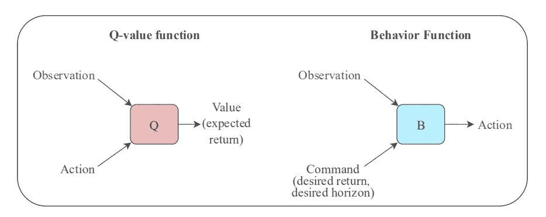
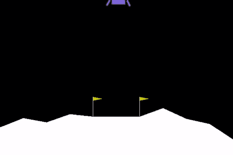
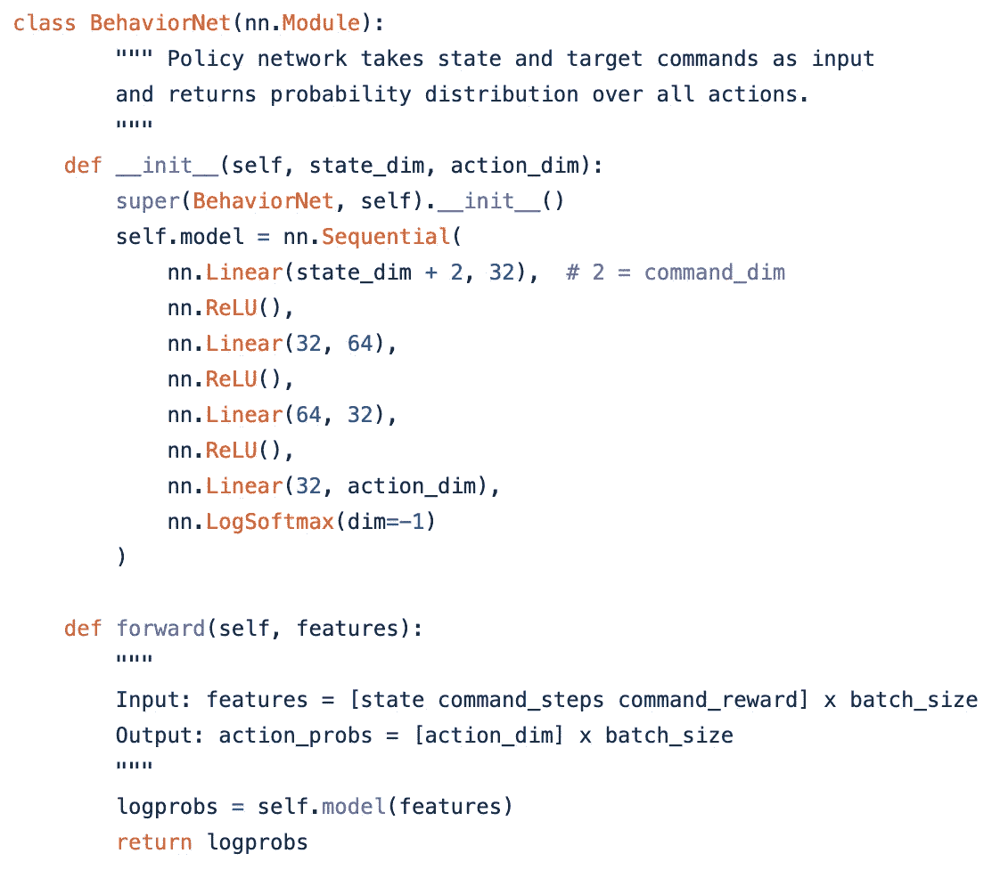
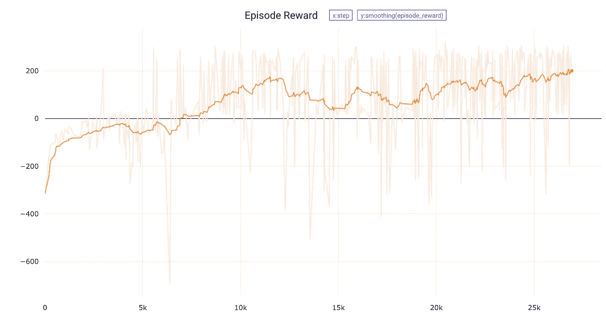
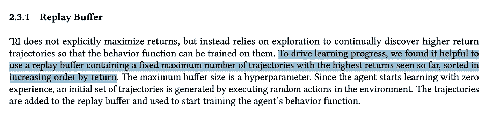
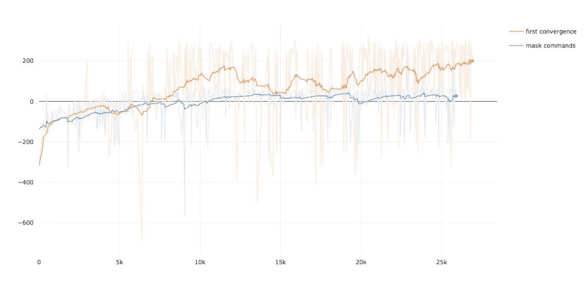

# 颠倒强化学习=模仿学习吗？

> 原文：<https://towardsdatascience.com/is-upside-down-reinforcement-learning-imitation-learning-4a9d346f9f98?source=collection_archive---------53----------------------->

## 理解和实现 UDRL 算法

# 什么是颠倒强化学习？

我是在参加 NeurIPS 2019 的 RL 研讨会时发现这项工作的。老实说，这是我在会议上偶然发现的最酷的想法之一。你可以在这里看看我在会议上最喜欢的其他想法。无论如何，这个帖子是关于检查倒挂强化学习更多。你可以在这里阅读完整的论文，但是这里是摘要所说的:

> 传统的强化学习(RL)算法要么用价值函数来预测回报，要么使用策略搜索来最大化回报。我们研究了一种替代方法:倒置强化学习(倒置 RL 或 UDRL)，它主要使用监督学习技术来解决 RL 问题。在这里，我们提出了 UDRL 的第一个具体实现，并证明了它在某些情景学习问题上的可行性。实验结果表明，其性能可以与经过几十年研究开发的传统基线算法相媲美，甚至超过后者。

如果你想更深入地了解这篇论文，你可以观看这个优秀的[视频](https://www.youtube.com/watch?v=RrvC8YW0pT0)。但是 TL；dr——他们设计了一种新的监督学习算法来解决强化学习任务。没有政策梯度，没有价值函数估计，只是简单的旧的监督学习。下面是论文中的一个图表，可以更好地说明这一点:

行为功能试图预测的是— *根据这一观察，在这一期望的时间范围(总时间步长)*内，采取什么样的最佳行动来实现这一期望的回报(总回报)。它们不是学习/模拟奖励，而是被用作直接预测行动的输入(命令)。

为了更好地理解整个算法，我进行了一些快速实验。这篇文章记录了我的发现。

我特别想回答以下两个问题:

1.  既然实现大多数 RL 算法是极其重要的，那么让这个算法运行起来有多容易呢？
2.  只是巧妙伪装的模仿学习算法吗？

# 要解决的任务—稀疏月球着陆器

为了回答上述问题，我实现了算法来解决稀疏月球着陆器任务(论文中提到的任务之一)。任务是学习一个代理人能够成功地登陆月球情人，如下所示:

我通过修改奖励函数将 OpenAI Gym 的“LunarLander-v2”环境手动转换为稀疏环境，如下所示:

*   0 奖励所有非终端步骤
*   最后一步的每集总奖励

# 实施说明

*   所有的学习组件都是使用 Pytorch 实现的
*   论文列出了他们在实验中扫描的所有超参数值。我根本没有调过音。只是选择了每一个的中间值。
*   模型架构:

*   使用 [comet.ml](http://comet.ml/) 进行度量跟踪

这个实验的代码可以在[这里](https://github.com/bprabhakar/upside-down-reinforcement-learning)获得。现在，让我们来看看实验结果。

# 让算法发挥作用有多容易？

回答——出奇的快。我能够在我的第三个(！)运行尝试；而不需要对超参数进行太多的修改。我不记得任何基于策略梯度的算法上一次出现这种情况是什么时候了。

当然，这需要半信半疑，因为“月球着陆器”是一项相对简单的任务。但是如果你看看代码中实现的算法，你会同意这个算法简单得可笑！

# 只是变相的模仿学习吗？

我读这篇论文的第一印象是，这个想法听起来非常类似于模仿学习。考虑描述重放缓冲策略的论文中的以下摘录:

因此，随着训练的进行，通过设计，存储在缓冲器中的轨迹开始越来越像*专家轨迹*(高回报的剧集)。仅仅学习从状态到这些专家轨迹上的行为的映射(模仿学习)就足够了。这个想法实际上在之前的工作中得到更好的表达，叫做[自我模仿学习](https://arxiv.org/abs/1806.05635)。

为了测试这一假设，我进行了以下实验——试图通过屏蔽行为功能的命令输入(保持其他一切不变)来了解要采取的最佳行动。所以有效地，仅仅学习仅仅从观察中预测行动。事情是这样的:

显然，将*命令*作为行为函数的输入会产生不同。我的猜测是，拥有这些命令有助于代理进一步区分不同类型的高回报轨迹，从而帮助它学习得更快。这显然需要在更复杂的环境中进一步测试，但我的微观实验结果绝对令人鼓舞。

实验的所有代码都可以在这个 [Github Repo](https://github.com/bprabhakar/upside-down-reinforcement-learning) 上获得

这个帖子最初发布在 [bprabhakar.github.io](https://bprabhakar.github.io/2020/04/18/udrl.html)