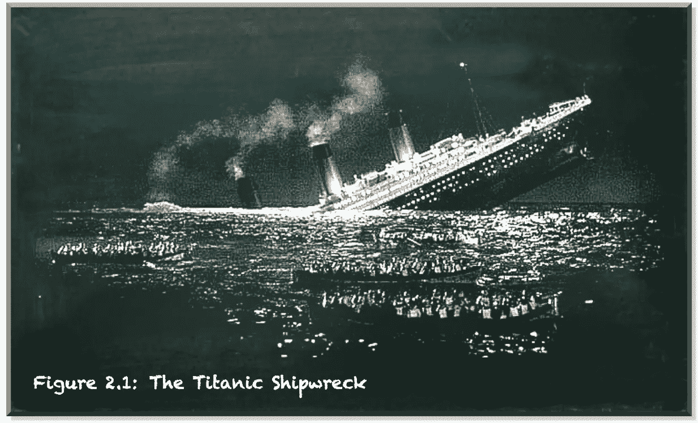
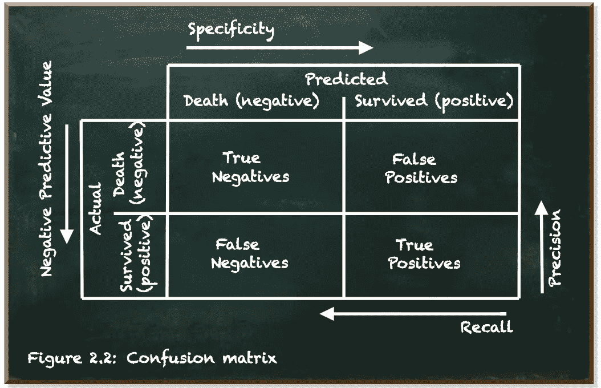
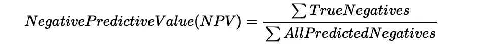

# 你的分类器好吗？

> 原文：<https://towardsdatascience.com/is-your-classifier-any-good-796050a36f9a?source=collection_archive---------64----------------------->

## 不要陷入错误的评价标准

本帖是本书的一部分: [**用 Python 动手做量子机器学习**](https://www.pyqml.com/page?ref=medium_classifier&dest=/)



作者弗兰克·齐克特的图片，改编自电影《难忘的一夜》(1958 年，[松林制片厂](https://www.pinewoodgroup.com/))

在本帖中，我们旨在预测一名乘客是否在泰坦尼克号沉船事故中幸存。但是我们甚至不看数据，而不是训练一个复杂的模型。通过这种方式，我们发现产生看似好的结果实际上毫无价值是多么容易。

预测泰坦尼克号上的幸存者是一项分类任务，因为有不同的结果值。具体来说，这是一个二元分类任务，因为正好有两个可能的预测(`survived`或`died`)。

在我们开发复杂的机器学习算法之前，让我们实现我们可以想象的最简单的算法。猜测的分类器。

随机分类器

我们导入随机数生成器(第 1 行)并初始化它(第 2 行)。

我们的分类器是一个将乘客数据作为输入并返回`0`或`1`作为输出的函数。与我们的数据相似，`0`表示乘客死亡，`1`表示乘客幸存。

为了使用分类器，我们编写了一个 Python 函数，为训练集中的每个项目运行分类器。

分类赛跑运动员

该函数将分类器函数作为第一个参数(我们可以稍后替换分类器)，将输入数据(如`x`)作为第二个参数(第 1 行)。

它使用 Python 的`map`函数来调用带有`x`中每一项的分类器，并返回一个结果数组。

让我们运行它。

运行分类器

`[0, 1, 0, ... 0, 1, 1]`

当我们使用`train_input`运行分类器时，我们会收到一个预测列表。

由于我们的目标是正确预测实际结果，所以我们需要评估预测是否与实际结果匹配。

让我们看看我们预测的准确性。

评估分类器

```
350 correct predictions out of 711\. Accuracy 49 %
```

我们定义另一个函数`evaluate`。它将我们算法的预测和实际结果作为参数(第 1 行)。

术语`list(zip(predictions,actual))`(第 4 行)创建了一个包含两个条目的列表。2 项列表是预测和相应的实际结果的配对。

我们从预测与实际结果匹配的列表中选择这些`item`(`lambda item: item[0] == item[1]`)(第 3 行)。这些都是正确的预测。正确预测的列表长度除以乘客总数就是我们的`Accuracy`。

太好了！我们已经在一半的情况下(或多或少)是正确的。当从两个可能的标签中猜出一个时，这并不奇怪。

但是也许我们可以做得更好？我是说毫不费力。我们知道死亡的人比幸存的人多。如果我们总是预测一个乘客的死亡会怎么样？

总是预测有乘客死亡

```
437 correct predictions out of 711\. Accuracy 61 %
```

我们预测的准确率高达 61%。不算太坏，是吗？这个值，也就是两个可能的实际值之比，就是患病率。

让我们考虑一个不同的任务。假设你是一名医生，你的任务是预测病人是否患有癌症。你的病人中只有 1%患有癌症。如果你一直预测没有癌症，你的准确率会达到惊人的 99%!但是你会错误地诊断出实际上患有癌症的病人。由于缺乏治疗，他们将会死去。

也许仅仅预测的准确性并不能很好地衡量我们算法的性能。

评估是每个机器学习算法的一个主要部分。乍一看，这似乎是微不足道的。然而，决定正确的措施是非常重要的一步。当你朝着更好的性能优化你的算法时，你将不可避免地在你的评估函数中朝着更好的分数优化。

但是现在，我们保持简单。评估分类器性能的更好方法是查看混淆矩阵。



作者弗兰克·齐克特的图片

总的想法是将预测值与实际值进行比较。在二元分类中，有两个可能的实际值:`true`或`false`。并且有两种可能的预测:`true`或者`false`。

有四种可能性:

*   **真否定** (TN):一名乘客死亡被正确预测
*   **假阳性** (FN):一名死亡的乘客被错误地预测为存活
*   **假阴性** (FP):一名幸存的乘客被错误地预测死亡
*   **真阳性** (TP):一名幸存乘客被正确预测

我们来看看`predict death`分类器的混淆矩阵。

预测死亡分类器的混淆矩阵

```
array([[437,   0],
       [274,   0]])
```

*Scikit-Learn* 提供了我们导入的`confusion_matrix`方法(第 1 行)。它将实际值作为第一个参数，将预测值作为第二个参数(第 3 行)。

它返回一个二维数组。在第一行，它显示了真阴性(TN)和假阳性(FP)。在第二行，它显示了假阴性(FN)和真阳性(TP)。

我们可以将目前测量的精度定义为:


它不关心是否存在系统误差，例如算法不能正确预测幸存的乘客(真阳性)，只要它在正确预测死亡的乘客(真阴性)方面表现良好。

混淆矩阵为我们提供了分类器性能的更详细的度量。这些是:

*   精确
*   召回
*   特征
*   阴性预测值(NPV)

精度是“正面预测的准确性”。它只关注正面的预测，这些是乘客幸存的预测。


让我们看一下代码:

精确分数

```
The precision score of the predict_death classifier is 0.0
```

*Scikit-Learn* 提供了计算`precision_score`的功能。它将实际值列表和预测值列表作为输入。

因为我们没有一个正面的预测，所以我们的精确度是不确定的。 *Scikit-Learn* 将此解释为`0.0`的分数。

召回是“实际阳性的准确性”。它只关注实际的积极因素。


在 Python 中，它是:

回忆分数

```
The recall score of the predict_death classifier is 0.0
```

这一次，即使定义了`recall`(实际阳性的数量大于 0)，分数仍然是`0.0`，因为我们的分类器没有正确预测单个存活。当它总是预示着死亡时，这并不奇怪。

特异性是“实际底片的准确性”。它只看实际的负面(死亡)。


而“负面预测值”(NPV)是“负面预测的准确性”。



这两个功能不是现成的。但是利用我们从混淆矩阵中得到的值，我们可以很容易地计算它们:

特异性和净现值

```
The specificity score of the predict_death classifier is 1.00
The npv score of the predict_death classifier is 0.61
```

函数`specificity`将混淆矩阵作为参数(第 1 行)。它将真阴性(`matrix[0][0]`)除以真阴性和假阳性之和(`matrix[0][1]`)(第 2 行)。

函数`npv`将混淆矩阵作为一个参数(第 4 行)并将真否定除以真否定和假否定之和(`matrix[1][0]`)。

这四个分数提供了我们的分类器的性能的更详细的视图。

让我们也为我们的随机分类器计算这些分数:

随机分类器的分数

```
The precision score of the random classifier is 0.40
The recall score of the random classifier is 0.52
The specificity score of the random classifier is 0.51
The npv score of the random classifier is 0.63
```

虽然`predict death`分类器完全没有精确度和召回率，但它具有完美的特异性，并达到与我们测试数据集中的阴性百分比(患病率)相匹配的 NPV 分数。

随机分类器产生更平衡的分数。每次运行分类器，你都会得到一点点不同的分数。但是这些值似乎停留在一定的范围内。虽然这个分类器的精度通常低于`0.4`，但是 npv 高于`0.6`。

混淆矩阵和相关度量给你很多信息。但是有时候，你需要一个更简洁的度量标准。事实上，机器学习算法中的评估函数必须返回它可以优化的单个度量。

这个单一的测量应该揭露一个没有真正增加任何价值的分类器。

本帖是本书的一部分: [**用 Python 动手做量子机器学习**](https://www.pyqml.com/page?ref=medium_classifier&dest=/) **。**


在这里免费获得前三章。