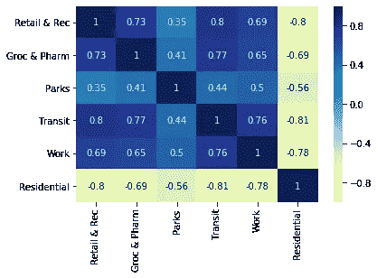
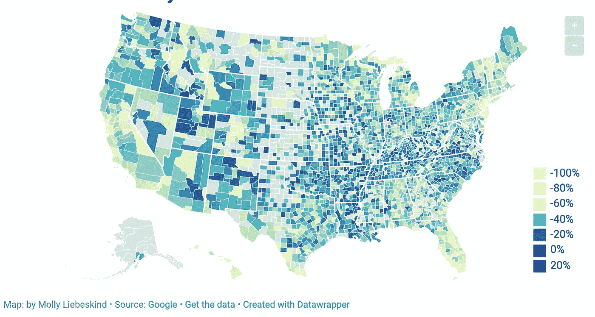

# 你的社区为抗击新冠肺炎做了足够的努力吗？

> 原文：<https://towardsdatascience.com/is-your-community-doing-enough-to-fight-covid-19-aa745b424eb1?source=collection_archive---------45----------------------->

## 谷歌的移动性报告告诉我们什么是应对新冠肺炎的行为变化

根据美国疾病控制和预防中心的说法，防止新冠肺炎病毒传播的最好方法是与其他人保持足够的距离，至少 6 英尺。这有助于避免被感染者通过咳嗽、打喷嚏和说话时从鼻子或嘴里喷出的飞沫传播疾病。作为回应，许多国家鼓励居民呆在家里，只在必要或必要的工作时才离开。

上周，为了追踪人类行为如何因新冠肺炎而改变，谷歌发布了[移动报告](https://www.google.com/covid19/mobility/)，该报告汇总了一段时间内匿名化的地理移动趋势。这些数据是通过手机定位历史记录获得的，可以跟踪多种类别的活动，包括零售和娱乐、杂货店和药店、公园、公交车站、工作场所和住宅区。通过这些报告，我们现在可以看到美国和全球的居家条例是如何影响行为的，以及我们可以在哪些方面继续做得更好以阻止这种传播。

# 全球行为的变化

根据 4 月 9 日发布的最新报告，减少人类互动的全球倡议正在对行为产生巨大影响。全球平均值显示，所有公共聚会活动减少，在家人数增加。具体而言，报告强调了以下几点。

*   零售和娱乐活动平均减少 60.5%
*   工作场所出勤平均减少 35.5%
*   杂货店和药店平均降价 38.6%
*   在家时间平均增加 16.8%

虽然这些数字代表全球平均水平，但在国家一级，我们看到对新冠肺炎的反应存在差异。下图描绘了目前谷歌数据集中包括的所有国家在居住空间花费时间的变化。

我们可以看到，尽管几乎所有国家都增加了在家的时间，但人们呆在家里的程度各不相同。巴拿马、玻利维亚、秘鲁和博茨瓦纳等国家已经做出了重大改变，居家活动增加了 34%以上。要查看其他类别的统计数据，如购物、工作出勤和参观公园，请滚动国家/地区。

# 在美国的影响

根据避免社交聚会和人与人之间近距离接触的建议，仅在美国，42 个州至少有 3 . 16 亿人受到地方政府的指示，尽可能待在家里。这相当于大约 95%的美国人口。谷歌的报告揭示了这些法令如何影响了美国各地的行为。

随着全国各地的餐馆、酒吧、商店和其他工作场所关闭，我们看到工作场所的出勤率平均下降了 40%，零售和娱乐活动平均下降了 49%。然而，人们仍然经常出于各种原因离开他们的家，包括因为他们是必要的工人，他们需要食品杂货和其他必需品，或者他们正在参观一个公园。在全国范围内，我们只看到居住时间平均增长了 13%，低于全球 16.8%的平均水平。下图显示了美国各地住宅活动的变化情况。在新泽西州和加利福尼亚州等州，我们看到住宅活动增加了 16%，而尚未实施居家条例的州，如阿肯色州和爱荷华州，住宅活动仅增加了 8%。

虽然上面的地图只显示了居住活动的变化，但我们看到居住活动和涉及公共互动的类别之间存在强烈的负相关。下面的热图显示，在人们居住时间越长的州，他们花在购物、工作和公共交通上的时间越少，这意味着他们接触病毒的频率越低。

Molly Liebeskind 绘制——来源谷歌移动报告

# 让你的社区变得不同

我们正在全球和全国范围内大力限制公众互动，但上面的图片显示我们仍有很大的改进空间。在谷歌移动报告的帮助下，你现在可以看到你的社区是如何回应新冠肺炎的。滚动浏览您所在的县，查看您所在社区行为的详细信息，以及您可以在哪些方面做得更好，以帮助阻止新冠肺炎的传播。

Choropleth 着色源自娱乐和零售活动。滚动一个县，查看更多详细信息。注意:灰色的县没有足够的信息供谷歌匿名报告。由于缺乏信息，一些县缺少信息，这在叠加图中以空%表示。

帮助阻止疾病传播是我们所有人的责任。以下是一些方法，你可以采取行动，帮助阻止新冠肺炎在你的社区传播。

1.  减少购物次数，将购物旅行整合成一次大型采购
2.  接入网上杂货配送系统或路边取货
3.  转向邮购药物
4.  通过[更新您的脸书个人资料图片](https://www.facebook.com/profilepicframes/?selected_overlay_id=302247084082668)来激励他人
5.  当你确实需要离开房子时，遵循[疾病预防控制中心的指导方针](https://www.cdc.gov/coronavirus/2019-ncov/prevent-getting-sick/index.html)来帮助保护自己和他人

本文的数据由 Google 以 PDF 文档的形式发布，这些文档由 active commendation 抓取并聚合成 csv 文件。完整的数据集可以在[这里](https://github.com/ActiveConclusion/COVID19_mobility)找到。

***编者按:*** [*走向数据科学*](http://towardsdatascience.com/) *是一份以数据科学和机器学习研究为主的中型刊物。我们不是健康专家或流行病学家，本文的观点不应被解释为专业建议。想了解更多关于疫情冠状病毒的信息，可以点击* [*这里*](https://www.who.int/emergencies/diseases/novel-coronavirus-2019/situation-reports) *。*

## 参考

*[*https://www.cdc.gov/coronavirus/2019-nCoV/index.html*](https://www.cdc.gov/coronavirus/2019-nCoV/index.html)*

**[*https://www . nytimes . com/interactive/2020/us/coronavirus-stay-at-home-order . html*](https://www.nytimes.com/interactive/2020/us/coronavirus-stay-at-home-order.html)**

****