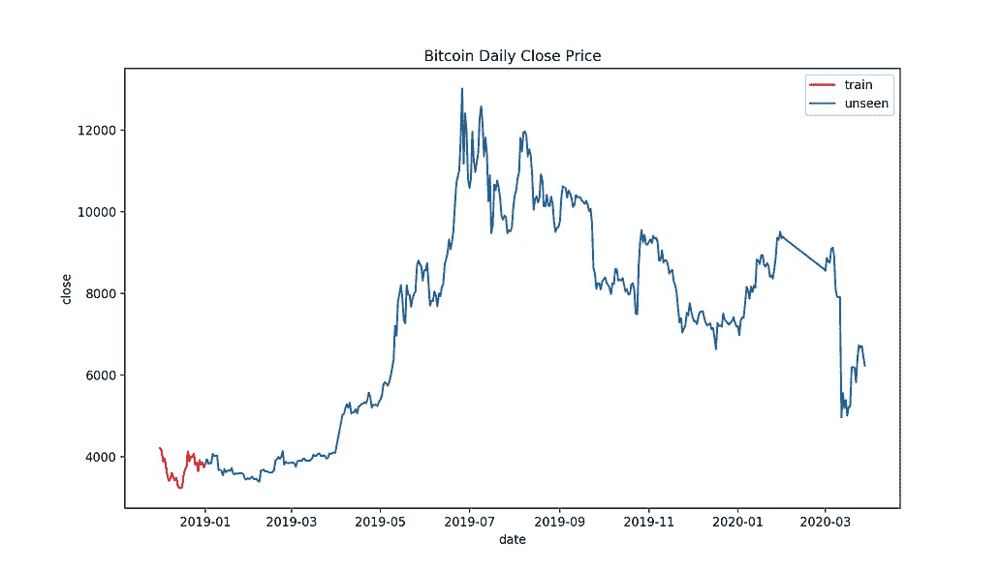

# 你的机器学习模型还能准确预测吗？

> 原文：<https://towardsdatascience.com/is-your-machine-learning-model-still-predicting-accurately-177f2d353153?source=collection_archive---------42----------------------->

## 使用直接比率来衡量“模型漂移”——以比特币价格为例


塞尔吉奥·马丁内斯在 [Unsplash](https://unsplash.com?utm_source=medium&utm_medium=referral) 上的照片

当我们建立一个机器学习模型时，我们以各种方式验证和测试它的准确性/性能。虽然在测试集中准确率相当高，但是预测最终会随着时间漂移。这通常是由于将来的数据“漂移”到与训练数据集不同的状态。但是我们如何有效地检测这种漂移呢？这篇博文展示了使用直接比率估计来检测比特币每日价格数据的变化点。

这篇文章的代码可以在我的 [GitHub repo](https://github.com/kyosek/change-point-detection-kl-divergence) 上找到。

# 目录

**1。变化点检测概念**

**2。直接比率(KL 散度和相对无约束最小二乘重要性拟合)估计**

**3。比特币价格数据示例**

**3.1。比特币及其数据简介**

**3.2。应用 KL 散度估计来检测状态变化**

**3.3。使用 Bolinger 带的状态变化阈值**

**4。结论和后续步骤**

**5。参考文献**

1.  **改变点检测概念**

正如我上面提到的，变化点检测(CPD)基本上是试图发现时间序列序列的不相似性。

刘等(2013)将 CPD 问题定义为测量两个连续子序列 *y(t)* 和 *y(t+n)之间的差异。*这些子序列有一定时间段的窗口 *k* 来评估。下图展示了 PCD 的概念。


来自刘等人(2013)的 PCD 概念图像

例如，假设上图中的“a”是 2020–04–01，那么“b”是 2020–04–02，“c”是 2020–04–03，以此类推。同样设窗口‘k’为图中的 3，则 Y(t)包含 a、b 和 c，Y(t+1)包含 b、c 和 d，包含从 2020–04–02 到 2020–04–05。设 n = 2，则 *y(t)* 是由 y(t)和 Y(t+1)组成的子序列。我们想知道由 from Y(t+n)=[2020–04–06，2020–04–08]和 Y(t+n+1)=[2020–04–05，2020–04–07]组成的 *y(t)* 和 *y(t+n)* 的不同之处。

这也可以通过使用统计假设检验来正式化(Harchaoui 等人，2009)。

*H _ 0:y(t)= y(t+1)= y(t+2)=…= y(t+n-1)= y(t+n)*

*H_1:存在 1 个< k 个< n 使得*

*y(t)= y(t+1)=……= y(t+k)≠y(t+k+1)=……= y(t+n-1)= y(t+n)*

以上是对 CDP 概念的简单介绍。下一节将介绍我们如何计算直接比率估计值。

**2。直接比率(KL 散度和相对无约束最小平方重要性拟合)估计**

这里我们将讨论这两种直接比率估计方法。首先，给定概率分布 p(x)和 p’(x)的著名的 KL 散度方程可以表示如下。


KL 散度是非负的和非归一化的度量，例如**KL[p(x)| | p '(x)]in[0，inf+)** 。较高的值表明这些概率分布更远。

在我们讨论相对无约束最小二乘重要性拟合之前，让我们先来看看无约束最小二乘重要性拟合(uLSIF)。这使用皮尔逊(PE)散度如下。


然而，根据 p’(x)的条件，PE 散度值可以是无界的。为了克服这个性质，RuLSIF 将凸组合引入到第二个给定的概率分布中，可以表示如下。


，其中*0≤𝛂***<1***。***

*当取凸组合时，RuLSIF 的计算值总是有界的。*

*当我们计算上述值时，窗口的长度也是这种方法的关键点之一。当您将窗口设置得较小时，它对变化更敏感。它可以快速检测甚至很小的变化，但是也可以捕获假阳性情况，例如变量的暂时漂移。另一方面，当你设置一个更大的窗口时，它的估计会更稳定，得到更少的假阳性情况。然而，实际检测状态变化需要一段时间。因此，找到合适的窗口来使用这种方法至关重要。如果即使是很小的状态变化对机器学习模型预测也是至关重要的(例如，基于最小值的股票价格预测)，那么使用较小的窗口更合适。如果你的机器学习模型没有受到影响或者可以容忍很小的状态变化，那么最好应用更大的窗口。*

*由于 KL 散度和 RuLSIF 值都没有归一化，也没有正式的阈值，因此有必要决定如何使用这些值来检测变化点。例如，我们可以应用 95%的置信区间。，2007)，还有一些更像金融技术分析工具的东西——比如说博林格带和移动平均线。使用适当的决策规则来发现状态变化是非常重要的。*

*下一节将展示如何使用这些直接比率估计方法来检测比特币价格数据的状态变化的示例。*

***3。比特币价格数据示例***

**

*安德烈·弗朗索瓦·麦肯齐在 [Unsplash](https://unsplash.com?utm_source=medium&utm_medium=referral) 上的照片*

***3.1 比特币及数据简介***

*那么比特币是什么？比特币是目前最受欢迎的去中心化虚拟货币。它的价格仅仅由供求关系决定(来自[bitcoin.org](https://bitcoin.org/en/faq#what-determines-bitcoins-price))。所以简单来说，当对比特币的需求高时，比特币的价值增加，然后需求低时，价值降低。此外，比特币的数量是有限的，并将以可预测的递减速度新创造出来，这意味着为了保持比特币价格稳定，它需要有轻微的通货膨胀。此时此刻，由于市场容量与其可能达到的规模相比仍然相对较小，比特币的价格波动很大——与股票市场相比，它相对更容易受到需求的影响。*

*现在我们来看看比特币的数据。数据是从 [CoinMarketCap](https://coinmarketcap.com/currencies/bitcoin/historical-data/?start=20130429&end=20200302) 中检索的。它包括 2013 年 4 月 29 日至 2020 年 3 月 28 日的日期、开盘价、最高价、最低价、收盘价、成交量和市值(所有价格均以美元计)。在这篇文章中，我们将使用接近的价格。*

**

*这是数据框的外观*

*这是比特币每天的收盘价。*

**

*我们可以看到比特币的价格波动很大。如上所述，价格由供需决定，当需求增加时，价格就会上涨，例如，在 2013 年底左右，因为塞浦路斯的金融危机，而在 2020 年初，由于冠状病毒造成的不确定性，价格就会下跌。*

***3.2。应用 KL 散度估计来检测状态变化***

*这里我们尝试使用直接比率估计方法来机器学习模型漂移。为了使 CPD 问题适合这种设置，我们需要修改上面的公式。我们将在训练集中使用固定窗口，而不是使用移动窗口来获得原始概率分布。以便我们可以计算训练集和看不见数据有多相似。*

*这里假设我们建立了一个机器学习模型，通过使用其 2013 年 4 月 29 日至 2018 年底的数据，可以预测第二天的比特币收盘价。因此，我们将比较火车设置和看不见的未来价格的一些子序列。在这里，我们将尝试查看月水平的模型漂移，因此将窗口设置为 30。*

*让我们计算每个日期的 KL 散度，并绘制这些值。*

```
*from scipy.stats import entropy
from datetime import date, timedelta start_date = date(2019,2,1)
end_date = date(2020,3,28)
delta = timedelta(days=1)kl = []
date = []while start_date <= end_date: kld = entropy(np.array(df[df['date'] < 
                  '2019-01-01'].close.tail(30)), 
                   np.array(df[df['date'] <= 
                   start_date].close.tail(30))) kl += [kld]
    date += [start_date]
    start_date+=delta kl = pd.DataFrame(list(zip(date,kl)),columns=['date','kl'])*
```

**

*正如我们可以观察到的那样，2019 年几乎每个月都有相当多的峰值。然而，峰值在一段时间后下降，所以这些可能只是由季节性引起的。然而，在 2020 年 3 月有一个巨大的峰值。这显然是由于冠状病毒的冲击。*

*现在我们可以比较 KL 散度图和实际的比特币价格分布，看看它们是如何相互关联的。*

****

*在比特币价格图中，假设的“训练集”中的子序列显示为红色，其余为未知价格。因此，这些直接比率估计是用 30 天窗口的红色子序列对蓝色子序列计算的。*

*我们注意到，当价格在短时间内大幅上涨时，估计价值也会飙升。有趣的是，尽管比特币价格自 2019 年初以来一直呈上升趋势，直到 2019 年 7 月左右达到最高值，然后呈下降趋势，但估计的 KL 散度值在 2020 年前显示出“恒定波动”。这可能是因为训练集的分布已经考虑了比特币价格的波动性和理论上的常数通货膨胀帐户，因此估计的 KL 散度值并没有真正响应价格的逐渐增加，而是突然的价格变化。*

***3.3。带 Bolinger 带的状态变化阈值***

*最后，我们将探讨状态变化检测的决策阈值。在这里，我们将尝试看看如何博林格带可以用于这一目的。Bolinger 波段常用于金融技术分析。它应用了简单的移动平均线和移动标准差。下面是计算 Bolinger 波段的代码片段。*

```
*# Bolinger bandskl['ma21'] = kl.kl.rolling(21).mean()
kl['mstd2'] = kl.kl.rolling(2).std()
kl['bolinger_high'] = kl.ma21+(kl.mstd2*2)
kl['bolinger_low'] = kl.ma21-(kl.mstd2*2)*
```

*这里，我们使用 21 天简单移动平均线和 2 天移动标准偏差，通过使用每个定义的 2 个标准偏差(95%区间)来计算“波段”。此外，我们只对作为问题特征的 Bolinger 带的上界感兴趣(我们只想知道分布何时变得远离)，我们只画出上界。*

**

*正如我们可以看到的，有几个时间段，估计的 KL 散度超过了 Bolinger 带的上限，这意味着状态发生了变化。通过这种方法，我们可以系统地辨别变化点，并且通过改变移动平均的窗口，我们可以修改检测的灵敏度(窗口越小，对变化越不敏感)。*

***4。结论和后续步骤***

*这篇博文经历了以下几点:*

*   *CPD 旨在检测时间序列概率分布中两个子序列的不相似性。*
*   *因为 KL 散度和 RuLSIF 都不是标准化的比率，并且没有明确的阈值来确定“状态变化”。因此，确定适当的规则来检测变化是很重要的。*
*   *窗口的长度也是这种方法的关键点之一。当您将窗口设置得较小时，它对变化更敏感。它可以快速检测甚至很小的变化，但是也可以捕获假阳性情况，例如变量的暂时漂移。另一方面，当你设置一个更大的窗口时，它的估计会更稳定，得到更少的假阳性情况。然而，实际检测状态变化需要一段时间。*
*   *仅仅通过检查目标变量，我们并不知道是什么导致了状态变化，通常我们感兴趣的是是什么导致了变化。其中一个解决方案是监控模型中的所有特征，这样我们就可以看到模型的哪个部分正在发生变化。*

*希望你对这篇文章感兴趣。如果你想和我联系，这是我的 [LinkedIn 页面](https://www.linkedin.com/in/kyosuke-morita-58329286/)。*

***5。参考文献***

*哈尔查乌伊，z .，穆林斯，e .，，巴赫，F. R. (2009)。内核变点分析。在*神经信息处理系统的进展*(第 609–616 页)。*

*刘，s .，山田，m .，柯里尔，n .，杉山，M. (2013)。用相对密度比估计检测时间序列数据中的变点。*神经网络*， *43* ，72–83。*

*Sebastiã，r .，& Gama，J. (2007 年 12 月)。从数据流中学习直方图的变化检测。在*葡萄牙人工智能会议*(第 112-123 页)。斯普林格，柏林，海德堡。*