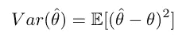
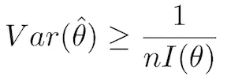
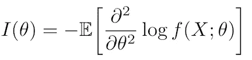

# 估计量及其效率

> 原文：<https://towardsdatascience.com/is-your-model-efficient-845abce5c2f3?source=collection_archive---------25----------------------->

## 无偏估计量的方差/均方误差的 Cramer-Rao 下界介绍

[澳门图片社](https://unsplash.com/@macauphotoagency?utm_source=unsplash&utm_medium=referral&utm_content=creditCopyText)在 [Unsplash](https://unsplash.com/s/photos/casino?utm_source=unsplash&utm_medium=referral&utm_content=creditCopyText) 上拍摄的照片

# 简介——什么是评估者？

假设你在抛硬币，你想凭经验估计正面的概率。为此，你决定抛硬币 **n** 次，根据你得到的是正面还是反面，记录 1 或 0。

估计概率最直接的方法是计算你在 **n** 次投掷中获得的正面的比例，我们称之为**p̂.**n**变得越大，你就越确定 **p̂** 准确地估计了 **p** ，即获得正面的真实概率。在统计学中，我们说 **p̂** 是 **p** 的**估计量**。直观地说，**估计器**只是在给定一些数据的情况下，估计统计模型中未知参数的一种方式。**

维吉尔·卡亚萨在 [Unsplash](https://unsplash.com/s/photos/coin?utm_source=unsplash&utm_medium=referral&utm_content=creditCopyText) 上拍摄的照片

估计量是统计学的基础。在上面的例子中，我们的估计量是**无偏的**，这意味着它的期望值就是我们试图估计的参数。除了让我们的估计量无偏之外，我们的估计量尽可能接近期望值也非常重要，即**方差**最小化。

hat 的方差，θ的估计量

当使用无偏估计量时，方差与**均方误差(MSE)** 相同，这对于之前有机器学习经验的人来说应该很熟悉。

马克 A 在 [Unsplash](https://unsplash.com/s/photos/darts?utm_source=unsplash&utm_medium=referral&utm_content=creditCopyText) 上的照片

这里有一个非常直观的例子，通常用来解释估计量。假设你在射箭。目标是击中靶心(参数)。粘在棋盘上的单个飞镖是你的评估者(你，扔飞镖的人)做出的评估。不偏不倚只是意味着你的飞镖的预期位置是靶心，实际上并没有说你平均会有多接近靶心。这就是我们关注 MSE 的原因。在这种情况下，高 MSE 只是意味着从单个飞镖到靶心的平均距离相当高。成为一个好的玩家(评估者)意味着你的飞镖聚集在中心周围——也就是说，你的 MSE 非常小。

既然我们理解了为什么我们需要我们的估计量具有最小的 MSE，问题就变成了:给定一个估计量，我们如何知道它是否是最**有效的**估计量，即具有最小 MSE 的估计量？这就是 Cramer-Rao 界派上用场的地方。

# 克莱姆-拉奥界

Cramer-Rao 界产生于 20 世纪 40 年代，它给出了无偏估计量的方差/均方误差的一个下界。这意味着给定参数的最佳可能估计量将具有由界限规定的 MSE。

假设我们想从 **n** 个样本中估计 **θ** 。克莱姆-拉奥定理陈述如下(在 iid 假设和其他正则性条件下):

克莱姆-拉奥界

如果我们在界上有等式，那么我们知道估计量是有效的！这并不意味着总是存在这样的估计量；然而，它确实声明了最佳可能估计量的 MSE 将大于或等于由界限给出的 MSE。

## 费希尔信息

现在，你可能想知道等式中的 **I(θ)** 到底代表什么。它被称为**费希尔信息**，直观地说，它是我们对样本来自哪个数据分布有多少信息的一种度量。

在 *iid* 假设下，大小为 **n** 的样本中的费希尔信息是单个样本中的信息乘以 **n** 。我们期望，随着我们获得更多的数据和 **n** 变得更大，我们应该有更多的关于数据是从什么分布抽样的“信息”，因此，我们应该能够更好地估计 **θ** 。

现在让我们努力理解费雪信息的公式。我们首先需要定义什么叫做**得分函数**。如果我们考虑一个随机变量**X∞f(X；θ)** ，则得分由下式给出

分数函数

然后，Fisher 信息被定义为得分平方的期望值。

费希尔信息

或者，通过一些简单的操作，我们可以获得 Fisher 信息的替代表达式:

Fisher 信息的替代表达

根据这些表达式，计算费希尔信息相对简单。

# 结论

我希望你现在对估计量的 Cramer-Rao 界有了更好的理解。此外，我希望你现在准备好计算和评估你自己的估算器的效率。

# **参考文献**

[1]马丁，《统计理论讲义》(2015)，[http://home pages . math . UIC . edu/~ rg Martin/Teaching/stat 411/Notes/411 Notes . pdf](http://homepages.math.uic.edu/~rgmartin/Teaching/Stat411/Notes/411notes.pdf)