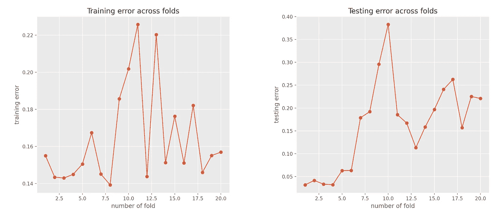
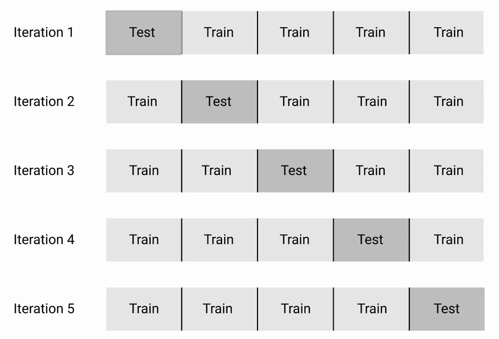

# 你的模型是否过拟合？或者不合身？使用神经网络的示例

> 原文：<https://towardsdatascience.com/is-your-model-overfitting-or-maybe-underfitting-an-example-using-a-neural-network-in-python-4faf155398d2?source=collection_archive---------13----------------------->

## 过拟合，欠拟合，泛化能力，交叉验证。一切都简单解释了。我还提供了一个使用神经网络的 python 示例。



作者创作的人物。

# 1.介绍

大多数时候，机器学习(ML)模型的**差** **性能**的原因要么是**过拟合**要么是**欠拟合。**一个好的模型应该能够**推广**并克服过拟合和欠拟合问题。**但是什么是过度拟合呢？但是什么是不适合呢？对于一个模型来说，什么时候能够概括学习到的功能/规则？**

继续读下去，你就能回答所有这些问题。

# 2.ML 中的泛化是什么

**ML 模型的泛化**是指**如何很好地**ML 模型学习**的规则/模式/功能**，应用于模型学习时没有看到的具体例子**。这通常被称为**匿**集**或**测**集**测**集**。**

一个好的 ML 模型的目标是从训练数据很好地推广到来自问题领域的任何数据。**这允许对模型以前从未见过的一些数据进行预测(即，对未来进行预测)。**

如果你想在交互式路线图和活跃的学习社区的支持下自学数据科学，看看这个资源:[https://aigents.co/learn](https://aigents.co/learn)

# 3.什么是机器学习中的过拟合

> 过度拟合意味着我们的 ML 模型对训练数据建模(已经学习)得太好了。

从形式上来说，**过拟合**指的是模型学习数据以及作为**训练数据**的一部分的噪声的情况，其程度是**负面地** **影响**模型在**新的未知数据**上的**性能**。

在其他世界中，训练集中的噪声(即随机波动)被模型学习为规则/模式。然而，这些有噪声的学习表示不适用于新的看不见的数据，因此，模型的性能(即准确性、MSE、MAE)受到负面影响。

*过拟合的一个教科书案例是当* ***模型的错误*** *上的* ***训练*** *设定(即训练期间)是******低*** *但接着，模型的* ***错误*****

# **4.机器学习中的不足是什么**

> **欠拟合意味着我们的 ML 模型既不能对训练数据建模，也不能推广到新的看不见的数据。**

**数据拟合不足的模型在训练数据上的性能会很差。例如，在有人使用线性模型来捕捉数据中的非线性趋势的情况下，该模型会对数据进行欠拟合。**

***欠拟合的一个教科书案例是当模型的误差对******训练*** *和* ***测试*** *集合(即在训练和测试期间)非常高时。*****

# **5.最佳位置和好的模型**

**很明显，过拟合和欠拟合之间存在权衡。**

> **理想情况下，一个好的模型是在欠拟合和过拟合之间找到最佳平衡点的模型。**

**哪个是最佳点？**

> **最佳点被定义为模型在训练集和测试集(不可见)上的误差都保持较低的点。**
> 
> **换句话说，最佳点是测试集上的误差开始增加的点，同时，模型在训练集上的误差是可接受的(低)。**

# **6.如何(潜在地)限制过度拟合**

**ML 学习领域最常见的问题是**过拟合**。**

****能够(潜在地)限制过度拟合的行动:****

1.  **我们可以使用**交叉验证** (CV)方案。**
2.  ****降低**模型的**复杂度**(使模型不那么复杂)。**

***说到方案 1 即**交叉验证的使用，最著名的 CV 方案就是 **KFolds** 交叉验证。使用 KFolds 方案，我们在训练数据的不同子集上训练和测试您的模型 k 次，并使用测试(看不见的)数据估计性能指标。其他选项包括留一个*留一个*交叉验证( **LOOCV** )、留一个 P 出来交叉验证( **LpOCV** )等。***

****

**KFold 的视觉表现。作者创作的人物。**

***说到方案 2 即* ***降低模型的复杂度*** 有助于减少过拟合。例如，如果有人使用 RBF 核的 SVM 模型，那么降低复杂度就意味着使用线性核。在另一种情况下，如果有人用多项式来拟合一些数据，那么降低复杂性就意味着用线性模型来代替(线性回归)。**

# **7.如何(潜在地)限制欠拟合**

**在这种情况下，有两种黄金标准方法:**

1.  **尝试另一种模式**
2.  **增加当前模型的复杂性**

**解决方案 1 很简单。关于解决方案 2，一个例子如下:如果有人对一些数据进行线性回归拟合，那么增加的**复杂度**将意味着拟合多项式模型。**

# **8.结论**

****过拟合** **或欠拟合**是大多数机器学习(ML)模型**性能** **差**的最常见原因。此外，过度拟合比欠拟合更常见。**

*   ****过度拟合**是指模型在训练集(即训练期间)上的误差非常低，但模型在测试集(即未知样本)上的误差很大！**
*   ****欠拟合**是指****训练**和**测试**集合(即在训练和测试期间)的模型误差非常高。****

****为了克服这些问题，通常使用**交叉验证**来估计模型在**未知**数据上的表现。****

# ****额外收获:Python 中的工作示例****

## ****数据集****

****我们将使用 Iris 数据集，正如我们在我以前的所有帖子中所做的那样。数据集包含鸢尾属三个品种****四个** **特征**(萼片和花瓣的长度和宽度) **50 个**样本(鸢尾属 **setosa** 、鸢尾属 **virginica** 和鸢尾属 **versicolor** )。******

## ******模型******

******我们将使用**一个多层感知器**【MLP】**。MLP 是一类[前馈](https://en.wikipedia.org/wiki/Feedforward_neural_network) [人工神经网络](https://en.wikipedia.org/wiki/Artificial_neural_network) (ANN)。术语 MLP 使用含糊，有时不严格地指任何前馈神经网络，有时严格地指多层感知器组成的网络。********

```
********from sklearn.neural_network import MLPRegressor 
from sklearn.metrics import mean_absolute_error
import numpy as np
from sklearn.model_selection import validation_curve
from sklearn.datasets import load_iris
import matplotlib.pyplot as plt
from sklearn.model_selection import KFold
np.random.seed(0)
plt.style.use(‘ggplot’)********
```

********让我们加载**虹膜** **数据**:********

```
******iris = load_iris()
X, y = iris.data, iris.target******
```

******我们将使用 **KFolds** **交叉** - **验证**与 20 折( **K=20)** 来评估我们模型的**泛化** **能力**。**在每个文件夹中，我们将分别使用训练和测试集来估计训练和测试误差。********

```
******kf = KFold(n_splits=20)
list_training_error = []
list_testing_error = []for train_index, test_index in kf.split(X):
    X_train, X_test = X[train_index], X[test_index]
    y_train, y_test = y[train_index], y[test_index]
    model = MLPRegressor()
    model.fit(X_train, y_train)
    y_train_data_pred = model.predict(X_train)
    y_test_data_pred = model.predict(X_test) fold_training_error = mean_absolute_error(y_train, y_train_data_pred) 
    fold_testing_error = mean_absolute_error(y_test, y_test_data_pred)
    list_training_error.append(fold_training_error)
    list_testing_error.append(fold_testing_error)******
```

******绘制培训阶段的 MAE 和测试阶段的 MAE:******

```
******plt.subplot(1,2,1)
plt.plot(range(1, kf.get_n_splits() + 1), np.array(list_training_error).ravel(), ‘o-’)
plt.xlabel(‘number of fold’)
plt.ylabel(‘training error’)
plt.title(‘Training error across folds’)
plt.tight_layout()plt.subplot(1,2,2)
plt.plot(range(1, kf.get_n_splits() + 1), np.array(list_testing_error).ravel(), ‘o-’)
plt.xlabel(‘number of fold’)
plt.ylabel(‘testing error’)
plt.title(‘Testing error across folds’)
plt.tight_layout()plt.show()******
```

************

******现在让我们解释结果，并尝试找出过度拟合和欠拟合点。******

********提醒**:******

*   ******过度拟合是指模型在训练集(即训练期间)上的误差非常低，但模型在测试集(即看不见的样本)上的误差很大！******
*   ******欠拟合是指模型在训练集和测试集(即在训练和测试期间)的误差都非常高。******

******在折叠编号 10 处可以识别出一个**欠拟合**点。在第 10 次折叠期间，训练集和测试集上的误差同时很高！因此，该模型对传入 fold 10 中用于训练的那部分训练数据进行了欠填充。******

******在折叠 20 处可以看到一个**过度拟合**点(不是真正的极端)。训练 MAE 约为 0.16，对于相同的倍数，测试集上的 MAE 高于 0.20。******

******免责声明:这些都不是过度拟合/欠拟合的极端情况，但我只是想表明我的观点，并将其与我在本文中讨论的理论联系起来。******

******那都是乡亲们！希望你喜欢这篇文章！******

# ******敬请关注并支持这一努力******

******如果你喜欢这篇文章并且觉得它有用，那么**关注**我就可以看到我所有的新帖子。******

******这是我的简介。点击**关注！********

******[](https://towardsdatascience.com/@seralouk) [## Serafeim Loukas -走向数据科学

### 阅读 Serafeim Loukas 在《走向数据科学》中的文章。电气和计算机工程文凭(NTUA)。主人…

towardsdatascience.com](https://towardsdatascience.com/@seralouk) 

有问题吗？把它们作为评论贴出来，我会尽快回复。****** 

# ******最新帖子******

******[](/time-series-forecasting-predicting-stock-prices-using-facebooks-prophet-model-9ee1657132b5) [## 时间序列预测:用脸书的先知模型预测股票价格

### 使用可从《先知脸书》公开获得的预测模型预测股票价格

towardsdatascience.com](/time-series-forecasting-predicting-stock-prices-using-facebooks-prophet-model-9ee1657132b5) [](/roc-curve-explained-using-a-covid-19-hypothetical-example-binary-multi-class-classification-bab188ea869c) [## 用新冠肺炎假设的例子解释 ROC 曲线:二分类和多分类…

### 在这篇文章中，我清楚地解释了什么是 ROC 曲线以及如何阅读它。我用一个新冠肺炎的例子来说明我的观点，我…

towardsdatascience.com](/roc-curve-explained-using-a-covid-19-hypothetical-example-binary-multi-class-classification-bab188ea869c) [](/support-vector-machines-svm-clearly-explained-a-python-tutorial-for-classification-problems-29c539f3ad8) [## 支持向量机(SVM)解释清楚:分类问题的 python 教程…

### 在这篇文章中，我解释了支持向量机的核心，为什么以及如何使用它们。此外，我还展示了如何绘制支持…

towardsdatascience.com](/support-vector-machines-svm-clearly-explained-a-python-tutorial-for-classification-problems-29c539f3ad8) [](/pca-clearly-explained-how-when-why-to-use-it-and-feature-importance-a-guide-in-python-7c274582c37e) [## PCA 清楚地解释了——如何、何时、为什么使用它以及特性的重要性:Python 指南

### 在这篇文章中，我解释了什么是 PCA，何时以及为什么使用它，以及如何使用 scikit-learn 在 Python 中实现它。还有…

towardsdatascience.com](/pca-clearly-explained-how-when-why-to-use-it-and-feature-importance-a-guide-in-python-7c274582c37e) [](/everything-you-need-to-know-about-min-max-normalization-in-python-b79592732b79) [## 关于 Python 中的最小-最大规范化，您需要知道的一切

### 在这篇文章中，我将解释什么是最小-最大缩放，什么时候使用它，以及如何使用 scikit 在 Python 中实现它

towardsdatascience.com](/everything-you-need-to-know-about-min-max-normalization-in-python-b79592732b79) [](/how-and-why-to-standardize-your-data-996926c2c832) [## Scikit-Learn 的标准定标器如何工作

### 在这篇文章中，我将解释为什么以及如何使用 scikit-learn 应用标准化

towardsdatascience.com](/how-and-why-to-standardize-your-data-996926c2c832) 

# 和我联系

*   **LinkedIn**:【https://www.linkedin.com/in/serafeim-loukas/ 
*   https://www.researchgate.net/profile/Serafeim_Loukas**研究之门**:[](https://www.researchgate.net/profile/Serafeim_Loukas)
*   **https://people.epfl.ch/serafeim.loukas**EPFL**简介**:
*   **堆栈** **溢出**:[https://stackoverflow.com/users/5025009/seralouk](https://stackoverflow.com/users/5025009/seralouk)******