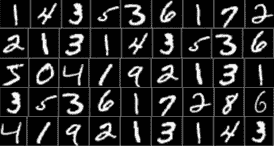
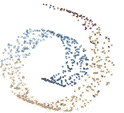
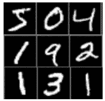
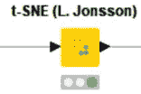
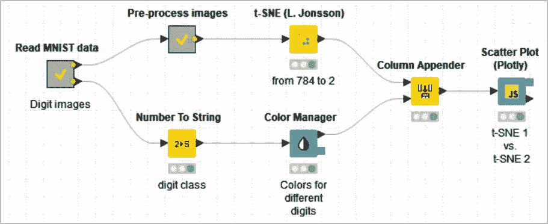

# 零更接近八还是一？

> 原文：<https://towardsdatascience.com/is-zero-closer-to-eight-or-to-one-c6392242b696?source=collection_archive---------62----------------------->

## **应用 t-SNE 可视化 2D 图中的 MNIST 数字数据集**

*作者:罗莎丽娅·西里波*[米莎·利索夫伊](https://www.linkedin.com/in/misha-lisovyi/) *，克尼梅*

零更接近八还是一？这是三分还是五分？几周前，当我们检查一个图像分类应用程序的结果时，我们就在思考这类问题。

是的，事实上，0 更接近于 8 而不是 1，2 更接近于 5 而不是 3——当然，这是从图像识别的角度而不是从严格的数学意义上来说。在我们准备的最后一个数据科学示例中，我们训练了一个机器学习模型来识别手写数字的图像。最后，在检查结果的时候，我们意识到人们的笔迹是多么的潦草，有时很难区分 8 和 0，2 和 5，1 和 7，0 和 3，以及其他有时意想不到的类似数字。

由于时间和其他义务的明显原因，我们不能一个接一个地检查所有的数字图像和它们的错误分类。然而，对数据集中最容易混淆的重叠数字有一个总体的了解是很有趣的。说起来容易做起来难。每个数据行都是一幅图像，由 784 个输入要素描述。试着想象一下！

我们需要将输入维度从 784 大幅减少到 2 或最多 3，以便通过 2D 或 3D 绘图实现数据可视化，同时还能提供信息。如果我们能从一个图表中了解最大的困惑在哪里，哪些数字在书写风格上有最大的延伸，那就太好了。

**t 分布随机邻居嵌入(t-SNE)**

图一。应用 t-SNE 投影后的可视化示例

t-分布式随机近邻嵌入(t-SNE)是一种相对较新的技术，通常用于在二维或三维空间中以图形方式表示复杂的多维数据集。t-SNE 是一种非线性降维技术，它基于数据点之间的非线性局部关系，将数据集的原始 *n* 坐标转换为一组新的*m = 2–3*坐标。具体而言，它将每个高维对象建模为二维或三维点，以这种方式，在新的较低维空间中，相似的对象由附近的点建模，不相似的对象由远处的点建模。

在第一步中，通过数值属性的多元正态分布对数据点进行建模。为高维空间中的对象对创建概率分布。相似的物体被一起拾取的概率高，而不相似的物体被一起拾取的概率低。

在第二步中，这个分布被低维空间中的 t-分布代替，该 t-分布必须尽可能地遵循原始的多元正态分布。第二步的目标是找到具有尽可能相似的 t 分布的低维空间——通过最小化 *Kullback-Leibler 散度*——然后在新找到的低维空间中投影物体。第二个 t 分布必须模拟在数据集中挑选另一个点作为低维空间中当前点的邻居的概率，就像在高维空间中一样。

*困惑度*参数将 t 分布的形状控制为“任意点的有效邻点数”较低的困惑值(~2)会找到受数据中局部变化支配的聚类形状。较高的困惑值(~30)在多次迭代后会产生更稳定的聚类。也就是说，困惑值越大，数据中考虑的全局结构就越多。

这项技术主要用于可视化。事实上，将数据集维度积极缩减到两个或三个坐标，将数据点对的可能性转换为视觉邻域属性，以及由于投影的非线性而能够表现数据组的奇怪形状，这些都使 t-SNE 特别适合大多数数据可视化技术。

请注意，t-SNE 技术仅适用于当前数据集。无法导出模型并将其应用于新数据。事实上，所有可用的数据都必须用来寻找新的低维空间。也就是说，新的数据不能被投影。

**MNIST 数字数据集**

图二。MNIST 数字数据集中的一些数字图像

位于 LeCun 网站上的 MNIST 手写数字数据库包含 70，000 个手写数字 iii 的 28x28 黑白图像样本。在这个例子中，我们使用了 10，000 个这样的图像的子集。

通常在处理图像时，可以直接从标准格式如 PNG、JPG 和 TIFF 中读取。不幸的是，MNIST 数据集只有非标准的二进制格式。幸运的是，下载数据集并把文件转换成易于阅读的 CSV 格式非常简单。

在将数字图像转换成数字向量后，每个图像由 784 个灰度级的向量表示，即由 784 个输入特征表示。

**应用 t-SNE 可视化 2D 图中的 MNIST 数据集**

图 3。KNIME 分析平台中的 t-SNE 节点

一方面，我们有一个想要在 2D 散点图上可视化的高维数据集；另一方面，将维度从高的 *n* 降低到低的 *m* 的技术(例如 m=2)。然后，我们将 t-SNE 变换应用于 MNIST 数据集，并将结果绘制在 2D 散点图上(图 3)。

这是一个 t-SNE 变换如何帮助在二维图上可视化高维数据集的示例。每个图像的原始尺寸 28×28 = 784 像素仅通过 t-SNE 被减少到二维，并且产生的数据点被绘制在散点图上，其中代表相似图像的数据点被紧密定位。784 个输入特征来自“展开”成单个数组或值序列的 28x28 像素图像。

例如，“6”位于两种不同类型的“0”之间数字“4”和“9”在形状上接近且部分重叠，伸展成类似于“1”的形状“0”和“8”数字的位置也很接近，因为它们的形状通常相似；“3”和“5”也一样因此，图 4 中的散点图是每个数字不同形状的拓扑图。

图 4。t-SNE 变换后散点图上的 MNIST 数据集。

**KNIME 工作流程**

现在，让我们快速浏览一下在 MNIST 数据集上实施 t-SNE 变换并在 2D 散点图上绘制结果的工作流，该工作流在 KNIME Hub 上以“ [t-SNE 对 MNIST 数据集](https://kni.me/w/WovGEVM-S78ITqj7)”的形式提供

名为“读取 MNIST 数据”的元节点列出并读取 10，000 个 MNIST 文件，每个文件都包含一个手写数字的图像。然后，通过“预处理图像”元节点中的“图像到数据行”节点，图像被转换成数字(灰度级)的集合。然后将数值向量输入“t-SNE (L. Jonsson)”节点，计算两个 t-SNE 分量。在并行分支中，提取数字类别并用于对不同的数字图像进行颜色编码。最后，使用“散点图(Plotly)”节点在经典的传统散点图上绘制颜色编码的 t-SNE 变换的二维向量。

*图 5。工作流"*[*MNIST 数据集上的 t-SNE*](https://kni.me/w/WovGEVM-S78ITqj7)*"实现 MNIST 数字数据的 t-SNE 变换并将结果绘制在散点图上。*

**结论**

t-SNE 是一种非常强大的变换，可以将数据从任何维度空间投影到二维空间，并显示数据集中的数据组有多接近。

在本例中，我们已经将 MNIST 数字数据集从 784 维空间转换到二维空间，但我们仍然可以检查哪些数字最容易与其他数字混淆，如“8”与“0”或“7”与“1”

**参考文献**

1.Laurens van der Maaten，Geoffrey Hinton，“[使用 t-SNE](http://www.jmlr.org/papers/volume9/vandermaaten08a/vandermaaten08a.pdf) 可视化数据”，《机器学习研究杂志》2008 年第 9 期

2.k .栗田(2018 年 9 月 14 日)。[论文剖析:“使用 t-SNE 可视化数据”讲解](https://mlexplained.com/2018/09/14/paper-dissected-visualizing-data-using-t-sne-explained/)【博客文章在“机器学习”中讲解】

3.Y. LeCun、L. Bottou、Y. Bengio 和 P. Haffner。"基于梯度的学习应用于文档识别."IEEE 会议录，86(11):2278–2324，1998 年 11 月

*2020 年 7 月 8 日首次发表于 Datanami*[*https://www . Datanami . com/2020/07/08/is-zero-closer-to-eight-or-to-one/*](https://www.datanami.com/2020/07/08/is-zero-closer-to-eight-or-to-one/)