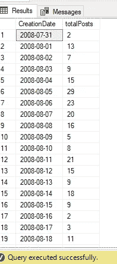
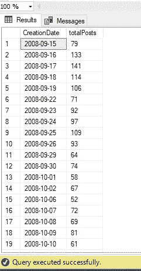
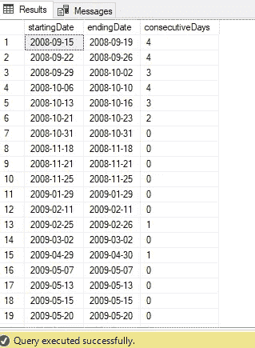
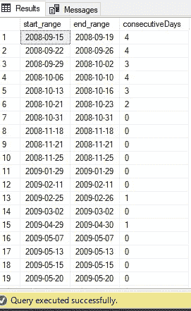
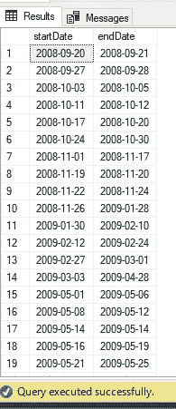
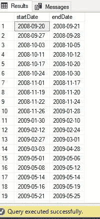

# 使用 T-SQL 窗口函数的孤岛冒险

> 原文：<https://towardsdatascience.com/island-adventures-with-t-sql-window-functions-3c2bdf050797?source=collection_archive---------64----------------------->

## 使用 T-SQL 窗口函数可以轻松解决传统的“间隙和孤岛”问题


拉胡尔从[派克斯](https://www.pexels.com/photo/clouds-crescent-moon-daylight-glass-2162909/?utm_content=attributionCopyText&utm_medium=referral&utm_source=pexels)拍摄的照片

最近，我公司的一位业务用户请求我创建一个报告，显示资金周转率大于 X 值的连续天数。当我开始准备来自 SQL Server 数据库的数据时，有一些棘手的问题需要解决。

## 抽样资料

为了演示我是如何解决这个问题的，我将使用****栈溢出*** 示例数据库。让我们将业务请求转化为以下内容:找出连续几天有超过 50 篇帖子并且每篇帖子都有超过 50，000 次浏览的情况。*

*表 *dbo。Posts* 包含大约 1720 万行。首先，让我们看看每天有多少帖子的浏览量超过 50，000:*

```
*SELECT convert(date,CreationDate) as CreationDate
    ,count(Id) as TotalPosts
FROM Posts 
WHERE CreationDate >= '20080731'
    AND CreationDate < '20140101'
        AND ViewCount > 50000
GROUP BY convert(date,CreationDate)
ORDER BY CreationDate*
```

*当我运行这个查询时，我得到以下结果:*

**

*为了更好地处理正在运行的查询，我在 CreationDate 列上创建了一个非聚集索引，包括 ViewCount 列。现在，当我运行查询来检查有超过 50 篇帖子、超过 50，000 次浏览的日期时，我得到了以下结果:*

```
*;WITH CTE_POSTS as(
select convert(date,CreationDate) CreationDate
    ,count(Id) totalPosts
from Posts 
where CreationDate >= '20080731'
    and CreationDate < '20140101'
    and ViewCount > 50000
group by convert(date,CreationDate)
)

SELECT * 
FROM CTE_POSTS
WHERE totalPosts > 50
order by CreationDate*
```

**

*正如你所注意到的，从 2008 年 9 月 15 日到 9 月 19 日，所有日期都包括在内。然后，第 20 个和第 21 个不见了……这个问题就是众所周知的 ***【缺口与孤岛】*** 问题。在这里，第一桶日期(15 日—19 日)代表“岛”，20 日和 21 日代表“沟”。*

## *欢迎来到这个岛…*

*让我们首先确定我们的“岛”(满足标准的连续日期的桶:在我们的例子中，超过 50 个帖子的日期有 50.000 以上的浏览量):*

```
*; WITH CTE_POSTS as(
SELECT CONVERT(DATE,CreationDate) CreationDate
    ,COUNT(Id) totalPosts
from Posts 
WHERE CreationDate >= '20080731'
    AND CreationDate < '20140101'
    AND ViewCount > 50000
GROUP BY convert(date,CreationDate)
HAVING COUNT(Id) > 50
)

,starting as (
SELECT CreationDate
    ,ROW_NUMBER() OVER(ORDER BY CreationDate) rnm
FROM CTE_POSTS as CTE1
WHERE NOT EXISTS (
    SELECT * 
    FROM CTE_POSTS as CTE2
    WHERE DATEDIFF(dd,CTE2.CreationDate,CTE1.CreationDate) = 1)
    )

,ending as (
SELECT CreationDate
    ,ROW_NUMBER() OVER(ORDER BY CreationDate) rnm
FROM CTE_POSTS as CTE1
WHERE NOT EXISTS (
    SELECT * 
    FROM CTE_POSTS as CTE2
    WHERE DATEDIFF(dd,CTE2.CreationDate,CTE1.CreationDate) = -1)
    )

SELECT s.CreationDate as startingDate
    ,e.CreationDate as endingDate 
        ,DATEDIFF(dd,s.CreationDate,e.CreationDate) as ConsecutiveDays
FROM starting s
INNER JOIN ending e on s.rnm = e.rnm*
```

*这样，我们确定了我们的“岛屿”，正如您在下面的截图中看到的:*

**

## *利用领先/落后优势*

*如果您运行的 SQL Server 版本是 2012 年或更高版本，您可以利用时间偏移函数*超前*和*滞后*。默认情况下，LEAD 将返回序列中的下一个值，但是也可以使用可选参数来调整偏移量，而后者将执行完全相反的操作，即返回序列中的上一个值(默认情况下)。*

*让我们看看 *LEAD* 在我们的场景中是如何工作的:*

```
*; WITH CTE_POSTS as(
select CONVERT(DATE,CreationDate) CreationDate
    ,COUNT(Id) totalPosts
FROM Posts 
WHERE CreationDate >= '20080731'
    AND CreationDate < '20140101'
    AND ViewCount > 50000
GROUP BY CONVERT(DATE,CreationDate)
HAVING COUNT(Id) > 50
)

,CTE_LEAD AS
(
SELECT CreationDate
    , DATEADD(day, -1 * DENSE_RANK() OVER(ORDER BY CreationDate), CreationDate) AS DateGroup
FROM CTE_POSTS
)

SELECT MIN(CreationDate) AS start_range
    ,MAX(CreationDate) AS end_range
    ,DATEDIFF(dd,MIN(CreationDate),MAX(CreationDate)) AS consecutiveDays
FROM CTE_LEAD
GROUP BY DateGroup;*
```

*这个解决方案更加直观，因为您避免了自连接的复杂性，但是更重要的是，这段代码运行得更快。*

*这里，我从 *ROW_NUMBER()* 函数开始，而不是 *DENSE_RANK()* 。但是，后来我从 **Itzik Ben-Gan** 的书*“使用窗口函数的 Microsoft SQL Server 2012 高性能 T-SQL”*中找到了一个很好的解释，他在书中阐明了 *DENSE_RANK()* 保证即使我们的序列中有重复值，代码也会正常工作，而 *ROW_NUMBER()* 则不会。*

*结果和预期的一样:*

**

## *寻找差距*

*在某些情况下，您希望检查业务请求未得到满足的范围。例如，您希望检查您的销售额低于某个阈值的日期，或者您的系统无法正常工作的日期。*

*在我的例子中，我将显示不超过 50 个帖子有 50，000 以上的浏览量的日期。*

## *传统 T-SQL 解决方案*

*与寻找“孤岛”相反，我们需要检查连续的值并检测它们之间的“间隙”在哪里。*

```
*; WITH CTE_POSTS as(
select CONVERT(DATE,CreationDate) CreationDate
    ,COUNT(Id) totalPosts
FROM Posts 
WHERE CreationDate >= '20080731'
    AND CreationDate < '20140101'
    AND ViewCount > 50000
GROUP BY CONVERT(DATE,CreationDate)
HAVING COUNT(Id) > 50
)

SELECT DATEADD(dd,1,CreationDate) AS startDate
    ,DATEADD(dd,-1,(SELECT MIN(t2.CreationDate)
     FROM CTE_POSTS t2
     WHERE t2.CreationDate > t1.CreationDate)) AS endDate
FROM CTE_POSTS t1
WHERE NOT EXISTS (
        SELECT *
    FROM CTE_POSTS t2
    WHERE t2.CreationDate = DATEADD(dd,1,t1.CreationDate)
           AND CreationDate < (SELECT MAX(CreationDate) from CTE_POSTS))*
```

**

## *使用窗口功能变得复杂*

*至于“孤岛”问题，可以实施类似的逻辑来寻找“缺口”。因此，和前面的例子一样，我们将使用 *LEAD* 函数来实现我们的目标:*

```
*; WITH CTE_POSTS as(
select CONVERT(DATE,CreationDate) CreationDate
    ,COUNT(Id) totalPosts
FROM Posts 
WHERE CreationDate >= '20080731'
    AND CreationDate < '20140101'
    AND ViewCount > 50000
GROUP BY CONVERT(DATE,CreationDate)
HAVING COUNT(Id) > 50
)
,CTE_LEAD AS
(
SELECT CreationDate AS startDate
    , LEAD(CreationDate) OVER(ORDER BY CreationDate) AS endDate
FROM CTE_POSTS
)
SELECT DATEADD(dd, 1, startDate) AS startDate
    ,DATEADD(dd, -1, endDate) endDate
FROM CTE_LEAD
WHERE DATEDIFF(dd, startDate, endDate) > 1;*
```

*同样，有了*的引导*，代码更加直观，可读性更好。在这里，我们只是检查连续日期之间的范围，如果它大于 1，这意味着我们的序列中有一个缺口。当满足该标准时，我们只是在序列中的最后一个“岛”日期上加一天，以获得第一个“间隔”日期，同时从下一个序列中的第一个“岛”日期减去一天，以获得“间隔”的最后一个日期。*

**