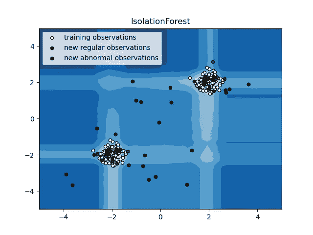
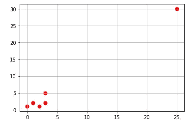

# 隔离森林:一种基于树的异常检测算法

> 原文：<https://towardsdatascience.com/isolation-forest-a-tree-based-algorithm-for-anomaly-detection-4a1669f9b782?source=collection_archive---------11----------------------->

## 关于异常检测算法的小数据科学


托德·夸肯布什在 [Unsplash](https://unsplash.com?utm_source=medium&utm_medium=referral) 拍摄的照片

这是我写的关于异常检测中常用的算法的一系列小文章中的第 10 篇(我会在最后放上所有其他文章的链接)。在今天的文章中，我将重点介绍一种基于树的机器学习算法——隔离森林——它可以有效地从多维数据集中隔离出离群值。

我在这里的目的是给出算法如何工作的直觉，以及如何用几行代码实现它作为演示。所以我不会深入理论，但足以帮助读者理解基础知识。如果您对算法的某个特定部分感兴趣，您可以随时搜索和查找细节。所以让我们开始吧！

## 什么是隔离林？

隔离森林或 iForest 是较新的算法之一，于 2008 年首次提出[1]，后来在 2012 年的一篇论文中发表[2]。大约在 2016 年，它被并入 Python Scikit-Learn 库。

它是一种基于树的算法，围绕决策树和随机森林理论构建。当呈现数据集时，该算法根据随机阈值将数据分成两部分。这个过程递归地继续，直到每个数据点被隔离。一旦该算法贯穿整个数据，它就过滤掉比其他数据点花费更少步骤的数据点，以将其隔离。`sklearn`中的隔离森林是集合模型类的一部分，它返回每个实例的异常分数来衡量异常。



图:分割数据以隔离隔离林中的异常(来源: [Scikit-Learn](https://scikit-learn.org/stable/auto_examples/ensemble/plot_isolation_forest.html) )

在大多数非监督方法中，首先对“正常”数据点进行分析，如果异常数据点与该分析不相似，则报告异常数据点。另一方面，隔离森林采取了不同的方法；它明确地隔离异常数据点。

值得一提的是，隔离森林是一种无监督的机器学习算法。也就是说，该过程中不涉及实际的“训练”或“学习”,并且在数据集中不存在预先确定的“异常值”或“非异常值”标签。所以没有传统机器学习意义上的精度测试。

现在让我们用 5 个步骤来实现这个算法。

## **第一步:导入库**

你将需要`pandas`和`numpy`来处理数据，需要`matplotlib`来进行数据可视化，当然，还需要`sklearn`库中的算法本身。

```
# libraries
import pandas as pd
import numpy as np
import matplotlib.pyplot as plt
from sklearn.ensemble import IsolationForest
```

## **第二步:准备数据**

为了便于您理解，我没有导入任何外部数据集，而是创建了一个简单的二维`numpy`数组，其中只有一个异常值，如二维图所示。

```
# dataset
X = np.array([[1, 2], [2, 1], [3, 2], [0, 1], [25, 30], [3, 5]])# using just numpy array for visualization
plt.scatter(X[:,0], X[:,1], color = "r", s = 50)
plt.grid()
```



带有异常值的二维 numpy 数组

## 步骤 3:实例化并拟合模型

像 Scikit Learn 库中的大多数算法一样，实例化和拟合模型只需要几行代码。

构建模型的两个重要参数是 *n_estimators* 和*contaminance*，后者指定被识别为异常值的数据的百分比。

```
# instantiate model
model = IsolationForest(n_estimators = 10)# fit model
model.fit(X)
```

## 第四步:预测

当进行预测时，该过程包括向模型显示一个二维数组，该模型将对正常数据给出 1，对异常值给出-1。

```
# predict on new data 
new_data = np.array([[10, 15]])
model.predict(new_data)>> array([-1])
```

## 第五步:异常分数

就像我在开始所说的，算法使用异常分数作为度量，它代表输入样本的平均异常分数。

```
# average anomaly score
model.decision_function(np.array(new_data))>> array([-0.11147288])
```

## **最后一个字**

感谢您的阅读，希望这篇文章有助于您直观地了解什么是隔离林以及如何在 Python `sklearn`库中实现它。我在这份出版物中写了一系列文章，重点关注其他几种算法。如果你有兴趣去看看，下面是链接。和往常一样，请随时通过 [Twitter](https://twitter.com/DataEnthus) 或 [LinkedIn](https://www.linkedin.com/in/mab-alam/) 联系我，并在 [Medium](https://medium.com/@mab.datasc) 上关注我，获取最新文章的通知。

*   [1。k-最近邻(kNN)](/k-nearest-neighbors-knn-for-anomaly-detection-fdf8ee160d13)
*   [2。支持向量机(SVM)](/support-vector-machine-svm-for-anomaly-detection-73a8d676c331)
*   [3。无监督算法](/dbscan-a-density-based-unsupervised-algorithm-for-fraud-detection-887c0f1016e9)
*   [4。椭圆形信封](/machine-learning-for-anomaly-detection-elliptic-envelope-2c90528df0a6)
*   [5。局部异常值因子(LOF)](/anomaly-detection-with-local-outlier-factor-lof-d91e41df10f2)
*   [6。z 分数](/z-score-for-anomaly-detection-d98b0006f510)
*   7 .[。箱线图](/boxplot-for-anomaly-detection-9eac783382fd)
*   [8。统计技术](/statistical-techniques-for-anomaly-detection-6ac89e32d17a)
*   [9。时间序列异常检测](/time-series-anomaly-detection-with-anomalize-library-67472003c003)

**参考文献**

[1]刘，费托尼，丁，，周，张志华.“隔离林。”数据挖掘，2008。08 年的 ICDM。第八届 IEEE 国际会议。

[2]刘，费托尼，丁，，周，张志华.“基于隔离的异常检测。”《美国计算机学会数据知识发现汇刊》6.1 (2012): 3。