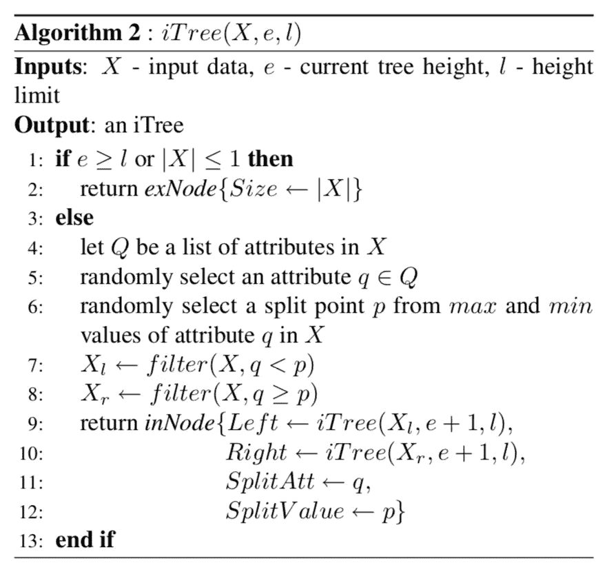
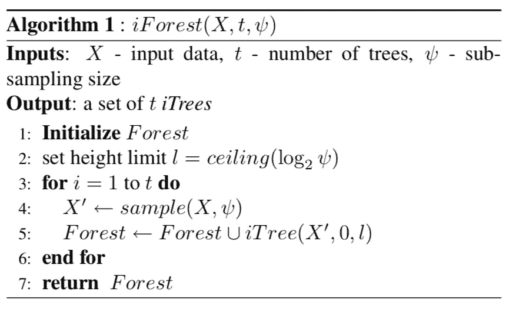
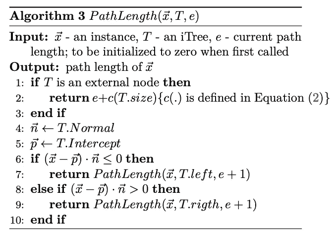
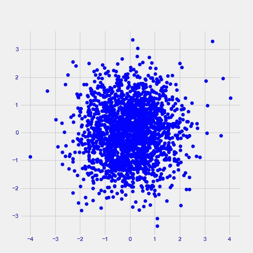
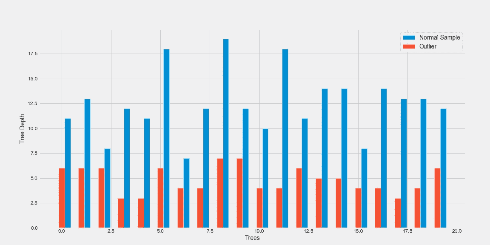
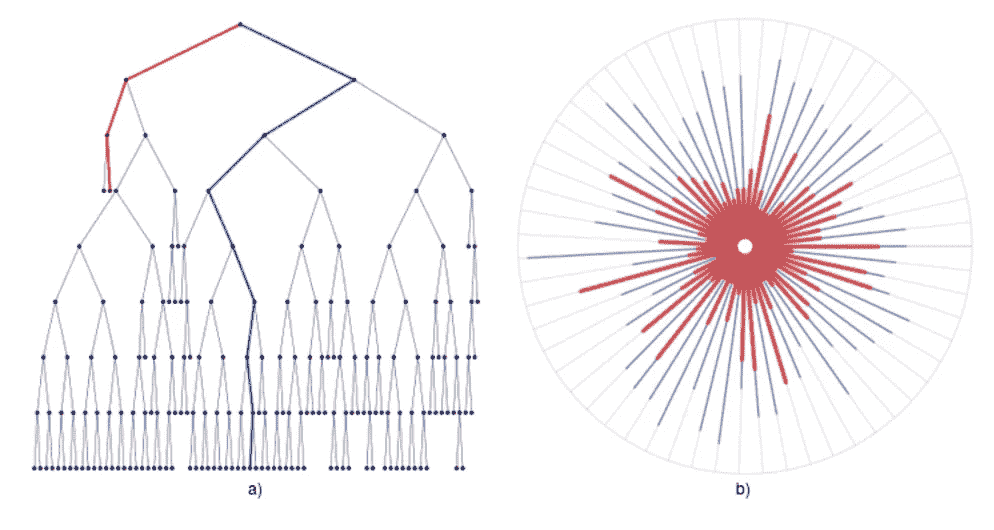
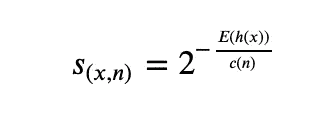

# 从零开始隔离森林

> 原文：<https://towardsdatascience.com/isolation-forest-from-scratch-e7e5978e6f4c?source=collection_archive---------20----------------------->

## 从零开始实现隔离森林，以便进一步理解算法

最近，我一直在阅读隔离森林及其在异常值/异常检测方面的表现。在仔细阅读了算法之后(并且没有找到任何我喜欢的香草教程)。为了更好地掌握算法，我决定用最简单的方式从头开始编码。

这篇文章的目的是在阅读后，你可以深入了解隔离森林，它的优点，缺点，参数，你可以随时使用它，只要你考虑与算法的知识。

对于这个博客/实现，我使用了这篇关于[隔离森林的论文作为伪代码](https://cs.nju.edu.cn/zhouzh/zhouzh.files/publication/icdm08b.pdf?q=isolation-forest)，这篇[扩展的隔离森林论文作为可视化](https://arxiv.org/abs/1811.02141)(与另一篇[博客文章](/outlier-detection-with-extended-isolation-forest-1e248a3fe97b)相对应)，并使用了这个 youtube 教程示例[来自](https://github.com/SebastianMantey/Random-Forest-from-Scratch) [Sebastian Mantey](https://www.youtube.com/channel/UCCtkE-r-0Mvp7PwAvxzSdvw) 的随机森林实现

# 一点理论背景

在开始写代码之前，我认为需要一点理论。

## 什么是隔离林？

*   隔离林用于异常值/异常检测
*   隔离森林是一种无监督学习技术(不需要标签)
*   使用二进制决策树 bagging(类似监督学习中的随机森林)

## 假设

该方法将异常与正常情况隔离开来，为此，对异常进行了以下假设:

*   它们是由较少实例组成的少数
*   它们具有不同于普通实例的属性值

换句话说，异常是“少数和不同的。”

由于前两个假设，异常很容易被隔离，这使得它们更接近树根。

## 简要描述

隔离林为给定数据集构建一个二叉树集合。异常，由于它们的性质，它们在树中有比正常情况下最短的路径。

隔离森林使用非常少的树快速收敛，子采样使我们能够在计算高效的同时获得良好的结果。

# 代码

总体编码策略如下。首先对一棵树进行编码，然后进行树的森林(集合)，最后测量某个实例在每棵树中走了多远，并确定它是否是离群值。

让我们从树开始

## 隔离树:对树进行编码



[1]中的隔离树伪代码

输入将是数据样本、当前树高和最大深度。

对于输出，我们将有一个构建好的树。

为了更容易理解，我正在使用熊猫数据框，即使它在性能方面不是最佳的，也能让普通用户更容易理解。

*   选择数据的特征(列)

```
def select_feature(data): 
    return random.choice(data.columns)
```

*   在范围内选择一个随机值

```
def select_value(data,feat):
    mini = data[feat].min()
    maxi = data[feat].max()
    return (maxi-mini)*np.random.random()+mini
```

*   分割数据

```
def split_data(data, split_column, split_value): data_below = data[data[split_column] <= split_value]
    data_above = data[data[split_column] >  split_value]

    return data_below, data_above
```

*   一起:隔离树。

其思想如下:选择一个特征、该特征的值以及分割数据。如果分支中只有一个数据点，或者树已经达到最大深度:停止。

```
def isolation_tree(data,counter=0, max_depth=50,random_subspace=False):

    # End Loop if max depth or isolated
    if (counter == max_depth) or data.shape[0]<=1:
        classification = classify_data(data)
        return classification

    else:
        # Counter
        counter +=1

        # Select feature
        split_column = select_feature(data)

        # Select value
        split_value = select_value(data,split_column) # Split data
        data_below, data_above = split_data(data,split_column,split_value)

        # instantiate sub-tree      
        question = "{} <= {}".format(split_column, split_value)
        sub_tree = {question: []}

        # Recursive part
        below_answer = isolation_tree(data_below, counter,max_depth=max_depth)
        above_answer = isolation_tree(data_above, counter,max_depth=max_depth)

        if below_answer == above_answer:
            sub_tree = below_answer
        else:
            sub_tree[question].append(below_answer)
            sub_tree[question].append(above_answer)

        return sub_tree
```

## 隔离森林



[1]中的隔离林伪代码

一旦我们有了自己的树，我们就要把它们变成一片森林。伪代码如下:

给定一个输入数据、一些树和一个采样大小(每棵树有多少数据),我们根据需要拟合尽可能多的树并返回一个森林。

实际代码:

```
def isolation_forest(df,n_trees=5, max_depth=5, subspace=256):
    forest = []for i in range(n_trees):
        # Sample the subspace
        if subspace<=1:
            df = df.sample(frac=subspace)
        else:
            df = df.sample(subspace) # Fit tree
        tree = isolation_tree(df,max_depth=max_depth)

        # Save tree to forest
        forest.append(tree)

    return forest
```

## 路径长度

在构建了隔离林之后，我们必须评估实例，为此我们定义了路径长度



来自[1]的路径长度伪代码

给定一个实例和一个隔离树，我们计算每个实例在被隔离或达到最大深度之前要经过多少个节点。

伪代码摘自[隔离林](https://cs.nju.edu.cn/zhouzh/zhouzh.files/publication/icdm08b.pdf?q=isolation-forest)论文。

```
def pathLength(example,iTree,path=0,trace=False): # Initialize question and counter
    path=path+1
    question = list(iTree.keys())[0]
    feature_name, comparison_operator, value = question.split()

    # ask question
    if example[feature_name].values <= float(value):
        answer = iTree[question][0]
    else:
        answer = iTree[question][1]

    # base case
    if not isinstance(answer, dict):
        return path

    # recursive part
    else:
        residual_tree = answer
        return pathLength(example, residual_tree,path=path)return path
```

这只是根据以前存储数据的方式来计算一个实例经过了多少个节点。

## 估价

让我们四处看看

```
mean = [0, 0]
cov = [[1, 0], [0, 1]]  # diagonal covariance
Nobjs = 2000
x, y = np.random.multivariate_normal(mean, cov, Nobjs).T
#Add manual outlier
x[0]=3.3
y[0]=3.3
X=np.array([x,y]).T
X = pd.DataFrame(X,columns=['feat1','feat2'])
plt.figure(figsize=(7,7))
plt.plot(x,y,'bo');
```



数据样本

我们将用我们的数据进行训练和评估。

```
iForest = isolation_forest(X,n_trees=20, max_depth=100, subspace=256)# Evaluate one instance
def evaluate_instance(instance,forest):
    paths = []
    for tree in forest:
        paths.append(pathLength(instance,tree))
    return paths
```

我们选择数据的一个正常实例(随机选择)和一个异常值(记得我们在开始时硬编码了一个异常值作为第一行)。我们看它在树上落下多远，然后画出结果。

```
outlier = evaluate_instance(X.head(1),iForest)
normal  = evaluate_instance(X.sample(1),iForest)
```

蓝色表示随机正态样本，红色表示异常值。

```
np.mean(outlier)
# 4.85
np.mean(normal)
# 12.55
```



异常值和正常样本的每棵树的树深度

我们可以看到，在正常样本和异常值之间，在每个树中实例的深度方面存在视觉和统计差异。

从[扩展隔离森林的论文中，](https://arxiv.org/abs/1811.02141)有另一种放射状的可视化形式，提供了对离群值的清晰直觉



如果节点深度(a)和径向深度(b)由[2]形成，则为正常与异常值

评估森林的更正式的方法是使用实例(x)的异常分数:



异常分数

其中 H(i)是谐波数，可以通过 ln(i) + 0.5772156649(欧拉常数)来估算。由于 c(n)是给定 n 的 h(x)的平均值，我们用它来归一化 h(x)。

```
def c_factor(n) :
    """
    Average path length of unsuccesful search in a binary search     tree given n points

    Parameters
    ----------
    n : int
        Number of data points for the BST.
    Returns
    -------
    float
        Average path length of unsuccesful search in a BST

    """
    return 2.0*(np.log(n-1)+0.5772156649) - (2.0*(n-1.)/(n*1.0))def anomaly_score(data_point,forest,n):
    '''
    Anomaly Score

    Returns
    -------
    0.5 -- sample does not have any distinct anomaly
    0 -- Normal Instance
    1 -- An anomaly
    '''
    # Mean depth for an instance
    E = np.mean(evaluate_instance(data_point,forest))

    c = c_factor(n)

    return 2**-(E/c)
```

使用这种方法，我们可以得到异常值的数学定义，但我相信，到此为止，您已经可以直观地了解算法是如何工作的，参数是什么，以及在哪些情况下它可能会成功。

请随意发表任何评论或给我发短信，告诉我你的建议或其他任何事情。

# 参考

这个博客已经完成如下

*   [1] [隔离林论文为伪代码](https://cs.nju.edu.cn/zhouzh/zhouzh.files/publication/icdm08b.pdf?q=isolation-forest)出自费托尼刘、廷和
*   [2] [扩展隔离森林](https://arxiv.org/abs/1811.02141)用于可视化(与另一篇[博文](/outlier-detection-with-extended-isolation-forest-1e248a3fe97b)相对应)
*   [3] Youtube [随机森林实现](https://github.com/SebastianMantey/Random-Forest-from-Scratch)来自 [Sebastian Mantey](https://www.youtube.com/channel/UCCtkE-r-0Mvp7PwAvxzSdvw)

完整的代码、笔记本和图片可以在这个资源库中看到

[](https://github.com/cmougan/IsolationForest) [## cmougan/IsolationForest

### 隔离林存储库。通过在 GitHub 上创建帐户，为 cmougan/IsolationForest 的发展做出贡献。

github.com](https://github.com/cmougan/IsolationForest)