# 隔离森林是目前针对大数据的最佳异常检测算法

> 原文：<https://towardsdatascience.com/isolation-forest-is-the-best-anomaly-detection-algorithm-for-big-data-right-now-e1a18ec0f94f?source=collection_archive---------6----------------------->

## [理解大数据](https://towardsdatascience.com/tagged/making-sense-of-big-data)


照片由[西蒙·戈弗雷](https://unsplash.com/@sgodfrey?utm_source=unsplash&utm_medium=referral&utm_content=creditCopyText)在 [Unsplash](https://unsplash.com/?utm_source=unsplash&utm_medium=referral&utm_content=creditCopyText) 上拍摄

Isolation forest 或“iForest”是一个非常漂亮、非常简单的算法，可以用很少的参数识别异常。[原始论文](https://cs.nju.edu.cn/zhouzh/zhouzh.files/publication/icdm08b.pdf)面向广大读者，包含最少的数学内容。在本文中，我将解释为什么 iForest 是目前针对大数据的最佳异常检测算法，提供该算法的摘要、该算法的历史，并分享一个代码实现。

# 为什么 iForest 是目前大数据的最佳异常检测算法

**同类最佳的性能概括了**。基于 ROC 性能和精度，iForest 在各种数据集上的表现优于大多数其他离群点检测(OD)算法。我从[**Py**thon**O**ut lier**D**detection package](https://pyod.readthedocs.io/en/latest/pubs.html)(PyOD；[原始论文](http://www.jmlr.org/papers/volume20/19-011/19-011.pdf))并在 Excel 中应用了逐行绿-红渐变条件格式。深绿色表示数据集的最佳算法，深红色表示性能最差:

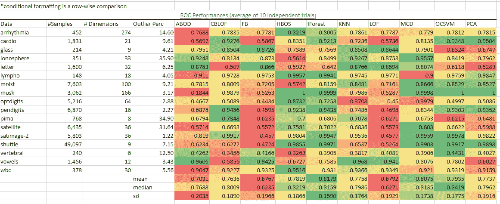

我从 PyOD(**Py**thon**O**ut lier**D**detection toolbox)获取基准数据，并在 Excel 中应用行范围的绿-红渐变条件格式。绿色表示“好”，红色表示“坏”。我们看到，iForest 在大多数数据集和总体上领先，如均值、中值和标准差颜色所示。图片来源:作者。数据来源:[https://pyod.readthedocs.io/en/latest/benchmark.html](https://pyod.readthedocs.io/en/latest/benchmark.html)

我们看到，iForest 在大多数数据集和总体上领先，如我计算的均值、中值和标准差行的颜色所示。iForest 的出色结果同样适用于 precision @ N 性能:

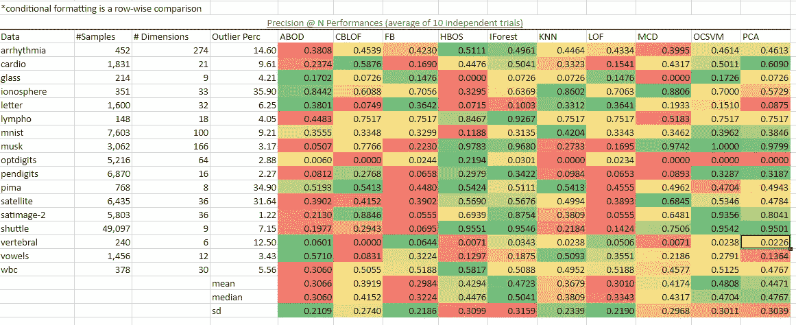

图片来源:作者。数据来源:【https://pyod.readthedocs.io/en/latest/benchmark.html 

**扩展性**。就其性能而言，iForest 是执行速度最快的算法。PCA 和基于直方图的异常值分数(HBOS[论文](http://citeseerx.ist.psu.edu/viewdoc/download?doi=10.1.1.401.5686&rep=rep1&type=pdf)、[海报](https://www.dfki.de/fileadmin/user_upload/import/6431_HBOS-poster.pdf))在所有数据集上都比预期的要快。k-最近邻(KNN)要慢得多，并且随着更多的观察而可怕地扩展。

> 在集群环境中，我已经成功地用包含 100 万个观察值的数据集构建了隔离森林，这些观察值有 36 列，数量级为几分钟。我不能对 sk-learn 的 KNN 说同样的话。

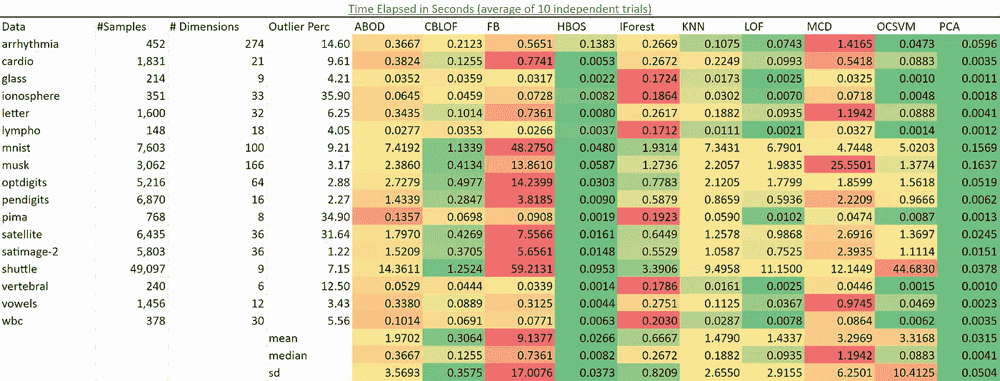

图片来源:作者。数据来源:[https://pyod.readthedocs.io/en/latest/benchmark.html](https://pyod.readthedocs.io/en/latest/benchmark.html)

# 算法要点/总结

我将提供一份 10 页纸的简要总结，概述如下:

1.  大多数其他异常值检测(OD)算法试图建立“正常”实例的轮廓，然后标记不符合该正态轮廓的实例。iForest 通过利用异常的固有属性来明确隔离异常记录:它们对于协变量集具有不寻常的值。
2.  由于计算开销，现有方法局限于低维数据和小数据量。例证:有没有在大数据上尝试过`[sklearn.neighbo](https://scikit-learn.org/stable/modules/classes.html#module-sklearn.neighbors)r.KNeighborsClassifier` ？:)
3.  此外，iForest 具有“低常数和低内存需求”，即低开销。细节:外部节点的数量是 *n* ，因为每个观察值 *n* 都是独立的。内部节点总数明明是 *n-1* ，节点总数是 *2n-1。*因此，我们看到了为什么内存需求是有限的，并且随着 *n.* 线性增长
4.  隔离树节点定义: *T* 或者是无子外部节点，或者是具有一个测试和恰好两个子节点的内部节点(Tₗ，Tᵣ).为了构建一个 iTree，我们通过随机选择一个属性 *q* 和一个分割值 *p* 来递归分割 *X* ，直到(I)树达到一个高度限制，(ii)所有的观察值在它们自己的外部节点被隔离，或者(iii)所有的数据对于所有的属性具有相同的值。
5.  路径长度。观察值 *x* 的路径长度 *h(x)* 由从根节点到外部节点终止的横向遍历 iTree 的边数 *x* 测量。 *E(h(x))* 是来自隔离树集合的 *h(x)* 的平均值。异常分数 *s(x，n)* 可以从平均路径长度 *E(h(x))* : *s(x，n) = 2^[− E(h(x)) / c(n)】中导出。*基本上， *s* 和 *E(h(x))* 之间存在单调关系(详见最后的附录和说明它们关系的帮助图)*。*我不会讨论术语 *c(n)* ，所以我可以保持简短，但它对于任何给定的静态数据集都是常数*。*
6.  仅要求用户设置两个变量:要构建的树的数量和子采样大小。作者提出了使用生成的高斯分布数据的实验，该实验显示了如何用很少的树和小的子样本相对快速地实现平均路径长度的收敛。
7.  小的子采样(样本中的样本)解决了淹没和掩蔽问题。淹没和掩蔽是由对于异常检测目的而言太大的输入数据引起的。淹没是当一个“正常”的观察被误认为是一个“异常”的观察，因为它被异常所包围，而掩蔽是相反的。换句话说，当一棵树被提供了一个包含大部分异常的样本时，一个正常的数据点可能看起来是异常的。作者提出了这种现象的乳房 x 线照片数据的例子。
8.  小的子样本允许每个隔离树特殊化，
    因为每个子样本包括一组不同的异常或
    甚至没有异常
9.  iForest 不依赖任何基于距离或密度的措施来识别异常，因此它速度快，计算成本低，这就引出了下一点
10.  线性时间复杂度，O(n)。通俗地说，这意味着运行**时间**最多随着输入的大小线性增加**。[这个不错](https://www.bigocheatsheet.com/):**

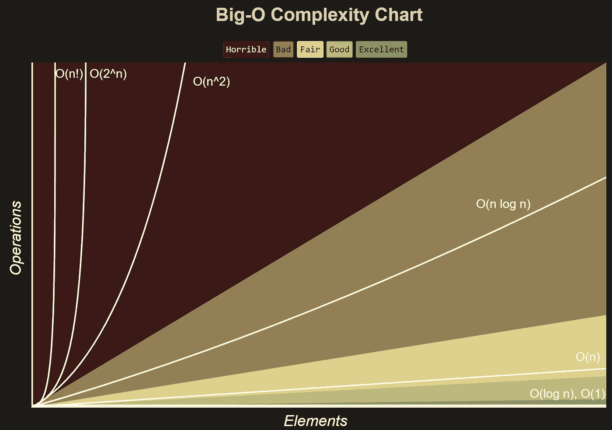

11.对于具有相关背景的读者来说，论文中的以下图表清楚地说明了算法是如何工作的:

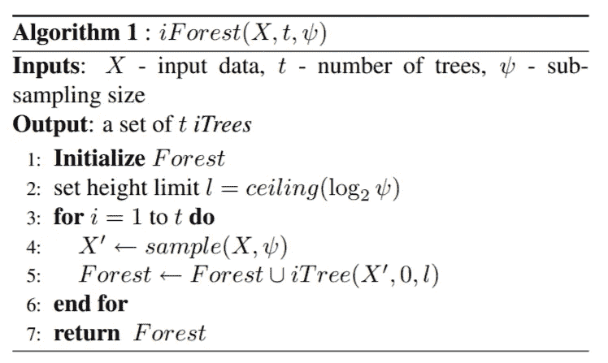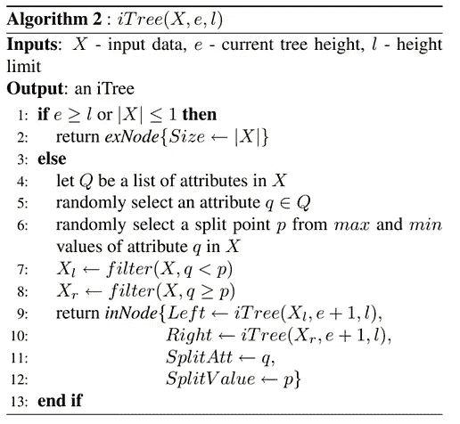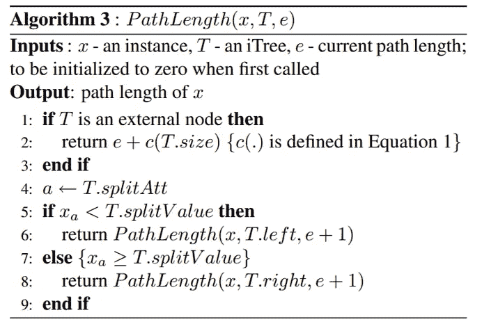

图片来源:[刘、汀、周](https://cs.nju.edu.cn/zhouzh/zhouzh.files/publication/icdm08b.pdf)的《隔离林》。

# 算法历史

博览群书的读者都知道，一个伟大的新想法和更广泛的采用之间的时滞可能长达几十年。例如，逻辑函数在 1845 年被发现，在 1922 年被重新发现([阅读更多](https://papers.tinbergen.nl/02119.pdf))，现在被现代数据科学家定期用于逻辑回归。近几十年来，一个新想法和它被更广泛地采用之间的时间差已经缩短了，但仍然可以说是一段很长的时间。iForest 于 2008 年首次共享，商业上可行的应用程序直到 2018 年底才发布！下面的时间线:

2008 年 12 月— iForest 发布的原始论文([论文](https://cs.nju.edu.cn/zhouzh/zhouzh.files/publication/icdm08b.pdf))
2009 年 7 月—I forest 作者最后一次修改他们的代码实现([代码](https://medium.com/r?url=https%3A%2F%2Fsourceforge.net%2Fprojects%2Fiforest%2Ffiles%2F))
2018 年 10 月— h2o 团队向 R 和 Python 用户提供 I forest([代码](https://github.com/h2oai/h2o-3/commits/d5bc739b47316a94f32cd80f17f788cf4a9d3aa7/h2o-algos/src/main/java/hex/schemas/IsolationForestModelV3.java))
2019 年 1 月— PyOD 为 Python 用户发布离群点检测(OD)工具包([代码](https://github.com/yzhao062/pyod)，[论文)](https://www.jmlr.org/papers/volume20/19-011/19-011.pdf)

# 代码实现

因为本文是关于大数据的，所以我假设一个集群环境。我下面的实现可以处理存储在 AWS S3 中的数据，但只需稍加修改就可以在其他地方使用。代码搭建(QA 对象、调试等的代码。)大多省略。需要为 AWS 集群环境安装软件包的帮助吗？参见我的中型文章:[如何为 SparkSQL 设置经济高效的 AWS EMR 集群和 Jupyter 笔记本](http://bit.ly/2spBaSd)

我发现 iForest 可以轻松快速地处理 750 万行和 36 个特征，在几分钟内完成计算。

**Python (h2o):**

下面的直方图由上面的代码生成。对于我的数据框`predictions_fullX`中的观察结果，大多数观察结果并不异常，如较大平均路径长度的频率所证明的。

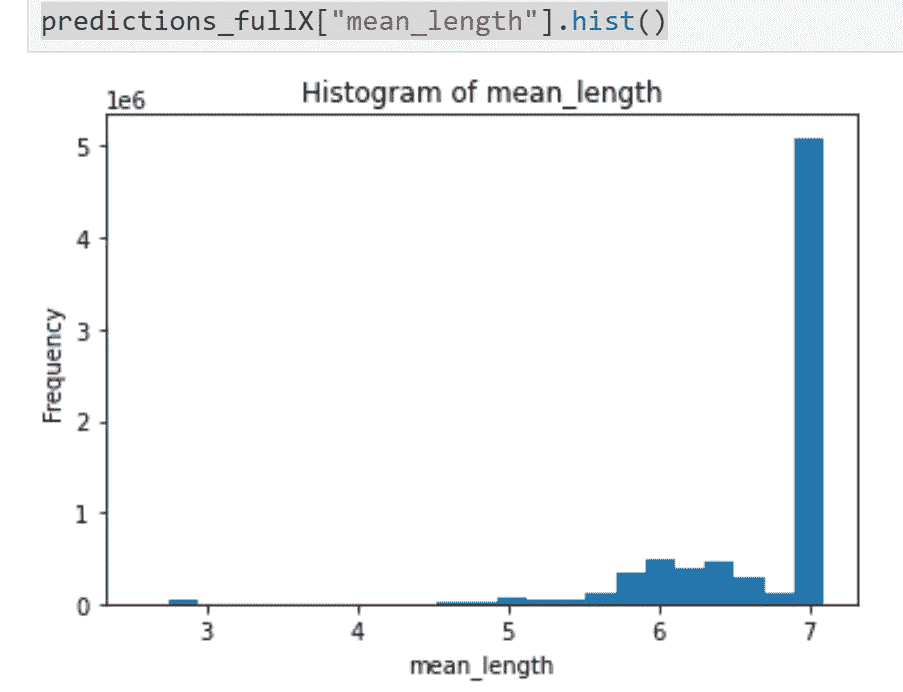

图片来源:作者使用专有数据集

如果您的数据有您想要用 iForest 确证的标签，您可以将正常实例集的分布与异常实例集的分布进行比较，并与原始数据集进行比较，以便进一步推断。例如，您可以通过原始数据集中要素的不同组合来查看计数，如下所示:

```
N = df.count()
df[['v1', 'v2', 'id']].groupby(['v1', 'v2']).count() / N
df[['v1', 'v3', 'id']].groupby(['v1', 'v3']).count() / N
...
```

并与 iForest 确定的正常/异常实例集进行比较，如下所示:

我完成了所有这些工作，还将我的数据导出到 Excel 中，以快速生成一些累积分布函数，如下所示:

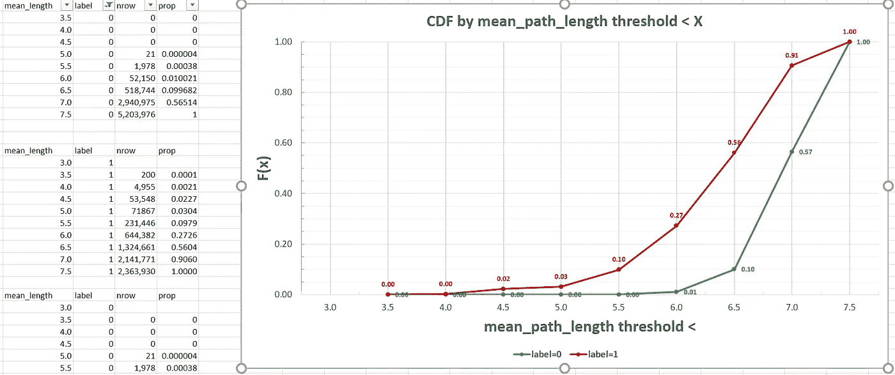

图片来源:作者本人作品。绿线代表 label=1，或已知的正态观测值；红线代表标签=1 的观察值，确认为可能异常或可能不异常。

**Python (pyod)** (如果评论中有要求，我会添加代码！)

**更新(2020 年 12 月 15 日)，PyOD 代码:**

在 PyOD github ( [link](https://github.com/yzhao062/pyod/tree/master/examples) )上有很多很棒的例子，所以我不认为我有必要编造一个。如果你对 GitHub repo 上没有的 PyOD 代码有特殊要求，请在评论中告诉我。Github 不会向您显示结果应该是什么样子，所以我的增值功能可以向您显示代码应该输出什么，以防您在这方面遇到困难。

https://github . com/yzhao 062/pyod/blob/master/examples/ocsvm _ example . py 的输出应该类似于:

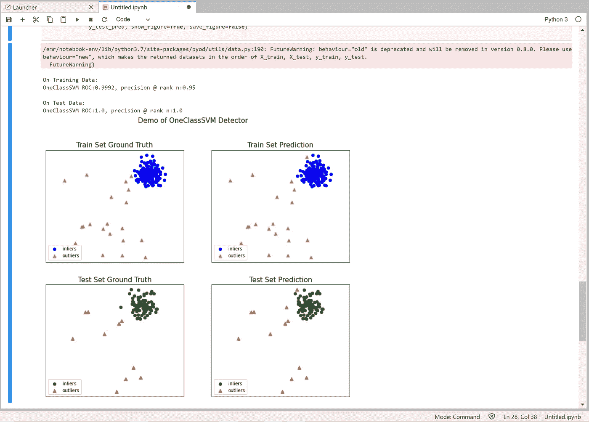

图片来源:作者

**Scala** (即将推出)

我使用 LinkedIn 团队对 Scala 的 iForest ( [github](https://github.com/linkedin/isolation-forest) )实现，因为 PyOD 和 h2o 是针对 Python 的。目前还不能让它工作，但当我可以的时候会更新。

# 参考

*   F.刘铁男、丁国明、周志宏。[隔离林](https://cs.nju.edu.cn/zhouzh/zhouzh.files/publication/icdm08b.pdf)。摘自:**《第八届 IEEE 数据挖掘国际会议论文集》(ICDM'08)** ，意大利比萨，2008 年，第 413–422 页。本文获得了 2008 年 IEEE ICDM 会议理论/算法亚军最佳论文奖
*   赵，杨，纳斯鲁拉，和李，2019。PyOD:用于可伸缩异常检测的 Python 工具箱。机器学习研究杂志(JMLR)，20(96)，第 1–7 页。

# 关于作者

安德鲁·杨是 Neustar 的 R&D 数据科学家经理。例如，Neustar 是一家信息服务公司，从航空、银行、政府、营销、社交媒体和电信等领域的数百家公司获取结构化和非结构化的文本和图片数据。Neustar 将这些数据成分结合起来，然后向企业客户出售具有附加值的成品，用于咨询、网络安全、欺诈检测和营销等目的。在这种情况下，Young 先生是 R&D 一个小型数据科学团队的实践型首席架构师，负责构建、优化和维护一个为所有产品和服务提供信息的系统，该系统为 Neustar 带来了超过 10 亿美元的年收入。在 LinkedIn 上关注 Andrew，了解数据科学的最新趋势！

# 更多热门文章:

*   [每个数据科学家都应该知道:偏差-方差权衡推广是错误的](/something-every-data-scientist-should-know-but-probably-doesnt-the-bias-variance-trade-off-25d97a17329d)
*   [高效数据科学家必备的演示工具](/must-know-presentation-tools-for-the-effective-data-scientist-93e618ffc8c2)

# 附录

算法要点/总结，第 5 点细节:

*   当 E(h(x)) → c(n)，s → 0.5(观测不是明显异常)
*   当 E(h(x)) → 0，s → 1(异常)
*   当 E(h(x))→n1，s → 0 时(非异常)

所以用这篇论文的话来概括上述内容:

*   (a)如果实例返回的 s 非常接近 1，那么它们肯定是异常，
*   (b)如果实例的 s 远小于 0.5，那么它们被视为正常实例是相当安全的，并且
*   如果所有实例都返回 s ≈ 0.5，那么整个样本实际上没有任何明显的异常。

说明异常分数 *s* 和平均路径长度 *E(h(x))* 之间关系的有用图

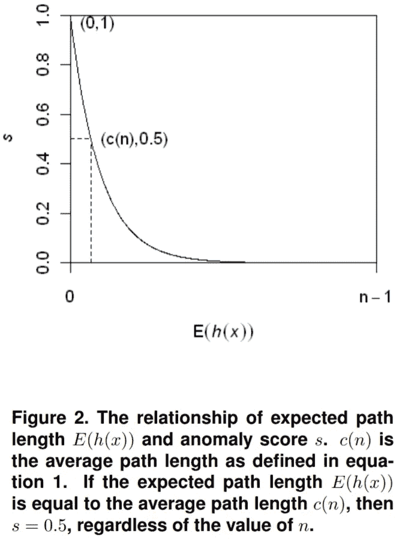

图 2 来自[隔离林纸。](https://cs.nju.edu.cn/zhouzh/zhouzh.files/publication/icdm08b.pdf)