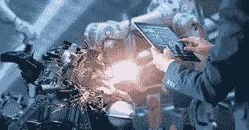

# It from Bit:人工智能如何塑造我们的物理世界

> 原文：<https://towardsdatascience.com/it-from-bit-how-ai-is-shaping-our-physical-world-2fbf3c5df27?source=collection_archive---------28----------------------->

# 人工智能只是一个“数字事物”，还是它正在彻底改变我们的物理世界？

它只是“一点”？

先驱物理学家约翰·阿奇博尔德·惠勒曾用诗意的“比特的信息”总结了信息的“空灵”概念和我们的物质物理现实之间错综复杂的相互联系。像充斥在我们电子设备中的由 1 和 0 组成的无形实体，实际上正在“构成”和塑造我们的物理世界。

人工智能:一堆比特……以及它如何影响物理世界。

人工智能是一个同样虚无缥缈的概念，由 0 和 1 构建的抽象数学实体组成，这些实体对模拟神经元和突触的结构和功能进行编码，最终赋予人工智能学习和预测真实世界的能力，这些真实世界类似于我们生物大脑产生的世界。

然而，我们生活在一个由物质构成的世界:人、房子、桌椅、建筑、飞机、火车和汽车。人工智能这个抽象的东西对我们日常的物理现实有什么真正的影响？

虽然人工智能已经被证明能够为聊天机器人提供动力，能够与客户互动，查看安全摄像头，寻找你心爱的亚马逊包裹的可能小偷，并帮助脸书和谷歌了解如何为你看到更多广告，但它对我们的物理世界有何影响？

很微妙，但是很大。让我给你举一个例子，我认为这是地球上存在的最有形的“东西”之一……制造业，正是这个过程构建了构成我们人类世界的万物。

# 人工智能如何塑造我们建造事物的方式

人工智能正在改变我们的物理世界的一个主要领域是制造业，从产品一致性到质量控制，在简化制造供应链和主动设备维护方面。

人工智能是真实的…例如，在制造业。

想象一个充满制造机器的现代化工厂。例如，在质量控制方面，人工监督只能做这么多，而机器每小时生产数百种产品。人类工人，在制造业中是一种微不足道的商品，根本不能也没有能力发现每一个不完美和缺陷。

人工智能在制造车间的引入极大地改变了工厂提高产品缺陷检测和质量保证的方式，将生产率提高了 50%或更多。这些都是真实的，人工智能的物理效果，每个人都可以触摸和量化！

而这只是冰山一角！根据 IDC 的数据，到 2021 年，20%的领先制造商将依赖人工智能和其他技术，麦肯锡发现，在未来五到七年内，将人工智能嵌入数据密集型制造流程的 50%的公司将有机会使现金流翻倍。

除了制造业中精致的物理例子，影响我们物理世界的其他人工智能包括，例如，零售业，智能软件能够理解客户行为，帮助商店在销售点向他们提供更有针对性的有趣产品。或者医疗保健，在人工智能的帮助下，我们的身体将得到更好、更快、更普遍的诊断。由于物联网中集成的高级人工智能，我们的家正在通过管理照明、温度和其他设置来改变我们大部分时间所在的物理环境。此外，最重要的是，我们自己的钱包将受到人工智能的好处(积极)影响，人工智能可以根据用户的风险偏好准确有效地优化股票投资组合。

数字化正成为我们现实中越来越不可或缺的一部分，数十亿物联网传感器、移动设备和联网机器正在进入我们的物理世界，重新融入 it 动作、见解，并从根本上改变它，人工智能技术是其核心。

所以，下次你坐在咖啡店里阅读下一篇关于人工智能的文章时，记住它不仅仅是比特。相反，它是夹在真实物理系统之间的一个非常重要的软件，在真实物理系统中，信息一直被不断地获取、理解和处理。

欢迎来到无处不在的物理智能时代。