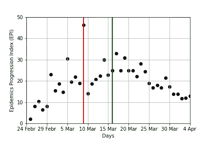
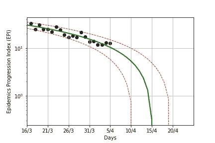
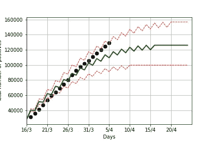

# 使用 Python 进行意大利新冠肺炎分析

> 原文：<https://towardsdatascience.com/italian-covid-19-analysis-with-python-1bdb0e64d5ac?source=collection_archive---------24----------------------->


照片由 [Gerd Altmann](https://pixabay.com/it/users/geralt-9301/?utm_source=link-attribution&utm_medium=referral&utm_campaign=image&utm_content=4957154) 从 [Pixabay](https://pixabay.com/it/?utm_source=link-attribution&utm_medium=referral&utm_campaign=image&utm_content=4957154) 拍摄

本教程分析了意大利民间保护组织发布的关于新冠肺炎的数据，并建立了流行病结束的预测。在下面的文章中描述了这个预测器背后的一般概念:[https://medium . com/@ angelica . lo duca/predicting-the-end-of-the-coronavirus-epiderations-in-Italy-8da 9811 f 7740](https://medium.com/@angelica.loduca/predicting-the-end-of-the-coronavirus-epidemics-in-italy-8da9811f7740)。代码可以从我的 github 资源库下载:[https://github . com/alod 83/data-science/tree/master/data analysis/新冠肺炎](https://github.com/alod83/data-science/tree/master/DataAnalysis/covid-19)。

本教程的主要目的在于建立一个预测器，用于预测意大利新冠肺炎疫情新发病例的可能结束时间。建议的教程是基于意大利的数据，但它也可以推广到其他国家的数据。例如，关于西班牙的数据可在此链接获得:[https://github . com/data dista/datasets/tree/master/COVID % 2019](https://github.com/datadista/datasets/tree/master/COVID%2019)。

到目前为止，已经提出了不同的方法，例如 R0 传染指数(详见此处[和](http://theconversation.com/r0-how-scientists-quantify-the-intensity-of-an-outbreak-like-coronavirus-and-predict-the-pandemics-spread-130777))。然而，在新冠肺炎流行病的情况下，估计 R0 并不简单。相反，本教程中提出的模型是基于对真实数据的观察，并且使用哪条曲线来拟合数据的决定是基于这样的观察。

本教程的一个可能的扩展是构建一个预测意大利整个流行病结束的预测器，即没有新的阳性病例登记的时间。这方面将是未来文章的主题。

笔记本利用了`pandas`和`scikit-learn`库。

# 输入数据

## 从 Github 存储库导入 CSV 并构建 EPI

首先，我们从意大利 Protezione Civile 的 Github 库导入数据，然后计算流行病进展指数(EPI)。我们提取列`totale_casi`，其中包含自疫情开始以来的新冠肺炎感染总数，以及`tamponi`，其中包含自疫情开始以来的新冠肺炎拭子总数。我们将 EPI 存储在`y`变量中。最后，我们打印所有有数据的日期列表(`data['data']`)。

```
data = pd.read_csv(“[https://raw.githubusercontent.com/pcm-dpc/COVID-19/master/dati-andamento-nazionale/dpc-covid19-ita-andamento-nazionale.csv](https://raw.githubusercontent.com/pcm-dpc/COVID-19/master/dati-andamento-nazionale/dpc-covid19-ita-andamento-nazionale.csv)") 
tc = data[‘totale_casi’]
tt = data[‘tamponi’]
y = []
tt_increase = []
for i in range(1, len(tt)):
 current_epi = (tc[i] — tc[i-1])/(tt[i]-tt[i-1])*100
 tt_increase.append(tt[i]-tt[i-1])
 y.append(current_epi)
data[‘data’]
```

现在我们计算有数据的日子。我们可以使用变量`data['data']`。但是，这个变量是一个字符串，所以很难用它来拟合预测值。因此，我们使用一个通用变量`X`，它包含一个数字序列，从 1 到样本总数。

```
X = []
for i in range(1, len(y)+1):
 X.append([i])
```

# 初步情节

## 绘制 EPI 与天数的关系图，以及两条垂直线，分别代表限制法的开始及其效果

现在我们可以绘制 y 对 X，也就是绘制 EPI 对天数。我们还绘制了两条额外的线:1)对应于限制法则开始的日期，2)曲线开始下降的日期(一周后)。这两条线在剧情展示的时候就可以理解了。

在意大利，限制法律始于 3 月 9 日，相当于第 14 天。换句话说，它对应于`y`和`X`变量中的 14 行。从 3 月 9 日开始的一个星期后，限购令的效果就会显现出来。他们就这样在第 21 天开始了。

```
# vertical line corresponding to the beginning of restriction laws. 
di = 14
restrictions_x = [di,di,di,di,di,di]
restrictions_y = [0,10,20,30,40,50]# vertical line corresponding to the beginning of effects of restriction laws (after a week)
de = di + 7
effects_x = [de,de,de,de,de,de]
effects_y = [0,10,20,30,40,50]
de
```

现在我们可以绘制图表。我们可以通过`xticks()`函数将`X`值转换成日期。

```
import matplotlib.pyplot as pltplt.scatter(X, y, color=’black’)
plt.plot(restrictions_x,restrictions_y, color=’red’, linewidth=2)
plt.plot(effects_x,effects_y, color=’green’, linewidth=2)
plt.grid()
plt.xlabel(‘Days’)
plt.xlim(0,40)
plt.ylim(0,50)
plt.xticks([0,5,10,15,20,25,30,35,40],
 [“24 Febr”, “29 Febr”, “5 Mar”, “10 Mar”, “15 Mar”, “20 Mar”, “25 Mar”, “30 Mar”, “4 Apr”])plt.ylabel(‘Epidemics Progression Index (EPI)’)
plt.savefig(“EPI-all.png”)
plt.show()
```



我们注意到 EPI 从 3 月 16 日开始下降，也就是限制法令颁布后整整一周。因此，我们可以用线性回归来逼近从 3 月 16 日开始的曲线，该曲线递减。

# 建立模型

## 建立代表 EPI 的线性回归方程，拟合回归方程并计算分数

我们从`sklearn`库中导入`linear_model`。然后我们从 3 月 16 日之前的`X`和`y`数据中剔除，并用`X`和`y`拟合`LinearRegression`模型。最后，我们通过`score()`函数计算模型的得分。

```
import numpy as np
from sklearn import linear_model
X = X[de:]
y = y[de:]print(X)
# Linear Regression
linear_regr = linear_model.LinearRegression()# Train the model using the training sets
linear_regr.fit(X, y)linear_regr.score(X,y)
```

# 预测未来趋势

## 使用回归变量预测未来趋势。也计算误差

拟合后，我们通过函数`predict()`建立代表数据的线性曲线，并通过应用于`y`的真实值和预测值`y_pred`的函数`max_error()`计算模型的最大误差。该误差将用于构建两条新的线，最大线和最小线，这两条线将定义新样本移动的范围。

```
from sklearn.metrics import max_error
import mathy_pred = linear_regr.predict(X)
error = max_error(y, y_pred)
error
```

现在，我们可以应用该模型来预测未来几天的 EPI。我们构建了一个变量`X_test`，它包含过去的日子(即数据已经可用的日子)和未来的日子。我们定义包含预测天数的变量`gp`。

然后我们将我们的模型应用到`X_test`。

```
X_test = []gp = 40for i in range(de, de + gp):
 X_test.append([i])y_pred_linear = linear_regr.predict(X_test)
```

变量`y_pred_linear`包含未来几天的预测 IPE。然而，我们也应该考虑模型产生的误差。因此，我们构建两个新变量`y_pred_max`和`y_pred_min`，分别包含`y_pred + error`和`y_pred - error`。

```
y_pred_max = []
y_pred_min = []
for i in range(0, len(y_pred_linear)):
 y_pred_max.append(y_pred_linear[i] + error)
 y_pred_min.append(y_pred_linear[i] — error)
```

# 绘图结果

## 画三条线，分别代表预测的输出，最大误差和最小误差

现在我们准备绘制数据(`y_pred`、`y_pred_max`和`y_pred_min`)。为了让情节更吸引人，我们应该将数字(由`X_test`变量表示)转换成日期。因此，我们维护两个变量`x_ticks`和`date_prev`，它们分别包含`X_test`和相应标签的子集..

为了建立`x_ticks`和`date_prev`之间的映射，我们从变量`data['data']`中提取限制的日期，并通过函数`datetime.strptime()`将其转换为日期。我们将结果存储在变量`data_eff`中。

我们构建`x_ticks`，通过对`X_test`的每一个`step`物品进行抽样。我们定义`date_prev[0] = data_eff`。对于每一项，我们可以通过将`step`添加到前一项来构建`date_prev`。

```
from datetime import datetime
from datetime import timedeltadata_eff = datetime.strptime(data[‘data’][de], ‘%Y-%m-%dT%H:%M:%S’)
# date previsione
date_prev = []
x_ticks = []
step = 5
data_curr = data_eff
x_current = de
n = int(gp/step)
for i in range(0, n):
 date_prev.append(str(data_curr.day) + “/” + str(data_curr.month))
 x_ticks.append(x_current)
 data_curr = data_curr + timedelta(days=step)
 x_current = x_current + step
```

现在我们可以画出所有的线。

```
plt.grid()
plt.scatter(X, y, color=’black’)plt.plot(X_test, y_pred_linear, color=’green’, linewidth=2)
plt.plot(X_test, y_pred_max, color=’red’, linewidth=1, linestyle=’dashed’)
plt.plot(X_test, y_pred_min, color=’red’, linewidth=1, linestyle=’dashed’)plt.xlabel(‘Days’)
plt.xlim(de,de+gp)plt.xticks(x_ticks, date_prev)
plt.ylabel(‘Epidemics Progression Index (EPI)’)
plt.yscale(“log”)plt.savefig(“EPI-prediction.png”)
plt.show()
```



# EPI 的 0 值预测

## 预测 EPI 何时为 0，即代表 EPI 的线何时穿过 X 轴

首先，我们计算一个辅助函数，它将数字转换为日期。该功能将视为开始日期`data_eff`。

```
def n_to_date(n):
 return data_eff + timedelta(days=n-de)
```

现在我们可以计算这条线何时穿过 x 轴。提醒一下，一条线的方程是 y = ax + b，x 轴的方程是 y = 0。因此，我们必须求解包含这两个方程的系统。结果 x = -b/a。

```
data_zero = round(- linear_regr.intercept_ / linear_regr.coef_[0])
n_to_date(data_zero)
```

前面的计算只对回归定义的直线进行。现在我们还应该计算`y_pred_max`和`y_pred_min`的值。我们定义一个辅助函数，叫做`build_line()`，从两点构建一条线，返回这条线的系数。

```
def build_line(x1,y1,x2,y2):
 m = float(y2 — y1)/(x2-x1)
 q = y1 — (m*x1)
 return [m,q]
```

现在我们可以计算出`y_pred_min`和`y_pred_max`的结束日期。我们将 max 的零日期近似为获得值的`ceil()`，将 min 的零日期近似为获得值的`floor()`。

```
import math
line_max = build_line(X_test[0][0], y_pred_max[0], X_test[1][0], y_pred_max[1])
data_zero_max = math.ceil(- line_max[1] / line_max[0])
n_to_date(data_zero_max)line_min = build_line(X_test[0][0], y_pred_min[0], X_test[1][0], y_pred_min[1])
data_zero_min = math.floor(- line_min[1] / line_min[0])
n_to_date(data_zero_min)
```

# 预测一般日期的 EPI 值

## 通过添加代码来计算一般日期的 EPI 值，从而扩展本教程

我们定义了一个名为`date_to_n()`的辅助函数，它将一个通用日期转换为自开始日期起的天数。然后，我们将模型应用于获得的值。

```
def date_to_n(my_date):
 initial_date = datetime.strptime(data[‘data’][0], ‘%Y-%m-%dT%H:%M:%S’)
 return (my_date — initial_date).days + 1my_date = datetime.strptime(“2020–04–05”, ‘%Y-%m-%d’)
n = date_to_n(my_date)
predict = linear_regr.predict([[n]])
```

# 预测感染的最大数量

## 在 EPI 的基础上，用逆方程计算感染总数。情节也是结果

现在我们可以建立感染总数的最大值。我们可以利用 EPI 的公式:`y_pred[i] = (tc[i] - tc[i-1])/(tt[i]-tt[i-1])*100`来计算`tt[i] = y_pred[i]*/(tt[i]-tt[i-1])*100) + tc[i]`的值。差值`tt[i]-tt[i-1]`代表`i`时刻的拭子数量，因此我们可以将其近似为`data['tamponi']`的平均值(存储在变量`tt_increase`中)。或者，我们也可以将差值计算为最小值或最大值。因此，我们计算`tt`(称为`avg_tt`)的平均值作为`tt_increase[de:]`的度量。度量作为函数的参数传递。

```
def average(mylist):
 return sum(mylist)/len(mylist)# calculate the plateau considering the average increase of swabs
def plateau(y_pred,data_end,metrics):
 avg_tt = metrics(tt_increase[de:])np_avg = []
 #np_start = data[‘totale_casi’][len(data[‘totale_casi’])-1]
 np_start = data[‘totale_casi’][de]
 np_avg.append(np_start)for i in range(0, data_end-de):
 np = y_pred[i]*avg_tt/100 + np_avg[i-1]
 np_avg.append(np)

 last_value = max(np_avg)
 for i in range(0, gp-len(np_avg)):
 np_avg.append(last_value)
 return np_avg
```

现在，我们可以通过将最大值视为度量来计算`y_pred_min`、`y_pred_max`和`y_pred_linear`的平稳状态。

```
plateau_min = plateau(y_pred_min,data_zero_min, max)
plateau_max = plateau(y_pred_max,data_zero_max, max)
plateau_avg = plateau(y_pred_linear,int(data_zero), max)
```

最后，我们绘制结果并打印最大值。

```
plt.plot(X_test,plateau_min, color=’red’, linewidth=1, linestyle=’dashed’)
plt.plot(X_test,plateau_max, color=’red’, linewidth=1, linestyle=’dashed’)
plt.plot(X_test,plateau_avg, color=’green’, linewidth=2)
plt.scatter(X,tc[de+1:], color=’black’, linewidth=2)
plt.xlabel(‘Days’)
plt.xlim(de,de+gp)
#plt.ylim(0,50)
plt.xticks(x_ticks, date_prev)
#plt.yticks([0,20,30,40,50,60])plt.ylabel(‘Total number of positives’)
plt.grid()
plt.show()
```



# 吸取的教训

本教程描述了一个简单的方法来建立一个预测意大利新冠肺炎流行病的结束。从本教程中，我们了解到:

*   在构建预测器之前，必须进行初步的数据探索。事实上，如果我们在所有可用数据上建立预测器(即从 2 月 24 日开始)，我们就不会使用线性回归来建立它；
*   预测器的建立还应考虑到现实生活(在我们的案例中，是意大利政府引入的限制法及其一周后的效果)；
*   一旦建立了预测器，也应该考虑误差。因此，必须计算误差范围，以便有更准确的预测；
*   真实(新)数据和预测值之间的比较总是受欢迎的，因为它允许您验证模型是否正确。

***编者按:*** [*走向数据科学*](http://towardsdatascience.com/) *是一份以数据科学和机器学习研究为主的中型刊物。我们不是健康专家或流行病学家，本文的观点不应被解释为专业建议。想了解更多关于疫情冠状病毒的信息，可以点击* [*这里*](https://www.who.int/emergencies/diseases/novel-coronavirus-2019/situation-reports) *。*