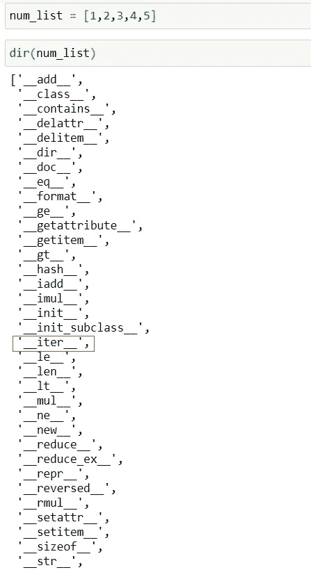
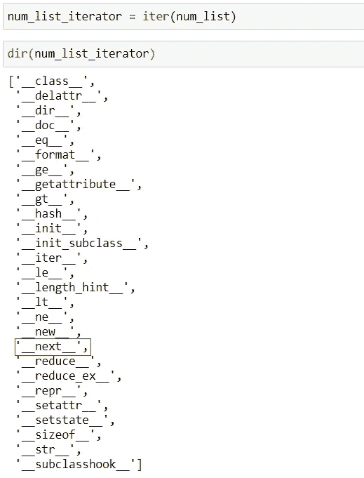
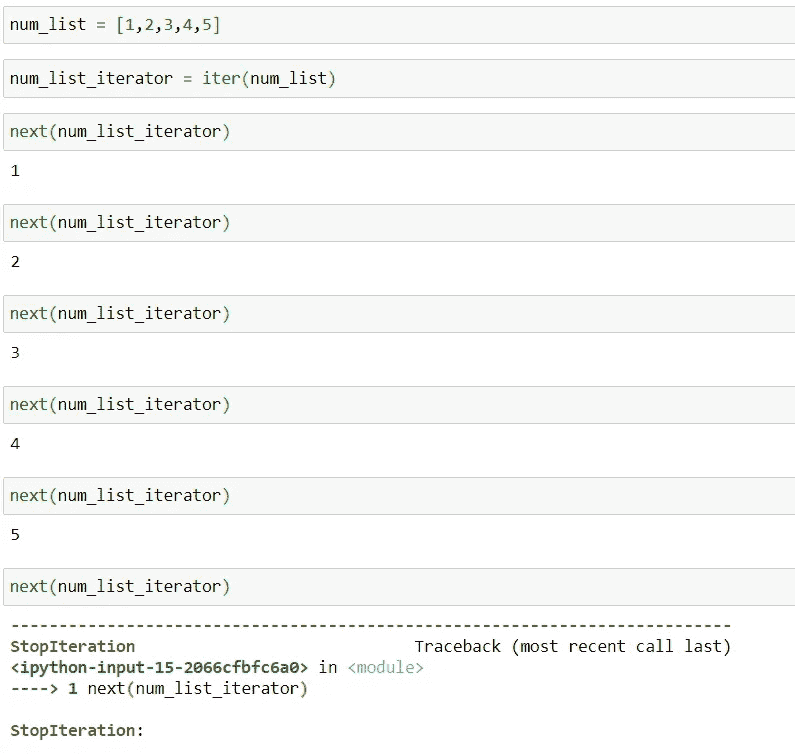
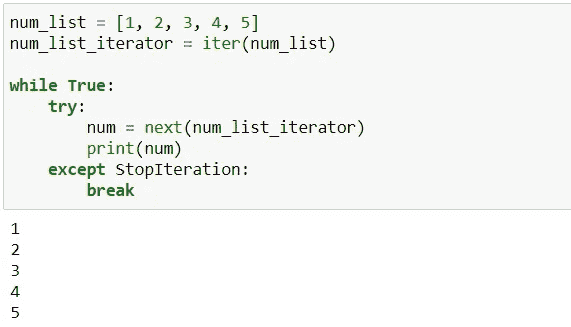
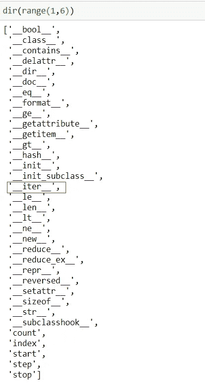

# Python 中的迭代器和迭代器

> 原文：<https://towardsdatascience.com/iterables-and-iterators-in-python-849b1556ce27?source=collection_archive---------17----------------------->

## Python 中的可迭代对象、迭代器和迭代


凯文·Ku 在 [Unsplash](https://unsplash.com?utm_source=medium&utm_medium=referral) 上的照片

在本文中，我们将学习迭代、可迭代和迭代器之间的区别，如何识别可迭代和迭代器，以及为什么这样做是有用的。

# 什么是可迭代的？

广义地说，iterable 是可以循环的东西。循环遍历某物，或者一个接一个地获取其中的每一项的过程，就是迭代。例如，当我们使用 For 循环来循环遍历一个列表时，循环遍历这个列表的过程就是迭代(或者我们正在迭代遍历这个列表)，这个列表就是 iterable。元组、字典、字符串、文件和生成器也是可迭代的，因为它们也可以被迭代。

例如，我们可以使用 For 循环来循环或迭代列表，如下所示:

```
num_list = [1,2,3,4,5]for num in num_list:
    print(num)
```

## **但是是什么让一个东西成为可重复的呢？**

换句话说，是什么使得某些东西能够被迭代，比如在 for 循环中？要成为可迭代的，一个对象将有一个 iter()方法。因此，如果一个对象有 iter()方法，那么它就是 iterable，因此我们可以使用 for 循环来遍历它。

从技术上来说，如果一个对象有 getitem()方法，它也可以是 iterable。然而，我们在这里将关注 iter()方法，因为它是 python 中迭代的较新协议。

如果我们在 *num_list* 上使用 dir()函数，它将显示列表对象的所有方法和属性:



列表对象的方法和属性

注意列表对象 *num_list* 有一个 __iter__()方法，这使它成为可迭代的。具有双前导和双尾随下划线的方法因此被称为 dunder 方法(也称为魔术方法或特殊方法)。这些方法旨在被间接调用，因为大多数 python 操作符都有相关的魔法方法。

## **那么这个 __iter__()方法是做什么的呢？**

__iter__()方法将返回一个迭代器对象。要循环遍历一个 iterable，比如一个 list，我们通常不会手动这么做。例如，For 循环首先调用对象上的 __iter__()方法，该方法返回一个迭代器对象。然后 for 循环遍历这个迭代器。所有这些都是在后台完成的。

这就把我们带到了迭代器。

[](/list-comprehensions-in-python-28d54c9286ca) [## Python 中的列表理解

### 用 python 创建列表的更优雅、更简洁的方式

towardsdatascience.com](/list-comprehensions-in-python-28d54c9286ca) 

# 什么是迭代器？

列表是可迭代的。但它不是迭代器。如果我们在列表上运行 __iter__()方法，它将返回一个迭代器。迭代器是一个对象，它有一个在迭代过程中记得自己位置的状态。迭代器也知道如何获得它们的下一个值。它们通过 __next__()方法获得下一个值。因此，要知道一个对象是否是迭代器，我们可以检查它是否有 __next__()方法。

我们可以先调用 num_list 上的 iter()函数(iter()函数调用传入的对象上的 __iter__()方法)，返回一个迭代器，然后我们将在迭代器上使用 dir()函数查看其属性和方法:



迭代器的方法和属性

注意我们的迭代器 *num_list_iterator* 有一个 __next__()方法。列表对象不是迭代器，因为它没有 __next__()方法。因此，在列表上调用 next()函数(如果有对象的话，它会在对象上调用 __next__()方法)会导致类型错误，因为我们的列表对象不是迭代器，因此没有 __next__()方法。但是，list 对象是可迭代的，因为它有一个 __iter__()方法，调用该方法时，返回一个迭代器，该迭代器将有一个 __next__()方法。

> 注意 num_list_iterator 也有一个 __iter__()方法。因此，迭代器也是可迭代的，或自迭代的，因为在迭代器上调用 __iter__()方法会返回 self。

## **下一个方法是做什么的？**

在迭代器上调用 __next__()方法将返回迭代中的下一个值。因此，在我们从 *num_list* 或 *num_list_iterator* 创建的迭代器上调用 __next__()方法，将返回迭代器中的第一个值。在同一个迭代器上调用 __next__()方法将返回迭代器中的第二个值(记住迭代器有一个状态，它能记住它在迭代过程中的位置)。一旦我们遍历了迭代器的所有值，在迭代器上再次调用 __next__()方法将导致 StopIteration 错误，因为我们的迭代器现在已经用完了。一旦一个迭代器用完了，我们必须通过 iterable 的 __iter__()方法创建一个新的迭代器。

> 注意:迭代器只能向前。这意味着我们只能通过 __next__()方法获得迭代器中的下一个值。为了从头开始，我们必须通过在我们想要迭代的 iterable 上调用 __iter__()方法来创建一个新的 iterator 对象。

[](/args-and-kwargs-in-python-6d991a3c1b5e) [## * Python 中的 args 和**kwargs

### 理解什么是*args 和**kwargs 以及如何使用它们

towardsdatascience.com](/args-and-kwargs-in-python-6d991a3c1b5e) 

## **for 循环是如何工作的？**

for 循环的工作原理是在后台执行上述操作。使用 for 循环遍历 list(或其他 iterable)首先通过 __iter__()方法创建一个迭代器对象，然后调用该迭代器上的 __next__()方法，返回值，直到返回 StopIteration 错误(它没有向我们显示)，这让它知道迭代器已经用尽，因为迭代器中没有更多的值了。这可以从下面看出:



在 for 循环的背景中

请注意，我们可以使用内置的 iter()和 next()函数，而不是键入 dunder 方法，这些函数为我们调用 __iter__()和 __next__()方法。但是，我们也可以像下面这样调用方法:

```
num_list.__iter__()num_list_iterator.__next__()
```

如果您熟悉 while 循环和 try/except 语句，那么上面的 for 循环类似于下面的 while 循环:



类似于 while 循环和 for 循环

## 为什么知道这些很有用？

在用 python 编码时，知道一个对象是可迭代的(还是可被迭代的)会非常有帮助。例如，知道一个对象是否是 iterable 将告诉我们一个对象是否可以在 For 循环中使用。

在上面的例子中，我们使用了一个 for 循环来遍历 *num_list* ，这是一个从 1 开始到 5 结束的整数列表，即[1，2，3，4，5]。好吧，不像上面那样创建 *num_list* 并遍历它，我们可以检查一下是否可以使用 range()函数来创建一个 range 对象，我们可以使用 for 循环来遍历它，给我们相同的数字序列来迭代:



range 对象的方法和属性

正如我们所看到的，range 对象是一个可迭代的对象，因为它有 __iter__()方法！因此，可以使用 for 循环对其进行迭代，因为 for 循环将首先创建迭代器对象，然后使用 __next__()方法对该迭代器对象进行迭代。

```
for num in range(1,6):
    print(num)
```

如果你喜欢阅读这样的故事，并想支持我成为一名作家，考虑注册成为一名媒体成员。每月 5 美元，你可以无限制地阅读媒体上的故事。如果你用我的 [*链接*](https://lmatalka90.medium.com/membership) *注册，我会赚一小笔佣金。*

[](https://lmatalka90.medium.com/membership) [## 通过我的推荐链接加入媒体——卢艾·马塔尔卡

### 阅读卢艾·马塔尔卡的每一个故事(以及媒体上成千上万的其他作家)。您的会员费直接支持…

lmatalka90.medium.com](https://lmatalka90.medium.com/membership) 

## 结论

在本教程中，我们讨论了迭代、可迭代对象和迭代器的含义。我们了解了 iterable 是一个具有 __iter__()方法的对象，该方法将创建一个迭代器对象。我们还了解到迭代器是一个对象，它有一个在迭代过程中记得它在哪里的状态，并且知道如何通过 __next__()方法获得下一个值。最后，我们看到了将一个对象标识为 iterable 是如何帮助我们编写更多 pythonic 代码的。