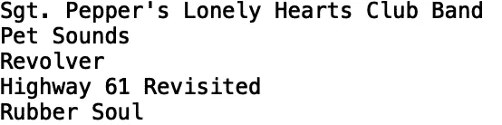
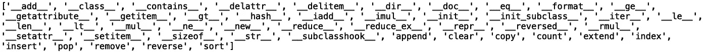
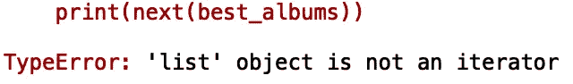
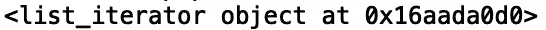
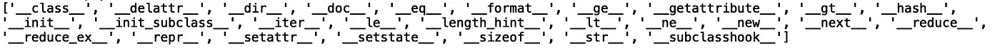
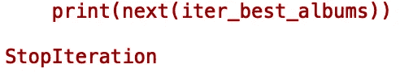

# Python 中的迭代器和可迭代对象

> 原文：<https://towardsdatascience.com/iterators-iterables-in-python-e713a55dfe1f?source=collection_archive---------22----------------------->

## 迭代器和可迭代对象简介


[来源](https://www.pexels.com/photo/iphone-desk-laptop-notebook-7100/)

在这篇文章中，我们将讨论 python 迭代器和可迭代对象。我们将回顾每个对象的定义，并努力理解每个对象背后的基本概念。

我们开始吧！

**Iterables** 是 python 中能够一次返回一个元素的对象。此外，这些对象有一个名为“__iter__()”的双下划线(也称为 *dunder* )方法，其中“__iter__()”方法返回一个迭代器(稍后将详细介绍)。列表就是 iterable 的一个例子。为了帮助我们理解列表作为可迭代对象意味着什么，让我们定义一个列表。让我们根据 [*滚石*](https://www.rollingstone.com/music/music-lists/500-greatest-albums-of-all-time-156826/the-beatles-rubber-soul-53553/) *:* 来定义一个包含有史以来最好的五张专辑的列表

```
best_albums = ["Sgt. Pepper’s Lonely Hearts Club Band", "Pet Sounds", "Revolver", "Highway 61 Revisited",  "Rubber Soul"]
```

我们对 iterables 定义的第一部分指出，它们允许我们一个接一个地返回它们的元素。让我们通过循环我们的列表来演示这一点:

```
for album in best_albums:
    print(album)
```



iterables 的这个特性非常明显。我们还指定了“__iter__()”方法，该方法也将 python 对象限定为可迭代对象。我们可以使用内置的“dir()”方法检查对象可用的方法和属性:

```
print(dir(best_albums))
```



我们可以看到“__iter__()”方法出现在对象的方法和属性列表中。一般来说，任何带有“__iter__()”方法的对象都可以循环。

此外，当我们在 iterables 上使用 for 循环时，我们调用“__iter__()”方法。当调用“__iter__()”方法时，它返回一个迭代器。

现在，让我们定义迭代器。

**迭代器**是有状态的对象，其中状态指定迭代期间的当前值。迭代器还有一个名为“__next__()”的 dunder 方法，允许我们访问后续值。如果我们查看列表的属性和方法，我们可以看到没有' __next__()'，这意味着列表不是迭代器。

我们可以通过尝试使用列表中的“下一个”方法来证明这一点:

```
print(next(best_albums))
```



我们得到一个错误，告诉我们列表对象不是迭代器。因为我们知道列表对象是可迭代的，这意味着它们有“__iter__()”方法，所以我们可以在列表上调用“__iter__()”来返回一个迭代器:

```
iter_best_albums = best_albums.__iter__()
```

定义迭代器的一种更简洁的等效方法如下:

```
iter_best_albums = iter(best_albums)
```

让我们打印我们的迭代器:

```
print(iter_best_albums)
```



我们看到我们的对象确实是一个迭代器。现在，让我们打印迭代器对象的属性和方法:

```
print(dir(iter_best_albums))
```



我们可以看到我们的迭代器对象有“__next__()”方法。让我们在迭代器上调用这个方法:

```
print(next(iter_best_albums))
print(next(iter_best_albums))
print(next(iter_best_albums))
```


我们可以看到，每次我们调用“next”时，我们的对象会记住它停止的地方,“next”方法会指向后续的值。让我们看看如果我们调用' next '直到用完所有值会发生什么。我们再打 6 次电话:

```
print(next(iter_best_albums))
print(next(iter_best_albums))
print(next(iter_best_albums))
print(next(iter_best_albums))
print(next(iter_best_albums))
print(next(iter_best_albums))
```



我们可以用“StopIteration”异常来处理此错误:

```
while True:
    try:
        element = next(iter_best_albums)
        print(element)
    except(StopIteration):
        break
```

我们得到的结果和之前循环链表得到的结果是一样的。当我们用 for 循环遍历列表时，这就是本质上发生的事情。

我就讲到这里，但是您可以自己随意摆弄代码。如果你有兴趣学习更多关于迭代器和可迭代对象的知识，科里·斯查费的 YouTube 教程是一个很好的资源。

## 结论

总之，在这篇文章中，我们讨论了 python 中的迭代和迭代器。Iterables 是具有方法“__iter__()”的对象，该方法返回迭代器对象。迭代器是具有方法' __next()__ '的对象，该方法允许我们访问后续值。此外，迭代器有关于迭代过程中状态的信息。简而言之，迭代器是 python 中每个 for 循环背后发生的事情。我希望你觉得这有用/有趣。这篇文章的代码可以在 [GitHub](https://github.com/spierre91/medium_code/tree/master/basic_python) 上找到。感谢您的阅读！