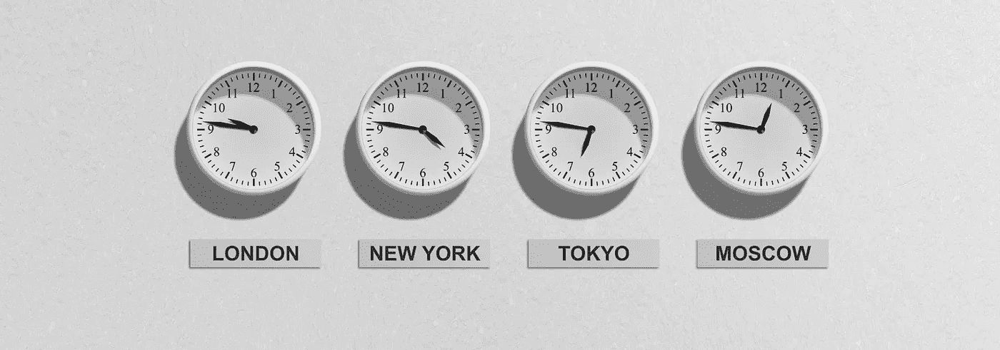
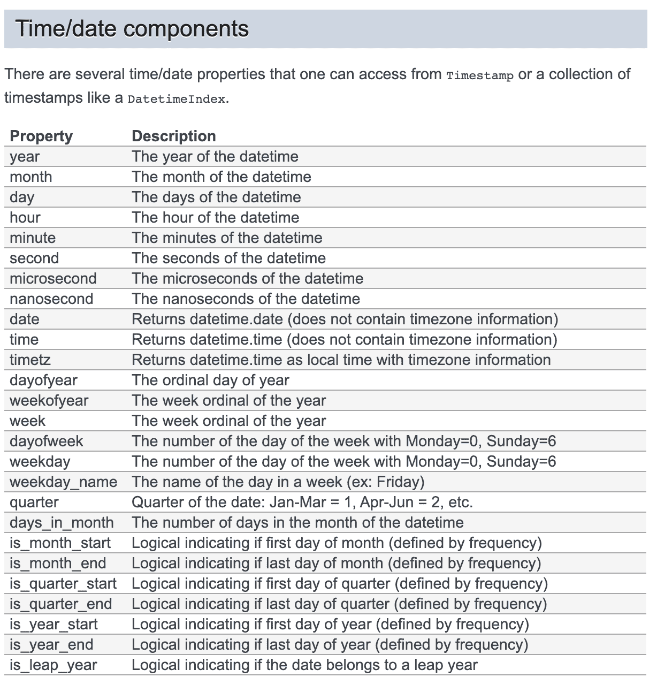
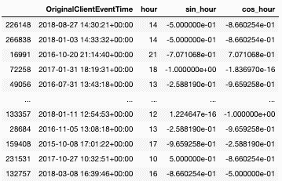
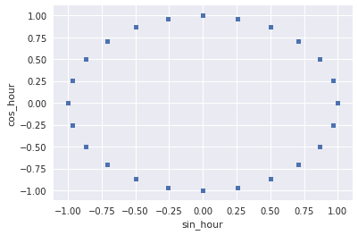

# 这是官方说法:时间不存在

> 原文：<https://towardsdatascience.com/its-official-time-doesn-t-exist-8c786530eca1?source=collection_archive---------1----------------------->



来源: [Pixabay](https://www.pexels.com/@pixabay) at Pexels —免费源图像

## 那么我们应该为 ML 模型提供什么样的时间特性呢？

*【****重要的*** *】:有些人离开文章时以为是关于物理的。如果您只对 ML 中关于如何处理时间特征的部分感兴趣，请随意跳过故事的第一部分，直接进入'* ***处理我们数据集*** *中的时间特征。*

12 月，我和女友回到了乌拉圭和阿根廷，我们来自那里。在那边，她的祖父，一个我个人觉得很迷人的人，向我推荐了一本书，告诉我这是他一生中读过的最难的书之一。让我解释一下:我们在谈论一个同时阅读两到三本书的超级聪明的人。他自己读的书可能比我们想象的要多。但事情并没有就此结束:在我们离开之前，他给我买了这本书，所以我在圣诞节前后离开了布宜诺斯艾利斯，手里拿着一本大约 150 页的书，书名是《时间的顺序》，作者是意大利物理学家卡尔罗·罗威利。

他让我一读完这本书就给他提意见，所以我就有意识地读了。我确保我已经理解了每一章，并且我突出了所有的书，以便在我读完之后再读一遍最重要的部分。我并不羞于大声说我不得不至少读两遍所有的章节来理解它们。这本书一开始就说，如果两个双胞胎兄弟十年后再次相遇，一个住在山里，另一个住在平原上，前者会更老，因为时间在山里过得更快，在平原上过得更慢。我的朋友们，这可不是童话:在离地心越近的地方，时间确实走得越慢。

简而言之，这本书解释了我们所知道的时间和我们已经学会理解的时间是不存在的。什么是真正的时间。从一个从大学生开始就研究这个课题的专业人士那里读到这一切，让我思考了很多东西。我不会用自我反省之类的想法来烦你，但这本书也让我想到了我们通常在机器学习和数据科学中使用时间的人。因为在他的书里，卡罗说时间本身什么都不是。我们所感知的时间是人类发明的，用来测量地球绕太阳一周需要多少时间。这种测量是通过我们发明的度量来完成的，比如秒、毫秒、小时、分钟等等。

鉴于此，对于一个不知道“分”或“秒”是什么概念，不知道今天是什么日子，更糟糕的是，不知道什么是“日”或“月”的人来说，说现在是晚上 22:48 根本不能说明什么。我知道你在想什么:那种人根本不存在。好吧，即使这是真的，猜猜谁不知道这些:你的机器学习算法。因此，我们处理时间数据并将其输入模型的方式是关键。

对于所有好奇的人来说，首先我要花几段时间对这本书做一个总结。如果你有足够的兴趣，请继续阅读。否则，你可以跳过它。然而，如果你读了它，你想了解更多，这是卡尔罗·罗威利 8 年前的 Ted 演讲，这本书在亚马逊只有大约 6 磅。

正如我之前所说，这本书指出我们所知的时间概念并不存在。我们用来衡量它的标准。它们不存在，因为在物理世界里它们不存在。世界的基本方程没有时间变量。确实存在的是一个物理时间，它的流逝不是均匀的，而是取决于许多因素。

这个物理时间似乎不是一个连续的时间，而是一个颗粒时间，在两个值之间跳跃，而不是流逝。一个特定值下的时间概念并不存在于它更基本的时间概念中。根据对物理时间的理解，在微观层面上，时间是由碰撞的原子组成的。分散在概率云中的原子，我们没有精确的方法知道它们会出现在哪里。它们出现了，并在概率足够高的地方发生碰撞。但是当它真的发生时，宇宙的那一部分会从某种特定的基本结构变成更复杂的结构。然而，这些允许那种微观事件的特殊结构，明确地依赖于我们对世界的模糊或未聚焦的视觉。但是这种不集中的视觉并不依赖于我们可能有的一些精神感知，相反，它是一种相对的属性。它是一个对象相对于另一个对象的属性。时间性的概念与这个模糊或不清晰的世界紧密相连，我们忽略了它最微观的细节。因此，这个物理时间最终是我们对世界无知的表现。

关于最后一个观点，理解它很有帮助，这一章谈到了一个事实，即猫不是宇宙元素的一部分。比这更复杂的东西，不断出现在我们星球的几个地方。同样的，在山顶，我们看到一个被蓝色的白云覆盖的山谷。如果我们爬山，当我们爬山时，云不再是白色的；我们发现自己在雾中。但这种变化不是瞬间的，而是渐进的。任何表面都会发生同样的情况。如果我们能把自己变得足够小，大理石桌子看起来就会像雾一样。在这些例子中，一个真实的东西出现了，一些我们能看到甚至有时能触摸到的东西。他们来自一个最基本的没有猫的世界。同理，时间产生于一个没有时间的世界。

这本书说，没有时间的世界只不过是一个相互关联的事件网络。没有时间并不意味着它是静止不动的。这意味着事情的发生不是按照线性时间线来排序的。如果到了时间，我们只理解发生的事情，那么一切都是时间。但同时，以我的理解，没有什么是太。或者至少，没有什么是过去，也没有什么是未来。在一个比我们所知和理解的要大得多的宇宙中，我们只是相互关联的事件中的一小部分。

我们所理解的过去和未来就在我们自己心中。我们是生活在我们大脑中的故事。从原子不断碰撞的足迹中画出的线条。允许我们预测未来事件的线。举个例子，一个扔给我的球朝哪个方向去，如何移动我们的手去抓住它。这个空间，我们的记忆，以及持续不断的预期实践，是我们对时间和自身感知的来源。

## 处理数据集中的时间要素

现在，正如我之前所说的，除了所有的自我反思和深刻的想法，所有这些都可以引发，让我们把它带到机器学习的世界。我们确实有预测事物的记忆，比如上面那个球的例子。我们确实知道一月之后是二月，去年是 2019 年，或者晚上 23:59 之后是哪一分钟。此外，就行业而言，我们的记忆让我们知道，例如，春天过后就是夏天，如果我在一家销售啤酒的公司工作，夏天对我们来说可能是一个季节，因此，我们应该会看到销售额的增长。在我工作的 Ravelin，我们可能知道对于某些行业来说，一天中的某些时间比其他时间更具欺骗性。然而，我们的机器学习模型并不知道所有这些。即使我们以一种一次性编码的方式输入一年中的月份，算法也不知道 12 月之后是 1 月。或者午夜过后，整点又从零开始。

那么我们应该如何对待时间戳呢？嗯，正如我不久前在一个 Stackoverflow 问题中读到的:

> 你并没有真正使用时间戳作为特征，因为它们在对看不见的数据进行分类时没有用。想象一下，用 2018 年获得的数据训练一个模型，并尝试对 2019 年的数据进行分类。信息不在日期上，而在其他特性的值上！

你能看出卡洛在他的书里所说的相似之处吗？在现实生活中，时间本身只不过是我们记忆中可能存在的给它提供上下文的参考，我们的机器学习模型也是如此。我们的时间特征只有在与一些其他日期相关时才有价值，这些日期可能与我们试图预测的任何事情相关。

根据这一点，以下值对于机器学习模型没有任何意义:

*   日期时间如:2019–12–24t 10:25:11.577 z，
*   或者像 1578830817 这样的时间戳

我们如何将这转化为对我们的算法有用的东西？首先，我们可以做一些简单的转换，让我们的模型更好地参考如何比较不同日期或时间戳发生的行或事件。例如，我们可以获得:

*   一年中的某月
*   一年中的某一天
*   一周中的某一天
*   一天中的某个小时
*   一天中的分钟
*   小时分钟

Pandas 为我们提供了一个整洁的表格，其中包含许多选项，来自于[其关于时间序列/日期功能的文档](https://pandas.pydata.org/pandas-docs/stable/user_guide/timeseries.html):



通过这样做，我们的模型将知道八月，一年中的第八个月，在七月之后九月之前。或者在 2020 年，5 月 9 日在 1 月 30 日之后 100 天，8 月 17 日之前 100 天。

我们甚至可以更进一步，做一些其他种类的事情。例如，我们可能知道圣诞节对我们的业务来说是一个合理的日期，事实上，我们的模型本身甚至可以发现像“2019–12–24 08:57:04.927”这样的日期在预测时会发生一些特殊/怪异/奇特的事情。但是，模型如何知道某个其他日期时间恰好在该日期时间的一天或二十四小时之后？我们需要让算法更容易理解这一点。为此，我们可以设置如下功能:

*   是圣诞节吗
*   自圣诞节以来的天数
*   圣诞节以来的几周

或者，如果我们是一家在线快递公司，并且我们知道我们一周中销售最强劲的时刻是周五晚上 20:30，我们可以创建如下功能:

*   离高峰还有几分钟
*   自高峰以来的分钟数

再一次，我们试图给我们的机器学习模型同样的背景，这要归功于我们的记忆和我们对时间的理解。然而，我知道你可能会想:好吧，酷，但是一旦我创建了这些特性，我该如何处理它们呢？因为我们会把时间戳转换成分类特征。因为我们在我之前的一个关于分类变量编码的故事中提到过，如果我们没有正确地处理这种特征，一些算法就不会特别喜欢处理这种特征。那我们该怎么办？

嗯，如前所述，我们不想做任何一次性编码或类似转换。如果我们这样做，我们将会失去特征连续性的任何价值。换句话说，该模型将停止识别诸如一年中的第六个月，即 6 月，在 5 月之后 7 月之前这样的事情。然而，让它们保持原样提出了另一个挑战:模型如何知道一旦 12 月结束，1 月又来了？或者在一天的第 23 个小时之后，它又从零开始了？

幸运的是，有一个非常简单的方法来解决这个问题:我们可以使用正弦和余弦变换，将每个变量转换为二维特征。我们来看一个例子。

假设您有一个包含“OriginalClientEventTime”功能的数据集。首先，您希望将特征的类型转换为熊猫日期时间，以便随后获得一天中的小时。您可以这样做:

```
train[‘OriginalClientEventTime’] = pd.to_datetime(train[‘OriginalClientEventTime’])train[‘hour’] = [x.hour for x in train[‘OriginalClientEventTime’]]
```

以类似的方式，您可以从 [Panda 关于时间序列/日期功能的文档](https://pandas.pydata.org/pandas-docs/stable/user_guide/timeseries.html)中获得上表中列出的任何属性。

一旦我们这样做了，这些功能将如下所示:


现在我们有了一天中的时间，我们可以将它转换成二维特征，以便模型能够获得原始的性质。我们只用两行代码就可以轻松做到这一点:

```
import numpy as nptrain[‘sin_hour’] = np.sin(2*np.pi*train.hour/24)train[‘cos_hour’] = np.cos(2*np.pi*train.hour/24)
```

这是我们的数据集现在使用新功能的情况:

train[[' originalclienteventime '，' hour '，' sin_hour '，' cos_hour']]



如果我们单独绘制正弦或余弦特征，我们不会注意到太多，但这是因为我们需要两个变量来捕捉特征的适当性质。现在看看当我们在 Y 轴和 X 轴上同时绘制两个特征时会发生什么:

```
train.plot.scatter(‘sin_hour’,’cos_hour’)
```



整洁，对不对？我们所知道的时间行为似乎反映在一个完美的圆圈中，这个圆圈在一天中的小时值之间循环。我们可以对任何其他时间特性做同样的事情！一年中的月份、一天中的分钟、一年中的某一天、圣诞节前的天数等。

正如我在评论罗维利的书时告诉我女朋友的祖父的那样，书中肯定有很多我不理解的东西。但我确实明白，如果我们能以某种方式记住过去的事情，并预测未来的事情，比如我应该把手移到哪里才能接住别人扔给我的球，这要归功于我们的记忆和我们建立的时间概念。一个由度量组成的时间概念，仅描述事件之间的距离，例如地球绕太阳旋转一周需要多长时间(顺便说一下，是 365.256 天)。

因此，如果我们想让我们的机器学习模型真正学习，让我们试着教它们我们自己随着时间的推移学到的东西。

好了，今天就到这里。请继续关注未来的故事，了解处理分类特征的其他技术。同时，这一年刚刚开始，你会在 2020 年找工作吗？好吧，那么你不能错过我关于获得第一份数据工作的实用技巧的故事。或者你还在寻找给自己的完美圣诞礼物？那就来看看这个关于[的故事 9 本数据科学相关书籍来读读](/9-data-science-related-books-to-ask-santa-for-christmas-37a1036478e9?source=friends_link&sk=089c71e8d8be1977dfe8a1b490501191)。如果这些都不是你的情况，请随时访问我在 Medium 上的个人资料，查看我的任何其他故事。

还有**如果你想直接在你的邮箱里收到我的最新文章，只需** [**订阅我的简讯**](https://gmail.us3.list-manage.com/subscribe?u=8190cded0d5e26657d9bc54d7&id=3e942158a2) **:)**

回头见！感谢您的阅读！