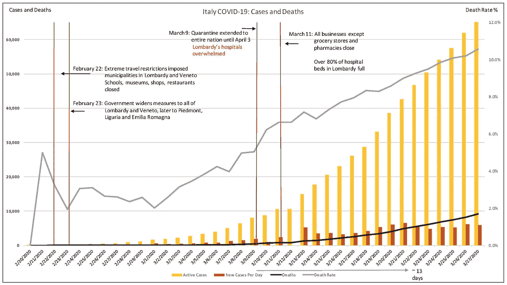
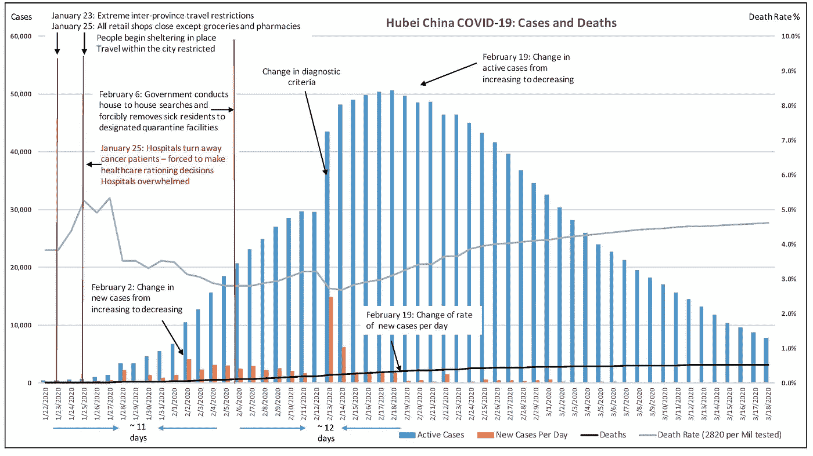
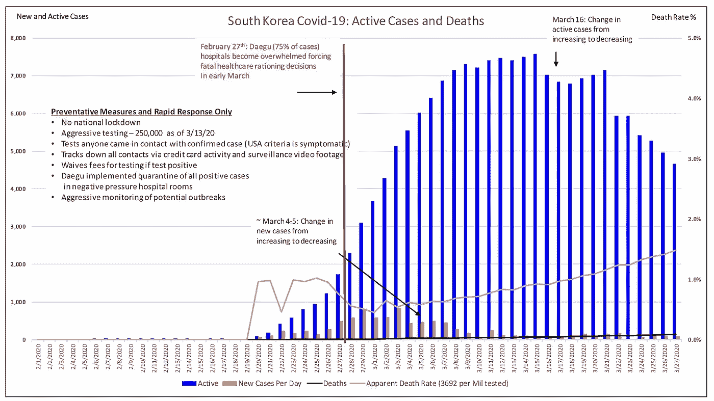
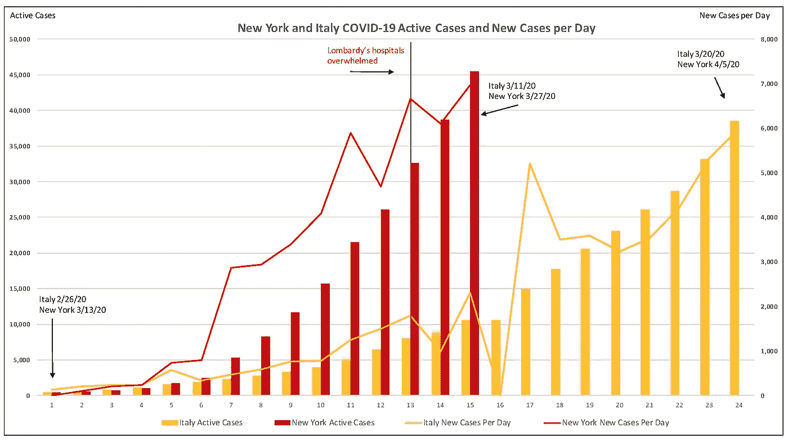
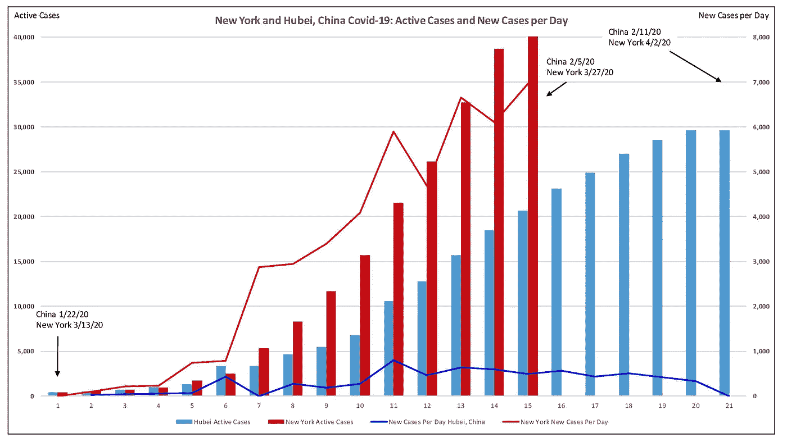
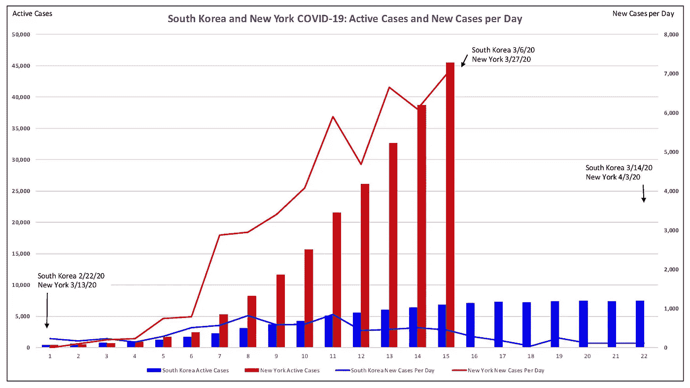
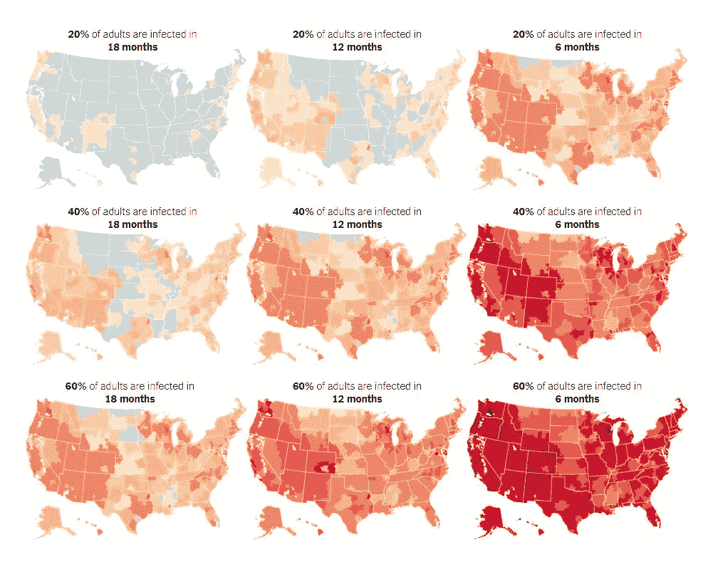

# 是时候为“冲击美国”做好准备了——全面审视新冠肺炎的数据显示，我们目前的措施是不够的

> 原文：<https://towardsdatascience.com/its-time-to-brace-for-impact-america-a-comprehensive-look-at-covid-19-in-italy-new-york-china-9e899464ef9?source=collection_archive---------23----------------------->

来自意大利、中国湖北省和韩国疫情的数据显示，从实施强有力的抑制措施开始，每天的新增病例数大约需要 11 到 12 天才能达到峰值，然后下降。在每日新增病例达到峰值后，大约需要 2 周时间才能看到活跃病例数达到峰值，然后开始下降。翻译一下——“使曲线变平”需要大约 26 天的时间，在实施严格和全面的措施阻止传播之前，第一天不会开始——我不是在说洗手和站在 6 英尺远的地方。在我们准备好启动*并充分利用全球正在使用的两个选项之一*(严格封锁，或积极检测和追踪)之前，美国人应该准备好看到病例继续增长。人口越密集的地区——T4 的增长可能越快。在这一后期阶段，许多州可能没有时间让医院做好充分准备，或采购拯救生命和避免第一波疫情中医疗配给所需的救生保护装置和设备。

让我们看看数据，好吗？

意大利新冠肺炎 2 月 20 日至 3 月 23 日的新增和活跃病例。活跃病例总数用黄色表示，每天新增病例用橙色表示，死亡病例用黑线表示。未校正的表观死亡率在右边的 Y 轴上用灰色表示。红色垂直线代表意大利实施各种缓解措施的日期，以及医疗配给报告开始的日期。数据来源:[https://github.com/CSSEGISandData/COVID-19](https://github.com/CSSEGISandData/COVID-19)

在意大利，活跃病例的峰值还没有达到，但 3 月 22 日和 23 日的数据表明，它可能最终会到来。3 月 21 日的数据似乎显示，截至 3 月 21 日，每日新增病例达到峰值。意大利增加了检测能力，从 3 月 24 日到 25 日的数字反映了这一点，但是新病例在 3 月 26 日又开始下降。高峰和低谷可能有一个区域组成部分——旧的爆发达到某种程度的控制，而新爆发的数字上升。

3 月 9 日和 11 日是在全国范围内实施重大减排措施的日子。来自湖北的数据表明，从大规模隔离开始，每天的新增病例可能需要 11-12 天才能达到峰值并开始下降，这将大约在 3 月 23 日或 24 日，数据显示目前情况是这样的。在湖北，每天新增病例数开始下降后，又过了 12 天，活跃病例数才开始下降。如果意大利的抑制措施同样有效，并保持到位，这可能意味着我们将在 4 月 5 日左右看到活跃病例的高峰。按照目前的病毒发展轨迹，在指数增长方程 A = A0ert 中简单应用一个缓慢的增长率(在此之前每天计算),表明到 4 月 5 日，意大利的病例总数可能达到 115，000 例左右，按照目前 9.9%的死亡率，这意味着总死亡人数接近 11，300 例。

一旦意大利超过 3 例确诊病例，他们马上开始有非常快速的指数增长，然而他们对当地疫情的反应也非常快。2 月 22 日，该国伦巴第地区只有 62 例病例，他们选择在伦巴第和威尼托地区实施严格的旅行限制——关闭学校、博物馆、商店和餐馆。第二天，病例激增至 155 例，政府将措施扩大到伦巴第和威尼托所有地区，后来包括皮埃蒙特、利古里亚和艾米利亚-罗马涅。到 17 天后的 3 月 9 日，病例数量飙升至 9172 例，促使政府将隔离范围扩大至全国，直至 4 月 3 日。3 月 11 日，全国关闭了除杂货店和药店以外的所有商店。到那时，伦巴第 80%的医院床位都满了，整个系统已经到了崩溃的边缘。

大约在 3 月 9 日，伦巴第的意大利医院因病人过多而不堪重负的报道开始出现，同时还有关于医院制定战场分流协议的报道。战场伤检分类简单地解释为这样一个原则，即接受救命治疗的病人是最有可能生存和康复的人，而不是最需要医疗的人。意大利的医生们不得不做出可怕的选择，定量分配有限的医疗用品和护理，这决定了 T2 的生死。

**中国湖北**

意大利新冠肺炎 2 月 20 日至 3 月 23 日的新增和活跃病例。活跃病例总数用黄色表示，每天新增病例用橙色表示，死亡病例用黑线表示。未校正的表观死亡率在右边的 Y 轴上用灰色表示。红色垂直线代表意大利实施各种缓解措施的日期，以及医疗配给报告开始的日期。数据来源:[https://github.com/CSSEGISandData/COVID-19](https://github.com/CSSEGISandData/COVID-19)

湖北的病例高峰出现在 444 例确诊病例后的 27 天左右，中国政府于 1 月 23 日对进出武汉实施了非常严格的限制。1 月 25 日，他们将隔离范围扩大到湖北省的 10 个城市，关闭了除杂货店和药店以外的所有零售商店，并要求人们待在家中，外出购买食物的时间受到限制。2 月 6 日，政府开始对任何有症状的人进行*挨家挨户的搜查*，这些人被 [*强行带离家园，带到指定的隔离设施*](https://www.nytimes.com/2020/02/06/world/asia/coronavirus-china.html) 。

即使实施了这些非常早期和极端的措施，他们的活跃病例曲线也非常清楚地显示了 11-12 天的滞后时间，直到每天的新病例达到峰值并开始下降。从首次发现该病毒到活跃病例达到高峰，仅持续了 27 天。这意味着湖北在大约 27 天内从 399 例活跃病例增加到 48，510 例。1 月 25 日，当医院被迫拒绝非冠状病毒患者时，首次报道了医疗配给。

2 月份的文章谈到了在高速公路边进行的测试和医院走廊两旁的病人——明确了最坏情况的形象。超过 3300 名医护人员受到感染，许多年轻和中年医生和护士在极端轮班时间和连续工作过多天没有休息以满足前所未有的危急护理需求后，死于疾病和疲惫。

**韩国**

意大利新冠肺炎 2 月 20 日至 3 月 23 日的新增和活跃病例。活跃病例总数用黄色表示，每天新增病例用橙色表示，死亡病例用黑线表示。未校正的表观死亡率在右边的 Y 轴上用灰色表示。红色垂直线代表意大利实施各种缓解措施的日期，以及医疗配给报告开始的日期。数据来源:[https://github.com/CSSEGISandData/COVID-19](https://github.com/CSSEGISandData/COVID-19)

韩国最初拒绝在以大邱为中心的疫情爆发的主要增长阶段实施地区或国家隔离或旅行限制，担心这些措施在政治上不受欢迎，并让人想起朝鲜的旅行限制——而是选择[建立积极的接触者追踪和检测](https://www.forbes.com/sites/carlieporterfield/2020/03/13/south-korea-sees-coronavirus-slowdown-without-a-lockdown-but-with-nearly-250000-tests/#4b756b78576b)，并对患者进行隔离。一旦检测结果呈阳性，政府就会积极寻求所有可能的接触者进行检测——包括患者认识的任何接触过的人，以及与此人的信用卡历史和监控录像相关的任何人。如果检测呈阳性，他们将免除检测费用，并继续对潜在疫情进行积极监测。

截至 3 月 17 日，该国已检测了超过 28 万人，相当于每百万人中有超过 5500 次检测。截至 3 月 10 日，该国出现了全国性的社区传播，春川市 Hallym 大学医学院教授 Kim Dong-hyun 博士表示，该市和该国很快将达到一个临界点，即没有足够的流行病学调查人员来有效追踪新病例，“在这一点上，追踪感染如何传播是没有意义的”。韩国公共卫生医生协会(Korean Association of Public Health Doctors)会长 Kim Hyeonggab 表示，截至 3 月 7 日，通过关闭学校、取消音乐会、确保更多医院床位以及“建立分流系统”，工作重点明显从遏制转向缓解。

与湖北相比，韩国最初的疫情总体数字较低，但与湖北类似，活跃病例的峰值仅出现在指数增长开始后的 26 天。这意味着该国在 26 天内从 399 例活跃病例增加到 7577 例。第一份关于医疗配给的报告来自大邱，超过 75%的病例集中在那里。此时，2 名冠状病毒患者在家中等待床位时死亡。根据 Kim Dong-hyun 博士的说法，虽然通过积极的检测和对病人的隔离来分离病毒对控制疫情是有效的，但全国范围内广泛的社区传播的发展很可能导致未来几周活跃病例的重新出现。截至 3 月 23 日，看起来积极的追踪可能导致一种形式的阶段性感染。

**纽约**

现在让我们来看看纽约州与意大利、中国和韩国相比的活跃案例的增长情况。纽约州是美国活跃病例指数曲线上进展最快的州，也是获得检测机会最多的州。我现在就告诉你，你不会喜欢的。

纽约和意大利新冠肺炎的活动案例(左侧 y 轴)和从那时起每天的新案例(右侧 y 轴)各有 400 多个记录在案的案例，这些案例用图表显示在一起，以便进行粗略的关联。纽约的数据跨度为 3 月 13 日至 4 月 2 日，意大利的数据跨度为 2 月 26 日至 3 月 20 日。纽约每天的活动案例总数用红色表示，意大利的案例用黄色表示。数据来源:【https://github.com/CSSEGISandData/COVID-19 

第一天代表每个地点大约有 400 多个病例的第一天，从那时起病例呈指数级增长。第 1 天和第 21 天显示的每个位置的实际数据日期。截至本文撰写之时(2020 年 3 月 24 日)，纽约已有 400 个案例的数据。黄色条表示意大利每天的活动案例。红色条表示纽约每天的活动案例。黄线表示意大利每天的新增病例，红线表示纽约每天的新增病例。以下两个图表显示了纽约和湖北的数据，湖北用蓝色表示，纽约和韩国的数据用深蓝色表示。

纽约州和湖北省新冠肺炎市的活动案例(左侧 y 轴)和自时间以来的每日新案例(右侧 y 轴)各有 400 多个记录在案的案例，这些案例用图表显示在一起，以便进行粗略的关联。纽约数据跨度为 3 月 13 日至 4 月 2 日，湖北数据跨度为 1 月 22 日至 2 月 11 日。纽约每天的总活动案例以红色显示，湖北的案例以蓝色显示。数据来源:【https://github.com/CSSEGISandData/COVID-19 

纽约州和南韩新冠肺炎的活动案例(左侧 y 轴)和自时间以来每天的新案例(右侧 y 轴)各有 400 多个记录在案的案例，这些案例用图表显示在一起，以便进行粗略的关联。纽约数据从 3 月 13 日持续到 4 月 2 日，韩国数据从 2 月 22 日持续到 3 月 14 日。纽约每天的活动和新病例总数用红色表示，韩国的病例用深蓝色表示。数据来源:[https://github.com/CSSEGISandData/COVID-19](https://github.com/CSSEGISandData/COVID-19)

从这些图表的第 1 天到第 12 天，纽约*每天新增病例数远远超过湖北、南韩和义大利。纽约州目前进行的人均测试是美国最多的，州长科莫估计他们每百万人的测试次数高于韩国——韩国在 3 月 17 日测试了大约[每百万人 5500 次](https://www.forbes.com/sites/niallmccarthy/2020/03/20/covid-19-the-us-still-trails-the-world-in-testing-infographic/#10fb8c7f4f9a)。这使得它成为试图预测影响的唯一可靠数据集。该州在短短 12 天内从 421 起案件增加到 26105 起。*

州长一直等到他们有超过 700 个案例关闭学校，8310 个案例关闭不必要的企业。居民们仍然被告知这不是一个就地避难的命令。他们使用意大利 3 月 25 日开始的增长率预测的数据估计，到 4 月 3 日，该州将有超过 150，000 例病例(见下图)。然而，纽约目前的活跃病例数和每天新增病例数都比意大利高得多，意大利在 12 天内就有 400 例。如果纽约州预计在 45 天内需要 37，000 个 ICU 床位，正如州长在 3 月 18 日报告的那样，15%的新冠肺炎病例需要紧急护理，那么纽约州预计在 45 天内大约有 250，000 个病例。这几乎是全球疫情中心湖北省病例数的 4 倍。州长表示，纽约目前在整个州有 3000 个 ICU 床位，其中 80%目前已被占用。

**茶叶建模**

以下数字并不意味着实际预测未来的确切病例，而是根据意大利的增长率在黑暗中尝试一种可能的情况——尽管直到 3 月 24 日，纽约的增长率要高得多。纽约的数据用红色绘制，条形表示已报告的活跃病例，直线表示增长率。纽约的建模数据以粉色条表示从 3 月 25 日到 4 月 3 日的未来几天。

来自纽约州、意大利、湖北和韩国的活动案例以多色条显示(纽约-红色/粉色、意大利-黄色、湖北-浅蓝色、韩国-深蓝色)，对应于左侧 y 轴(0 到 160，000 个案例)。对于尚未报告的数据，纽约的建模数据显示为粉红色。意大利(黄色)和纽约(红色)的增长率以直线绘制，对应于右侧的 y 轴(0-1.4)。增长率是指数增长方程 A=A0ert 中的变量 r。彩色竖线表示各国医院被报道不堪重负的日期。数据来源:[https://github.com/CSSEGISandData/COVID-19](https://github.com/CSSEGISandData/COVID-19)

意大利新冠肺炎 2 月 20 日至 3 月 23 日的新增和活跃病例。活跃病例总数用黄色表示，每天新增病例用橙色表示，死亡病例用黑线表示。未校正的表观死亡率在右边的 Y 轴上用灰色表示。红色垂直线代表意大利实施各种缓解措施的日期，以及医疗配给报告开始的日期。数据来源:【https://github.com/CSSEGISandData/COVID-19 

意大利新冠肺炎 2 月 20 日至 3 月 23 日的新增和活跃病例。活跃病例总数用黄色表示，每天新增病例用橙色表示，死亡病例用黑线表示。未校正的表观死亡率在右边的 Y 轴上用灰色表示。红色垂直线代表意大利实施各种缓解措施的日期，以及医疗配给报告开始的日期。数据来源:【https://github.com/CSSEGISandData/COVID-19 

如果来自中国和意大利的数据有任何意义的话，美国测试的最新发展和纽约缓解措施的最新应用已经导致了令人难以置信的感染率，这将对纽约应对严重病例的能力产生毁灭性影响，因为该市正在走向其活跃病例数的峰值。

怎么强调都不为过——中国、韩国和意大利迅速做出反应，实施了广泛的遏制措施。所采用的措施采用了两种不同的策略，但都是积极的。韩国对所有确诊病例进行了极端检测、追踪和隔离。在湖北省，他们实施了全面的旅行限制，停止了所有的公共交通，关闭了除杂货店和药店之外的所有企业，命令人们呆在家里，并将生病的公民转移到隔离设施 *。*意大利也实施了公共关闭，关闭学校和非必要的企业，命令公民留在家中。州长科莫可能试图复制韩国控制病毒的明显成功的测试计划，但除了高人均测试外，该县还隔离了所有患者，并进行了远比美国合法或可执行的更严格的接触者追踪。

**糟糕的数据意味着我们真的不知道真实的范围**

令人心碎的是，纽约也加入了意大利的行列，成为一个警示故事，但在这一点上，数据显示它确实如此。我们非常确定冠状病毒就在这里，它像野火一样在每个社区传播。由于缺乏测试，我们没有准确的国家数据来真正掌握截至 3 月 24 日新冠肺炎在美国纽约州以外的规模。病例的指数增长速度，加上缺乏检测途径和检测处理滞后，意味着报告的病例实际上远远高于报告的病例，因为*不管我们确认与否，未受抑制的增长仍在发生*。例如，一周多前，田纳西州默弗里斯伯勒一个呼叫中心的 1500 名员工可能暴露于某个有症状确诊病例的人的病毒。这意味着暴露可能在阳性病例出现症状前一周或更长时间就开始了。只有一两个呼叫中心的其他员工接受了测试，与此同时，那里的所有员工都在继续他们的日常工作——与家人互动、购物、去教堂做礼拜。据估计，韩国一名妇女通过她的教堂与 1100 多人接触，引发了大邱的严重疫情。你能想象呼叫中心地区真正爆发的可能范围吗？然而，像大多数其他州一样，只有最严重的病例在田纳西州接受测试。底线是，我们无法确切知道有多少人实际上被感染了，而这一明显较低的病例数可能会诱使我们放慢行动。

领导层未能迅速果断地采取行动

面临的主要问题是领导层决策的滞后，这些决策有效地限制了传播，并解决了未来对重症监护能力的需求。在这一点上，美国已经发布公共留在家中命令的各州在达到伦巴第或湖北政府封锁这些地区时的病例数量后很久才发布命令，有些州根本没有发布命令。不，其他州不太可能有像纽约一样多的病例——毫无疑问，由于人口密度和控制延误，他们可能是世界上受打击最严重的州。然而，如果不及早采取措施来减缓在 T2 出现的指数式增长，世界各地的每一次爆发都会在中国的每一个主要人口中心上演类似的场景。农村人口不会被排除在外——虽然人口密度降低和暴露程度降低可能导致农村总体病例减少，但农村医院普遍关闭将导致这些人口难以获得足够的护理。

对于像先发制人的社会隔离这样的遏制措施的缓慢实施，以及像建设额外的紧急 ICU 容量和[使用生产法案来帮助解决预期的防护设备](https://www.wsj.com/articles/administration-to-use-defense-production-act-for-first-time-in-coronavirus-pandemic-11585058618)、呼吸机和呼吸器的短缺这样的缓解措施，这是一个非常值得警惕的故事。如果美国要实施这项法律来防止成千上万不必要的死亡，那么当我们看到意大利不堪重负的医院系统的影响时，就应该迅速果断地实施。改变制造设备和获得供应材料的时间不会在一夜之间发生，虽然它目前甚至不在桌面上，但对第一波流行病来说可能已经太晚了。

总统没有迅速采取行动允许私人测试开发，结果美国测试系统仍然被堵塞，严重不足。他没有发起足够强大的全国性回应来阻止传播，而是继续助长混乱和[不和](https://www.politico.com/states/new-york/albany/story/2020/03/24/cuomo-to-trump-administration-you-pick-the-26k-people-who-are-going-to-die-1268833)，[发表声明和政策](https://www.wsj.com/articles/trump-hopes-to-have-u-s-reopened-by-easter-despite-health-experts-guidance-11585073462)，淡化世界各地顶级医疗顾问统一给出的建议。从所有明显的证据来看，各州没有实施任何有意义的策略来为即将到来的危急情况做准备，而是独自处理阻止传播和照顾病人的问题。迄今为止，这导致了不同的反应速度和严格程度。

美国的医院短缺会是什么样子？

《纽约时报》发表了一份由哈佛大学哈佛全球健康研究所制作的分析报告，下图显示了如果不扩大目前的容量，医院短缺的规模。根据分析，如果 40%的成年人在未来 12 个月内被感染，那么 40%的医院市场将无法扩大足够的能力来治疗新冠肺炎患者。进行分析的团队称 40%的感染率为中度，但他们的估计表明感染率可能会高得多，甚至超过医院通过取消选择性手术和让不太危急的病人回家等措施可以产生的过剩能力。“如果我们不在长期传播疾病和扩大容量方面做出实质性改变，我们将耗尽医院的床位，”哈佛全球卫生研究所所长 Ashish Jha 博士说。在意大利，这导致了前面提到的医疗保健配给，如果医生被迫制定战场分流协议，将对弱势群体和老年人以及患有其他疾病的患者产生影响。

图片来源:[https://www . nytimes . com/interactive/2020/03/17/upshot/hospital-bed-abstraits-coronavirus . html](https://www.nytimes.com/interactive/2020/03/17/upshot/hospital-bed-shortages-coronavirus.html)

**来自其他状态的数据**

以下是 11 个州的表格，摘自约翰霍普金斯大学在 github source 上停止按州报告数据之前 3 月 23 日的美国总数据。该表显示了每天的活跃案件，以及各州或其他市颁布的抑制措施。浅蓝色单元格显示的是湖北省发布停业和居家禁止令的最接近案例数(444)，浅黄色单元格显示的是伦巴第发布停业和居家禁止令的案例数(62)。亮蓝色表示全州范围的居家命令，橙色表示仅选择主要城市和/或县发布居家命令，浅绿色表示较弱的命令，仅建议但不要求居民居家。该表还假设实际上已知活动案例的数量，然而事实远非如此。正如你所看到的，许多州直到比意大利或中国更深入地了解了其新生的流行病后才颁布这些控制措施。

11 个州的现行案例表，列出了颁布抑制措施的日期，并与湖北和意大利颁布居家禁止令和非必要停业的案例数进行了比较。数据来源:【https://coronavirus.jhu.edu/map.html 

以下三个表格显示了每天计算的死亡率、生长率和倍增时间，试图确定一种趋势。死亡率就是死亡人数除以总病例数。死亡率通常是追溯计算的，因为在任何给定的时间，我们可能不知道总病例的实际数目。迄今为止，这些州中的许多州死亡率都很低，其中佐治亚州、路易斯安那州和华盛顿州最高。虽然病例总数仍然相对较低，而且在检测的前几周内，但应谨慎对待这些数字。它们也可能受到其他因素的严重影响，例如疫情是否发生在更脆弱的人群中——就像华盛顿州疗养院疫情那样。

各州未校正的表观死亡率表，按死亡数/总病例数计算。原始数据来源:【https://coronavirus.jhu.edu/map.html】T4。由于缺乏测试来了解以脆弱人群为中心的病例和疫情的实际总数，死亡率可能会更高。

根据等式 A=A0ert 每天计算的增长率表，其中 A0 是一天的病例总数，A 是第二天的病例总数，e 是欧拉数，t 是时间。原始数据来源:[https://coronavirus.jhu.edu/map.html](https://coronavirus.jhu.edu/map.html)

根据等式 A=A0ert 每天计算的增长率表，其中 A0 是一天的病例总数，A 是第二天的病例总数，e 是欧拉数，t 是时间。原始数据来源:[https://coronavirus.jhu.edu/map.html](https://coronavirus.jhu.edu/map.html)

显示增长率的第二个表格试图捕捉数字增长的速度。增长率是基本指数增长计算中的变量“r”。每天使用前一天(A0)到当天(A)的总病例数计算这些值。在意大利和湖北的数据中，高于 0.2 的数字出现在快速指数增长期间，而低于 0.1 的数字出现在这些地区经历新病例快速下降时。

最后，最后一个表格显示了一些文章引用的一个数字，即倍增时间。翻倍时间是总病例数以当前增长率翻倍之前的天数。这是通过等式 ln(2)*r 计算的，其中 r 是增长率。倍增时间是一种更直观的衡量流行病增长速度的方法——人类可以用天数来表示，而增长率是一个更抽象的数字。该表显示，倍增时间每天都在变化，但仍然相对较低，倍增时间越短意味着病例增长越快。这些数字对*任何*的持续限制是缺乏全面的测试。缺乏测试可能会导致重大错误，即*低估了一个地区正在经历的实际增长和翻倍时间*。

曲线变平后会发生什么？

伦敦帝国理工学院新冠肺炎反应小组发布的一份报告称，如果像居家命令和企业关闭这样的抑制措施在短期内成功，但没有有效和广泛使用的疫苗，这些抑制措施的放松将导致今年晚些时候出现相同或更大的疫情，因为“群体免疫”的建立不足。群体免疫是对传染病在人群中传播的抵抗力，如果足够高比例的个体具有免疫力，就会产生这种抵抗力。

这对领导人来说意味着，抑制新冠肺炎的传播需要通过社会措施来管理，要么 1)持续保持呆在家里的命令，2)像韩国那样组织一个资源充足、100%充分的检测、追踪和隔离计划，或者 3)制定一个间歇性社会距离的有意循环。为了实现这一目标，我们有意放松抑制传播的居家和企业关闭令，以允许控制感染模式*，这种模式永远不会超过我们通过充分的医疗护理有效应对的能力*，直到疫苗可用。在这 3 个中，迄今为止只有前 2 个被建模。

对大多数美国人来说，接下来的几天将是暴跌前的深呼吸。截至 3 月 24 日的数据显示，对大多数州来说，要安然无恙地度过这一阶段为时已晚。但是数据显示，可能需要 27 天左右的时间才能使曲线变平，因为 T2 发布了强劲的留在国内订单，并且保持在 T3。成千上万人的生命——包括我们医疗服务提供者的生命——现在取决于国家领导人在未来几天是否会响应日益增长的领导呼声。

**为了保护自己的公民，每个国家都必须颁布以下措施:**

**1)** 立即关闭非必要业务。

立即发布并执行留在家中的命令。

**3)** 与该州的当地医院领导合作，构建一个现实的模型来计算可能需要的医院容量和达到需求峰值的时间。

**4)** 协助医院为提供者获取救生急救设备和 PPE。

**5)** 与州医疗和/或医院协会合作，为即将到来的医疗提供者和肺病专家的短缺做好准备。

**6)** 帮助重要企业获得必要的个人防护设备(PPE)以保证员工的安全。

**a.** 建议杂货商、药店、饲料商店和其他重要企业现在就开始准备个人防护设备，并制定在疫情高峰期开展工作的协议。

**b.** 考虑发布一份与美国疾病预防控制中心或州医疗领导指南合作制作的标准化指南。

启动国民警卫队:

**a.** 根据能力不足的情况，开始为急病患者建造临时医院或准备现有医院，包括将服务扩展到农村地区。

一旦测试变得广泛可用，将有助于减轻医院的压力。随着病例的增加，需求将会显著增加。

**c.** 帮助高危人群获取食物和药品。

**d.** 在有疫苗时，帮助接种疫苗

**8)** 大幅提高信息热线的现场呼叫能力，推送以下方面的最新详细信息:

**答:**去哪里做测试

**b.** 国家颁布的现行指南

**c.** 关于人们在哪里可以获得食物、药品、宠物用品和儿童用品等必需品的信息。

**9)** 与商会和其他商业实体合作:

**a.** 鼓励对长期远程业务运营进行物流规划，以尽可能保持商业运作。这将减少因疾病导致的生产力损失和因检疫限制导致的运营能力下降，并有助于保持该州的经济运行。企业在规划中花费的准备时间越多，这种转变就会越顺利。这是促进快速和广泛创新，阻止一切照旧的时候了。

**b.** 鼓励电信提供商迅速满足对额外网络和远程通信能力的需求。

**10)** 制定一个短期和长期计划，为州居民提供财政救济，使他们能够:

维持住房和水电等基本服务。

b. 购买基本商品，如食品、个人和儿童护理用品、药品和动物饲料。

**11)** 制定一个现实的、分阶段的长期计划，以指导企业、学区和公众放松社会封锁指导方针，避免连续爆发疫情，并根据该计划继续执行封锁和居家命令。

**行动号召**

此时此刻，我向美国的每一个人发出这一呼吁。各级领导——做你被选举出来要做的事情，并领导别人。不要再等着看问题在你那里显现了——数据已经被很好地确定了，医学界正在用一个声音说话。越早实施全面的控制措施，病例高峰就越早到来。

公民们，我现在呼吁成为人类的代言人——是时候让人们停止坐以待毙，从你们在这个系统中的任何地方开始带头了。像淹没卫生纸通道一样，给当地媒体、城市、县、州和联邦代表打电话——要求他们发布居家订单，并提出快速和全面的解决方案，以满足现在对医疗、金融和物流解决方案的需求。为了你的家人、你的社区和你的国家的健康。潮水退去时，我们正坐在沙滩上——很快，潮水就会淹没我们。现在的行动可以拯救无数的生命。我强烈要求你服用它们。