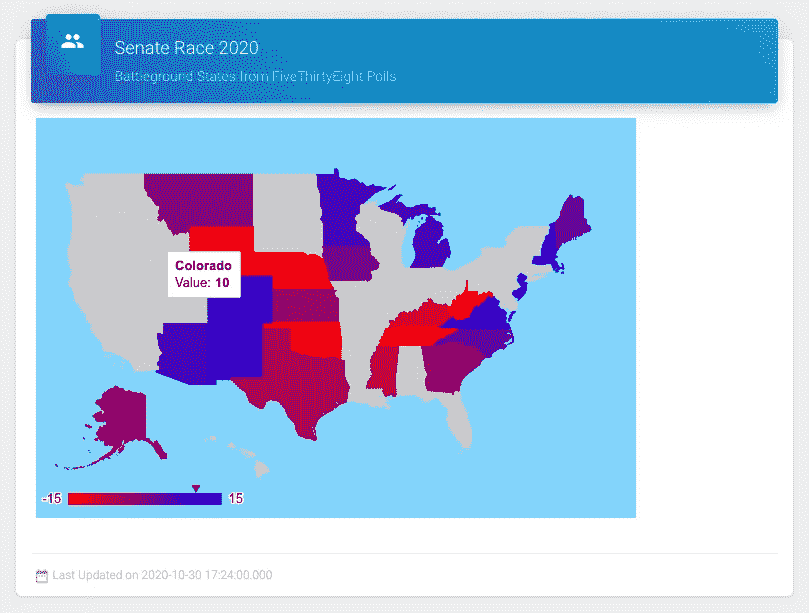
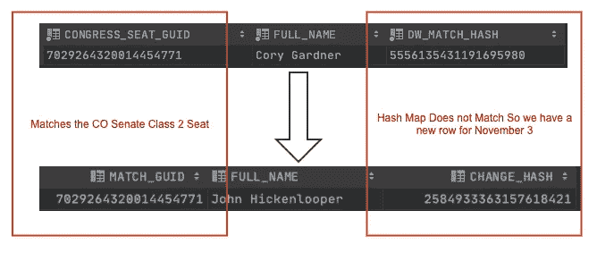
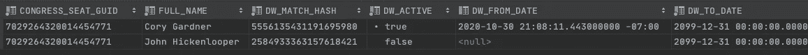
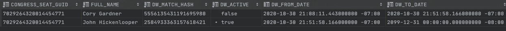

# 是时候改变维度了

> 原文：<https://towardsdatascience.com/its-time-to-change-dimensions-be3302893dd6?source=collection_archive---------33----------------------->


安东尼·加兰在 [Unsplash](https://unsplash.com/s/photos/constitution?utm_source=unsplash&utm_medium=referral&utm_content=creditCopyText) 上的照片

任何事物都有一个季节，每个目的都有一个时间…让我们用一个缓慢变化的维度(SCD)来记录这些变化。

缓变维度是什么？这是一个随着时间逐渐变化的表，就像一组当选的官员。假设我们将下面一组美国参议员加载到数据库中。

[https://the United States . io/congress-立法者/立法者-current.csv](https://theunitedstates.io/congress-legislators/legislators-current.csv)

尽管许多人已经在位很长时间，但有些人即将改变。根据我们的宪法第一条，第三节，第二款，这些参议员的三分之一将受到改变。

> [合众国参议院]在第一次选举结果产生后，应立即尽可能平等地分成三个等级。第一等参议员的席位应在第二年期满时空出，第二等参议员的席位在第四年期满时空出，第三等参议员的席位在第六年期满时空出，以便每隔一年选出三分之一的参议员

有许多方法可以实现渐变维度。保持一个简单的模式可以简化你决定如何改变的过程。

确定标识唯一行的列以及要跟踪的列。

例如，我希望每个州和每个阶层都有一个独特的参议员。州参议员没有阶级重叠，因此在一个特定的州的选举周期中只有一个人可以参加选举。目前，格鲁吉亚是个例外，但我们不会深入探讨。

假设我们已经将上述 CSV 文件的原始数据存放到一个表中。为了将原始数据处理到当前参议院的表中，我们将行插入到一个维度表中。

注意，我已经将惟一的行标识为我的 MATCH_GUID，将 CHANGE_HASH 标识为 H as 值。我使用散列来最小化 SQL 上的 CPU 处理时间。

MATCH_GUID 对行中的所有更改进行编码，如果有任何更改，它将使用新记录更新维度。

```
insert into OWLMTN.WAREHOUSE.DIM_CONGRESS_SEAT(CONGRESS_SEAT_GUID,
                                               LAST_NAME,
                                               FIRST_NAME,
                                               FULL_NAME,
                                               BIRTHDAY,
                                               GENDER,
                                               TYPE,
                                               STATE,
                                               DISTRICT,
                                               SENATE_CLASS,
                                               PARTY,
                                               ADDRESS,
                                               PHONE,
                                               CONTACT_FORM,
                                               DW_MATCH_HASH)
with source as (
    SELECT hash(STATE,
                SENATE_CLASS)    MATCH_GUID,
           LAST_NAME,
           FIRST_NAME,
           FULL_NAME,
           BIRTHDAY,
           GENDER,
           TYPE,
           STATE,
           DISTRICT,
           SENATE_CLASS,
           PARTY,
           ADDRESS,
           PHONE,
           CONTACT_FORM,

           hash(
                   LAST_NAME,
                   FIRST_NAME,
                   FULL_NAME,
                   BIRTHDAY,
                   GENDER,
                   TYPE,
                   DISTRICT,
                   PARTY,
                   ADDRESS,
                   PHONE,
                   CONTACT_FORM) CHANGE_HASH
    from OWLMTN.STAGE.CONGRESS_MEMBERS sor
    where type = 'sen'
),
     target as (
         select CONGRESS_SEAT_GUID,
                DW_MATCH_HASH match_hash
         from OWLMTN.WAREHOUSE.DIM_CONGRESS_SEAT tar
         where DW_ACTIVE = 'T'
     )
select source.MATCH_GUID,
       source.LAST_NAME,
       source.FIRST_NAME,
       source.FULL_NAME,
       source.BIRTHDAY,
       source.GENDER,
       source.TYPE,
       source.STATE,
       source.DISTRICT,
       source.SENATE_CLASS,
       source.PARTY,
       source.ADDRESS,
       source.PHONE,
       source.CONTACT_FORM,
       source.CHANGE_HASH
from source
         left outer join target
                         on target.CONGRESS_SEAT_GUID = source.MATCH_GUID
where target.match_hash is null
   or target.match_hash <> source.CHANGE_HASH;
```

更新查询将找到任何新行，并将它们标记为活动的。

```
-- Arrange the dimensions on the SCD.
update OWLMTN.WAREHOUSE.DIM_CONGRESS_SEAT new_data
    set new_data.DW_ACTIVE = update_logic.DW_ACTIVE,
        new_data.DW_FROM_DATE = update_logic.new_from_dw_date,
        new_data.DW_TO_DATE = update_logic.new_to_dw_date,
        DW_UPDATE_DATE = current_timestamp()
from (

    with updated_gui as (
        select DIM_CONGRESS_SEAT_KEY, CONGRESS_SEAT_GUID
        from OWLMTN.WAREHOUSE.DIM_CONGRESS_SEAT
        where dw_from_date is null
        )
    select current_row.DIM_CONGRESS_SEAT_KEY,
           current_row.dw_active as old_active,
           case when current_row.DW_FROM_DATE is null
               then TRUE
               else FALSE end as DW_ACTIVE,

           current_row.DW_FROM_DATE,
            case when current_row.DW_FROM_DATE is null
               then CURRENT_TIMESTAMP()
               else current_row.DW_FROM_DATE end as new_from_dw_date,

           current_row.DW_TO_DATE,

           case when current_row.DW_FROM_DATE is null
                 then to_timestamp_ltz('2099-12-31 00:00:00')
               else CURRENT_TIMESTAMP() end as new_to_dw_date,
           current_row.DW_MATCH_HASH
        from updated_gui
        inner join OWLMTN.WAREHOUSE.DIM_CONGRESS_SEAT current_row
            on updated_gui.CONGRESS_SEAT_GUID = current_row.CONGRESS_SEAT_GUID
                   and (DW_FROM_DATE is NULL or current_row.DW_ACTIVE=TRUE)
        left outer join OWLMTN.WAREHOUSE.DIM_CONGRESS_SEAT old
            on current_row.CONGRESS_SEAT_GUID = old.CONGRESS_SEAT_GUID
                   and old.dw_ACTIVE

      ) update_logic
where new_data.DIM_CONGRESS_SEAT_KEY = update_logic.DIM_CONGRESS_SEAT_KEY;
```

那么 11 月 3 日之后会发生什么，座位状态有变化？让我们追踪一下我最喜欢的科罗拉多州的选举，假设一下席位的变化。

根据 [Azri.us 上的数据预测，](https://azri.us/)希肯卢珀比目前占据席位的加德纳多 10 个百分点的优势。



图片由 Google GeoChart 基于 538 个原始数据制作

查看前面的插入查询中的散列比较，我们看到 MATCH_GUID 保持不变(相同的席位)，但是 CHANGE_HASH 发生了变化(新参议员)。



SCD 哈希匹配策略

在 insert 检测到一个已更改的记录后，它还不是活动的，我们需要以一种事务方式激活该记录，当新行替换旧记录时，将旧记录设置为非活动的。



运行移动当前活动行上的日期的查询会将非活动行移动到活动行。



对于给定时间点的任何查询，声明为 unique 的项将始终返回一行。

如果我想知道在特定时间谁是科罗拉多州 2 级参议员，我可以指定时间，它永远不会改变。

请注意，DW_FROM_DATE 小于该日期，而 DW_TO_DATE 大于或等于该日期。

```
select CONGRESS_SEAT_GUID, FULL_NAME, DW_MATCH_HASH, DW_ACTIVE, DW_FROM_DATE, DW_TO_DATE
from owlmtn.WAREHOUSE.DIM_CONGRESS_SEAT
where state = 'CO' and SENATE_CLASS = 2
  and DW_FROM_DATE < '2020-10-30 21:51:58.166000000 -07:00'
  and DW_TO_DATE >= '2020-10-30 21:51:58.166000000 -07:00';
```

# 结论

缓慢变化的维度表是数据仓库的基础。它允许分析师跟踪趋势，查看历史，并遵守保存所有数据的原则。

一些 SQL 结构可能比较复杂，一些数据库本身就支持 SCD。然而，使用基本的 SQL SCD 模式将使您的代码具有可移植性和清晰性。