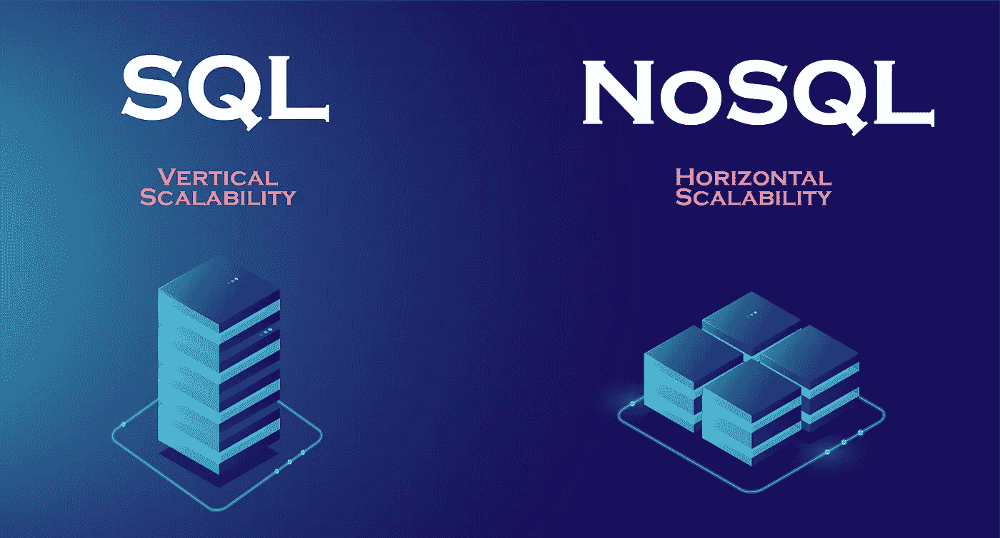
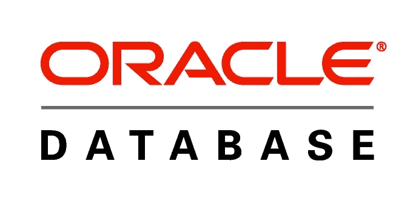
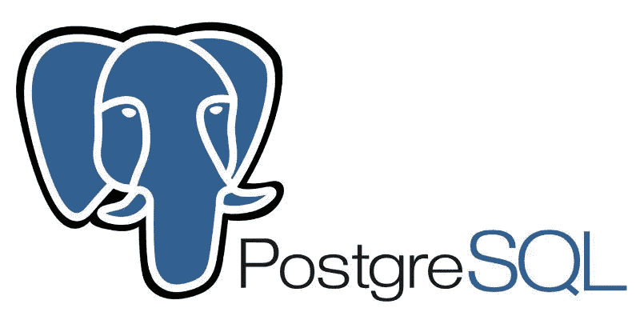
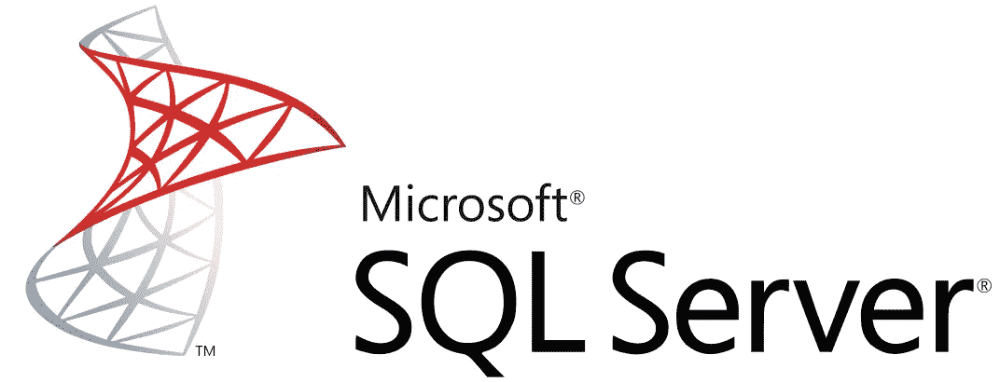
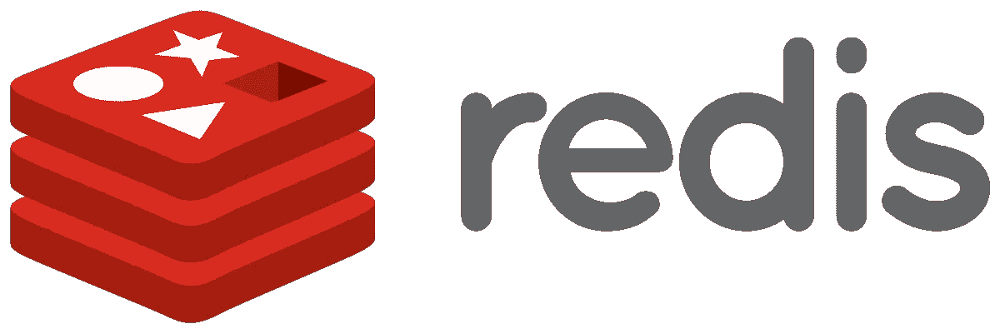
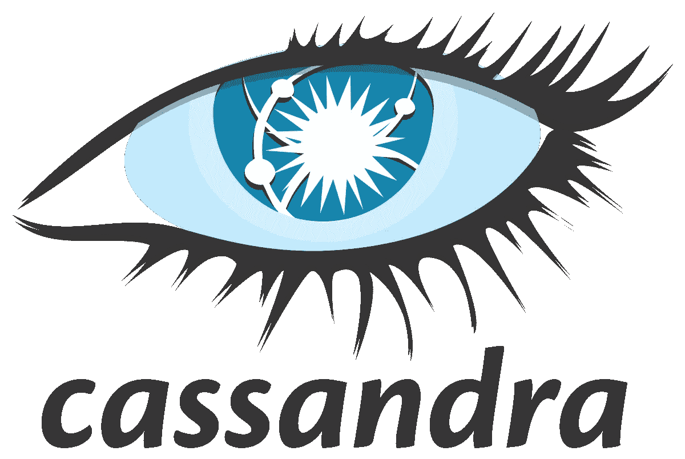
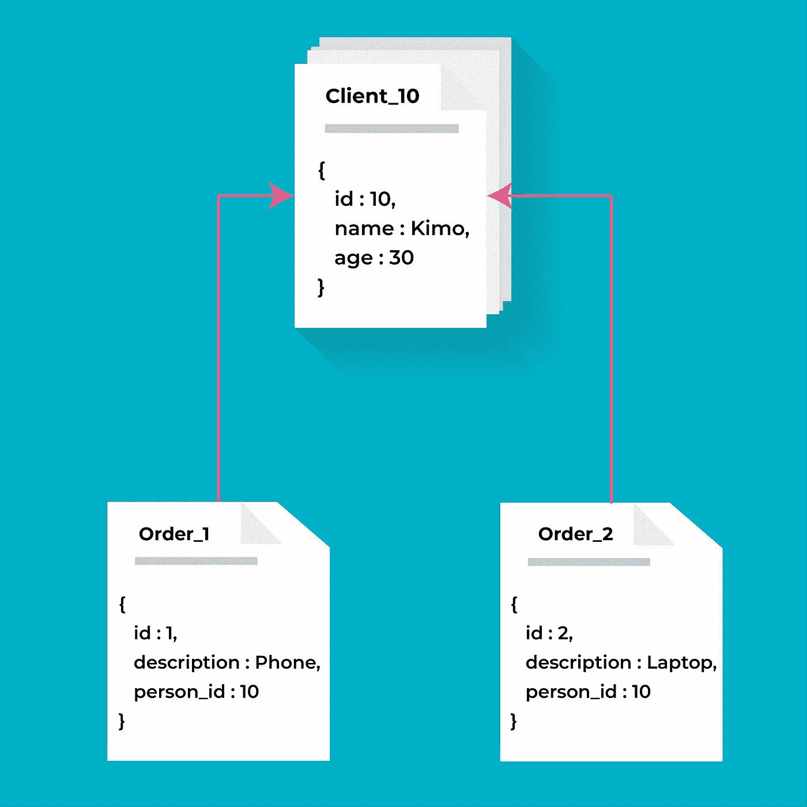
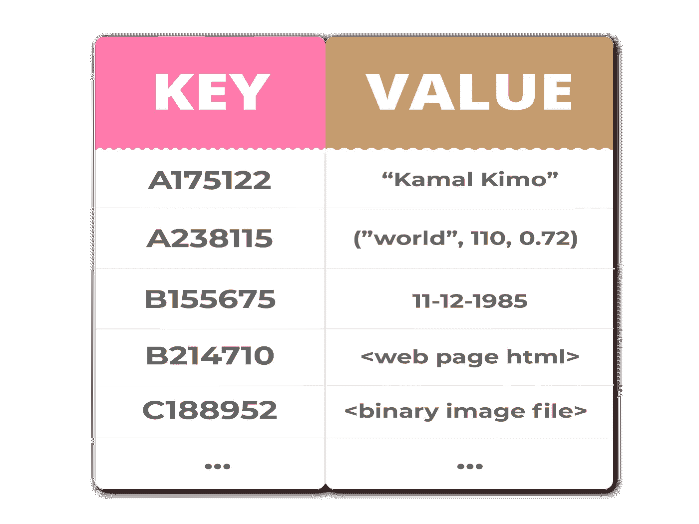
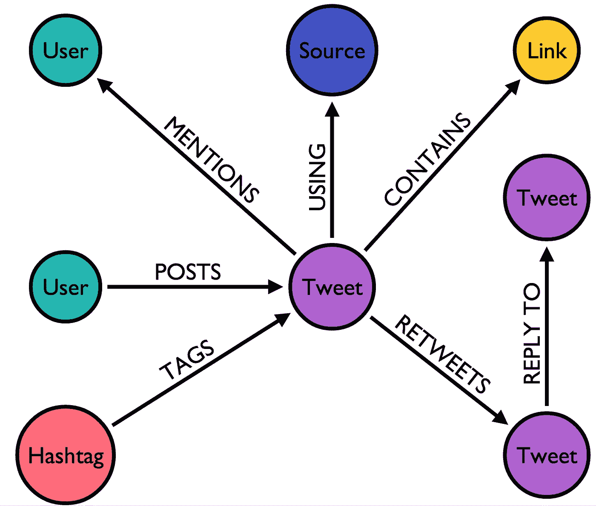

# 是时候让自己比以往更熟悉 NoSQL 数据库了

> 原文：<https://towardsdatascience.com/its-time-to-familiarize-yourself-with-nosql-databases-more-than-ever-5fb1f65c22b1?source=collection_archive---------9----------------------->

## SQL 与 NoSQL:选择合适的数据库的困难(以及如何做好)

[万花筒](https://unsplash.com/@kaleidico?utm_source=unsplash&utm_medium=referral&utm_content=creditCopyText)在 [Unsplash](https://unsplash.com/s/photos/data?utm_source=unsplash&utm_medium=referral&utm_content=creditCopyText) 上拍摄的照片

数据是信息系统的核心。其组织和运作的效率是任何公司都关心的主要问题。在**大数据**的时候，业务专长和了解现有的技术解决方案是非常必要的。技术领域发展非常迅速，公司必须同时继续评估和选择能够满足其未来需求并支持其发展的数据库。

几十年来，关系数据库一直被用来存储数据，对于许多用例来说，它们仍然是一种可行的解决方案。NoSQL 数据库是为了应对关系数据库技术的局限性而创建的。与关系数据库相比， **NoSQL** 数据库更具伸缩性，提供更高的性能，它们的数据模型纠正了关系模型的几个弱点。在本文中，我将尝试阐明从 **RDBMS** 迁移到 **NoSQL** 的挑战、好处和过程。

总的来说， **NoSQL** 数据库旨在解决**大数据**环境下的海量、多源、多格式的数据处理问题。它们提供了一种新的方法来满足容量需求
和新的数据类型。

如今，NoSQL 数据库的数量变得越来越重要。必须了解它们的差异，以便为正确的应用采用正确的技术。

# 1.介绍

## - SQL:

**SQL** 是 ***S*** *结构化****Q****uery****L****语言*。长期以来，所有必须在大型关系数据库 **(DBMS)** 中快速搜索信息的 It 工程师都知道这一点。 **SQL** 如今被广泛使用，因为它是结构化程度最高、速度最快的数据库组织和查询设备之一；它有不同的名字，这表明有各种各样的适应，如甲骨文的 MySQL 和微软的 SQL Server。此外， **SQL** 由于其预定义的结构和模式，是许多公司最推荐的选项。

## **——NoSQL:**

首字母缩略词**“NoSQL”**有两种解释，目前并不明确:

*   有的则是 ***【无 SQL】***，也就是说使用另一种不同于 **SQL** 的查询语言。
*   对于其他人来说，就是 ***【不仅仅是 SQL】***，也就是说 **SQL** 与其他信息检索工具的结合使用。

因此，这个术语既与技术特征有关，也与出现在 2010 年前后的历史性一代数据库管理系统有关。导致发明 **NoSQL** 的主要问题是解决网站上的同一个数据库可以被全球数百万用户同时使用的事实；像亚马逊这样的公司的典型问题…

因此，我们试图用 **NoSQL** 实现的是降低查询语言的复杂性，简化数据库的架构。这些数据库由*面向列的*、*面向文档的*、*面向图形的*和*面向键/值的*数据组成。 **NoSQL** 系列由各种产品组成，每种产品都有一套独特的功能。

## -主要区别:

*   **SQL** 数据库有一个预定义的模式，而 **NoSQL 数据库**有一个非结构化数据的动态模式。
*   **SQL** 数据库是纵向可伸缩的，而 **NoSQL 数据库**是横向可伸缩的。 **SQL** 数据库通过增加硬件的能力来扩展，比如 **CPU** 、 **RAM** 或 **SSD** 。数据库 **NoSQL** 通过增加数据服务器的数量来降低负载。这就像在同一栋建筑上增加更多的楼层和在附近增加更多的建筑。
*   **SQL** 数据库是基于表的数据库，而 **NoSQL 数据库**是基于键值对的数据库。这意味着 **SQL** 数据库以表格的形式表示数据，表格由一定数量的表示数据的行组成，而 **NoSQL 数据库**是键值对、文档、图形数据库等的集合。
*   **SQL** 数据库使用 **SQL *(结构化查询语言)*** 来定义和操作数据，非常强大。在 **NoSQL 数据库**中，查询集中在文档集合上。有时也叫 **UnQL *(非结构化查询语言)*** 。在不同的现有 **NoSQL 数据库**之间，使用 **UnQL** 的语法差别很大。

# 2.历史元素

来源:照片由[国立癌症研究所](https://unsplash.com/@nci?utm_source=unsplash&utm_medium=referral&utm_content=creditCopyText)在 [Unsplash](https://unsplash.com/s/photos/old-computer?utm_source=unsplash&utm_medium=referral&utm_content=creditCopyText) 上拍摄

## 关系数据库管理系统的历史统治

*   创建于 20 世纪 70 年代的关系型**数据库管理系统**已经逐渐成为 20 世纪 90 年代早期占主导地位的数据库范例。
*   在 20 世纪 90 年代，许多物流公司的销售人员开始使用它来存储他们的业务数据。实际上，他们既没有鼠标，也没有用户界面来搜索存储在服务器上的某些信息，这些服务器通常距离很远，通过专用线路连接:他们被用来用键盘输入 SQL 命令，并能够在几秒钟内检索到关于特定产品或原材料可用性的相关信息。
*   其他几个数据库模型已经出现，如面向对象的数据库管理系统(DBMS)、[层次数据库管理系统(DBMS)](https://www.wikiwand.com/en/Hierarchical_database_model)、[对象关系数据库管理系统(DBMS)](https://www.wikiwand.com/en/Object-relational_database)，但是它们的使用非常有限。
*   从**2000 年代开始，**随着大型互联网公司**(亚马逊、易贝、谷歌……)**的发展，大量的**非结构化数据**出现了，并且比**结构化数据**增长得更快，以至于不再适合 **RDBMS** 的关系模式。集群计算也有了发展，因此关系模型的统治地位受到了质疑，因为它对这些新的实践有一些禁止性的限制。

## NoSQL 模式的先驱

大型网络公司必须处理非常大量的数据，这就是为什么他们首先面临传统关系型数据库管理系统固有的局限性。这些系统基于对**属性(原子性、一致性、隔离性、持久性)的严格应用，并且通常被设计为在单台计算机上运行，很快就提出了可扩展性的问题。**

**为了满足这些限制，这些公司已经开始开发他们自己的数据库管理系统，该系统可以在分布式硬件体系结构上运行，并且可以处理大量数据:**

*   **Google ( [BigTable](https://cloud.google.com/bigtable/) )，**
*   **亚马逊( [DynamoDB](https://aws.amazon.com/dynamodb/) )，**
*   **LinkedIn ( [伏地魔](https://www.project-voldemort.com/voldemort/))，**
*   **脸书([卡珊德拉](http://cassandra.apache.org/)然后 [HBase](https://hbase.apache.org/) )，**
*   **百度([超表](https://hypertable.org/))**

**通过简单地增加服务器的数量，性能保持良好，这是一个成本下降的合理解决方案，特别是如果收入随着活动的发展而增长。**

# **3.流行数据库**

**有几种流行的数据库系统可供使用；付费和免费都有。为了给你或你的组织选择正确的管理系统，了解市场上存在的东西是很重要的。看看下面 5 个流行的 SQL 数据库的列表。**

## **- SQL 数据库产品:**

****1- MySql:****

**它是免费的，甚至为免费的数据库引擎提供了很多功能。**

****

**来源:[https://www.mysql.com/](https://www.mysql.com/)**

****2-甲骨文:****

**Oracle 数据库管理工具凭借最新的创新和特性变得异常强大。**

****

**来源:[https://www.oracle.com/database/](https://www.oracle.com/database/)**

****3- Postgres:****

**这个数据库管理引擎是可伸缩的，可以处理万亿字节的数据，具有各种预定义的功能。**

****

**资料来源:https://www.postgresql.org/**

****4- SQL Server:****

**它非常快而且稳定。它与微软的其他产品配合得非常好。**

****

**来源:[https://www.microsoft.com/en-us/sql-server/sql-server-2019](https://www.microsoft.com/en-us/sql-server/sql-server-2019)**

**5- SQLite:**

**SQLite 数据库设置起来非常简单快捷，它还可以用于在智能手机应用程序(iPhone 或 Android)的真实数据库中存储数据。**

****

**来源:[https://www.sqlite.org/index.html](https://www.sqlite.org/index.html)**

## **- NoSQL 数据库产品:**

****1- MongoDB:****

**MongoDB 是一个灵活/可靠的数据库，它将把你带到 NoSQL 的世界。它的管理和维护非常简单快捷。**

****

**来源:[https://www.mongodb.com/](https://www.mongodb.com/)**

****2- Redis:****

**使用起来非常简单明了。您可以下载 Redis 并在接下来的五分钟内开始使用它。**

****

**来源:[https://redis.io/](https://redis.io/)**

****3-卡桑德拉:****

**Cassandra 提供的线性可伸缩性，允许通过简单地添加/删除服务器来轻松扩展/缩减集群。**

****

**来源:[http://cassandra.apache.org/](http://cassandra.apache.org/)**

****4-h 碱基:****

**这是一个面向列的数据库，有助于提高查询性能和聚合。**

****

**来源:https://hbase.apache.org/**

****5- CouchDb:****

**由于其存储序列化(JSON 格式)非结构化数据的能力及其 Restful HTTP API，CouchDB 非常适合 Web 和移动应用程序。**

****

**来源:https://couchdb.apache.org/**

# **4.NoSQL 数据库设计**

**NoSQL 数据库管理系统的主要特点是允许处理大量数据，并允许水平伸缩。然而，大多数公司今天面临的困难是，瞄准最合适的技术，以便对他们的问题和应用作出反应。**

**要解决这个困难，首先要很好地理解不同类型的 **NoSQL** 数据库。有一个普遍的误解，认为所有的 NoSQL 数据库都是平等的——这不是真的！实际上，这些数据库可以分为四类:**面向文档的**数据库、**键/值**数据库、**列**数据库和**面向图形的**数据库。它们都有一个共同点:支持比传统关系数据库更灵活、更动态的模型。**

**事实上，这些类别都有自己的属性和局限性。没有解决所有问题的更好的数据库。您必须根据项目的需要选择数据库。**

> **您必须考虑哪种数据将被操作，以及应用程序最终将如何使用它。**

## ****-面向文档的**数据库:混合结构**

**面向文档的 NoSQL 数据库以键/值对的形式存储和提取数据，但值部分存储为文档。文档以 **JSON** 或 **XML** 格式存储。**

****

> **[**MongoDB**](https://www.mongodb.com/) ，[**Apache couch db**](https://couchdb.apache.org/)， [**MarkLogic**](https://www.marklogic.com/) 都是面向文档的数据库。**

## ****-键/值**数据库:**

**面向键-值的数据库有大量的键和值。它代表了 NoSQL 数据库的最简单形式。它们将唯一键与数据中的值相关联，目的是基于相对简单的数据集极大地增强应用程序的性能。**

****

> **[**Redis**](https://redis.io/) **，** [**Riak**](https://riak.com/) **，**[**Memcached**](https://memcached.org/)和 [**Aerospike**](https://www.aerospike.com/docs/guide/kvs.html) 都是键值数据库的例子。**

## ****-栏目**数据库:**

**列数据库将数据保存在具有大量列的表中。每个存储块包含来自单个列的数据，并且每个列被单独处理。它们在计数、求和、AVG、最大值等聚合查询上提供了高性能。，因为数据很容易在列中获得。**

> **[**HBase**](https://hbase.apache.org/) 、 [**Cassandra**](http://cassandra.apache.org/) 和 [**Accumulo**](https://accumulo.apache.org/) 都是基于列的数据库的例子。**

## ****-面向图形的**数据库:**

**基于图形的数据库是一种网络数据库，它以“图形”结构存储数据元素，并使在节点之间创建关联成为可能，最终作为推荐引擎或社交网络的基础。**

**我们可以从图形数据库中获得很多信息。例如，图表技术可用于通过不同人的兴趣来识别他们之间的关系。**

****

**推特图|来源:[https://neo4j.com/blog/oscon-twitter-graph/](https://neo4j.com/blog/oscon-twitter-graph/)**

> **[**Neo4J**](https://neo4j.com/) **、** [**无限图**](https://www.objectivity.com/products/infinitegraph/) 和 [**FlockDB**](https://github.com/twitter-archive/flockdb) 都是面向图的数据库的例子。**

# **4.为您的应用选择合适的数据库类型的 5 个标准**

****

> **我们如何决定哪种类型的数据库最适合一个项目？这里有一份你可以使用的清单:**

*   ****要存储的数据类型** : **SQL** 数据库不适合分层数据存储。然而， **NoSQL** 数据库更适合分层数据存储，因为它遵循键-值对方法或图形方法。NoSQL 数据库是大型数据集的首选。**
*   ****复杂查询** : **SQL** 数据库非常适合需要很多查询的环境，而 **NoSQL** 数据库不适合复杂查询。因此， **NoSQL** 中的查询不如 **SQL** 查询语言强大。**
*   ****可伸缩性**:在大多数情况下， **SQL** 数据库是垂直可伸缩的。您可以通过增加处理器、RAM、SSD 等来管理增加的负载。在一台服务器上。另一方面， **NoSQL** 数据库是水平可伸缩的。你可以简单地添加一些额外的服务器到你的 **NoSQL** 数据库基础设施来处理大流量。所以你可以根据你的设备选择适合你的数据库类型。**
*   ****高度事务性应用** : **SQL** 数据库更适合大量使用的事务型应用，因为它们更稳定，并保证原子性和数据完整性。虽然您可以将 **NoSQL** 用于事务性目的，但它仍然不具有可比性，但可以用于复杂的事务性应用程序。**
*   ****属性** : **SQL** 数据库强调 **ACID** 属性(原子性、一致性、隔离性、持久性)，而 **NoSQL** 数据库遵循 Brewers **CAP** 定理(一致性、可用性和分区容差)。**

# **5.从 RDBMS 转换到 NoSQL**

****

**在 [Unsplash](https://unsplash.com/s/photos/server?utm_source=unsplash&utm_medium=referral&utm_content=creditCopyText) 上[科学高清](https://unsplash.com/@scienceinhd?utm_source=unsplash&utm_medium=referral&utm_content=creditCopyText)摄影**

**无论您选择哪种 NoSQL 数据库设计，将数据迁移到其中都会面临一些严峻的挑战。在 NoSQL**的数据模型的设计有额外的复杂性，因为它需要知道数据的最终用途。知道您的应用程序将处理 ***账单*** 和 ***客户*** 已经不够了。您现在必须知道这些数据将如何显示给最终用户。因此，在 **NoSQL** 数据库中进行数据建模，除了需要对最终客户的使用有深入的了解之外，还需要真正的技术专家。****

## **是时候用 NoSQL 解决方案取代 SQL 了吗？**

**在我看来，这是一个很难的问题！因为在大多数情况下，这不是用一个 **NoSQL** 解决方案替换 **SQL** ，而是，如果应用程序和用例揭示了改变的需要，从一个解决方案过渡到另一个解决方案。一般来说，在构建现代 web 和移动应用程序时，灵活性和可伸缩性的需求将推动这种转变。**

**通常，许多公司试图支持其 web 应用程序中的负载，因此他们选择简单地在负载平衡器后添加 web 服务器来支持更多用户。毫无疑问，在日益重要的云计算世界中，向上扩展的能力是一个基本的竞争优势，在这个世界中，可以轻松地添加或删除虚拟机实例，以满足不断变化的需求。**

****关系数据库(RDBMS)** 不允许简单的伸缩，也不提供灵活的数据模型。管理更多的用户意味着增加更大的服务器，大型服务器非常复杂和昂贵，不像低成本硬件、**【商用硬件】**和云架构。组织开始发现现有或新应用程序的关系数据库存在性能问题。尤其是随着用户数量的日益增加，他们意识到对更快、更灵活的数据库的需求变得非常重要。是时候搬到 NoSQL 去了！**

## **从 SQL 过渡到 NoSQL 需要哪些主要步骤？**

**根据不同的组织，应用程序/项目可能会有很大的不同，因此过渡将取决于您的用例。以下是过渡的一些一般准则:**

****1-了解您的应用的关键要求:****

**以下是与拥有一个 **NoSQL** 数据库的需求相对应的一些要求:**

*   ****快速应用开发:**不断变化的市场需求&持续修改数据**
*   ****可扩展性****
*   ****稳定的性能:**响应时间短，用户体验更好**
*   ****运行可靠性:**高可用性，以对应用程序影响最小的方式管理错误&集成监控 API，以实现更好的维护**

****2-了解不同类型的 NoSQL 优惠:****

**正如我上面所说的，有不同类型的 **NoSQL** 数据库管理系统。**

**例如，面向文档的 **NoSQL** 数据库——带有 **Couchbase** 和 **MongoDB** ,这是两个最著名和最广泛采用的例子。**

**此外，例如， **Cassandra** 可能是一个解决方案，您可以使用它的柱状模型进行数据分析。对于需要存储实体间关系的应用程序来说，图形数据库 Neo4j 是一个完美的数据库。**

****3-构建原型:****

**一旦缩小了数据库类型的可能选择范围，就尝试开发一个集成了应用程序主要特征的原型。这个原型将帮助您评估响应时间、吞吐量方面的性能以及轻松扩展的能力。**

****4-文档建模和开发:****

**对于面向文档的数据库，花几天时间对数据建模，从固定的表格图开始，到灵活的文档模型。**

****5-部署然后生产:****

**操作稳定性是交互式 web 应用程序的一个非常重要的方面。像通常使用传统的 **RDBMS** 系统的应用程序一样测试和重新测试您的部署。**

****6-紧跟最新潮流:****

**今天，有太多的高质量培训为 NoSQL 的培训提供实践课程。确保成功实现 NoSQL 的最好方法是获得最新版本。**

**别担心，你会发现采用某些 **NoSQL** 技术很容易，尤其是如果你熟悉文档格式的 **JSON** 。大量使用 SQL 的开发人员可能需要适应和学习文档建模方法。重新思考如何使用文档逻辑地构造数据，而不是将数据规范化到固定的数据库模式中，这成为一个重要的方面。**

**以下是一些有趣课程的链接:**

*   **[NoSQL 课程&教程(Udemy)](https://www.udemy.com/topic/nosql/?ranMID=39197&ranEAID=vedj0cWlu2Y&ranSiteID=vedj0cWlu2Y-hOFDzyX.OTsY17shP_9CHw&LSNPUBID=vedj0cWlu2Y)**
*   **[NoSQL 系统公司(Coursera)](https://www.coursera.org/learn/nosql-databases?ranMID=40328&ranEAID=vedj0cWlu2Y&ranSiteID=vedj0cWlu2Y-DHHjdVvR8bfQdeOnPQg.nQ&siteID=vedj0cWlu2Y-DHHjdVvR8bfQdeOnPQg.nQ&utm_content=10&utm_medium=partners&utm_source=linkshare&utm_campaign=vedj0cWlu2Y)**

# **6.结论**

**因此，本文的目的是展示存在的主要差异，以帮助您做出正确的决策，并塑造您的信息系统(或您的简单应用程序)的未来。**

**我们已经看到 **SQL** 和 **NoSQL** 数据库最终做了几乎相同的事情(存储数据)，但方式不同。因此，对于任何数据项目来说，选择数据库管理系统 **(DBMS)** 都是一个重要的构建时刻。当然，总是有可能选择一个选项，然后稍后切换到另一个选项。但是在项目开始时进行一点概念性的分析和思考会让你节省时间和金钱。**

**今天的市场充满了 NoSQL 的数据库——我认为我们每天都要面对两到三个，因为开发人员转用 NoSQL 的数据库有很多好处。更灵活的数据模型和摆脱僵化模式是一个很大的优势。您还可以看到显著提高的性能和水平扩展能力。**

**但是大多数 NoSQL 产品仍处于产品周期的早期阶段。对于复杂连接这样的特性，开发人员可能更喜欢使用传统的 RDBMS。对于一些项目，一个 ***混合方法*** 可能是最好的选择。**

**总之，根据项目的要求，每个公司都有自己的偏好。因此，确定您的需求和数据库，明智地为您的项目开发提供集成支持。**

> **如果你设法来到这里，恭喜你。感谢阅读，我希望你喜欢它。如需个人联系或讨论，欢迎在[**LinkedIn**](https://www.linkedin.com/in/kamal-chouhbi/)**联系我。****

# **参考资料:**

*   **SQL 与 NoSQL:它们有什么不同，最好的 SQL 和 NoSQL 数据库系统是什么？**
*   **[从关系数据库迁移到 NoSQL 云数据库](https://www.techrepublic.com/blog/the-enterprise-cloud/migrating-from-a-relational-to-a-nosql-cloud-database/)**
*   **[SQL vs NoSQL 或者 MySQL vs MongoDB](https://www.youtube.com/watch?v=ZS_kXvOeQ5Y&t=411s)**