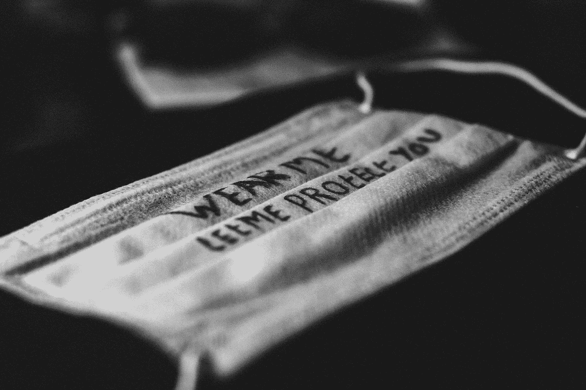

# 是时候去考冠状病毒博士了

> 原文：<https://towardsdatascience.com/its-time-to-get-a-phd-in-coronavirus-cacf7e2e9e9f?source=collection_archive---------21----------------------->

## 有可靠来源的 Corona-knowledge 的实际在线课程

教育让你保持健康。[刘凯潇](https://unsplash.com/@amikacin?utm_source=unsplash&utm_medium=referral&utm_content=creditCopyText)在 [Unsplash](https://unsplash.com/s/photos/covid?utm_source=unsplash&utm_medium=referral&utm_content=creditCopyText) 上拍照

取决于你住在哪里，在过去的几个月、几周或几天里，你可能已经遭受了与电晕相关的焦虑。所有的轻描淡写，假新闻，甚至有趣的模因，都倾向于加剧焦虑，至少对我来说是这样。

如果有一种方法可以治愈所有这些不确定性，那就是知识。我最近写了一篇关于如何利用这些社交距离来自学数据科学的文章。但是，如果你能通过了解引起焦虑的同样的事情来抑制你的焦虑呢？

 [## 如果你因为冠状病毒而被锁在家里，11 堂最好的数据科学课

### 不用花一分钱就可以开始你的职业生涯

towardsdatascience.com](/11-best-data-science-classes-if-youre-locked-home-because-of-coronavirus-ca7d2d74a454) 

事实证明，确实有关于冠状病毒的在线课程。这不是废话——他们由来自世卫组织、伦敦帝国理工学院、约翰·霍普金斯大学等机构的世界级健康和流行病学研究人员授课。你甚至可以在其中几门课程结束时获得成绩证书！

我将把重点放在英语课程上，这些课程是免费的，对普通大众来说是可以理解的。有更多针对健康专家的课程，但是因为我不在这个领域工作，我觉得我没有资格评价这些。这些课程的排名不分先后。

## 约翰霍普金斯大学/ coursera:用流行病学对抗新冠肺炎

*所需时间:~5 小时，自定进度
开始时间:2020 年 3 月 31 日(但随时可以加入)*

本课程主要关注疾病爆发的流行病学方面:主要关注如何收集和分析关于流行病的正确数据。核心问题是:

*   有多少人被感染了？
*   我们如何衡量谁被感染了？
*   病毒的传染性有多大？
*   我们能做什么？

该课程还提供了一些实用技巧，教你如何在社交孤立中学习和与他人联系。

如果你有症状，戴上口罩。由[Adam niecioruk](https://unsplash.com/@adamsky1973?utm_source=unsplash&utm_medium=referral&utm_content=creditCopyText)在 [Unsplash](https://unsplash.com/s/photos/corona?utm_source=unsplash&utm_medium=referral&utm_content=creditCopyText) 上拍摄的照片

## 伦敦帝国理工学院/ coursera:我们来谈谈新冠肺炎吧

*所需时间:~19 小时，自定进度
开始时间:2020 年 3 月 28 日(但可随时加入)*

虽然上述课程主要关注疫情的定量方面，[但本课程](https://www.coursera.org/learn/covid-19)也涵盖政府和社会的应对措施。随着疫情的发展，它也在不断更新。

本课程的要点是:

*   正在出现的疫情的规模和使用可靠的信息来源跟踪趋势的方法，
*   循证爆发控制方法的关键科学基础，
*   社区参与、多学科合作和全球合作在疫情应对中的重要性，以及
*   传染病模型如何为地方、国家和国际层面的战略和操作反应提供信息。

## 伦敦卫生与热带医学学院/未来学习:应对新型冠状病毒

*所需时间:~12 小时，自定进度
开始:任何时间*

与前面介绍的两门课程相比，这门课程更加关注医疗保健。课程的核心支柱是:

*   新冠肺炎是如何出现和被识别的，
*   新冠肺炎是如何传播的，
*   新冠肺炎全球公共卫生措施，以及
*   如何应对新冠肺炎的未来？

像许多其他课程一样，它会不断更新，以提供我们对该病毒的最新了解。完成后，您可以下载一份成就证书来证明您的成功。

## 世界卫生组织:新型冠状病毒的感染预防和控制

*所需时间:~1 小时，自定步调
开始:任何时间*

来自世界卫生组织的这一官方课程快速总结了疫情的现状以及在这一困难时期的一般准备指南。其核心目标是:

*   定义感染预防和控制及其在准备、准备和响应中的作用，
*   描述当前新冠肺炎的流行病学情况，包括病例定义和体征及症状。
*   描述源代码控制、管理控制以及环境和工程控制，
*   描述世卫组织建议的卫生保健机构感染预防和控制措施，包括在处理疑似或确诊新冠肺炎病例时，以及
*   描述额外的感染预防和控制措施，以帮助医疗机构做好一般准备。

利用你独处的时间去学习新的东西。照片由 [Unsplash](https://unsplash.com/s/photos/corona?utm_source=unsplash&utm_medium=referral&utm_content=creditCopyText) 上的 [Dhaya Eddine Bentaleb](https://unsplash.com/@dhaya_edd_art?utm_source=unsplash&utm_medium=referral&utm_content=creditCopyText) 拍摄

## 世界卫生组织:支持国家准备和应对的业务规划准则和新冠肺炎伙伴平台

*所需时间:~2 小时，自定步调
开始:任何时间*

本课程与上述课程相似，但更深入地探讨了流行病的准备计划。核心目标是:

*   让自己和他人了解实施[新冠肺炎战略准备和反应计划](https://www.who.int/docs/default-source/coronaviruse/srp-04022020.pdf)的重要性，
*   能够描述公共卫生准备和应对的 8 大支柱以及联合国国家工作队将采取的初步行动，以及
*   能够获得进行准备水平评估所需的全套行动、绩效指标和资源。

如果你在评分作业中取得了 80%以上的成绩，你也有资格获得成绩记录。

## 世界卫生组织:包括新冠肺炎在内的新型呼吸道病毒:检测、预防、应对和控制方法

*所需时间:~3 小时，自定进度
开始:任何时间*

[本课程](https://openwho.org/courses/introduction-to-ncov)重点关注新冠肺炎病毒爆发的生物学和流行病学，但也涵盖了应对一种新型病毒的某些方面。课程的中心点是:

*   新出现的呼吸道病毒的性质，如何检测和评估爆发，预防和控制由新型呼吸道病毒引起的爆发的策略，以及
*   应该使用什么策略来传达风险并让社区参与检测、预防和应对新型呼吸道病毒的出现。

它会根据最新的发现不断更新。目前还没有证书，但将来会有。

## 底线:呆在家里学习

在我们这个时代，社会隔离和自我隔离可能看起来像中世纪的反应。但由于这种冠状病毒如此新，这是科学在这一点上所能提供的最好的。

这并不意味着你不能做任何事情。第一步是利用可靠的来源来教育自己。尽管在这个充满焦虑的世界里，到处都有一个有趣的电晕迷因不会造成任何伤害…

然后，你可能想把你的知识带到下一个层次:帮助你的邻居，尤其是年轻人、老年人和病人。照看你所在地区的孩子，或者为别人去购物。现在不是自私的时候。

也许这些课程不足以让你获得冠状病毒博士学位。但他们肯定会给你一个人类的伟大。