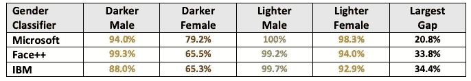
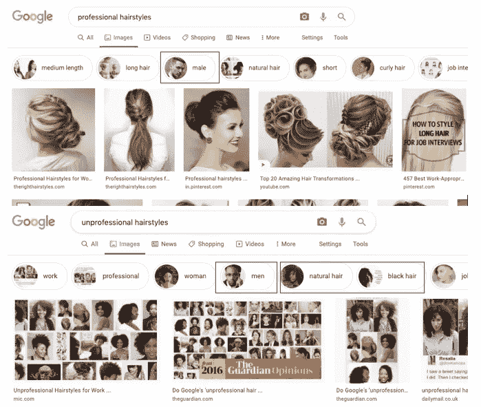
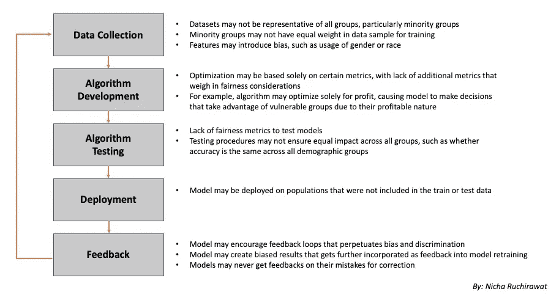
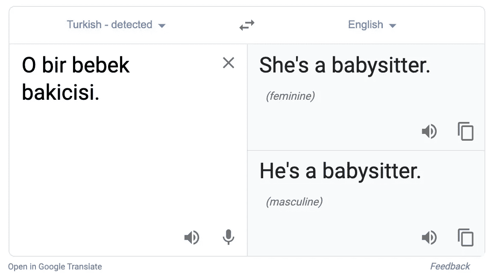

# 是时候考虑到公平性来优化数据算法了

> 原文：<https://towardsdatascience.com/its-time-to-optimize-data-algorithms-with-fairness-considerations-9bfe68c7ed38?source=collection_archive---------54----------------------->

## *为什么预测能力和花哨的模型指标不能说明全部情况…*

不可否认的是，我们的社会正越来越多地被大数据所统治。随着我们的生活越来越多地受到数据驱动算法的影响，意识到它们的道德含义很重要。一个普遍的问题是，这些模式往往会延续现有的社会偏见和歧视。虽然这通常是一个无意的过程，但这可能导致产品或服务不能平等地涵盖所有人群，在许多情况下甚至会给他们的生活带来意想不到的后果。

例如，今天存在的面部识别系统是用数据集进行大量训练的，这些数据集对某些人口统计数据的权重更大，导致准确性在种族、地区和年龄之间差异很大。来自少数群体的人的脸可能不被系统识别，或者以有害的方式被曲解。下面显示了三大公司开发的面部识别算法在性别和种族方面的准确性水平:

按人口统计的面部识别准确度；数据来自[性别差异:商业性别分类的交叉准确性差异](http://proceedings.mlr.press/v81/buolamwini18a/buolamwini18a.pdf)

另一个例子是谷歌搜索某些关键词的结果。下面是谷歌图片搜索“专业发型”和“非专业发型”的对比。

截至 2010 年 5 月 16 日的谷歌图片搜索

专业发型主要展示白人女性的照片。它还显示了相关的关键字，“男性”和一个白人图标。然而，“不专业的发型”展示了更多黑人女性的形象。相关关键词是“黑发”和“自然头发”，带有黑人女性图标。相关关键词“男性”的标志是一个黑人。

# **本文将讨论:**

*   这种偏见是如何融入模型的
*   高破坏性有偏模型的关键特征&例子
*   讨论一些可能的解决方案

# **模型中是如何引入偏差的？**

偏差可以包含在建模的所有步骤中[1，2，4]，如下图所示:

如何在模型开发周期中引入偏差

# **高破坏性模型的关键特征**

某些带有偏见的模型极具破坏性。凯茜·奥尼尔所著的《大规模杀伤性武器》一书很好地总结了这一点，因此我将在这一部分大量引用。在她的书中，她描述了有害的模型，或破坏数学的武器，是那些满足以下标准的模型:

1.  **损害——它会损害或摧毁生命吗？**

许多模型输出的决策可能会产生有害的后果。例如，它可能导致人们失业，使他们陷入贫困，或者以他们根本无法承受的价格收取产品/服务的费用。

**2。比例**

一些模型在很大程度上控制着社会，因此对我们的生活有很大的影响。例如，信用评分模型控制着我们的财务选项，这对我们过上稳定生活的能力起着很大的作用。

**3。缺乏透明度和问责制:**

许多模型是“黑匣子”。这个模型的决策过程很大程度上没有被质疑，也没有被理解。该模型的基本假设甚至可能是错误的，但没有足够的透明度让人们能够指出它的不公平性并进行辩护。

**促成破坏性和歧视性模式的关键因素:**

1.  **使用代理区分:**

很明显，如果模型明确使用人口统计变量，它会有偏差。招聘算法可能会将女性排名靠后，因为做母亲通常会影响职业表现。尽管如此，许多模型*隐含*歧视。通常很难获得显式数据信号，因此建模者转向隐式提供相同信号的代理。一个模特可能只使用邮政编码，但邮政编码与种族和收入相关。P2P 贷款机构通常根据与邻居、邮政编码、顾客购物的商店的相关性来制定风险评分。这些代理人不仅仅表明了更好地保证贷款偿还的责任。它们代表财富，也与种族相关。贫穷的少数群体可能有更高的借贷成本，尽管他们已经在挣扎，即使他们有责任。在另一个例子中，芝加哥警方小组列出了最有可能实施暴力犯罪的人的名单，不是基于他们的行为，而是基于他们犯罪的邻居和熟人。这些人不是根据他们自己的行为来判断的，而是因为属于社会的一个子群体而受到惩罚。

**2。只关注业务目标的优化，如利润**

大多数企业建立这些模型来帮助优化利润。我们在现实生活中从来没有看到一个 100%准确的模型，因为数据是有噪声的，但我们可以调整它来优化某些指标，如利润。然而，模型“错误”会给人们的生活带来高昂的代价。一个优秀的员工可能会被模型错误地预测为工作表现不佳而被解雇。此外，模型经常牺牲人性来优化利润。工人的时间表现在由优化软件控制，以实现利润最大化。他们采用在制造业中流行的“及时”原则，即物品及时到达以最小化成本。同样，这些模型预测商店何时需要员工，并根据不断变化的时间表安排员工。这种不稳定的、受商业驱动的时间表让你很难找到第二份工作或重返校园。这反过来又减少了他们通过更好的就业来摆脱这一循环的机会。

**3。恶性反馈循环**

有偏见的模型产生的输出有助于营造一种强化这种偏见的环境。例如，警察局使用的[累犯模型](https://www.propublica.org/article/how-we-analyzed-the-compas-recidivism-algorithm)可能会输出一个决定，预测来自某些种族特征的囚犯风险更大，应该被关押更长时间。然而，由于他们在监狱里的时间更长，他们回国后更难找到工作，导致再次犯罪的可能性增加。当他们这样做时，它加强了模型，它确实根据这些因素做出了正确的预测。很少有人评估受影响的最终用户是否得到了公平对待，如果没有，如何调整模型。

**4。未经测试的假设**

模型往往基于假设。上面解释的警察局累犯风险模型假设社会，甚至囚犯本身都会从被关更长时间中受益。然而，后来的一项研究实际上声称，将他们关押更长时间实际上会增加累犯的可能性。另一个例子是，一位名为[莎拉·威索基的老师被解雇了，因为 DCPS 的“影响力](https://www.huffpost.com/entry/teacher-evaluations_b_1328456)”算法——用于评估教师的表现——给她打了“表现不佳”的分数。尽管如此，大多数学生对她评价很高。该模型的决定是由她的学生每年较低的标准化考试成绩驱动的。尽管没有足够的技能，学生们还是以前一年虚假的高分入学。这伤害了莎拉提高分数的能力，不管她的教学技巧如何。分数增加作为教师绩效指标背后的假设没有得到验证。

**5。逆向工程使游戏系统成为可能**

因为模型是基于规则做出决策的，所以那些能够逆向工程这些规则的人可以击败系统，成为误报。美国新闻学院排名是由录取率、毕业率等指标驱动的。可以说，这迫使学校提高质量。然而，这些排名往往不能反映学校的质量。操纵排名的一个方法是通过拒绝那些可能不会被录取的顶尖学生来降低录取率。此外，学校可以通过把学生算作被雇佣者来欺骗 10%的就业率，即使他们是咖啡师.或者，他们可以通过更多地关注工程和科学部门，而不是教育和社会工作部门来提高平均收入。

**6。利用最终用户的漏洞**

算法可以用来暴露人们的弱点，并利用他们的需求或无知。以营利性大学的丑闻为例，比如科林斯大学的[。他们利用算法来锁定来自最贫困地区的学生，并点击了发薪日贷款等广告。这个群体迫切需要多挣钱的方法，所以向他们推销私人教育的帮助是很容易的。点击流数据可以提供关于他们兴趣的信息，自然语言处理可以分析他们在社交媒体上发布的关于他们关注的词语。A/B 测试可以用来优化广告以引起他们的注意。这些学院的收费比社区学院高很多倍，以吸引那些可以获得政府贷款的学生。这些学生最终背负了巨额债务，没有高质量的教育来增加收入。](https://www.usatoday.com/story/money/2018/04/29/student-loans-corinthian-colleges-court-fight-debts/557436002/)

# **可能的解决方案**

**提高认识:** 很多人根本就不知道这个问题的存在。意识不仅对数据科学家或建模师很重要。其他角色，如投资者、商业战略家、产品经理、消费者——任何参与数据驱动产品或公司的人(目前可能占大多数%)都同样有责任塑造行业。

**在建模过程中纳入公平性考虑:** 建模者需要在建模过程的每一步评估公平性[2，4]。数据收集需要确保多样化的数据集，让少数群体有平等的培训机会。特征工程需要考虑显性或隐性偏差。模型需要在其他传统指标的基础上用公平指标进行评估，以确保所有群体的平等绩效和影响。当模型做出错误判断时的反馈需要回到模型中重新调整。劳动力构建这些模型是多样化的。通过这种方式，那些意识到不公平会影响到与他们相似的人的少数群体将会推动解决这个问题。

LinkedIn 在优化候选人搜索结果的排名模型时，已经努力引入公平指标。正如他们在论文 [*中所解释的，搜索中的公平感知排名&推荐系统及其在 LinkedIn 人才搜索中的应用*](https://arxiv.org/pdf/1905.01989.pdf)*【3】，他们引入了额外的约束条件，以最小化对每个属性(如种族、性别等)的期望代表比例的偏离。)显示在搜索结果中，以确保不同群体拥有平等的个人资料曝光机会。他们使用 A/B 测试进行验证，结果显示> 95%的搜索是有代表性的，而业务指标(如发送/接受的邮件数量)没有显著变化。*

*同样，[谷歌已经开始解决他们语言翻译中的性别偏见问题[5]。](https://ai.googleblog.com/2020/04/a-scalable-approach-to-reducing-gender.html?)他们的翻译很多都倾向于选择一个性别，比如在谈论保姆的时候选择代词‘她’，在谈论医生的时候选择‘他’。他们建立了一个模型来检测默认翻译是否做出了性别特定的选择，并建立了另一个语言模型来重写包含两种性别的版本。*

**

*自 2010 年 5 月 16 日起，谷歌将搜索翻译成土耳其语。*

*对这种方法的评估是通过引入一个公平性度量——偏差减少来完成的。这衡量了从以前的模型中选择性别的翻译减少了多少%。新方法减少了从匈牙利语、芬兰语、波斯语、土耳其语到英语翻译中超过 90%的偏差。*

***让透明度和问责制成为标准:** 消费者应该能够要求大公司在如何使用分数来评判他们方面更加透明，并了解他们的分数中包含哪些内容，有权修正不准确的内容。有一些治理良好的分数的例子。信用评分虽然有时会被滥用，但它是透明的、可问责的[2]。他们结合反馈来调整模型的不准确性。它们是相对透明的——消费者有合法权利知道他们的分数是多少，他们的分数中包含什么，并被告知如何提高分数(例如减少债务)。消费者可以要求改正错误。大规模治理的模型需要更多地转向这个方向。*

***消费者透明度工具:** 我们将受益于更多构建工具的计划，这些工具对公众开放并可供公众使用，以模拟如果他们采取某种行动，他们在各种模型中的分数会发生什么(例如，如果他们有未支付的账单，他们的信用分数会发生什么，以及较低的分数会在多大程度上影响她的买车计划)[2]。*

***揭露模型中偏见的举措:** 模型中的偏见可以通过类似*P*[*roppublica 的消息机*](https://projects.propublica.org/emails/) 众包活动这样的举措得到更多的揭露[2]。这个众包收集了不同的人从奥巴马竞选中收到的信息，用于逆向工程定向政治广告的模型。再比如 [*普林斯顿的网络透明与问责项目*](https://webtap.princeton.edu/) 。该项目提供了一个平台来测试自动化系统，如搜索引擎和就业安置网站，它们将如何对待不同的人物角色(例如，富人、穷人、男性、女性、精神疾病)。另一个倡议是 [*算法正义联盟*](https://www.ajlunited.org/)*，这是一个讨论模型偏见的平台，人们可以分享他们经历的偏见，公司可以要求对他们的模型进行偏见审计。**

****政策&规定:** 规定保护数据的使用需要保护新类型分数的使用情况[2]。例如，我们需要规范性格测试、健康评分、声誉评分在招聘决策中的使用。此外，需要重新考虑数据收集条例。目前，欧洲政策要求收集的任何数据都必须得到用户的批准，作为一种选择，并禁止为其他目的重复使用数据。此外，法规应要求对大规模模型进行第三方审计。**

****商业模式需要融入公平&包容性目标:** 尽管这可能会让公司损失一些利润，但这与今天的企业社会责任努力或日益道德的商业模式(如环保)没有什么不同，它们实际上为品牌增加了价值。通过服务更广泛的人群，企业甚至可能变得更加有利可图。如果企业希望进入拥有巨大增长潜力的新兴市场，就需要为这些人群提供可获得的包容性产品。正如汉斯·罗斯林、*在《真实》一书中所写的，“只关注富裕的传统市场的投资者实际上正在错失良机。有数十亿潜在的新消费者，他们的购买力在不断增长。投资者可能会错过最大的经济机会，因为他们仍然认为这个群体是“少数”或“仍然太穷”。***

# ****来源:****

**[1] Krishnaram Kenthapadi， [LinkedIn 在人工智能/人工智能系统中的公平和隐私](https://www.slideshare.net/KrishnaramKenthapadi/fairness-and-privacy-in-aiml-systems-187923831) (2019) Pinterest 技术演讲**

**[2]凯茜·奥尼尔，[大规模杀伤性武器](https://www.amazon.com/Weapons-Math-Destruction-Increases-Inequality-ebook/dp/B019B6VCLO) (2016)**

**[3] Sahin Cem Geyik，Stuart Ambler，Krishnaram Kenthapadi，[搜索中的公平意识排名&推荐系统及其在 LinkedIn 人才搜索中的应用](https://arxiv.org/pdf/1905.01989.pdf) (2019)**

**[4] Neelima Kumar，[人工智能中的偏见](https://www.slideshare.net/NeelimaJadhav1/bias-in-artificial-intelligence) (2017)格蕾丝·赫柏会议**

**[5]梅尔文·约翰逊，[减少谷歌翻译中性别偏见的可扩展方法](https://ai.googleblog.com/2020/04/a-scalable-approach-to-reducing-gender.html) (2020)谷歌人工智能博客**