# 第一次尝试 R

> 原文：<https://towardsdatascience.com/ive-tried-r-for-the-first-time-how-bad-was-it-ba344f22e90b?source=collection_archive---------20----------------------->

## 空前的 Pythonista 尝试 R——包括与 Python 的比较

我是一个重度 Python 用户，这不是什么秘密。只要看看我的个人资料，你就会发现 100 多篇关于 Python 本身或数据科学中的 Python 的文章。最近，我尝试了很多新的语言和技术，其中 R 是我最抗拒的。下面你会发现我的发现，与 Python 的比较，以及对语言本身的总体看法。


Jason Coudriet 在 [Unsplash](https://unsplash.com?utm_source=medium&utm_medium=referral) 上拍摄的照片

我忽略 R 这么久的最大原因是缺乏关于这种语言的信息。我认识的每个使用过它的人都把它严格地作为一种统计语言来呈现。统计学对于数据科学来说是必不可少的，但是如果您不能通过*仪表板*来呈现它，并将其部署为 *REST API* ，那么构建模型又有什么意义呢？

这些是我最近的想法，但从那以后我发现了[闪亮](https://shiny.rstudio.com)和[水管工](https://www.rplumber.io)，它们基本上解决了我最初与 R 之间的问题。也就是说，没有必要再回避这种语言了，本文是 R 系列的第一篇。

今天我们将在**探索性数据分析**和**数据可视化**的过程中，通过代码和最终输出来比较 R 和 Python。我非常倾向于 Python，但是我的结论可能还是会让你吃惊。请继续阅读，寻找答案。

无论如何，让我们从比较开始，好吗？

# 探索性数据分析

EDA 是数据科学家花费大部分时间的地方，因此一种易于编写和易于理解的语言是必须的。我在两种语言中都使用了外部库 Python 中的`Pandas`和 r 中的`Tidyverse`。

## 数据集加载

在本文中，我们将使用 MPG 数据集。它内置于 R 中，但是 Python 中没有相同的数据集。为了适应这种情况，我将数据集从 R 导出为 CSV 格式，这样我们就可以开始使用两种语言了。

以下是如何用 R 读取 CSV 文件:

```
mpg <- read.csv(‘mpg.csv’)
head(mpg)
```

在 R 中使用了`head`函数来查看前 6 行，最终结果如下所示:

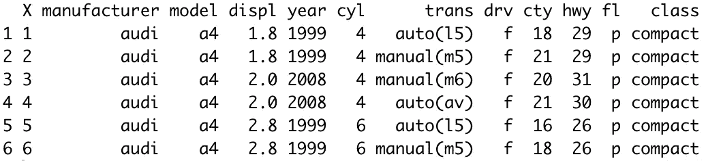

让我们用 Python 做同样的事情:

```
mpg = pd.read_csv(‘mpg.csv’)
mpg.head()
```

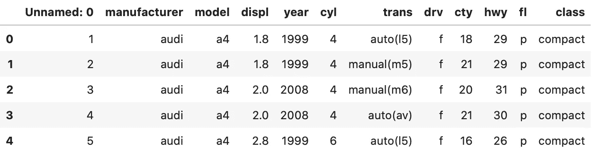

太好了！看起来我们有一个额外的列——R 中的`X`和 Python 中的`Unnamed: 0`，所以接下来让我们移除它们。

## 移除属性

下面介绍如何移除 R 中不需要的`X`列:

```
mpg <- mpg 
  %>% select(-X)
```

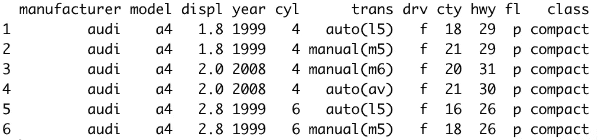

这是 Python 的变体:

```
mpg.drop(‘Unnamed: 0’, axis=1, inplace=True)
```

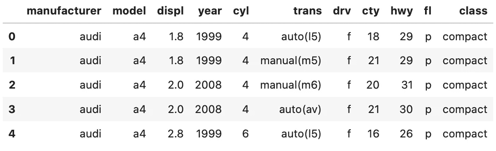

像变量一样指定列名(不带引号)不是我最喜欢的，但事实就是如此。

## 过滤数据

让我们继续一些更有趣的事情——数据过滤或子集化。我们将看到如何只选择那些柱面数量`cyl`为 6 的记录。

带 R:

```
head(mpg %>%
  filter(cyl == 6))
```

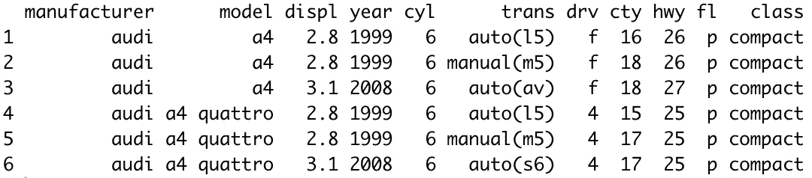

请记住，`head`函数只是在这里，所以我们不会在控制台中得到大量的输出。它不是数据过滤过程的一部分。

Python 也是如此:

```
mpg[mpg[‘cyl’] == 6].head()
```


厉害！让我们看看还能做些什么。

## 创建派生列

我们将创建一个布尔属性`is_newer`，如果汽车制造于 2005 年或之后，则为真，否则为假。

下面是 R 语法:

```
head(mpg %>%
  mutate(is_newer = year >= 2005))
```

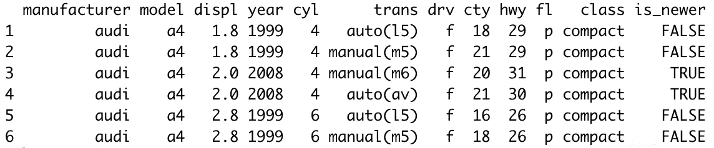

Python 也是如此:

```
mpg[‘is_newer’] = mpg[‘year’] >= 2005
```

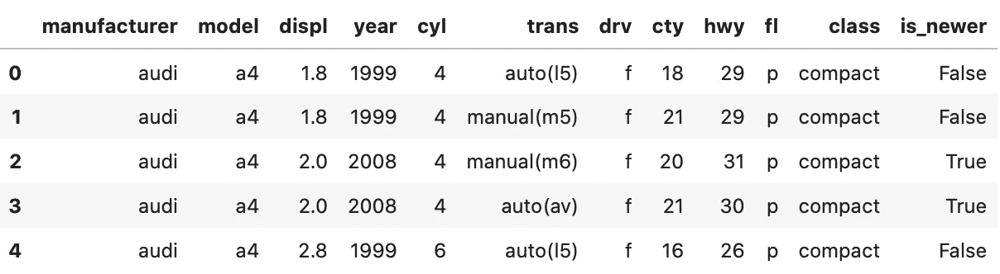

这就是 EDA 的全部内容。接下来我们就来简单总结一下。

## EDA 最终想法

很难选出一个赢家，因为两种语言都很棒。我重复一遍，对我来说不在列名周围加上引号是很奇怪的，但这是我必须习惯的事情。

此外，我非常喜欢在 r 中链接东西的简易性。

```
mpg <-
  read.csv(‘mpg.csv’) %>%
  select(-X) %>% 
  filter(cyl == 6) %>%
  mutate(is_newer = year >= 2005) %>%
  select(displ, year, cyl, is_newer)
```

在这里，我们基本上从上面做了所有的事情，所有的都在一个单一的命令中。让我们继续数据可视化部分。

# 数据可视化

说到数据可视化，有一点是肯定的——Python 毫无胜算！好吧，至少如果我们谈论的是两种语言的默认选项。以下库用于此比较:

*   `ggplot2` —用于 R
*   `matplotlib` —用于 Python

让我们从一个简单的散点图开始，X 轴是发动机排量，Y 轴是公路 MPG。

下面是 R 语法和结果:

```
ggplot(data = mpg, aes(x = displ, y = hwy)) + 
  geom_point()
```

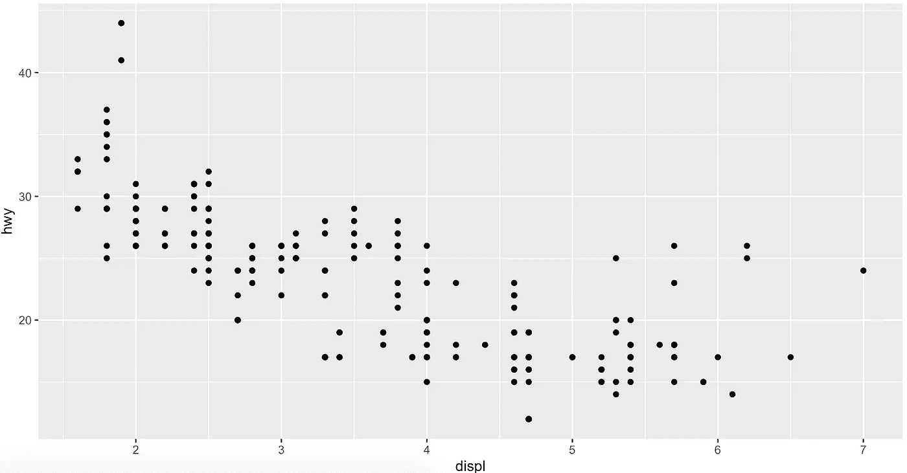

作者图片

对于 Python:

```
plt.scatter(x=mpg[‘displ’], y=mpg[‘hwy’])
```


作者图片

这两个看起来都不是特别好，但是 R 在这方面遥遥领先，至少在默认风格上是这样。

现在让我们添加一些*颜色*。这些点应该根据`class`属性进行着色，这样我们就可以很容易地知道每种类型的汽车所在的位置。

下面是 R 的语法和结果:

```
ggplot(data = mpg, aes(x = displ, y = hwy, color = class)) + 
  geom_point()
```

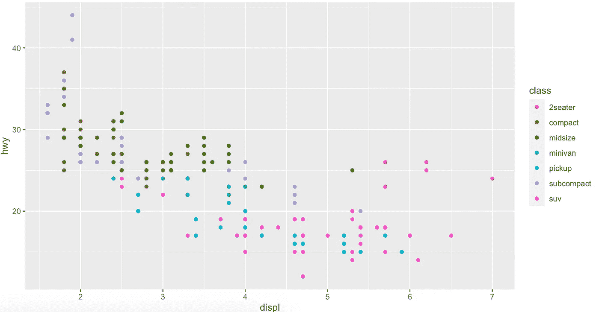

作者图片

没有比这更简单的了，下面的 Python 例子就是一个明显的例子。我还没有找到一种简单的方法来将分类变量映射为颜色(至少用 *Matplotlib* )，所以我最后得到了以下结果:

```
def get_color(car_class):
    colors = {
        ‘compact’   : ‘brown’,
        ‘midsize’   : ‘green’,
        ‘suv’       : ‘pink’,
        ‘2seater’   : ‘red’,
        ‘minivan’   : ‘teal’,
        ‘pickup’    : ‘blue’,
        ‘subcompact’: ‘purple’
    }
 return colors[car_class]colors = mpg[‘class’].apply(get_color) plt.scatter(x=mpg[‘displ’], y=mpg[‘hwy’], c=colors)
```

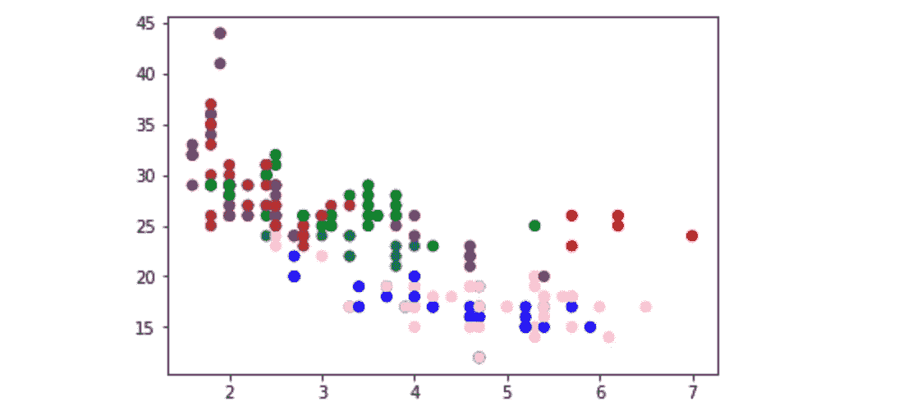

作者图片

所有这些都是为了一个不那么吸引人的图表。r 点。

现在，让我们通过为轴添加标题和标签来完成图表。下面是在 R 中如何做:

```
ggplot(data = mpg, aes(x = displ, y = hwy, color = class)) + 
  geom_point(size = 3) + 
  labs(title = ‘Engine displacement vs. Highway MPG’,
       x = ‘Engine displacement (liters)’,
       y = ‘Highway miles per gallon’)
```

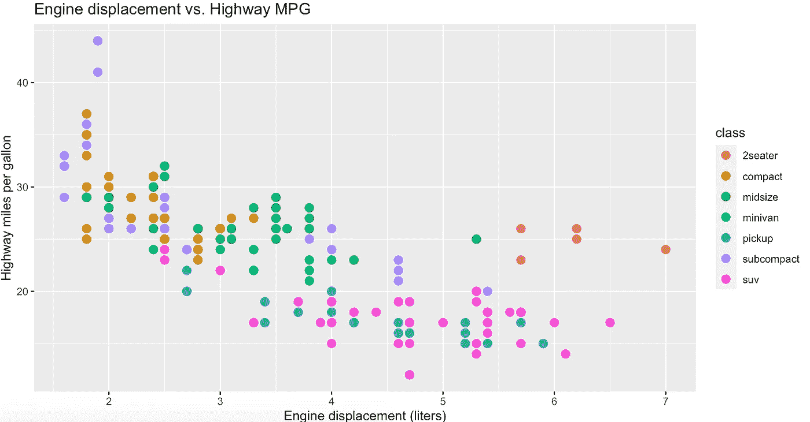

作者图片

同样，语法相当简单，图表看起来很惊人(嗯，有点)。

下面是如何用 Python 做同样的事情:

```
plt.scatter(x=mpg[‘displ’], y=mpg[‘hwy’], c=colors, s=75)
plt.title(‘Engine displacement vs. Highway MPG’)
plt.xlabel(‘Engine displacement (liters)’)
plt.ylabel(‘Highway miles per gallon’)
```

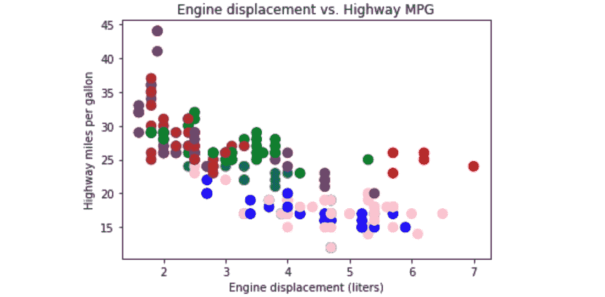

作者图片

这取决于你来决定哪个更好看，但在我看来 R 是一个明显的赢家。当然，可视化是可以调整的，但是我特意想使用两种语言的默认库。我知道 *Seaborn* 看起来更好，在评论区告诉我这些是没有意义的。

对于本文来说，这就差不多了。让我们在下一部分总结一下。

# 最后的想法

这是在数据科学领域对 R 和 Python 的一个比较。选择一个而不是另一个不是一件简单的事情，因为两者都很棒。在这两种语言中，Python 被认为是一种通用语言，所以如果你想用数据科学来构建软件，而不是直接在数据科学中工作，它是唯一可行的选择。

这两个都不会错——尤其是当我知道 R 支持仪表板、web 抓取和 API 开发的时候。我保证会有更多这样的文章出现。

感谢阅读。

## [**加入我的私人邮件列表，获取更多有用的见解。**](https://mailchi.mp/46a3d2989d9b/bdssubscribe)

*喜欢这篇文章吗？成为* [*中等会员*](https://medium.com/@radecicdario/membership) *继续无限制学习。如果你使用下面的链接，我会收到你的一部分会员费，不需要你额外付费。*

[](https://medium.com/@radecicdario/membership) [## 通过我的推荐链接加入 Medium-Dario rade ci

### 作为一个媒体会员，你的会员费的一部分会给你阅读的作家，你可以完全接触到每一个故事…

medium.com](https://medium.com/@radecicdario/membership) 

*原载于 2020 年 9 月 10 日 https://betterdatascience.com*[](https://betterdatascience.com/trying-r-for-the-first-time/)**。**