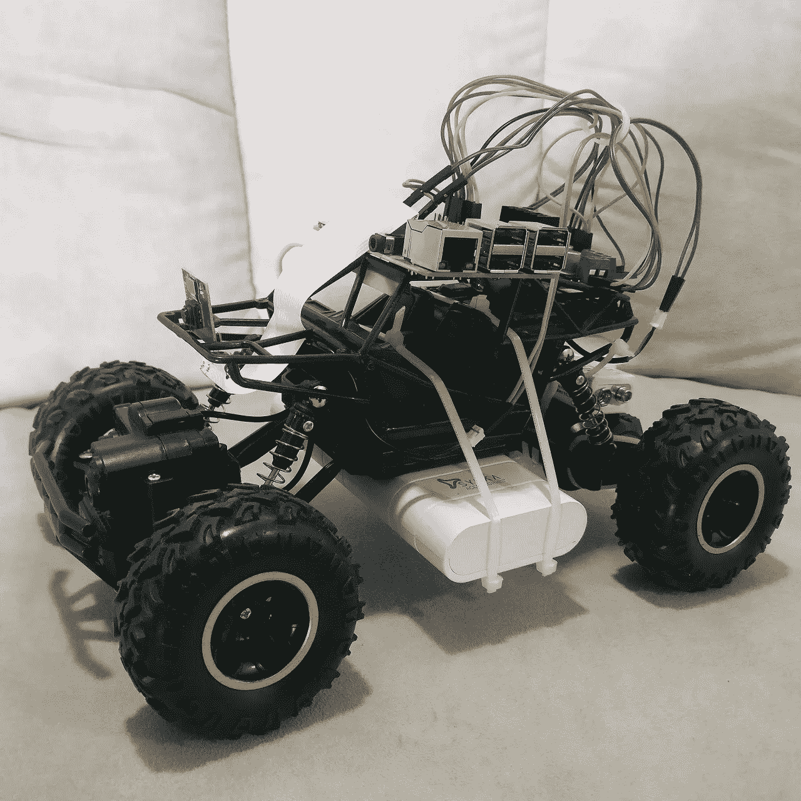
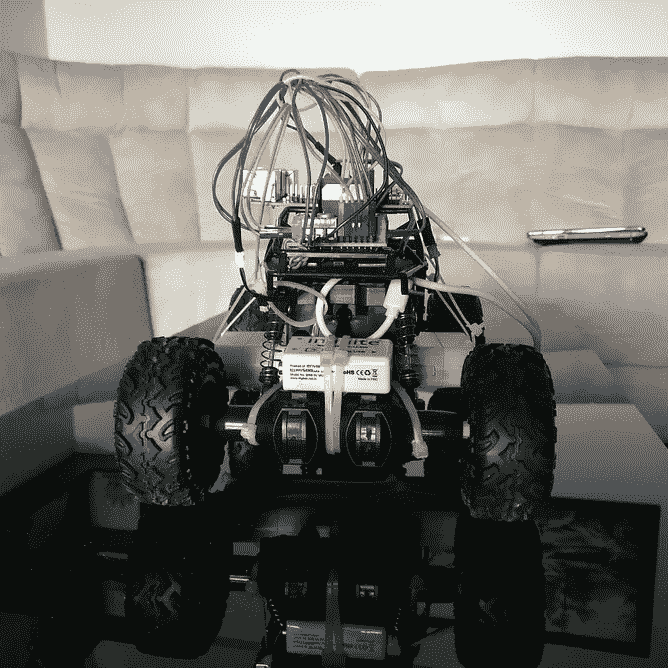
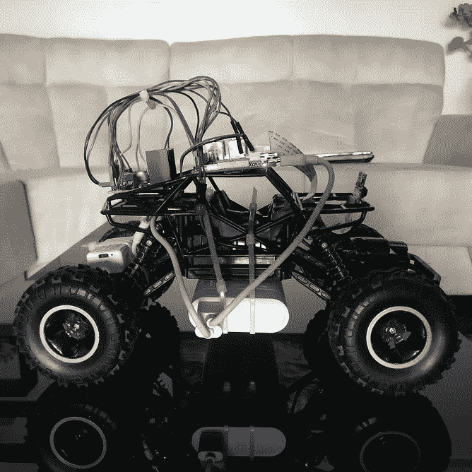
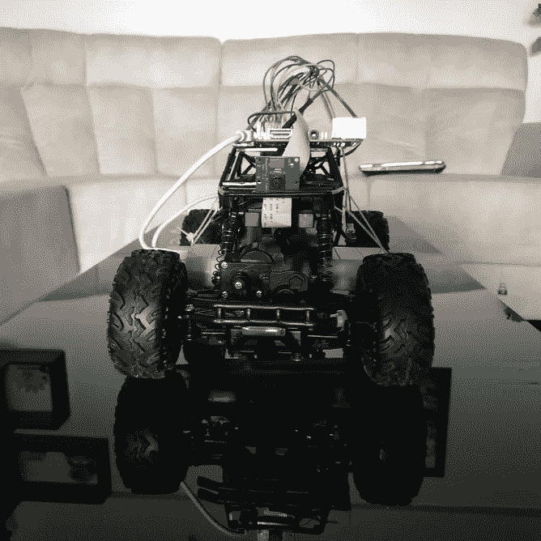
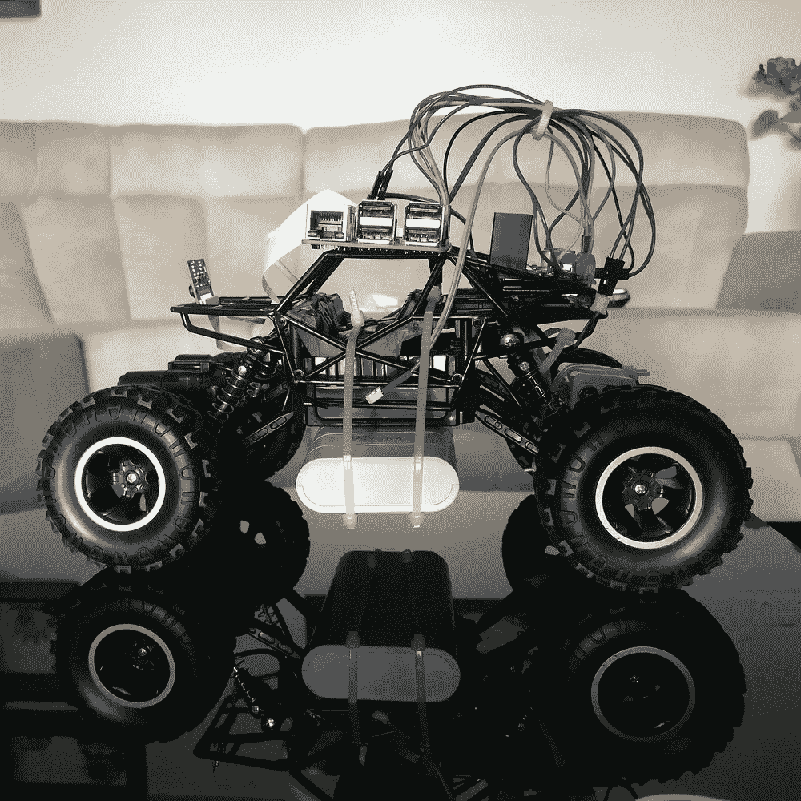
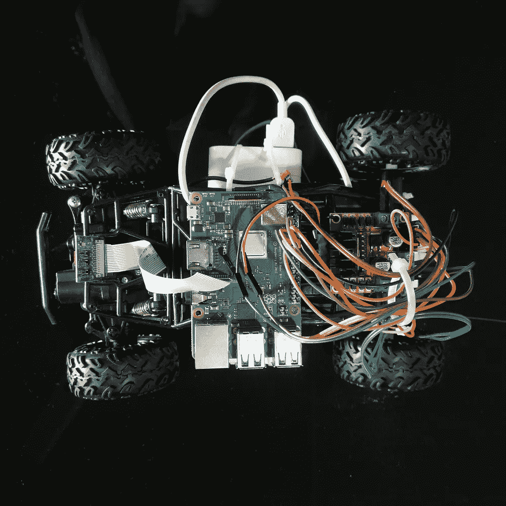
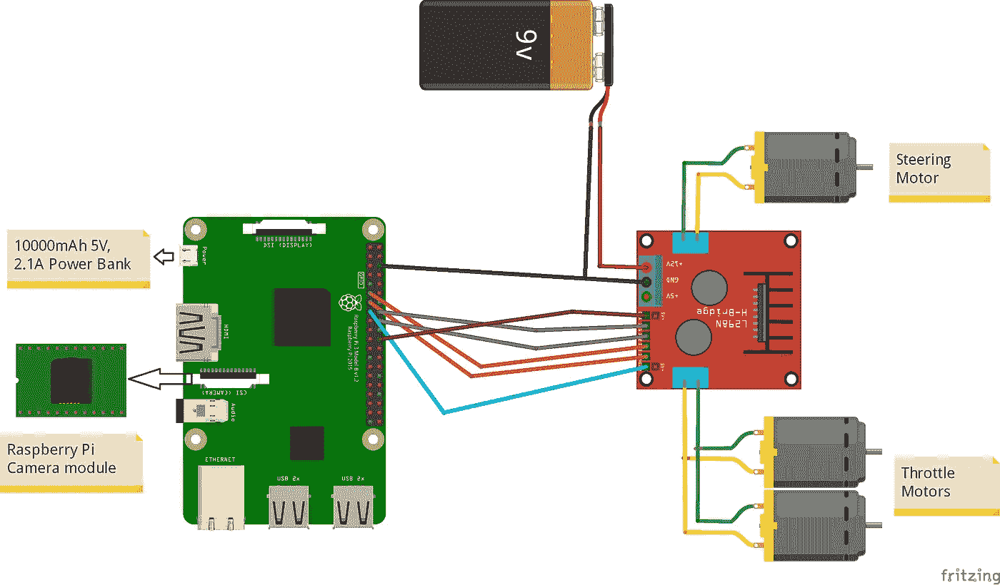
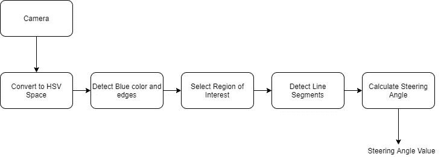
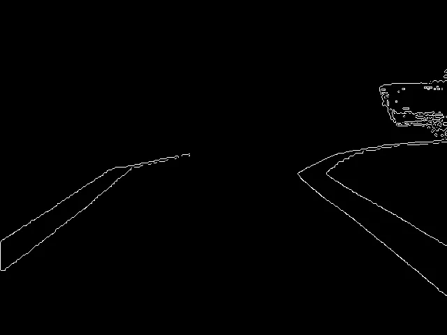
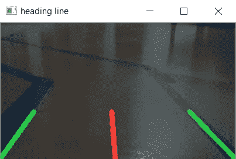

# J.自动驾驶汽车

> 原文：<https://towardsdatascience.com/j-a-c-w-i-b-autonomous-car-9c42bc732279?source=collection_archive---------43----------------------->

**作者/开发者** : [乌迪特·加瓦桑](https://www.linkedin.com/in/udit-gavasane-183b161a7/)，[罗汉·特冈卡尔](https://in.linkedin.com/in/rohan-tergaonkar-481b17188)，[阿莫德·萨哈斯·拉布德赫](https://www.linkedin.com/in/amod-sahasrabudhe-685b011a7/)

非常感谢 [David Tian](https://towardsdatascience.com/@dctian) ，他在《深度少年派汽车》系列中的工作启发我们开发了一个类似的模型。可以参考他的文章[这里](/deeppicar-part-1-102e03c83f2c)。

# 介绍

## 自动驾驶汽车有多重要？

自动驾驶汽车是未来的事情。许多科技巨头如特斯拉、谷歌和汽车公司如优步、通用、宝马都在投资自动驾驶汽车。人们相信，在不久的将来，自动驾驶汽车将会在路上随处可见。使用经济的工具和零件来建造你自己的能够探测车道并跟随它们的自动驾驶汽车怎么样？这是我们命名为 J.A.C.W.I.B(又一辆拥有智能大脑的汽车)的汽车的清晰图像



# 硬件组件

*   遥控车:我们使用了一辆使用了 3 个 DC 马达(一个用于转向，两个用于节流)的遥控车。
*   树莓 Pi 3 型号 B+
*   32 GB micro SD:用于部署 Raspbian OS 和 Raspberry Pi 的内存。
*   RaspberryPi 5MP 摄像头模块:支持 1080p @ 30 fps，720p @ 60 fps，640x480p 60/90 录制。
*   电机驱动器(LM298N):用于控制 DC 电机的方向和速度。支持 1 块板 2 个直流电机的控制，能承受 1.5 A。
*   电源组:电源组(额定电压为 5V，2.1A)为 Raspberry Pi 模块供电。
*   电池:9V 锂离子 USB 充电电池，500mAh 容量。用于给电机驱动器供电。
*   公对公和母对母跳线。
*   蓝色胶带:这是这个项目的一个非常重要的组成部分，它用于制作两条车道线，汽车将在这两条车道线之间行驶。
*   拉链
*   螺丝刀

# Raspberry Pi 设置

## Raspberry Pi 操作系统

Raspberry Pi 需要一个操作系统来运行不同类型的程序。可以参考这个优秀的[指南](https://projects.raspberrypi.org/en/projects/raspberry-pi-setting-up)。

## 设置远程访问

建议您设置远程访问您的 Raspberry Pi，因为您不能在汽车行驶时将其连接到外部显示器。要设置远程访问，您可以参考本[指南](https://www.raspberrypi.org/documentation/remote-access/)。你也可以参考这个[视频指南](https://www.youtube.com/watch?v=IDqQIDL3LKg)。

## 设置远程文件访问

因为我们的 Raspberry Pi 是使用远程访问运行的，所以我们可以轻松地将文件传输到 Raspberry Pi 或从 Raspberry Pi 传输文件也是至关重要的。请参考本[指南](https://www.raspberrypi.org/documentation/remote-access/samba.md)。

在 Raspberry Pi 安装完成后，我们现在可以继续安装必要的库了。

# 安装 OpenCV

[**OpenCV**](http://opencv.org) ( *开源计算机视觉库*)是一个高级库，包含主要针对实时计算机视觉的函数。OpenCV 的使用将使我们能够感知前方的情况，并帮助我们识别车道。在您的 Raspberry Pi 终端中运行命令(粗体)。

```
#Installing dependent librariespi@raspberrypi:~ $  **sudo apt-get install libhdf5-dev -y && sudo apt-get install libhdf5-serial-dev -y && sudo apt-get install libatlas-base-dev -y && sudo apt-get install libjasper-dev -y && sudo apt-get install libqtgui4 -y && sudo apt-get install libqt4-test -y**# install OpenCV
pi@raspberrypi:~ $ **pip3 install opencv-python**
Collecting opencv-python
[Omitted....]
Installing collected packages: numpy, opencv-python
Successfully installed numpy-1.16.2 opencv-python-3.4.4.19
```

通过运行以下代码测试 OpenCV 安装。

```
pi@raspberrypi:~ $ **python3 -c "import cv2"**
```

如果在运行该命令时没有看到任何错误，则库应该安装正确。

# 硬件装配



Raspberry Pi +电机驱动器装配示意图

上图显示了 Raspberry Pi、Raspberry Pi 摄像头模块和 LM298N 电机驱动器之间的连接。因为我们希望控制两个马达的节流速度，所以我们将它们连接到同一个端口。这些连接是借助公-公和母-母跳线完成的。摄像头模块安装在汽车的前格栅上。

**Raspberry Pi GPIO 引脚配置**

*   ENA — GPIO 25
*   IN1 — GPIO 23
*   IN2 — GPIO 24
*   IN3 — GPIO 17
*   IN4 — GPIO27
*   ENB — GPIO22

# 测试零件

完成所有连接后，我们将测试它们以确保所有连接都是正确的。

## 测试摄像机

在您的 Raspberry Pi 上打开一个新的 python 文件，并键入以下内容。

```
import cv2video = cv2.VideoCapture(0)while True:
  ret,frame = video.read()
  cv2.imshow('original',frame)
  cv2.imwrite('original.jpg',frame)

  key = cv2.waitKey(1) #wait for 1 ms for any keyboard button
  if key == 27:
     breakvideo.release()
cv2.destroyAllWindows()
```

第一行是导入我们的 OpenCV 库并使用它的函数。VideoCapture(0)功能从信号源开始传输实时视频。所提供的参数为“0 ”,这意味着我们使用默认摄像机，即本例中的 Raspberry Pi 摄像机。video.read()将读取来自摄像机的每一帧，并将其保存在一个名为“frame”的变量中。函数 imshow()将显示以单词“original”开头的帧，函数 imwrite()将在我们的存储设备上将“帧”存储为“original.jpg”。如果按下“esc”按钮，将返回十进制值 27，并相应地中断循环。

## 测试电机

我们需要测试马达，以检查速度并了解马达旋转的方向。在您的 Raspberry Pi 上运行以下代码来检查电机速度和方向。

```
**import** RPi.GPIO **as** GPIO          
**from** time **import** sleep

in1 = 24
in2 = 23
in3 = 17
in4 = 27
en1 = 25
en2 = 22
temp1=1

GPIO.setmode(GPIO.BCM)
GPIO.setup(in1,GPIO.OUT)
GPIO.setup(in2,GPIO.OUT)
GPIO.setup(in3,GPIO.OUT)
GPIO.setup(in4,GPIO.OUT)
GPIO.setup(en1,GPIO.OUT)
GPIO.setup(en2,GPIO.OUT)
GPIO.output(in1,GPIO.LOW)
GPIO.output(in2,GPIO.LOW)
GPIO.output(in3,GPIO.LOW)
GPIO.output(in4,GPIO.LOW)
p=GPIO.PWM(en1,1000)
q=GPIO.PWM(en2,1000)

p.start(75)
q.start(75)
print(**"\n"**)
print(**"The default speed & direction of motor is LOW & Forward....."**)
print(**"r-run x-stop w-forward s-backward a-left d-right m-medium e-exit f-front"**)
print(**"\n"**)    

**while**(1):

    x=raw_input()

    **if** x==**'r'**:
        print(**"run"**)
        **if**(temp1==1):
         GPIO.output(in1,GPIO.HIGH)
         GPIO.output(in2,GPIO.LOW)
         GPIO.output(in3,GPIO.HIGH)
         GPIO.output(in4,GPIO.LOW)

         print(**"forward"**)
         x=**'z'
        else**:
         GPIO.output(in1,GPIO.LOW)
         GPIO.output(in2,GPIO.HIGH)
         GPIO.output(in3,GPIO.LOW)
         GPIO.output(in4,GPIO.HIGH)

         print(**"backward"**)
         x=**'z'

    elif** x==**'x'**:
        print(**"stop"**)
        GPIO.output(in1,GPIO.LOW)
        GPIO.output(in2,GPIO.LOW)
        GPIO.output(in3,GPIO.LOW)
        GPIO.output(in4,GPIO.LOW)

        x=**'z'

    elif** x==**'w'**:
        print(**"forward"**)
        GPIO.output(in1,GPIO.HIGH)
        GPIO.output(in2,GPIO.LOW)
        temp1=1
        x=**'z'

    elif** x==**'s'**:
        print(**"backward"**)
        GPIO.output(in1,GPIO.LOW)
        GPIO.output(in2,GPIO.HIGH)
        temp1=0
        x=**'z'

    elif** x==**'d'**:
        print(**"right"**)
        GPIO.output(in3,GPIO.LOW)
        GPIO.output(in4,GPIO.HIGH)
        temp1=1
        x=**'z'

    elif** x==**'a'**:
        print(**"left"**)
        GPIO.output(in3,GPIO.HIGH)
        GPIO.output(in4,GPIO.LOW)
        temp1=0
        x=**'z'

    elif** x==**'f'**:
        print(**"front"**)
        GPIO.output(in3,GPIO.LOW)
        GPIO.output(in4,GPIO.LOW)
        temp1=0
        x=**'z'

    elif** x==**' '**:
        print(**"brake"**)
        GPIO.output(in1,GPIO.LOW)
        GPIO.output(in2,GPIO.LOW)   
        x=**'z'

    elif** x==**'m'**:
        print(**"medium"**)
        p.ChangeDutyCycle(50)
        q.ChangeDutyCycle(50)
        x=**'z'

    elif** x==**'e'**:
        GPIO.cleanup()
        print(**"GPIO Clean up"**)
        **break

    else**:
        print(**"<<<  wrong data  >>>"**)
        print(**"please enter the defined data to continue....."**)
```

使能引脚从 Raspberry Pi 获取脉宽调制(PWM)输入信号，并相应地运行电机。例如，100% PWM 信号表示我们正在以最大速度工作，0% PWM 信号表示电机不旋转。您可以使用 ChangeDutyCycle()函数进行调整。如果万一你的马达在相反的方向上运转，那么只要颠倒极性。如果电机根本不起作用，那么再次测试你的硬件连接。参考此[文档](https://www.raspberrypi.org/documentation/usage/gpio/)了解更多关于 Raspberry Pi GPIO 引脚配置的信息。

我们已经完成了测试。现在是开始实际编程的时候了！

# 车道导航



使用了由 [David Tian](/deeppicar-part-4-lane-following-via-opencv-737dd9e47c96) 开发的车道检测算法，我们将在这里分模块进行解释。

## 转换到 HSV 空间

我们将图像使用的颜色空间，即 RGB(红/绿/蓝)转换为 HSV(色调/饱和度/值)颜色空间。这样做的主要优点是通过颜色的亮度来区分颜色。

## 检测蓝色和边缘

使用蓝色车道的原因是在我们制造汽车的地方不常见。为了从 HSV 帧中提取蓝色，应该提到色调、饱和度和值的范围。为了减少每一帧中的整体失真，使用 Canny 边缘检测器检测边缘。你可以参考更多关于精明的[在这里](https://opencv-python-tutroals.readthedocs.io/en/latest/py_tutorials/py_imgproc/py_canny/py_canny.html)。

```
**def** detect_edges(frame):
    *# filter for blue lane lines* hsv = cv2.cvtColor(frame, cv2.COLOR_BGR2HSV)lower_blue = np.array([90, 120, 0], dtype=**"uint8"**)
    upper_blue = np.array([150, 255, 255], dtype=**"uint8"**)
    mask = cv2.inRange(hsv, lower_blue, upper_blue) *# detect edges* edges = cv2.Canny(mask, 50, 100)**return** edges
```

## 选择感兴趣区域

我们可以观察到，在我们的框架中也会出现其他蓝色。我们只需要隔离车道，因为这是我们希望关注的部分。

```
**def** region_of_interest(edges):
    height, width = edges.shape
    mask = np.zeros_like(edges) *# only focus lower half of the screen* polygon = np.array([[
        (0, height),
        (0, height / 2),
        (width, height / 2),
        (width, height),
    ]], np.int32) cv2.fillPoly(mask, polygon, 255) cropped_edges = cv2.bitwise_and(edges, mask)
    cv2.imshow(**"roi"**, cropped_edges) **return** cropped_edges
```



隔离感兴趣区域

## 检测线段

霍夫变换用于检测帧中的任何形状，如果我们用数学形式表示它的话。在我们的例子中，我们需要检测线条。它也可以处理轻微扭曲的形状。更多关于霍夫变换[的内容可以参考这里的](https://opencv-python-tutroals.readthedocs.io/en/latest/py_tutorials/py_imgproc/py_houghlines/py_houghlines.html)。

```
**def** detect_line_segments(cropped_edges):
    rho = 1
    theta = np.pi / 180
    min_threshold = 10 line_segments = cv2.HoughLinesP(cropped_edges, rho, theta, min_threshold,np.array([]), minLineLength=5, maxLineGap=150) **return** line_segments
```

HoughLinesP()函数采用以下参数:

*   Frame:是我们要在其中检测线条的框架。在我们的例子中，它是裁剪边
*   rho:是以像素为单位的距离精度。
*   θ:角度精度，单位为弧度(始终= π/180 ~ 1 度)
*   min_threshold 是被认为是线段所需的投票数。如果一条线有更多的投票，霍夫变换认为它们更有可能检测到线段。
*   maxLineGap:被视为一行的两行之间的最大像素间距。

## 计算转向角度

我们知道直线的方程是 *y=mx+b，*其中 *m* 是直线的斜率， *b* 是 y 截距。将计算使用霍夫变换检测的线段的斜率和截距的平均值。左车道线有 *x₁ < x₂* 和 *y₂ < y₁* 和坡度*，m= (y₂ — y₁) / (x₂ — x₁)* 会给出负坡度。右边的车道则完全相反。右侧车道有 x*₂*t28】x*₁*和 y*₂*t29】y*₁*这将给出一个正斜率。在垂直线的情况下(x *₁* = x *₂* )，斜率将为无穷大。在这种情况下，我们将跳过所有垂直线，以防止出现错误。为了准确地检测车道，通过边界线将帧分成两个区域，右边和左边。

```
**def** average_slope_intercept(frame, line_segments):
    lane_lines = [] **if** line_segments **is None**:
        print(**"no line segments detected"**)
        **return** lane_lines height, width, _ = frame.shape
    left_fit = []
    right_fit = [] boundary = 1 / 3
    left_region_boundary = width * (1 - boundary)
    right_region_boundary = width * boundary **for** line_segment **in** line_segments:
        **for** x1, y1, x2, y2 **in** line_segment:
            **if** x1 == x2:
                print(**"skipping vertical lines"**)
                **continue**fit = np.polyfit((x1, x2), (y1, y2), 1)
            slope = (y2 - y1) / (x2 - x1)
            intercept = y1 - (slope * x1) **if** slope < 0:
                **if** x1 < left_region_boundary **and** x2 < left_region_boundary:
                    left_fit.append((slope, intercept))
            **else**:
                **if** x1 > right_region_boundary **and** x2 > right_region_boundary:
                    right_fit.append((slope, intercept)) left_fit_average = np.average(left_fit, axis=0)
    **if** len(left_fit) > 0:
        lane_lines.append(make_points(frame, left_fit_average)) right_fit_average = np.average(right_fit, axis=0)
    **if** len(right_fit) > 0:
        lane_lines.append(make_points(frame, right_fit_average)) **return** lane_lines
```

make_points()是 average_slope_intercept()函数的辅助函数，它将返回车道线的有界坐标。

```
**def** make_points(frame, line):
    height, width, _ = frame.shape slope, intercept = line y1 = height  *# bottom of the frame* y2 = int(y1 / 2)  *# make points from middle of the frame down***if** slope == 0:
        slope = 0.1 x1 = int((y1 - intercept) / slope)
    x2 = int((y2 - intercept) / slope) **return** [[x1, y1, x2, y2]]
```

要在帧上显示车道线，使用以下函数

```
**def** display_lines(frame, lines, line_color=(0, 255, 0), line_width=6):
    line_image = np.zeros_like(frame) **if** lines **is not None**:
        **for** line **in** lines:
            **for** x1, y1, x2, y2 **in** line:
                cv2.line(line_image, (x1, y1), (x2, y2), line_color, line_width) line_image = cv2.addWeighted(frame, 0.8, line_image, 1, 1) **return** line_image
```

现在，在将速度应用到我们的电机之前，最重要的步骤是计算转向角。我们需要确保汽车准确地停留在检测到的车道线的中间。我们可能会遇到两种情况:

*   两条检测到的车道线
*   单条检测车道线

计算航向线是使用三角函数 tan 和 atan(即 tan⁻)。

```
**def** get_steering_angle(frame, lane_lines):
    height, width, _ = frame.shape **if** len(lane_lines) == 2:
        _, _, left_x2, _ = lane_lines[0][0]
        _, _, right_x2, _ = lane_lines[1][0]
        mid = int(width / 2)
        x_offset = (left_x2 + right_x2) / 2 - mid
        y_offset = int(height / 2) **elif** len(lane_lines) == 1:
        x1, _, x2, _ = lane_lines[0][0]
        x_offset = x2 - x1
        y_offset = int(height / 2) **elif** len(lane_lines) == 0:
        x_offset = 0
        y_offset = int(height / 2) angle_to_mid_radian = math.atan(x_offset / y_offset)
    angle_to_mid_deg = int(angle_to_mid_radian * 180.0 / math.pi)
    steering_angle = angle_to_mid_deg + 90
    *#print(steering_angle)***return** steering_angle
```

标题线显示如下。

```
**def** display_heading_line(frame, steering_angle, line_color=(0, 0, 255), line_width=5):
    heading_image = np.zeros_like(frame)
    height, width, _ = frame.shape steering_angle_radian = steering_angle / 180.0 * math.pi x1 = int(width / 2)
    y1 = height
    x2 = int(x1 - height / 2 / math.tan(steering_angle_radian))
    y2 = int(height / 2) cv2.line(heading_image, (x1, y1), (x2, y2), line_color, line_width)
    heading_image = cv2.addWeighted(frame, 0.8, heading_image, 1, 1) **return** heading_image
```



## 使用套筒传递转向角度

既然我们已经计算了转向角度，我们需要利用这个角度来驾驶我们的汽车。从技术上来说，你可以在 Raspberry Pi 上运行车道检测算法。然而，上述处理对于 Raspberry Pi 来说可能太重，可能会导致延迟。这可能会产生不准确的结果。为了解决这个问题，我们使用我们的笔记本电脑/个人电脑的处理能力，并利用插座。因此，输入相机流(使用 Raspberry Pi 相机模块捕获)从插座到达笔记本电脑/PC，在那里执行上述车道检测和转向角计算。以下代码显示了套接字程序的用法以及如何调用通道检测模块。

```
ser_soc = socket.socket()
ser_soc.bind((**'192.168.2.11'**, 5500))
ser_soc.listen(2)
conn, address = ser_soc.accept()**class** VideoStreamingTest(object):
    **def** __init__(self, host, port): self.server_socket = socket.socket()
        self.server_socket.bind((host, port))
        self.server_socket.listen(1)
        self.connection, self.client_address = self.server_socket.accept()
        self.connection = self.connection.makefile(**'rb'**)
        self.host_name = socket.gethostname()
        self.host_ip = socket.gethostbyname(self.host_name)
        self.streaming() **def** streaming(self): **try**:
            print(**"Host: "**, self.host_name + **' '** + self.host_ip)
            print(**"Connection from: "**, self.client_address)
            print(**"Streaming..."**)
            print(**"Press 'q' to exit"**) *# need bytes here* stream_bytes = **b' '
            while True**:
                stream_bytes += self.connection.read(1024)
                first = stream_bytes.find(**b'\xff\xd8'**)
                last = stream_bytes.find(**b'\xff\xd9'**)
                **if** first != -1 **and** last != -1:
                    jpg = stream_bytes[first:last + 2]
                    stream_bytes = stream_bytes[last + 2:]
                    frame = cv2.imdecode(np.frombuffer(jpg, dtype=np.uint8), cv2.IMREAD_COLOR)
                    edges = detect_edges(frame)
                    roi = region_of_interest(edges)
                    line_segments = detect_line_segments(roi)
                    lane_lines = average_slope_intercept(frame, line_segments)
                    lane_lines_image = display_lines(frame, lane_lines)
                    steering_angle = get_steering_angle(frame, lane_lines) *#pass value through socket* print(steering_angle)
                    server_program(steering_angle)
                    heading_image = display_heading_line(lane_lines_image, steering_angle)
                    cv2.imshow(**"heading line"**, heading_image) **if** cv2.waitKey(1) & 0xFF == ord(**'q'**):
                        **break** **finally**:
            self.connection.close()
            self.server_socket.close()**if** __name__ == **'__main__'**:
    *# host, port* h, p = **"192.168.2.11"**, 8000
    VideoStreamingTest(h, p)
```

发送套接字程序如下所述:

```
**def** server_program(data):
    data = str(data)
    conn.send(data.encode())  *# send data to the Raspberry Pi*
```

你可以在这里了解更多关于套接字编程[的知识。](https://docs.python.org/3/library/socket.html)

注意:您的 Raspberry Pi 和笔记本电脑需要连接到同一个网络来传输数据。

# 驾驶汽车

我们现在需要将 Pi 摄像机捕获的视频流发送到我们的主机。为此，我们将编写以下代码。

```
**import** io
**import** socket
**import** struct
**import** time
**import** picamera

*# create socket and bind host* client_socket = socket.socket(socket.AF_INET, socket.SOCK_STREAM)
client_socket.connect((**'192.168.2.11'**, 8000))
connection = client_socket.makefile(**'wb'**)

**try**:
    **with** picamera.PiCamera() **as** camera:
        camera.resolution = (320, 240)      *# pi camera resolution* camera.framerate = 15               *# 15 frames/sec* time.sleep(2)                       *# give 2 secs for camera to initilize* start = time.time()
        stream = io.BytesIO()

        *# send jpeg format video stream* **for** foo **in** camera.capture_continuous(stream, **'jpeg'**, use_video_port = **True**):
            connection.write(struct.pack(**'<L'**, stream.tell()))
            connection.flush()
            stream.seek(0)
            connection.write(stream.read())
            **if** time.time() - start > 600:
                **break** stream.seek(0)
            stream.truncate()

    connection.write(struct.pack(**'<L'**, 0))

**finally**:
    connection.close()
    client_socket.close()
```

现在，一旦我们的初始程序计算出转向角，我们需要接收它来执行一些动作。因此，我们将编写以下代码

```
**import** socket
**import** math
**import** sys
**import** time
**import** RPi.GPIO **as** GPIO

**def** client_program():

    cli_soc = socket.socket()  *# instantiate* cli_soc.connect((**'192.168.2.11'**, 5500))

    **while True**:

        data = cli_soc.recv(1024).decode()  *# receive response* print(**'Received from server: '** + data)  *# show in terminal* steering_angle = int(data)

        speed = 20
        lastTime = 0
        lastError = 0

        now = time.time()
        dt = now - lastTime

        kp = 0.4
        kd = kp * 0.65

        deviation = steering_angle - 90
        error = abs(deviation)

        **if** deviation < 10 **and** deviation > -10:
            deviation = 0
            error = 0
            GPIO.output(in1,GPIO.LOW)
            GPIO.output(in2,GPIO.LOW)
            steering.stop()

        **elif** deviation > 10:
            GPIO.output(in1,GPIO.LOW)
            GPIO.output(in2,GPIO.HIGH)
            steering.start(100)

        **elif** deviation < -10:
            GPIO.output(in1,GPIO.HIGH)
            GPIO.output(in2,GPIO.LOW)
            steering.start(100)

        derivative = kd * (error - lastError) / dt
        proportional = kp * error
        PD = int(speed + derivative + proportional)
        spd = abs(PD)
        print(spd)

        **if** spd > 35:
            spd = 35

        throttle.start(spd)

        lastError = error
        lastTime = time.time()

    cli_soc.close()  *# close the connection* **if** __name__ == **'__main__'**:
    GPIO.setwarnings(**False**)

    *#throttle* throttlePin = 25 *# Physical pin 22* in3 = 24 *# physical Pin 16* in4 = 23 *# physical Pin 18

    #Steering of front wheels* steeringPin = 22 *# Physical Pin 15* in1 = 17 *# Physical Pin 11* in2 = 27 *# Physical Pin 13* GPIO.setmode(GPIO.BCM)
    GPIO.setup(in1,GPIO.OUT)
    GPIO.setup(in2,GPIO.OUT)
    GPIO.setup(in3,GPIO.OUT)
    GPIO.setup(in4,GPIO.OUT)

    GPIO.setup(throttlePin,GPIO.OUT)
    GPIO.setup(steeringPin,GPIO.OUT)

    *# Steering
    # in1 = 1 and in2 = 0 -> Left* GPIO.output(in1,GPIO.LOW)
    GPIO.output(in2,GPIO.LOW)
    steering = GPIO.PWM(steeringPin,1000)
    steering.stop()

    *# Throttle
    # in3 = 1 and in4 = 0 -> Forward* GPIO.output(in3,GPIO.HIGH)
    GPIO.output(in4,GPIO.LOW)
    throttle = GPIO.PWM(throttlePin,1000)
    throttle.stop()

    client_program()

    GPIO.output(in1,GPIO.LOW)
    GPIO.output(in2,GPIO.LOW)
    GPIO.output(in3,GPIO.LOW)
    GPIO.output(in4,GPIO.LOW)
    throttle.stop()
    steering.stop()
```

这里，由于我们使用 DC 电机作为转动机构，我们计算了偏差。

# 执行步骤

查看我们的 [GitHub](https://github.com/Udit-Gavasane/J.A.C.W.I.B) 页面，下载项目并参考执行步骤。

## 怎么开车

1.  连接:使用远程桌面连接将 Raspberry Pi 连接到主机，以通过主机控制 Raspberry Pi。
2.  测试:在树莓 Pi 终端执行`test_drive.py`程序，检查汽车的油门和方向。
3.  初始化服务器:在主机上，执行`computer_server.py`。
4.  初始化客户端:在 Raspberry Pi 上同时执行两个客户端程序，分别是`raspi_client_1.py`和`raspi_client_2.py`。此时，主机将开始根据`raspi_client_2.py`从树莓派接收到的视频流计算转向角度，并通过 socket 发送回来，由`raspi_client_1.py`客户端接收。
5.  自驾在行动:基于转向角度，程序`raspi_client_1.py`会给树莓 Pi 的 GPIO 引脚发出指令，让电机运行(电机用来驱动汽车的车轮)。因此，汽车将开始在指定的车道上自主行驶。
6.  自驾在行动:基于转向角度，程序`raspi_client_1.py`会给树莓 Pi 的 GPIO 引脚发出指令，让电机运行(电机用来驱动汽车的车轮)。因此，汽车将开始在指定的车道上自主行驶。

# 结果

查看我们的 YouTube 视频，了解自动驾驶汽车的运行情况！

# 未来的工作

在写这篇文章的时候，因为新冠肺炎·疫情，我们被封锁了。一旦封锁停止，我们的下一步是在车上安装一个超声波传感器。在这里，我们可以计算汽车和障碍物之间的距离。在此基础上，我们可以调整我们的汽车，使其在检测到障碍物时以某种方式发挥作用。

> 非常感谢您完整地阅读我们的文章！这碰巧是我们第一次就自己开发的项目写文章，所以这种体验相当令人兴奋。我们希望你喜欢它，并尝试建立自己的类似的东西。如果您对此有任何疑问，请提出问题，我们将尽力回答您的问题。
> 
> 再次感谢！