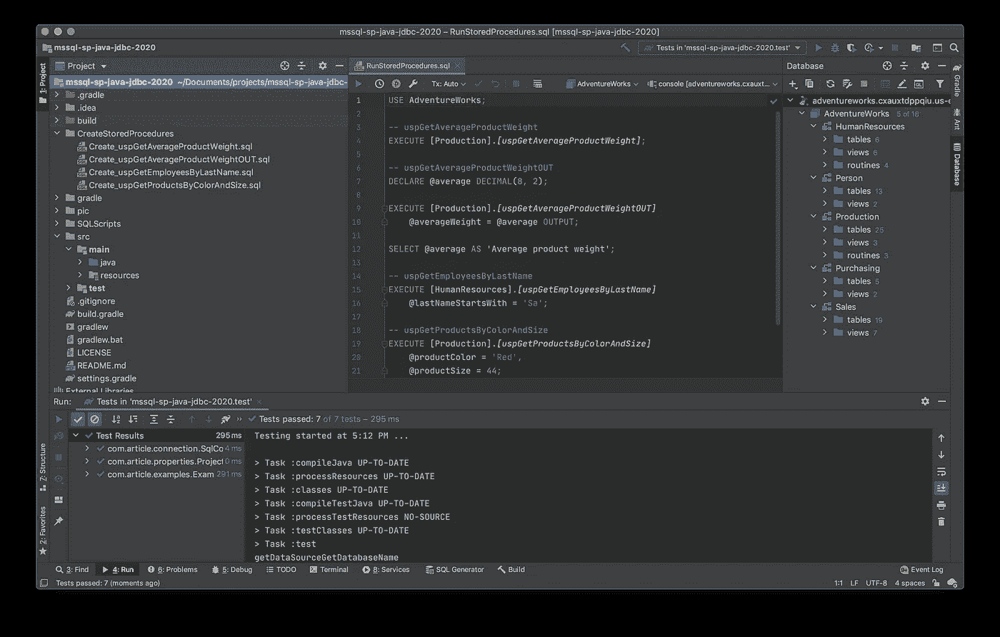
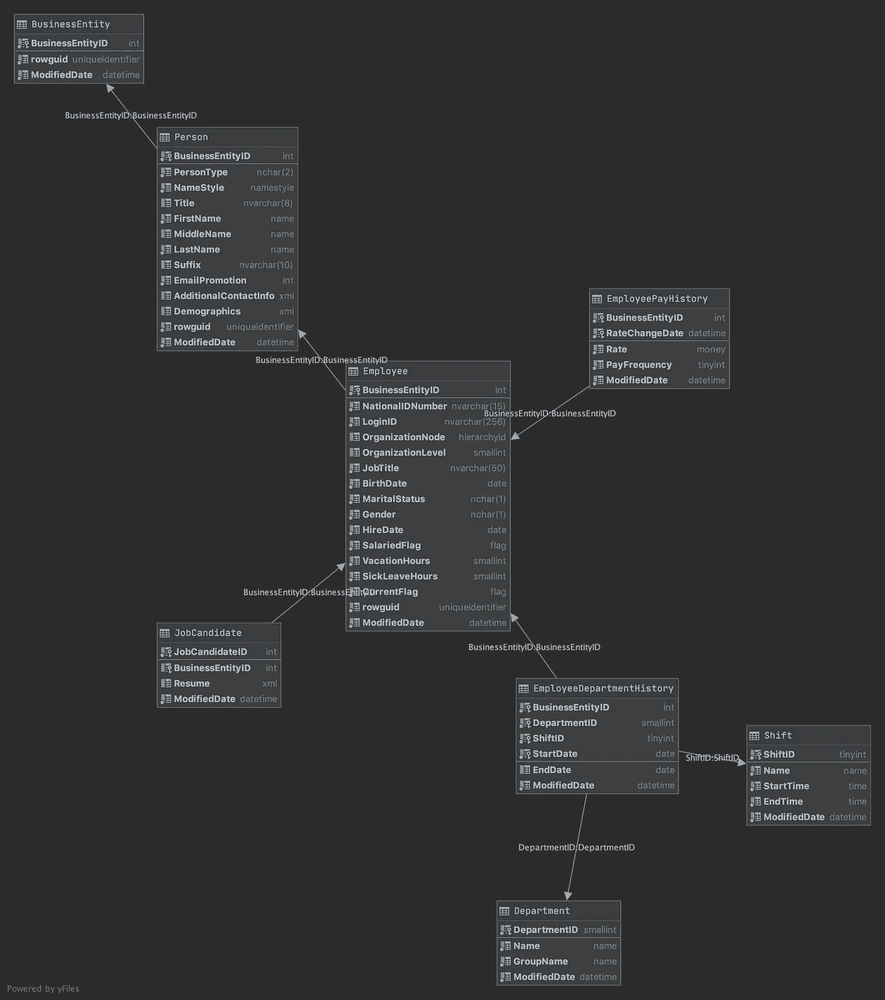
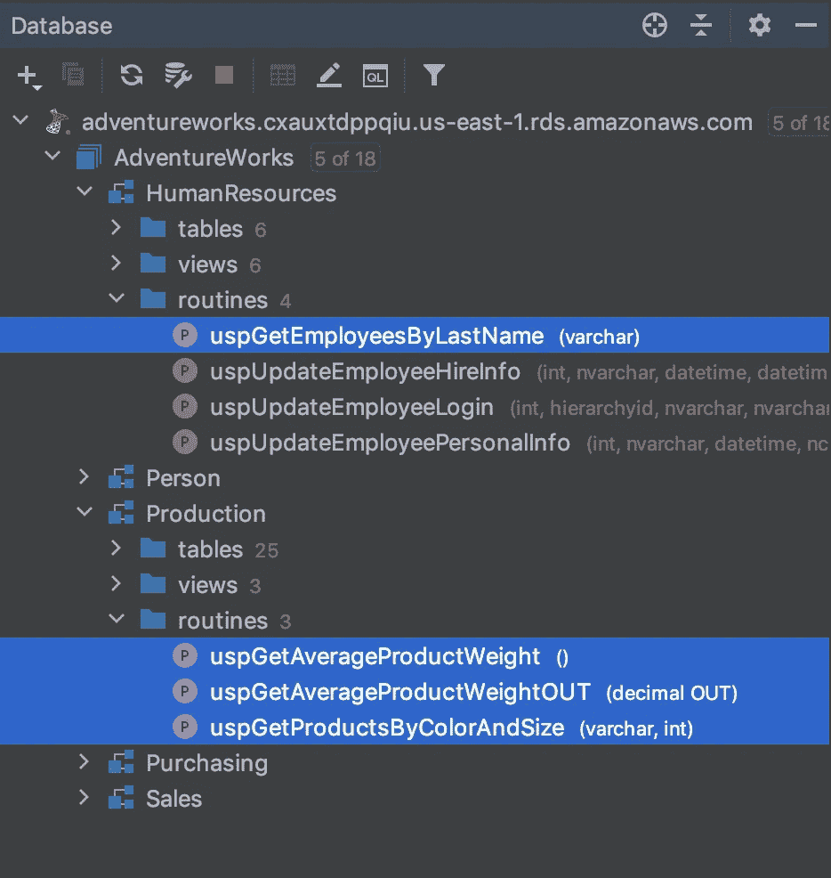
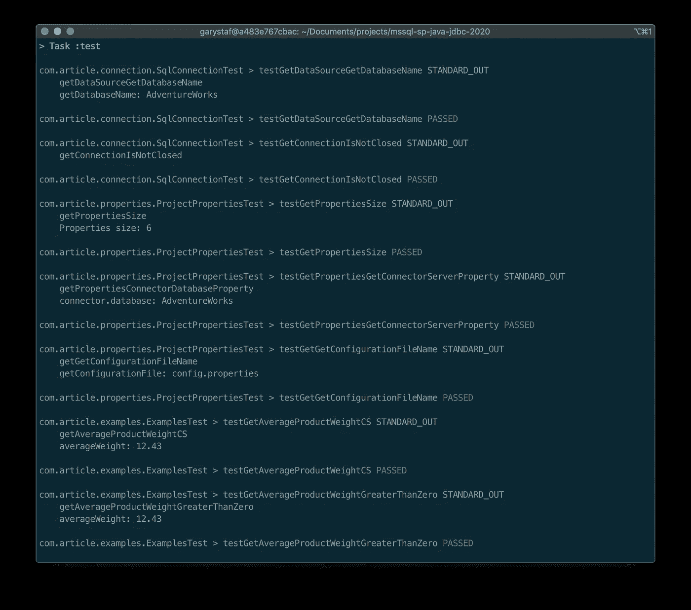
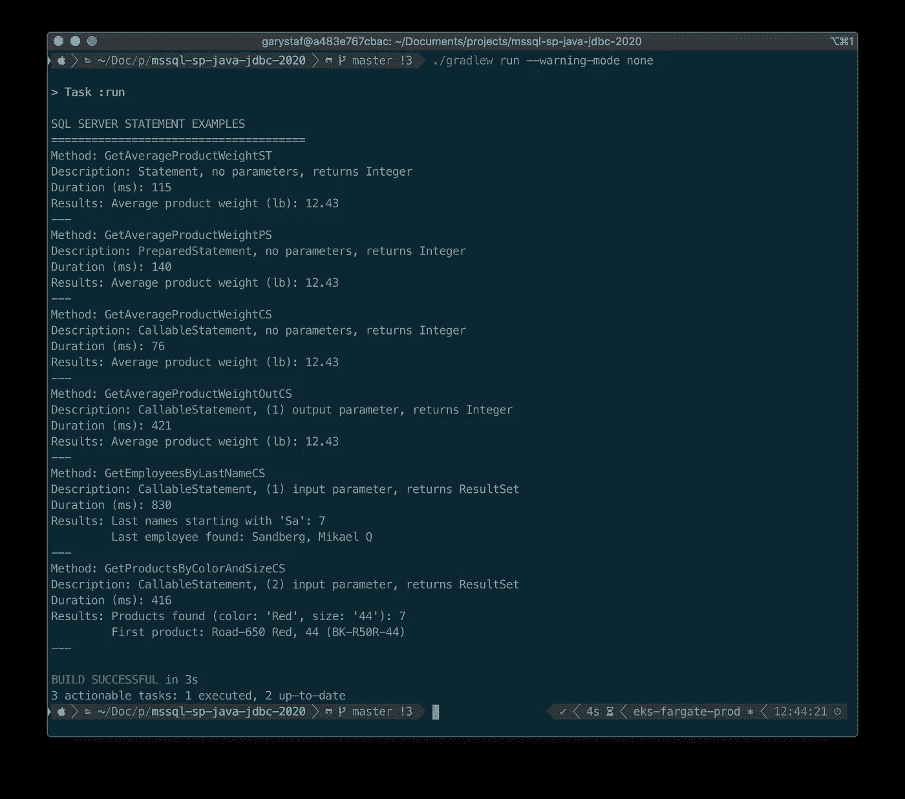
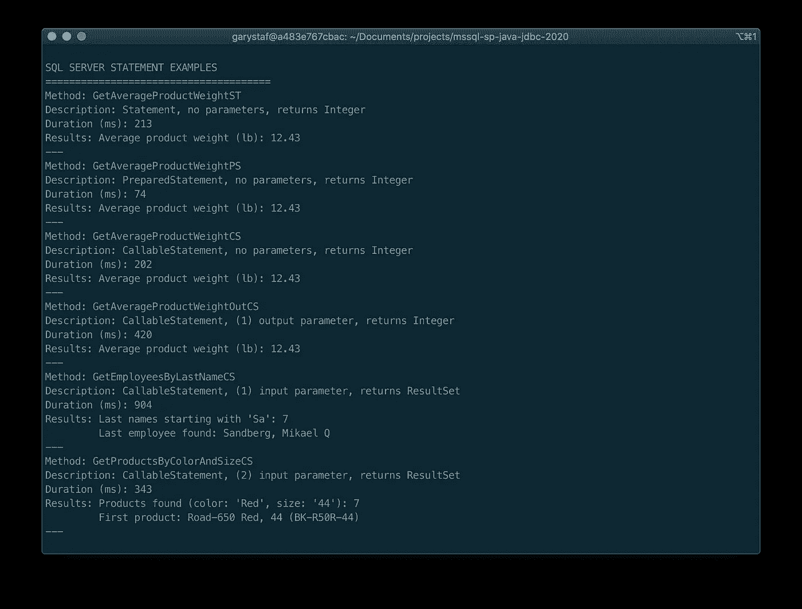

# 使用 Microsoft SQL Server 进行 Java 开发

> 原文：<https://towardsdatascience.com/java-development-with-microsoft-sql-server-ee6efd13f799?source=collection_archive---------34----------------------->

## 使用 JDBC 从 Java 应用程序调用 Microsoft SQL Server 存储过程

# 介绍

企业软件解决方案通常结合了多种技术平台。通过微软的。NET 应用程序，反之亦然，从基于 Java 的应用程序访问 Microsoft SQL Server 是很常见的。在本帖中，我们将探索如何使用 [JDBC](https://docs.oracle.com/javase/tutorial/jdbc/basics/index.html) (Java 数据库连接)API 从微软 SQL Server 2017 数据库中调用存储过程，并将数据返回给基于 Java 11 的控制台应用程序。



从 JetBrains 的智能界面查看 post 的 Java 项目

该员额的目标包括:

*   演示使用静态 SQL 语句和存储过程返回数据的区别。
*   演示三种返回数据的 JDBC 语句:`Statement`、`PreparedStatement`和`CallableStatement`。
*   演示如何使用输入和输出参数调用存储过程。
*   演示如何使用存储过程从数据库返回单个值和一个结果集。

# 为什么是存储过程？

为了访问数据，许多企业软件组织要求他们的开发人员在代码中调用存储过程，而不是对数据库执行静态的 [T-SQL](https://en.wikipedia.org/wiki/Transact-SQL) (Transact-SQL)语句。存储过程成为[首选](https://docs.microsoft.com/en-us/sql/relational-databases/stored-procedures/stored-procedures-database-engine?view=sql-server-ver15)有几个原因:

*   优化:存储过程通常由数据库管理员(DBA)或专门从事数据库开发的数据库开发人员编写。他们了解构造查询的最佳方式，以获得最佳性能和最小的数据库服务器负载。可以把它想象成开发人员使用 API 与数据库进行交互。
*   安全性:存储过程被认为比静态 SQL 语句更安全。存储过程提供了对查询内容的严格控制，防止对数据库执行恶意或无意的破坏性代码。
*   错误处理:存储过程可以包含处理错误的逻辑，以免错误上升到应用层，甚至最终用户。

# AdventureWorks 2017 数据库

为了简洁起见，我将使用一个现有的众所周知的微软 SQL Server 数据库， [AdventureWorks](https://github.com/microsoft/sql-server-samples/tree/master/samples/databases/adventure-works) 。AdventureWorks 数据库最初由 Microsoft 针对 SQL Server 2008 发布。尽管在体系结构上有点过时，但该数据库已经预先填充了大量用于演示的数据。



`HumanResources`模式，AdventureWorks 数据库中的五个模式之一

为了演示，我在 AWS 上创建了一个[Amazon RDS for SQL Server 2017 Express Edition](https://aws.amazon.com/rds/sqlserver/)实例。部署 SQL Server 有几种选择，包括 [AWS](https://aws.amazon.com/rds/sqlserver/) 、 [Microsoft Azure](https://azure.microsoft.com/en-us/services/sql-database/) 、 [Google Cloud](https://cloud.google.com/sql-server) ，或者安装在本地工作站上。

有许多方法可以将 [AdventureWorks](https://docs.microsoft.com/en-us/sql/samples/adventureworks-install-configure?view=sql-server-ver15&tabs=ssms) 数据库部署到 Microsoft SQL Server。为了这篇文章的演示，我使用了`AdventureWorks2017.bak` [备份文件](https://docs.microsoft.com/en-us/sql/samples/adventureworks-install-configure?view=sql-server-ver15&tabs=ssms)，我把它复制到了亚马逊 S3。然后[我启用并配置了](https://docs.aws.amazon.com/AmazonRDS/latest/UserGuide/SQLServer.Procedural.Importing.html)Amazon RDS for SQL Server 的本地备份和恢复特性，以导入并安装备份。

```
DROP DATABASE IF EXISTS AdventureWorks;
GO

EXECUTE msdb.dbo.rds_restore_database
     @restore_db_name='AdventureWorks',
     @s3_arn_to_restore_from='arn:aws:s3:::my-bucket/AdventureWorks2017.bak',
     @type='FULL',
     @with_norecovery=0;

-- get task_id from output (e.g. 1)

EXECUTE msdb.dbo.rds_task_status
     @db_name='AdventureWorks',
     @task_id=1;
```

# 安装存储过程

为了进行演示，我在 AdventureWorks 数据库中添加了四个存储过程，以便在本文中使用。为了跟进，您需要安装这些存储过程，它们包含在 [GitHub 项目](https://github.com/garystafford/mssql-sp-java-jdbc-2020)中。



JetBrains 的 IntelliJ IDE 数据库选项卡中的新存储过程视图

# 数据源、连接和属性

使用最新的 [Microsoft JDBC 驱动程序 8.4 for SQL Server](https://docs.microsoft.com/en-us/sql/connect/jdbc/download-microsoft-jdbc-driver-for-sql-server?view=sql-server-ver15) (版本 8.4.1.jre11)，我们创建一个 SQL Server 数据源`com.microsoft.sqlserver.jdbc.SQLServerDataSource`和数据库连接`java.sql.Connection`。创建和使用 JDBC 数据源和连接有多种模式。这篇文章不一定关注创建或使用这两者的最佳实践。在这个例子中，应用程序实例化了一个连接类`SqlConnection.java`，它又实例化了`java.sql.Connection`和`com.microsoft.sqlserver.jdbc.SQLServerDataSource`对象。数据源的属性由单例类实例`ProjectProperties.java`提供。这个类实例化了从配置属性文件`config.properties`中读取值的`java.util.Properties`类。启动时，应用程序创建数据库连接，调用每个示例方法，然后关闭连接。

# 例子

对于每个示例，我将展示存储过程(如果适用的话)，后面是调用该过程或执行静态 SQL 语句的 Java 方法。为了简洁起见，我在本文中省略了数据源和连接代码。同样，本文所有代码的完整副本可以在 [GitHub](https://github.com/garystafford/mssql-sp-java-jdbc-2020) 上获得，包括 Java 源代码、SQL 语句、辅助 SQL 脚本和一组基本的 [JUnit](https://junit.org/junit4/) 测试。使用下面的命令来`git clone`项目的本地副本。

```
git clone --branch master --single-branch --depth 1 --no-tags \
    [https://github.com/garystafford/mssql-sp-java-jdbc-2020.git](https://github.com/garystafford/mssql-sp-java-jdbc-2020.git)
```

要运行 JUnit 单元测试，使用项目所基于的 [Gradle](https://gradle.org/) ，使用`./gradlew cleanTest test --warning-mode none`命令。



JUnit 测试的成功运行

要使用项目所基于的 Gradle 构建和运行应用程序，请使用`./gradlew run --warning-mode none`命令。



Java 控制台应用程序的输出

## 示例 1: SQL 语句

在进入存储过程之前，我们将从一个简单的静态 SQL 语句开始。这个例子的方法`getAverageProductWeightST`使用了`[java.sql.Statement](http://docs.oracle.com/javase/1.4.2/docs/api/java/sql/Statement.html)`类。根据[甲骨文的 JDBC 文档](https://docs.oracle.com/javase/tutorial/jdbc/basics/processingsqlstatements.html),`Statement`对象用于执行静态 SQL 语句并返回其产生的结果。此 SQL 语句计算 AdventureWorks 数据库中所有产品的平均重量。它返回一个单独的`double`数值。此示例演示了从 SQL Server 返回数据的最简单方法之一。

```
*/**
 * Statement example, no parameters, returns Integer
 *
 ** ***@return*** *Average weight of all products
 */* public double getAverageProductWeightST() {
    double averageWeight = 0;
    Statement stmt = null;
    ResultSet rs = null;try {
        stmt = *connection*.getConnection().createStatement();
        String sql = "WITH Weights_CTE(AverageWeight) AS" +
                "(" +
                "    SELECT [Weight] AS [AverageWeight]" +
                "    FROM [Production].[Product]" +
                "    WHERE [Weight] > 0" +
                "        AND [WeightUnitMeasureCode] = 'LB'" +
                "    UNION" +
                "    SELECT [Weight] * 0.00220462262185 AS [AverageWeight]" +
                "    FROM [Production].[Product]" +
                "    WHERE [Weight] > 0" +
                "        AND [WeightUnitMeasureCode] = 'G')" +
                "SELECT ROUND(AVG([AverageWeight]), 2)" +
                "FROM [Weights_CTE];";
        rs = stmt.executeQuery(sql);
        if (rs.next()) {
            averageWeight = rs.getDouble(1);
        }
    } catch (Exception ex) {
        Logger.*getLogger*(RunExamples.class.getName()).
                log(Level.*SEVERE*, null, ex);
    } finally {
        if (rs != null) {
            try {
                rs.close();
            } catch (SQLException ex) {
                Logger.*getLogger*(RunExamples.class.getName()).
                        log(Level.*WARNING*, null, ex);
            }
        }
        if (stmt != null) {
            try {
                stmt.close();
            } catch (SQLException ex) {
                Logger.*getLogger*(RunExamples.class.getName()).
                        log(Level.*WARNING*, null, ex);
            }
        }
    }
    return averageWeight;
}
```

## 示例 2:预准备语句

接下来，我们将执行与示例 1 几乎相同的静态 SQL 语句。唯一的变化是增加了列名`averageWeight`。这允许我们按列名解析结果，与示例 1 中使用列的数字索引相比，代码更容易理解。

同样，我们不使用`java.sql.Statement`类，而是使用`java.sql.PreparedStatement`类。根据 [Oracle 的文档](https://docs.oracle.com/javase/tutorial/jdbc/basics/prepared.html)，一条 SQL 语句被预编译并存储在一个`PreparedStatement`对象中。然后，可以使用该对象多次有效地执行该语句。

```
*/**
 * PreparedStatement example, no parameters, returns Integer
 *
 ** ***@return*** *Average weight of all products
 */* public double getAverageProductWeightPS() {
    double averageWeight = 0;
    PreparedStatement pstmt = null;
    ResultSet rs = null;try {
        String sql = "WITH Weights_CTE(averageWeight) AS" +
                "(" +
                "    SELECT [Weight] AS [AverageWeight]" +
                "    FROM [Production].[Product]" +
                "    WHERE [Weight] > 0" +
                "        AND [WeightUnitMeasureCode] = 'LB'" +
                "    UNION" +
                "    SELECT [Weight] * 0.00220462262185 AS [AverageWeight]" +
                "    FROM [Production].[Product]" +
                "    WHERE [Weight] > 0" +
                "        AND [WeightUnitMeasureCode] = 'G')" +
                "SELECT ROUND(AVG([AverageWeight]), 2) **AS [averageWeight]**" +
                "FROM [Weights_CTE];";
        pstmt = *connection*.getConnection().prepareStatement(sql);
        rs = pstmt.executeQuery();
        if (rs.next()) {
            averageWeight = rs.getDouble("averageWeight");
        }
    } catch (Exception ex) {
        Logger.*getLogger*(RunExamples.class.getName()).
                log(Level.*SEVERE*, null, ex);
    } finally {
        if (rs != null) {
            try {
                rs.close();
            } catch (SQLException ex) {
                Logger.*getLogger*(RunExamples.class.getName()).
                        log(Level.*WARNING*, null, ex);
            }
        }
        if (pstmt != null) {
            try {
                pstmt.close();
            } catch (SQLException ex) {
                Logger.*getLogger*(RunExamples.class.getName()).
                        log(Level.*WARNING*, null, ex);
            }
        }
    }
    return averageWeight;
}
```

## 示例 3:可调用语句

在此示例中，平均产品重量查询已被移到存储过程中。该过程在功能上与前两个示例中的静态语句相同。为了调用存储过程，我们使用了`java.sql.CallableStatement`类。根据[甲骨文的文档](https://docs.oracle.com/javase/8/docs/api/java/sql/CallableStatement.html)，`CallableStatement`扩展了`PreparedStatement`。它是用于执行 SQL 存储过程的接口。`CallableStatement`接受输入和输出参数；然而，这个简单的例子既不使用。与前两个示例一样，该过程返回一个`double`数值。

```
CREATE OR
ALTER PROCEDURE [Production].[uspGetAverageProductWeight]
AS
BEGIN
  SET NOCOUNT ON;WITH
    Weights_CTE(AverageWeight)
    AS
    (
        SELECT [Weight] AS [AverageWeight]
        FROM [Production].[Product]
        WHERE [Weight] > 0
          AND [WeightUnitMeasureCode] = 'LB'
      UNION
        SELECT [Weight] * 0.00220462262185 AS [AverageWeight]
        FROM [Production].[Product]
        WHERE [Weight] > 0
          AND [WeightUnitMeasureCode] = 'G'
    )
  SELECT ROUND(AVG([AverageWeight]), 2)
  FROM [Weights_CTE];
ENDGO
```

调用的 Java 方法如下所示。

```
*/**
 * CallableStatement, no parameters, returns Integer
 *
 ** ***@return*** *Average weight of all products
 */* public double getAverageProductWeightCS() {
    CallableStatement cstmt = null;
    double averageWeight = 0;
    ResultSet rs = null;
    try {
        cstmt = *connection*.getConnection().prepareCall(
                "{call [Production].[uspGetAverageProductWeight]}");
        cstmt.execute();
        rs = cstmt.getResultSet();
        if (rs.next()) {
            averageWeight = rs.getDouble(1);
        }
    } catch (Exception ex) {
        Logger.*getLogger*(RunExamples.class.getName()).
                log(Level.*SEVERE*, null, ex);
    } finally {
        if (rs != null) {
            try {
                rs.close();
            } catch (SQLException ex) {
                Logger.*getLogger*(RunExamples.class.getName()).
                        log(Level.*SEVERE*, null, ex);
            }
        }
        if (cstmt != null) {
            try {
                cstmt.close();
            } catch (SQLException ex) {
                Logger.*getLogger*(RunExamples.class.getName()).
                        log(Level.*WARNING*, null, ex);
            }
        }
    }
    return averageWeight;
}
```

## 示例 4:使用输出参数调用存储过程

在本例中，我们使用了与例 3 几乎相同的存储过程。唯一的区别是包含了一个输出参数。这一次，不是在单个未命名的列中返回带有值的结果集，而是该列有一个名称`averageWeight`。现在，我们可以在检索值时通过名称来调用该列。

示例 3 和示例 4 中的存储过程模式都是常用的。一个过程使用输出参数，一个不使用，两个过程返回相同的值。您可以使用`CallableStatement`来选择任何一种类型。

```
CREATE OR
ALTER PROCEDURE [Production].[uspGetAverageProductWeightOUT]**@averageWeight DECIMAL(8, 2) OUT** AS
BEGIN
  SET NOCOUNT ON;WITH
    Weights_CTE(AverageWeight)
    AS
    (
        SELECT [Weight] AS [AverageWeight]
        FROM [Production].[Product]
        WHERE [Weight] > 0
          AND [WeightUnitMeasureCode] = 'LB'
      UNION
        SELECT [Weight] * 0.00220462262185 AS [AverageWeight]
        FROM [Production].[Product]
        WHERE [Weight] > 0
          AND [WeightUnitMeasureCode] = 'G'
    )
  SELECT **@averageWeight** = ROUND(AVG([AverageWeight]), 2)
  FROM [Weights_CTE];
ENDGO
```

调用的 Java 方法如下所示。

```
*/**
 * CallableStatement example, (1) output parameter, returns Integer
 *
 ** ***@return*** *Average weight of all products
 */* public double getAverageProductWeightOutCS() {
    CallableStatement cstmt = null;
    double averageWeight = 0;try {
        cstmt = *connection*.getConnection().prepareCall(
                "{call [Production].[uspGetAverageProductWeightOUT](?)}");
 **cstmt.registerOutParameter("averageWeight", Types.*DECIMAL*);**        cstmt.execute();
        averageWeight = cstmt.getDouble("averageWeight");
    } catch (Exception ex) {
        Logger.*getLogger*(RunExamples.class.getName()).
                log(Level.*SEVERE*, null, ex);
    } finally {
        if (cstmt != null) {
            try {
                cstmt.close();
            } catch (SQLException ex) {
                Logger.*getLogger*(RunExamples.class.getName()).
                        log(Level.*WARNING*, null, ex);
            }
        }
    }
    return averageWeight;
}
```

## 示例 5:使用输入参数调用存储过程

在本例中，该过程返回一个类型为`[java.sql.ResultSet](http://docs.oracle.com/javase/1.4.2/docs/api/java/sql/ResultSet.html)`的结果集，其雇员的姓氏以特定的字符序列开头(例如，“M”或“s a”)。使用`CallableStatement`将字符序列作为输入参数`lastNameStartsWith`传递给存储过程。

进行调用的方法遍历存储过程返回的结果集的行，将多个列连接起来，形成一个字符串形式的雇员全名。然后将每个全名字符串添加到一个有序的字符串集合中，即一个`List<String>`对象。列表实例由方法返回。您会注意到，由于使用了`LIKE`操作符，这个过程运行的时间会稍长一些。数据库服务器必须对表中的每个姓氏值执行模式匹配，以确定结果集。

```
CREATE OR
ALTER PROCEDURE [HumanResources].[uspGetEmployeesByLastName]
**@lastNameStartsWith VARCHAR(20) = 'A'** AS
BEGIN
  SET NOCOUNT ON;SELECT p.[FirstName], p.[MiddleName], p.[LastName], p.[Suffix], e.[JobTitle], m.[EmailAddress]
  FROM [HumanResources].[Employee] AS e
    LEFT JOIN [Person].[Person] p ON e.[BusinessEntityID] = p.[BusinessEntityID]
    LEFT JOIN [Person].[EmailAddress] m ON e.[BusinessEntityID] = m.[BusinessEntityID]
  WHERE e.[CurrentFlag] = 1
    AND p.[PersonType] = 'EM'
 **AND p.[LastName] LIKE @lastNameStartsWith + '%'**  ORDER BY p.[LastName], p.[FirstName], p.[MiddleName]
ENDGO
```

调用的 Java 方法如下所示。

```
*/**
 * CallableStatement example, (1) input parameter, returns ResultSet
 *
 ** ***@param*** *lastNameStartsWith
 ** ***@return*** *List of employee names
 */* public List<String> getEmployeesByLastNameCS(String lastNameStartsWith) {CallableStatement cstmt = null;
    ResultSet rs = null;
    List<String> employeeFullName = new ArrayList<>();try {
        cstmt = *connection*.getConnection().prepareCall(
                "{call [HumanResources].[uspGetEmployeesByLastName](?)}",
                ResultSet.*TYPE_SCROLL_INSENSITIVE*,
                ResultSet.*CONCUR_READ_ONLY*);**cstmt.setString("lastNameStartsWith", lastNameStartsWith);
**        boolean results = cstmt.execute();
        int rowsAffected = 0;// Protects against lack of SET NOCOUNT in stored procedure
        while (results || rowsAffected != -1) {
            if (results) {
                rs = cstmt.getResultSet();
                break;
            } else {
                rowsAffected = cstmt.getUpdateCount();
            }
            results = cstmt.getMoreResults();
        }
        while (rs.next()) {
            employeeFullName.add(
                    rs.getString("LastName") + ", "
                            + rs.getString("FirstName") + " "
                            + rs.getString("MiddleName"));
        }
    } catch (Exception ex) {
        Logger.*getLogger*(RunExamples.class.getName()).
                log(Level.*SEVERE*, null, ex);
    } finally {
        if (rs != null) {
            try {
                rs.close();
            } catch (SQLException ex) {
                Logger.*getLogger*(RunExamples.class.getName()).
                        log(Level.*WARNING*, null, ex);
            }
        }
        if (cstmt != null) {
            try {
                cstmt.close();
            } catch (SQLException ex) {
                Logger.*getLogger*(RunExamples.class.getName()).
                        log(Level.*WARNING*, null, ex);
            }
        }
    }
    return employeeFullName;
}
```

## 示例 6:将结果集转换为有序的对象集合

在最后一个例子中，我们将两个输入参数`productColor`和`productSize`传递给一个存储过程。存储过程返回包含几列产品信息的结果集。这一次，该示例的方法遍历该过程返回的结果集，并构造一个有序的产品集合，`List<Product>`对象。列表中的产品对象是`Product.java` [POJO](https://en.wikipedia.org/wiki/Plain_old_Java_object) 类的实例。该方法将每个结果集的行级字段值转换为一个`Product`属性(例如`Product.Size`、`Product.Model`)。使用集合是在应用程序中保持结果集中的数据的常用方法。

```
CREATE OR
ALTER PROCEDURE [Production].[uspGetProductsByColorAndSize]
 **@productColor VARCHAR(20),
  @productSize INTEGER** AS
BEGIN
  SET NOCOUNT ON;SELECT p.[ProductNumber], m.[Name] AS [Model], p.[Name] AS [Product], p.[Color], p.[Size]
  FROM [Production].[ProductModel] AS m
    INNER JOIN
    [Production].[Product] AS p ON m.[ProductModelID] = p.[ProductModelID]
  WHERE (p.[Color] = @productColor)
    AND (p.[Size] = @productSize)
  ORDER BY p.[ProductNumber], [Model], [Product]
ENDGO
```

调用的 Java 方法如下所示。

```
*/**
 * CallableStatement example, (2) input parameters, returns ResultSet
 *
 ** ***@param*** *color
 ** ***@param*** *size
 ** ***@return*** *List of Product objects
 */* public List<Product> getProductsByColorAndSizeCS(String color, String size) {CallableStatement cstmt = null;
    ResultSet rs = null;
 **List<Product> productList = new ArrayList<>();**try {
        cstmt = *connection*.getConnection().prepareCall(
                "{call [Production].[uspGetProductsByColorAndSize](?, ?)}",
                ResultSet.*TYPE_SCROLL_INSENSITIVE*,
                ResultSet.*CONCUR_READ_ONLY*);**cstmt.setString("productColor", color);
        cstmt.setString("productSize", size);
**        boolean results = cstmt.execute();
        int rowsAffected = 0;// Protects against lack of SET NOCOUNT in stored procedure
        while (results || rowsAffected != -1) {
            if (results) {
                rs = cstmt.getResultSet();
                break;
            } else {
                rowsAffected = cstmt.getUpdateCount();
            }
            results = cstmt.getMoreResults();
        }while (rs.next()) {
            Product product = new Product(
                    rs.getString("Product"),
                    rs.getString("ProductNumber"),
                    rs.getString("Color"),
                    rs.getString("Size"),
                    rs.getString("Model"));
            productList.add(product);
        }
    } catch (Exception ex) {
        Logger.*getLogger*(RunExamples.class.getName()).
                log(Level.*SEVERE*, null, ex);
    } finally {
        if (rs != null) {
            try {
                rs.close();
            } catch (SQLException ex) {
                Logger.*getLogger*(RunExamples.class.getName()).
                        log(Level.*WARNING*, null, ex);
            }
        }
        if (cstmt != null) {
            try {
                cstmt.close();
            } catch (SQLException ex) {
                Logger.*getLogger*(RunExamples.class.getName()).
                        log(Level.*WARNING*, null, ex);
            }
        }
    }
    return productList;
}
```

# 正确的 T-SQL:模式参考和括号

您会注意到，在所有的 T-SQL 语句中，我引用了模式以及表或存储过程的名称(例如，`{call [Production].[uspGetAverageProductWeightOUT](?)}`)。根据微软的说法，用一个模式名和对象名来引用数据库对象是一个很好的习惯，两者之间用句点隔开；这甚至包括默认模式(例如，`dbo`)。

您还会注意到我将模式和对象名放在方括号中(例如，`SELECT [ProductNumber] FROM [Production].[ProductModel]`)。方括号表示该名称代表一个对象，而不是一个[保留字](https://docs.microsoft.com/en-us/sql/t-sql/language-elements/reserved-keywords-transact-sql?view=sql-server-ver15)(例如`CURRENT`或`NATIONAL`)。默认情况下，SQL Server 添加这些以确保它生成的脚本正确运行。

# 运行示例

应用程序将显示被调用方法的名称、方法描述、检索数据所用的时间以及该方法返回的任何结果。

下面，我们来看看结果。



# SQL 语句性能

这篇文章当然不是关于 SQL 性能的，事实证明了这一点，我只是在一个单一的，非常不充分的 [db.t2.micro](https://aws.amazon.com/rds/instance-types/) Amazon RDS 实例类型上使用[Amazon RDS for SQL Server 2017 Express Edition](https://aws.amazon.com/rds/sqlserver/)。但是，我添加了一个定时器特性，`ProcessTimer.java`类，来捕获每个示例返回数据所花费的时间，以毫秒为单位。`ProcessTimer.java`类是项目代码的一部分。使用计时器，您应该可以观察到应用程序的第一次运行和后续运行之间对于几个被调用方法的显著差异。时间差是由几个因素造成的，主要是 SQL 语句的预编译和 SQL Server [计划缓存](https://www.sqlshack.com/understanding-sql-server-query-plan-cache/)。

通过使用 [DBCC](https://docs.microsoft.com/en-us/sql/t-sql/database-console-commands/dbcc-transact-sql?view=sql-server-ver15) (数据库控制台命令)语句[清除 SQL Server 计划缓存](http://msdn.microsoft.com/en-us/library/ms174283.aspx) ( *参见下面的 SQL 脚本*)可以轻松演示这两个因素的影响。然后连续运行应用程序两次。第二次，预编译和计划缓存将显著加快预处理语句和可调用语句的运行速度，如示例 2–6 所示。在下面显示的两次随机运行中，我们看到查询时间提高了 5 倍。

```
USE AdventureWorks;DBCC FREESYSTEMCACHE('SQL Plans');
GOCHECKPOINT;
GO-- Impossible to run with Amazon RDS for Microsoft SQL Server on AWS
-- DBCC DROPCLEANBUFFERS;
-- GO
```

第一次运行结果如下所示。

```
SQL SERVER STATEMENT EXAMPLES
======================================
Method: GetAverageProductWeightST
Description: Statement, no parameters, returns Integer
**Duration (ms): 122** Results: Average product weight (lb): 12.43
---
Method: GetAverageProductWeightPS
Description: PreparedStatement, no parameters, returns Integer
**Duration (ms): 146** Results: Average product weight (lb): 12.43
---
Method: GetAverageProductWeightCS
Description: CallableStatement, no parameters, returns Integer
**Duration (ms): 72** Results: Average product weight (lb): 12.43
---
Method: GetAverageProductWeightOutCS
Description: CallableStatement, (1) output parameter, returns Integer
**Duration (ms): 623** Results: Average product weight (lb): 12.43
---
Method: GetEmployeesByLastNameCS
Description: CallableStatement, (1) input parameter, returns ResultSet
**Duration (ms): 830** Results: Last names starting with 'Sa': 7
         Last employee found: Sandberg, Mikael Q
---
Method: GetProductsByColorAndSizeCS
Description: CallableStatement, (2) input parameter, returns ResultSet
**Duration (ms): 427** Results: Products found (color: 'Red', size: '44'): 7
         First product: Road-650 Red, 44 (BK-R50R-44)
---
```

第二次运行结果如下所示。

```
SQL SERVER STATEMENT EXAMPLES
======================================
Method: GetAverageProductWeightST
Description: Statement, no parameters, returns Integer
**Duration (ms): 116** Results: Average product weight (lb): 12.43
---
Method: GetAverageProductWeightPS
Description: PreparedStatement, no parameters, returns Integer
**Duration (ms): 89** Results: Average product weight (lb): 12.43
---
Method: GetAverageProductWeightCS
Description: CallableStatement, no parameters, returns Integer
**Duration (ms): 80** Results: Average product weight (lb): 12.43
---
Method: GetAverageProductWeightOutCS
Description: CallableStatement, (1) output parameter, returns Integer
**Duration (ms): 340** Results: Average product weight (lb): 12.43
---
Method: GetEmployeesByLastNameCS
Description: CallableStatement, (1) input parameter, returns ResultSet
**Duration (ms): 139** Results: Last names starting with 'Sa': 7
         Last employee found: Sandberg, Mikael Q
---
Method: GetProductsByColorAndSizeCS
Description: CallableStatement, (2) input parameter, returns ResultSet
**Duration (ms): 208** Results: Products found (color: 'Red', size: '44'): 7
         First product: Road-650 Red, 44 (BK-R50R-44)
---
```

# 结论

本文展示了使用 JDBC 和微软 JDBC 驱动程序 8.4 for SQL Server 从 SQL Server 2017 数据库查询和调用存储过程的几种方法。尽管这些示例非常简单，但是同样的模式也可以用于更复杂的存储过程，具有多个输入和输出参数，不仅可以选择数据，还可以插入、更新和删除数据。

您应该通过阅读[文档](https://docs.microsoft.com/en-us/sql/connect/jdbc/programming-guide-for-jdbc-sql-driver?view=sql-server-ver15)来了解用于 SQL Server 的微软 JDBC 驱动程序的一些限制。但是，对于大多数需要数据库交互的任务，该驱动程序为 SQL Server 提供了足够的功能。

本博客代表我自己的观点，不代表我的雇主亚马逊网络服务公司的观点。