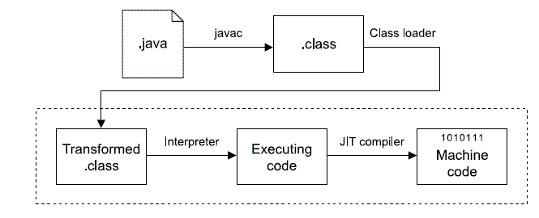

# 使用 Java 解决您的数据科学问题

> 原文：<https://towardsdatascience.com/java-for-data-science-f64631fdda12?source=collection_archive---------24----------------------->

## 通过了解这种广泛使用的编程语言的基础知识，快速访问高质量的数据。

Java——一次编写，随处运行。照片由[内森·绍特](https://www.pexels.com/photo/photo-of-man-riding-red-motor-scooter-2549355/)在[佩克斯](https://www.pexels.com/photo/photo-of-man-riding-red-motor-scooter-2549355/)拍摄。

Java 提供了多功能性、互操作性，以及开着红色 vespa 环游欧洲的机会。数据科学家被期望拥有良好的 Python(或 R)编码能力。我认为 Java 应该作为一个有用的工具加入到数据科学技能集中。

自 1995 年以来，Java 一直在啜饮浓咖啡，编写杀手级应用程序，偶尔还会向咖啡馆窗外投去渴望的一瞥。很可能已经有一个 Java 应用程序可以帮助你作为数据科学家的工作。

本文将帮助您了解一些基本知识，理解如何使用 Java 来支持机器学习，并查看一些资源以进一步学习。本文并不打算教你这种通用语言的实际语法。本文不会购买您的浓缩咖啡，但 Java 可能会。

在本指南中:

*   [Java 是什么？](#a505)
*   [为什么要学 Java？](#a505)
*   [Python 和 Java 的核心区别是什么？](#7579)
*   [总结](#7571)
*   [资源](#4d94)

## Java 是什么？

Java 是一种通用编程语言，它是基于类的、面向对象的，并且是为互操作性而设计的。说到部署环境，你可以说 Java 有一种不顾一切的态度——用 Java 编写的应用程序可以在任何可以运行 Java 虚拟机(JVM)的操作系统上运行。这种灵活性就是为什么 Java 是应用程序开发人员的最爱，他们寻求创建一个与操作系统无关的工具，并能很好地移植到移动设备上。

java 程序的源代码。java 文件)是用大括号语法编写的。程序被编译成可以在 JVM 上运行的字节码(一个. class 文件)。

通过键入`javac pdfParsingApp.java`将程序从源代码(如 pdfParsingApp.class)编译成字节码(如 pdfParsingApp.class)

如果你熟悉计算机科学基础中[机器码的概念，java 字节码是类似的——但是字节码不是为主机的特定架构编写的，而是为虚拟机编写的。](https://medium.com/coderbyte/eli5-computer-science-f8dfd7910311#e1de)

via [我的教程博客](https://mhadjis.wordpress.com/2013/08/01/is-java-a-compiled-or-interpreted-language/)

JVM 将 Java 字节码翻译成平台的机器语言——这就是 Java 的互操作性。JVM 能够从 Clojure、Scala 和其他编译成 Java 字节码的语言进行翻译。

## 为什么要学 Java？

虽然 Python 可能是数据科学世界的*通用语*(R 在较小程度上发挥了作用)，但就更广泛的开发人员社区而言，[估计有 40%的程序员使用 Java](https://insights.stackoverflow.com/survey/2020#technology-programming-scripting-and-markup-languages)。由于 Java 被广泛采用，至少粗略地了解一下 Java 包是如何构造、编写和实现的，可以帮助数据科学家更有效地与他们的软件工程同事交流。

此外，理解 Java 有助于机器学习管道的**数据获取和部署**阶段。

在数据采集阶段，Java 很有帮助，因为生产代码库通常是用 Java 编写的。作为一名数据科学家，在坏数据进入机器学习管道之前逆流而上修复坏数据的能力是非常宝贵的。在 SQL ( [被 55%的程序员使用](https://insights.stackoverflow.com/survey/2020#technology-programming-scripting-and-markup-languages))之后，Java 可能是解决后端数据问题和清理数据最有用的语言。

从模型开发到数据清理的倒退——这是我们试图通过数据工程改善数据质量来避免的。由 [Wilbur Wong](https://unsplash.com/@wilburwong?utm_source=medium&utm_medium=referral) 在 [Unsplash](https://unsplash.com?utm_source=medium&utm_medium=referral) 上拍摄的照片。

例如，在自然语言处理(NLP)中，我们处理大量非结构化的文本数据，这些数据被设计为人类可读，但计算机不可读。 [Apache PDFBox](https://pdfbox.apache.org/) 是一个 Java 库，旨在解决将 PDF 文本转换成可用格式的挑战。这个工具不仅支持内容提取，还可以用来修改现有文档和创建新文档。这将是一种非常酷的方式来报告基于文本分析的机器学习模型的输出。

说到部署， [Java 提供了对 Scala](https://docs.scala-lang.org/tutorials/scala-for-java-programmers.html) 的简单介绍。这种超快的语言运行在 JVM 上，经常被 DevOps 工程师用来将机器学习模型投入生产。

学习 Java 最有力的论据是，它为改进面向对象编程提供了坚实的基础。[计算机科学 101](https://medium.com/coderbyte/eli5-computer-science-f8dfd7910311) 课程通常以 Java 为基础语言，提供关于[数据结构&算法](https://www.youtube.com/watch?v=bum_19loj9A&list=PLGd_Hl6NWLZfj7cxJNLqAvDeF0OeQj5n0)的教学。因为 Java 提供的抽象不像 Python 那么多，所以它会提高你对计算机科学基础的整体知识。

一句话:当数据科学在计算机科学实践中得到正确定位时，每个人——数据科学家、软件工程师和他们所在的组织——都会受益。

 [## 软件 2.0

### 我有时看到人们将神经网络称为“你的机器学习工具箱中的另一个工具”。他们有一些…

medium.com](https://medium.com/@karpathy/software-2-0-a64152b37c35) 

## Python 和 Java 的核心区别是什么？

Python 是一种动态类型的解释语言。编写 Python 代码时，程序员不必声明每个变量的类型——类型是动态的、可变的。在运行时，解释器通过将每个语句翻译成一系列子例程，然后翻译成机器代码来执行 Python 程序。

Java 是一种静态类型的编译语言。在 Java 中创建新变量时，程序员负责声明类型。这种类型是静态的，不能改变。静态类型也意味着错误是在编译时被捕获的，而不是在运行时。我们已经讨论了 JVM 在从中间 Java 字节码(即通过编译创建的类文件)转换成特定于底层计算机硬件的机器代码。

Java 源文件就像一个俄罗斯套娃——它只能包含一个公共类，但可以包含任意数量的非公共类以及任意数量的公共内部类。via [Etsy](https://www.etsy.com/listing/684126700/set-of-5-blank-nesting-dolls-18-cm) 。

与使用 Python 相比，使用 Java 有更多的规则——无论是在语法方面(例如静态类型)还是在包结构方面。例如，一个 Java 源文件只能包含一个公共类。**源文件必须以其包含的公共类命名。**

例如，程序 pdfParsingApp.java 看起来像这样:

`**public static void main**` **行必须出现在每个 Java 程序**中(作为包库一部分的程序除外)。这是 main 方法的开始，它在执行时运行，本质上告诉 Java 程序要做什么。程序中的其他类可以提供 main 方法使用的信息。

## 摘要

学习 Java 是熟悉企业机器学习管道通常由多种语言组成这一概念的良好开端。您可能会使用与 Java 和 JVM 相关的技术来收集数据、清理数据并生产您的模型。另外，将 Java 添加到您的堆栈中会提高您编写基于类的、面向对象的程序的能力。

希望这篇文章能让您对 Java 如何对您的 DS 工作有用有一点直觉。利用您对 Python(或 R)的熟悉，您可以快速构建对 Java 的更好理解——以及更好的应用程序和模型部署。

## 资源

*   [丹·黑尔斯](/rewiring-your-brain-from-python-to-java-383960580098)[将你的大脑从 Python 重新连接到 Java](https://medium.com/u/81b7a04fbca0?source=post_page-----f64631fdda12--------------------------------)
*   [6 小时 Java 编程教程](https://www.youtube.com/playlist?list=PL_c9BZzLwBRKIMP_xNTJxi9lIgQhE51rF)作者[凯勒·库里](https://www.calebcurry.com/)
*   [构建肌肉记忆的 Codecademy Java](https://www.codecademy.com/learn/learn-java)
*   [JetBrains Academy 基于项目的 Java 学习方法](https://hyperskill.org/onboarding?_ga=2.173730602.868529341.1597001328-1552438823.1597001328&track=1)
*   [入门教程本书](https://beginnersbook.com/)

**如果你喜欢阅读这篇文章**，请关注我的 [Medium](https://medium.com/@nicolejaneway) 、 [LinkedIn](http://www.linkedin.com/in/nicole-janeway-bills) 和 [Twitter](https://twitter.com/Nicole_Janeway) ，了解更多提升你的数据科学技能的想法。

 [## 2020 年增强数据科学学习的资源

### 通过这个有用的期刊、视频和讲座的集合，推进你对机器学习的理解。

towardsdatascience.com](/supercharge-data-science-5bb7376d8572)  [## 数据分析师、数据科学家和机器学习工程师有什么区别？

### 以田径运动会为例，探究这些常见职位之间的区别。

towardsdatascience.com](/data-analyst-vs-data-scientist-2534fc1057c3)  [## 演练:在 Python 中映射 GIS 数据

### 通过 GeoPandas DataFrames 和 Google Colab 提高您对地理空间信息的理解

towardsdatascience.com](/walkthrough-mapping-gis-data-in-python-92c77cd2b87a)