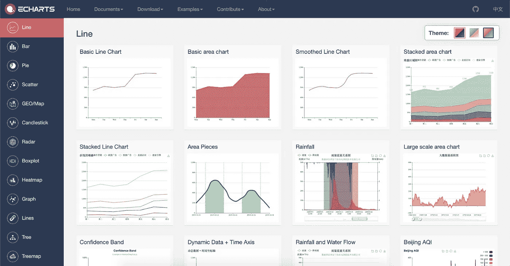
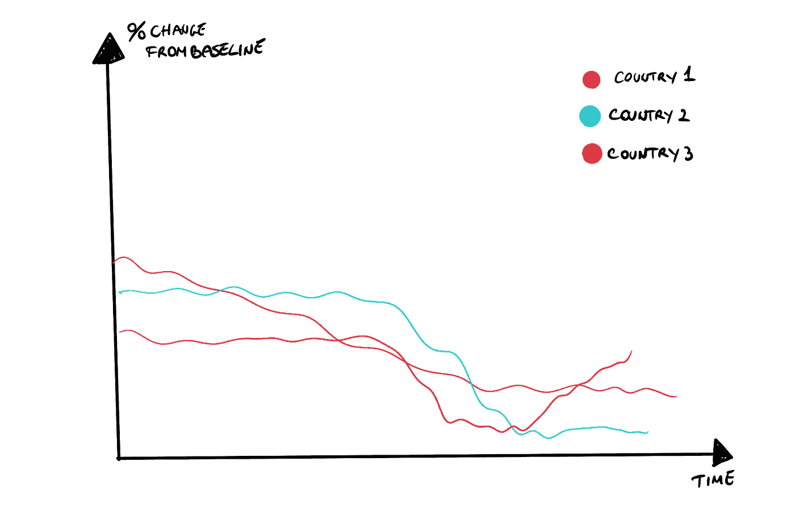
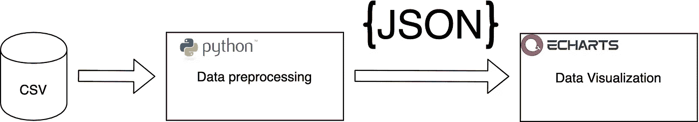
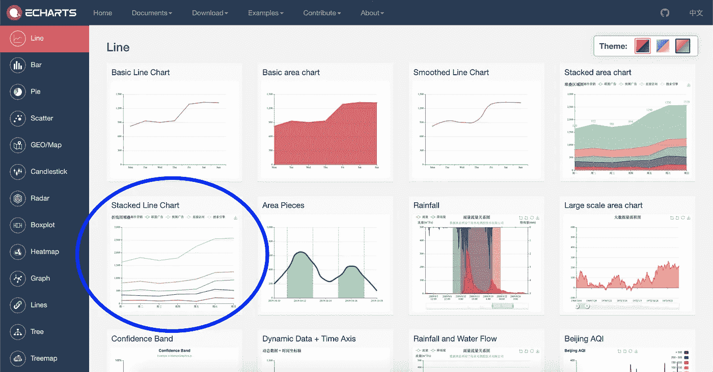
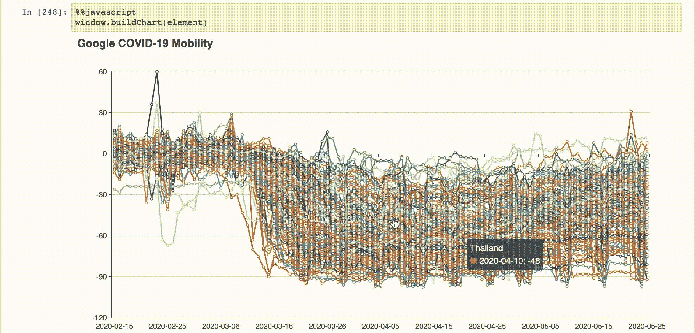
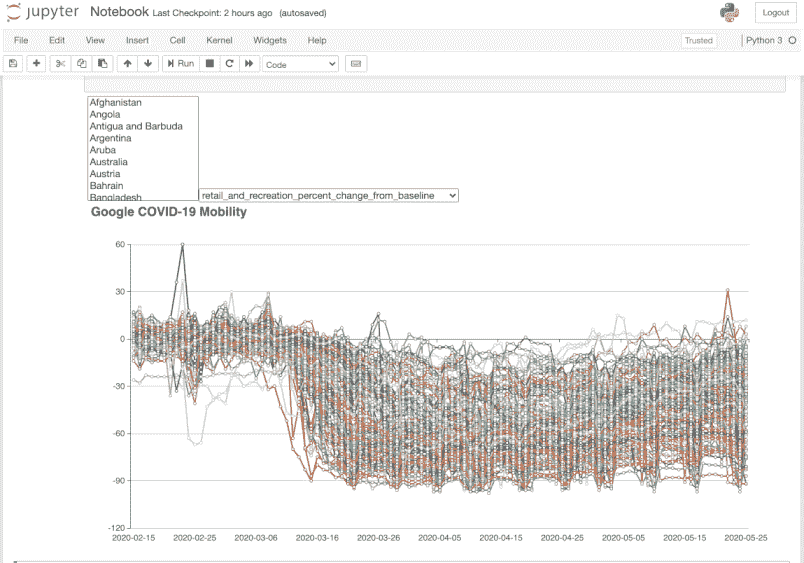

# Jupyter 笔记本上的 JavaScript 图表

> 原文：<https://towardsdatascience.com/javascript-charts-on-jupyter-notebooks-dd25f794cf6a?source=collection_archive---------14----------------------->

## 用漂亮的 JavaScript 可视化将 Jupyter 推向新的高度


照片是我的

作为一名专业人士，我喜欢把自己想象成数据科学家和前端开发人员的混合体。我在工作中真正喜欢的，是处理涉及这两个部分的项目。**然而，很多时候，我们没有时间去设计和实现一个完整的 web 应用程序，一个可靠的客户端-服务器架构和一个超级可重用的用户界面:在这种情况下，我们需要回到更快的东西。**

在接下来的文章中，我将向你展示如何给 Jupyter 笔记本加类固醇，实现**，一个交互式的可过滤的可视化，只需要几行 JavaScript** 。


# 工具

我们需要为数据可视化选择一个 JS 库。我们有几乎无限的选择；对于本指南，我们希望选择一些易于使用的东西。一些例子包括 [Highcharts](https://www.highcharts.com/demo/) 、 [ECharts](https://echarts.apache.org/en/index.html) 或 [d3.js](https://d3js.org/) ，

**我们将使用 ECharts** ，这是一个允许毫不费力地创建超级花哨的可视化效果的框架。该库最初是在百度开发的，但现在在 Apache 孵化器中。它是根据 Apache-2.0 许可的。

**JavaScript 可能并不总是数据科学家的武器库**(我发现这种语言的知识在具有计算机科学/编程背景的人中更常见)。**如果你不知道 JavaScript，那么考虑一下这些库使图表的生成变得非常容易**(如果你正在寻找非常复杂的交互，可能还需要做更多的工作)。ECharts 网站包含了**大量复制粘贴的例子，展现了几乎所有的特性**。



使用这些工具，唯一的“硬”工作就是处理数据，将它们转换成适合我们选择的特定图表类型的格式。

## 数据

我们将使用 [*谷歌新冠肺炎社区移动报告*](https://www.google.com/covid19/mobility/data_documentation.html?hl=en) *** 数据*。*这个数据集包含了每个国家在一个地理区域[[*1*](https://www.google.com/covid19/mobility/data_documentation.html?hl=en)*]，【T25 内去杂货店和公园等地方的百分比变化，它是由谷歌设计来帮助抗击新冠肺炎的。让我们来看一段摘录并描述一下这些列:*

*   `country_region_code`:国家代码。我们将从分析中过滤掉这个字段。
*   `country_region`:国家名称。
*   `sub_region_1`和`sub_region_2`:地理区域的两个更精细的视图。对于我们想要实现的图表，我们可以过滤掉这些。我们将只考虑`sub_region_1`为`null`的行(因此我们只考虑汇总数据，而不考虑每个子区域的信息)
*   `date`:简单的日期。
*   `retail_and_recreation_percent_change_from_baseline` : *餐馆、咖啡馆、购物中心、主题公园、博物馆、图书馆和电影院等场所的移动趋势。【*[*2*](https://www.google.com/covid19/mobility/data_documentation.html?hl=en)*】*
*   `grocery_and_pharmacy_percent_change_from_baseline` : *杂货店、食品仓库、农贸市场、特色食品店、药店和药房等场所的移动趋势。【*[*2*](https://www.google.com/covid19/mobility/data_documentation.html?hl=en)*】*
*   `parks_percent_change_from_baseline` : *当地公园、国家公园、公共海滩、码头、狗公园、广场和公园等地的移动趋势。【*[*2*](https://www.google.com/covid19/mobility/data_documentation.html?hl=en)*】*
*   `transit_stations_percent_change_from_baseline` : *地铁、公交、火车站等公共交通枢纽的移动趋势。【*[*2*](https://www.google.com/covid19/mobility/data_documentation.html?hl=en)*】*
*   `workplaces_percent_change_from_baseline` : *工作场所的移动趋势。【*[*2*](https://www.google.com/covid19/mobility/data_documentation.html?hl=en)*】*
*   `residential_percent_change_from_baseline` : *居住地流动趋势。【*[*2*](https://www.google.com/covid19/mobility/data_documentation.html?hl=en)*】*

太好了，我们需要的东西都有了，让我们开始研究代码吧！

> *谷歌有限责任公司*“谷歌新冠肺炎社区移动性报告”*。
> https://www.google.com/covid19/mobility/访问:<日期>。

# 你好世界！

本文的主题不是用 ECharts 创建一个超级漂亮的图表，而是展示如何在 Jupyter 笔记本上启用这个功能。**出于这个原因，我们将只实现一个可视化:一个多线图，显示数据集**中可用的每个 KPI 的时间序列。



Jupyter 单元可以解释各种类型的内容，从 Python 代码到 Markdown。注入 JavaScript 代码有多难？幸运的是，对我们来说，这就像使用一个[**Jupyter magic**](https://ipython.readthedocs.io/en/stable/interactive/magics.html)**一样简单！**通过单元格魔术，我们可以指示笔记本以特定的方式读取单元格内容，对于 JavaScript 我们可以使用`%%javascript`魔术。

太棒了。**我们知道如何在单元格中写 JS。工作流程应该如下**:

1.  我们**使用 Pandas** 读取 CSV，并根据需要对数据集进行预处理。
2.  **虽然仍然在 Python 代码中，但我们将数据转换成 JSON 字符串**，这样我们就可以很容易地在 JavaScript 中操作它。
3.  **我们*将 JSON* 传递给 JavaScript 代码**来生成可视化。



只是一个模式来了解数据流

**最简单的方法是将所有的 Python 代码组织在一个函数**中，在我们的例子中称为`get_data()`。对于这个**第一个**示例，我们将只显示与`retail_and_recreation_percent_change_from_baseline`指示器相关的时间序列。

我们将提供给 JavaScript 的 JSON 将具有以下形式:

```
{
  "dates":[<array of all the dates (sorted)>],
  "country_data":[
     {"name":"Country Name 1",
      "data":[<array of all the KPI's values, sorted by date>]
     }, 
     ...
     {"name":"Country Name N-1",
      "data":[<array of all the KPI's values, sorted by date>]
     }, {"name":"Country Name N",
      "data":[<array of all the KPI's values, sorted by date>]
     },
   ]
}
```

此时，我们有了数据:**我们只需要在 JavaScript 单元格**中访问它们。首先，我们需要导入 ECharts:为此，我们可以使用一个名为`requirejs`的模块:

稍后，我们将能够使用上面的方法在`ech`变量中存储 ECharts 对象。

**为了让 JS 和 Python 交流，我们必须在某个地方存储** `**get_data()**` **函数**的结果。让所有其他单元格都可以访问数据的一个非常简单的方法是将输出保存在一个`window`属性中:也就是说，我们将把 JSON 字符串保存在全局变量`window.outputVar`中。**虽然在** `**window**` **中存储东西几乎从来都不是 JavaScript 开发的最佳实践，但我认为我们可以接受这种妥协来保持代码简单一点**。

在`%%javascript`单元格中，我们可以使用`IPython.notebook.kernel.execute()`函数执行 Python 代码。没有深入研究细节([不幸的是，这个函数似乎缺少好的文档](https://github.com/jupyter/notebook/issues/2219))，这个函数接受一个字符串作为第一个参数:**这个字符串是将要执行的实际 Python 代码(因此我们将所有内容存储在一个函数中，以使这部分更简洁)**。
第二个参数描述 Python 之后需要执行哪些 JavaScript 回调。

[我们之所以不能“简单地返回”](https://codeburst.io/javascript-what-the-heck-is-a-callback-aba4da2deced) `[get_data()](https://codeburst.io/javascript-what-the-heck-is-a-callback-aba4da2deced)` [结果，而是需要一个“回调”和一个全局外部变量，这是我在本文中不谈论的，以免偏离实际主题。然而，上面发生的事情简单如下:](https://codeburst.io/javascript-what-the-heck-is-a-callback-aba4da2deced)

1.  执行`get_data()`功能。
2.  执行之后，一个 JavaScript 函数读取结果，删除一些不需要的字符(快速而肮脏的解决方案，抱歉)，**将字符串转换为 JSON 对象，并将 JSON 保存在一个变量中，这个变量现在可以在页面**中全局访问。

**最后，好玩的部分！让我们深入到 ECharts 示例中，找到一个适合我们需要的可视化效果**(想法是只复制-粘贴-编辑一些代码):[堆积折线图应该是一个很好的起点](https://echarts.apache.org/examples/en/editor.html?c=line-stack):



简单来说，**ECharts viz 生成分三步进行**:

1.  创建将包含可视化效果的 HTML 元素。
2.  在元素上初始化 ECharts 对象
3.  通过`setOption`方法设置图表选项。“选项”只是一个 JSON 对象，指示 ECharts 做什么。

除了所有视觉上的细微差别(颜色、工具提示等。)，**最重要的部分在于从上面**的 JSON 开始生成数据。我们需要创建两个对象:一个用于 x 轴，另一个用于 y 轴。

**x 轴数值** 这将包含我们想要显示的所有日期。**该列表需要保存在图表选项**的 `**xAxis**` **属性中:**

```
xAxis: {
        type: 'category',
        data: [<array with all the dates (sorted)>]
       },
```

**系列** 这将包含我们想要显示的实际数据。**`**series**`**属性由一个对象数组组成，其中每个元素都是图表**中的一行:**

```
series: [
    {
            name: 'Country 1',
            type: 'line',
            data: [<Array with values for each date>]
    },
        ...
    {
            name: 'Country N',
            type: 'line',
            data: [<Array with values for each date>]
        },
]
```

**生成 viz 的代码如下:**

**如您所见，所有代码都保存在一个函数中，这个函数存储在**中，同样，在`window`全局对象中:(**；**最后一步是做最后的调用**:**

**注意，在上面的例子中，我们将`element`变量传递给了`buildChart()`函数。**EChart 可视化将追加到** `**element**` **(即执行** `**buildChart()**` **功能的单元格)**。输出如下所示:**

****

# **添加过滤器**

**两个问题:**第一，图表不可读——线太多——第二，我们只能看到其中一个指标**。我们真的希望有两个 HTML 元素来选择想要显示的国家和 KPI。有多种方法可以做到这一点，我们将选择最简单的一种！**

****我们需要稍微修改** `**build_data()**` **来返回所有的 KPI**。让我们将该功能重命名为`build_data_all()`:**

**新的 JSON 结构如下:**

```
{
   "dates": [<Dates>],
   "country_data": [
      {
       "name": "<Country Name>",
       "retail_and_recreation_percent_change_from_baseline": [<Array of values for this KPI>],
       "parks_percent_change_from_baseline": [Array of values for this KPI],
       "transit_stations_percent_change_from_baseline": [Array of values for this KPI],
       "workplaces_percent_change_from_baseline": [Array of values for this KPI],
       "residential_percent_change_from_baseline": [Array of values for this KPI]
       },
      ...
   ]
}
```

**想法是在页面**中插入两个 HTML 选择元素**:**

*   ****一个包含国家列表**(这将是一个多选，以便我们可以同时显示多个国家)。**
*   ****一个包含 KPI 列表**。**

****和前面代码唯一的区别就是我们需要 e 根据用户选择**过滤 JSON。每当用户更改一个选项时，UI 都需要更新图表。**

> **虽然对于 JavaScript 开发来说，在`window`中存储东西几乎从来都不是最佳实践，但我认为我们可以接受这种妥协，让代码简单一点。**

**下面的代码片段创建了两个 HTML `select`元素，并将它们附加到单元格中:**

****注意，我们将事件监听器附加到了选择框**，这样每当选择被修改时，viz 就会被刷新**。此外，注意所有的函数都存储在`window`对象中，使它们可以全局访问。****

****我们已经准备好实现新的函数来生成图表**:**

**我们就要结束了，让我们写一个函数，当一个输入改变时，它进行刷新:**

**最后，**让我们调用单独单元格中的所有内容**:**

****

**你可以在这里找到完整的笔记本。**

**希望你喜欢[随时关注我的 Medium！](https://medium.com/@andrea.ialenti)**

# **外卖食品**

*   ****JavaScript 可以成为 Matplotlib 或其他图表库的有效替代品**；这项技术的主要优点之一是有大量的资源和选择。**
*   ****Jupyter 笔记本可以包含不同类型的代码，包括 JavaScript** :使用魔法命令(在本例中为`%%javascript``)可以非常容易地实现这一点**
*   **可以包含任何 JS 库，理论上，可以只与独立的笔记本交互(没有外部文件)**
*   ****没有任何调整，笔记本需要在每次页面刷新时重新运行****

# **看看这些其他的文章！**

**[](/the-art-of-joining-in-spark-dcbd33d693c) [## 火花中加入的艺术

### Spark 中加速连接的实用技巧

towardsdatascience.com](/the-art-of-joining-in-spark-dcbd33d693c) [](/clustering-pollock-1ec24c9cf447) [## 聚类波洛克

### 杰森·布拉克绘画的聚类分析——如何利用 k-means 进行色彩分组

towardsdatascience.com](/clustering-pollock-1ec24c9cf447)**