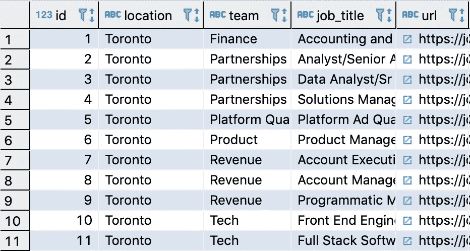
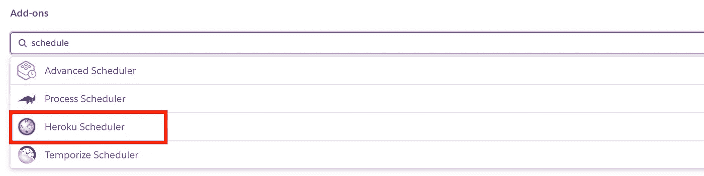
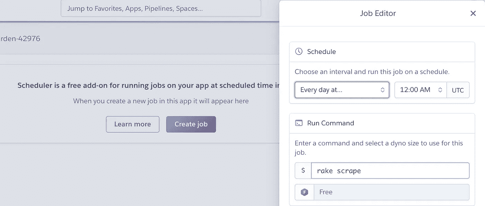

# 用轨道刮除工作板

> 原文：<https://towardsdatascience.com/job-board-scraping-with-rails-872c432ed2c8?source=collection_archive---------20----------------------->

## 用 Ruby on Rails 和 Heroku 构建一个调度作业刮刀


唐纳德·詹纳蒂在 [Unsplash](https://unsplash.com/s/photos/satellite?utm_source=unsplash&utm_medium=referral&utm_content=creditCopyText) 上拍摄的照片

与工作相关的数据是我最喜欢处理的数据之一。解析需求和分析跨时间、公司和地域的变化很有趣。

虽然有一些很棒的[公共数据库](https://www.kaggle.com/c/job-salary-prediction/data)有与工作相关的信息，但也很容易找到。

我们将在 Ruby on Rails 中构建一个每天自动运行一次的工作板刮刀，托管在 Heroku 的免费层上。

# 设置

假设你已经安装了 rails，创建一个新的 Rails 应用程序并`cd`到它的根目录。

```
$ rails new scraper-2020-03
$ cd scraper-2020-03/
```

然后修改`Gemfile`，这里设置了 ruby 依赖关系。注释掉这一行。

```
# gem 'sqlite3'
```

加上这一行。

```
gem 'pg'
```

然后运行这个来更新已安装的软件包。

```
$ bundle install
```

我们刚刚用 Postgres 替换了 Sqlite。

# 配置数据库

打开`/config/database.yml`并更新文件，如下所示。

```
default: &default
  adapter: postgresql
  pool: 5
  timeout: 5000

development:
  <<: *default
  database: scraper_development

test:
  <<: *default
  database: scraper_test

production:
  <<: *default
  url: <%= ENV['DATABASE_URL'] %>
```

这里重要的部分是设置`development`的数据库名称`database: scraper_development`和`production`的 URL`url: <%= ENV[‘DATABASE_URL’] %>`。

后者对我们部署到 Heroku 很重要。Heroku 默认将 Postgres 插件的 URL 设置为环境变量`DATABASE_URL`。

现在在本地创建一个数据库。它将被命名为我们上面设置的名称。

```
$ rake db:create
```

# 创建 ORM 模型

生成迁移文件。这是我们指定要对数据库进行什么更改的地方。

```
$ rails g migration CreateJobs
```

导航到刚刚生成的迁移文件。我的是`db/migrate/20200328142555_create_jobs.rb`，时间戳会有所不同。

编辑它，如下图所示。

```
class *CreateJobs* < ActiveRecord::Migration[5.0]
  def change
    create_table :jobs do |*t*|
      *t*.string :location
      *t*.string :team
      *t*.string :job_title
      *t*.string :url

      *t*.timestamps
    end
  end
end
```

我们正在创建一个名为`jobs`的表，它有几个字符串列来存储抓取的信息。默认情况下会添加一个主`id`。`t.timestamps`将添加`created_at`和`updated_at`列，当您将记录插入数据库时，这些列会自动填充。

在`/app/models/`中创建名为`job.rb`的文件。这是我们的模型。应该是这样的。

```
class *Job* < ApplicationRecord
end
```

# 创建一个耙子任务

在`/lib/tasks`中创建一个名为`scrape.rake`的新文件。Rails 中的 Rake 任务是用于自动化管理任务的命令，可以从命令行运行。如果你想写代码并安排它运行的时间，这里是放代码的地方。

更新`scrape.rake`。

```
task scrape: :environment do
  puts 'HERE'

  require 'open-uri'

  *URL* = 'https://jobs.lever.co/stackadapt'

  *doc* = Nokogiri::HTML(open(URL))

  *postings* = *doc*.search('div.posting')

  *postings*.each do |*p*|
    *job_title* = *p*.search('a.posting-title > h5').text
    *location* = *p*.search('a.posting-title > div > span')[0].text
    *team* = *p*.search('a.posting-title > div > span')[1].text
    *url* = *p*.search('a.posting-title')[0]['href']

    *# skip persisting job if it already exists in db* if Job.where(job_title:*job_title*, location:*location*, team:*team*, url:*url*).count <= 0
      Job.create(
        job_title:*job_title*,
        location:*location*,
        team:*team*,
        url:*url*)

      puts 'Added: ' + (*job_title* ? *job_title* : '')
    else
      puts 'Skipped: ' + (*job_title* ? *job_title* : '')
    end

  end
end
```

用 Nokogiri (Ruby 的 html 解析库)导航 html 超出了我们的范围，但是如果你打开网页查看，你可以按照我的方法解析 DOM 树。

# 本地运行

应用程序都设置好了。本地运行就这么简单。

```
$ rake scrape
```

在我的本地数据库中，我现在可以看到数据。如果您没有好的工具来查看本地数据库，可以考虑使用 [dbeaver](https://dbeaver.io/) 。



我们唯一的问题是我们不想每天手动运行它。通过部署到 Heroku 并安排任务来解决这个问题。

# 部署到生产环境

在浏览器中创建或登录您的 Heroku 帐户。

然后在命令行中键入以下内容。它将使用您的浏览器进行身份验证。

```
$ heroku login
```

运行以下命令在 Heroku 上创建您的应用程序。

```
$ heroku create
```

Heroku 将输出它给你的应用程序的名字作为响应。我的叫`fast-garden-42976`。

现在在本地设置 git。

```
$ git init
$ git add . -A
$ git commit -m 'The first and last commit'
```

使用 Heroku 给你的名称(不是我的名称)添加你的应用程序，以便我们可以部署。

```
$ heroku git:remote -a fast-garden-42976
```

并展开。

```
$ git push heroku master
```

完成后，迁移 Heroku 上的数据库。

```
$ heroku run rake db:migrate
```

# 在生产中配置调度程序

通过手动运行命令在生产环境中测试它。

```
$ heroku run rake scrape
```

现在我们只需要将 rake 任务设置为一个调度作业。

在 Heroku web 控制台中，单击“资源”。


开始键入“schedule”并提供 Heroku Scheduler。



单击您刚刚添加的调度程序，然后单击“创建作业”。



配置`rake scrape`作业，每天午夜运行一次。

*要善良，不要多刮地盘。*

瞧啊。你的应用程序现在将每 24 小时添加一次新工作。

当您想要访问这些数据时，可以考虑像 Postico 这样的应用程序，它允许直接连接到 Heroku 中的远程数据库。或者，您可以从 Heroku 下载数据库并将其导入本地。

# 结论

这是一个快速简单的抓取应用程序。我们获取了每项工作的一些初步信息，并将其存入数据库。

如果你想更进一步，可能还需要补充一些东西。

*   打开存储的 URL 以获取工作描述。
*   如果抓取多个工作公告板，请在数据库中添加另一列来存储公司名称。

我希望这是有益的，我很乐意回答评论中的问题。