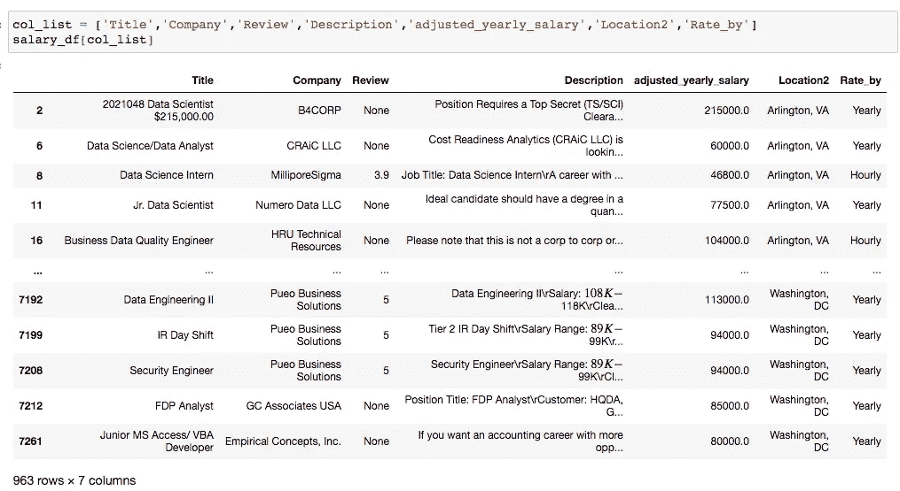
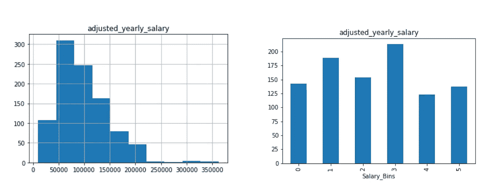
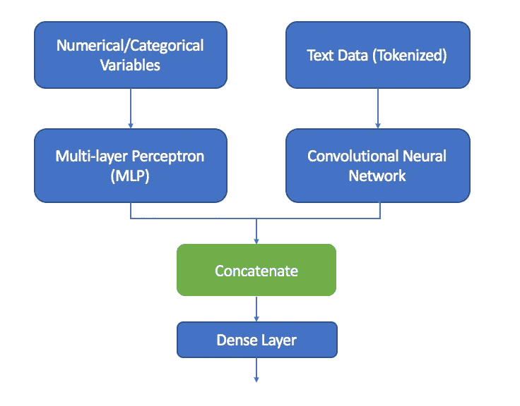

# 基于 NLP、机器学习和深度学习的工作薪酬预测

> 原文：<https://towardsdatascience.com/job-salary-prediction-with-nlp-machine-learning-and-deep-learning-b87a96336b08?source=collection_archive---------21----------------------->

## 利用从 Indeed.com 搜集来的职位信息进行工作薪水预测项目的第二部分

Clem Onojeghuo 在 Unsplash 上拍摄的照片

## 项目背景

找工作最重要的事情之一是知道你现在在哪里，你下一步想去哪里。求职者的心态很像产品经理，试图找到最适合的产品和市场。聪明的产品经理知道他们的客户想要什么。因此，他们仔细地找出客户的需求，这些需求通过职位描述中的“最高资格”、“你必须具备的条件”来表达。在确定了市场上普遍需要的东西之后，聪明的产品经理会定制他们的产品，比如简历、求职信、在线简介、作品集，以尽可能展示这些特点和特质。这个项目是为了帮助你成为那个聪明的产品经理，告诉你什么样的品质和顶级技能是市场所需要的，并进一步帮助你在工资谈判中导航，做出最佳选择！

怎么会？该项目将在美国主要城市的数据/分析领域取消 10000 多个职位，以及职位名称、公司、公司评论、城市、职位描述、薪资范围等信息。我们将从职位描述文本中提取特征，并在机器学习和深度学习模型中使用这些特征。稍后，我们将把文本特征与生活成本指数、购买力指数、位置等其他特征结合起来，为模型添加更多的颜色。

## 数据集

我放弃了 Indeed.com 的 12，115 份工作，主要集中在数据相关领域，如数据分析、数据科学/数据工程、商业分析、数据库管理等。如果你对我如何收集数据感兴趣，请查看我在这里发布的部分。

在初始数据清理(删除重复项、检查 nan 等)之后。)，留下了 964 个工资明确的岗位。Indeed.com 只有 8%的招聘信息有工资条😂。964 不是一个大数字，但对这个项目来说应该没问题。

我还预处理了位置和薪水列。原始工资信息包括小时工资率、月工资率和年工资率。所以我使用了一些正则表达式技术来清理它们，并将其转换为平均年利率。

这是数据现在的样子。

连续的工资数据被转换成更平衡的箱，以获得更好的预测结果。所以现在我们有 6 个箱子:0-50k 美元、50k-70k 美元、70k-90k 美元、90k-120k 美元、120k-150k 美元和 150k+。

连续工资数据被转到工资箱

我还有另一张表，上面有美国主要城市的生活成本指数，房租成本指数，购买力指数。我将在这篇文章的后面使用它们。

# 建模

现在我们来看建模部分。由于**作业** **描述**将主要用于获取特征和建立分类模型，因此本项目将探索多种文本矢量化技术。我为这个项目建立了 7 个模型，基本上是不同矢量化方法+分类模型的组合。网格搜索应用于整个建模过程，以获得最佳的参数集。

**模型 1:计数矢量器+ TF-IDF 变换+分类模型(随机森林/SGD/SVM)**

**模型二:Word2Vec 嵌入+分类模型(随机森林/SGD)**

**模型 3:预训练手套嵌入+分类模型(随机森林/SGD)**

**模型 4:单词嵌入+简单神经网络模型**

**模型 5:预训练手套嵌入+深度神经网络模型**

**模型 6:具有城市、费率类型和生活费用指数的混合输入网络模型**

**模式 7:仅使用职位、城市、生活成本指数+分类**

如果我对每一个模型进行扩展，这篇博客文章将会是一篇论文，所以我将在这篇文章中关注以下三点。

## 在这篇文章中，我将重点关注以下几点:

1.  使用计数矢量器和 TF-IDF 转换器(相当于 TF-IDF 矢量器)从文本中提取特征
2.  开发 Word2vec 嵌入并在机器学习管道中使用

3.在 Keras 中建立混合输入网络模型

## 使用计数矢量器-TF-IDF 转换器提取要素

使用计数矢量器和 TF-IDF 转换器相当于 TF-IDF 矢量器。其思想是首先将一组文本文档转换成一个令牌计数矩阵，然后将一个计数矩阵转换成一个规范化的 TF(术语频率)或 TF-IDF(术语频率-逆文档频率)表示。当分析职位描述以进行薪资预测时，我意识到仅基于计数并不容易找到“决定性”的词，因为所有的职位描述都在数据字段中，因此像“数据”、“分析”、“经验”这样的词出现频率非常高。然而，预测工作工资范围也不同于普通的文本分类，在普通的文本分类中，你可以区分“快乐”和“悲伤”，“真”或“假”。所以我们真的需要 count 和 tf-idf，以及机器学习模型。

编码部分其实很简单:

## 在分类模型中使用 Word2Vec 嵌入

[Word2Vec](https://radimrehurek.com/gensim/auto_examples/tutorials/run_word2vec.html) 是一组用于产生单词嵌入的相关模型。这些模型是浅层的单层神经网络，被训练来重建单词的语言上下文。详细解释可以在[这里](https://pathmind.com/wiki/word2vec)找到。

为了使用我们自己的数据创建 Word2Vec 模型，我们需要为该模型指定以下参数:
*我们想要学习的单词向量的**大小***训练模型时使用的
窗口大小
* **min_count** ，其对应于单词为了被包括在训练中而必须在语料库中使用的最小次数(例如， min_count=5 将只学习在整个训练集中出现 5 次或更多次的单词的单词嵌入)
* **workers** ，用于训练的线程数量，这可以加速处理(通常使用 4，因为现在大多数处理器至少有 4 个内核)

在上面的代码中有两个步骤:1)训练 Word2Vec 模型，2)计算平均单词嵌入——想法是获得出现在该文本块中的每个单词的向量，并将它们平均在一起。这样做的好处是，无论文本块有多大或多小，该句子的平均单词嵌入量将与所有其他句子的平均单词嵌入量相同，以确保我们在对向量进行平均后获得相同的维数。

## 在 Keras 中建立混合输入网络模型

这是我第一次尝试在一个神经网络模型中同时使用文本数据和数值分类数据。从概念上讲，该过程如下所示:

Keras Functional API 使这项任务变得简单。

第一步是检查数字/分类输入和文本输入的维数，并确保它们具有相同数量的目标类。其次，我们可以为每个输入创建单独的网络模型，并将它们连接在一起。最后一步是添加一个输出图层。

在我的 [github](https://github.com/bonniema/salary-predictor) 上查看完整的项目和代码，如果有任何问题，请随时告诉我！

感谢阅读到目前为止。最后一个问题:你认为哪种型号性能最好😀？

## 资源:

 [## 如何用 Gensim -机器学习掌握在 Python 中开发单词嵌入

### 单词嵌入是自然语言处理中表示文本的一种现代方法。单词嵌入算法…

machinelearningmastery.com](https://machinelearningmastery.com/develop-word-embeddings-python-gensim/)  [## Keras:多输入和混合数据- PyImageSearch

### 在本教程中，您将学习如何使用 Keras 处理多输入和混合数据。您将学习如何定义一个 Keras…

www.pyimagesearch.com](https://www.pyimagesearch.com/2019/02/04/keras-multiple-inputs-and-mixed-data/)  [## 如何使用 Keras Functional API 进行深度学习——机器学习掌握

### Keras Python 库使创建深度学习模型变得快速而简单。顺序 API 允许您创建…

machinelearningmastery.com](https://machinelearningmastery.com/keras-functional-api-deep-learning/)