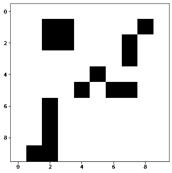
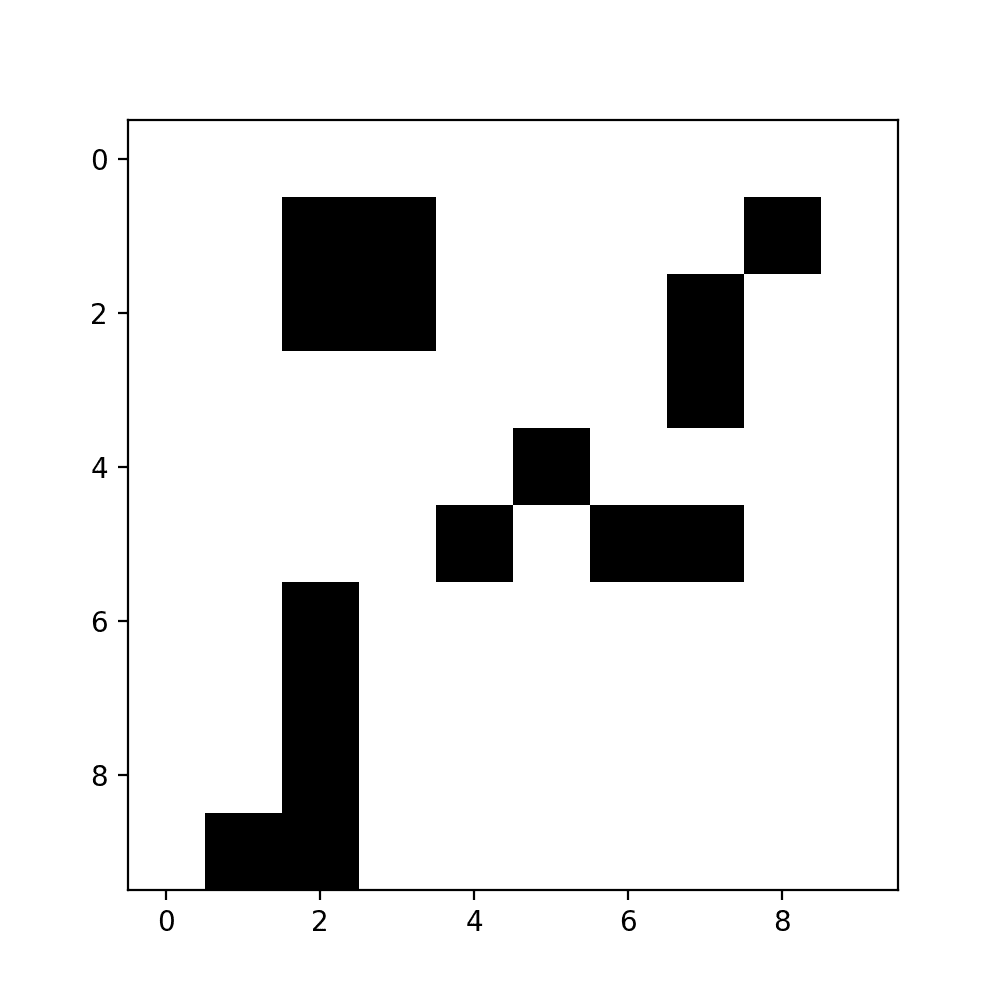
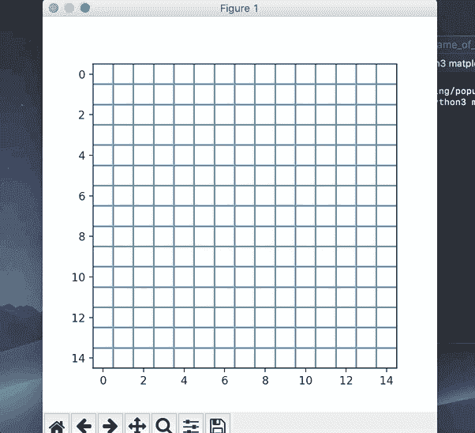
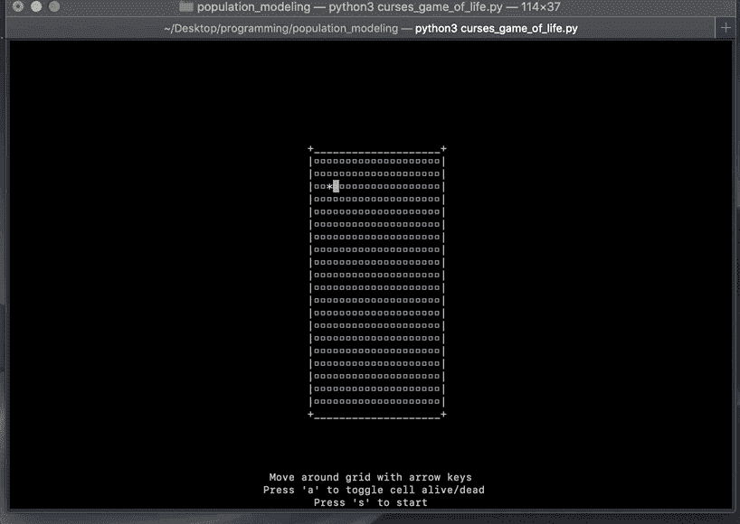
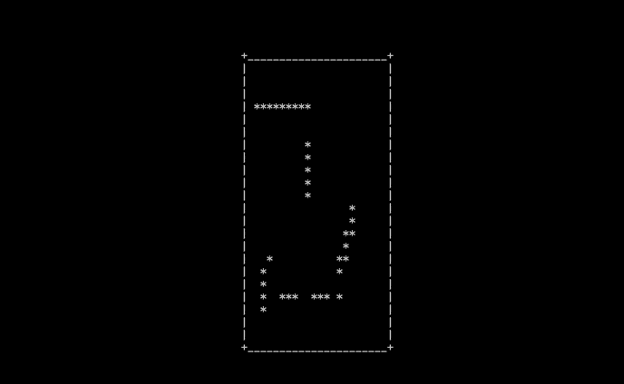

# 约翰·康威的生活游戏和互动视觉化

> 原文：<https://towardsdatascience.com/john-conways-game-of-life-and-interactive-visualization-9647c82044ef?source=collection_archive---------31----------------------->

## 庆祝一位伟大的数学家并探索输入数据的方法。

在当前的冠状病毒疫情的悲惨损失中，杰出的数学家约翰·康威于 4 月 11 日去世。他对群论和博弈论做出了重大贡献，但最广为人知的可能是他的人生游戏。《生命的游戏》是一个简单而迷人的细胞自动机练习，最终发展出了自己的生命，远远超出了康威的预期。

生命的游戏发生在一个网格上，某些细胞被标记为“活的”或“活跃的”，而其他细胞被标记为“死的”或“不活跃的”。

一个生命网格游戏的例子，黑色格子被切换为“开”

网格的初始条件由玩家设定，但之后，网格会根据设定的规则演变:

1.如果一个当前不活跃的细胞正好有三个活跃的邻居，它就像在下一轮繁殖时一样被激活。

2.如果一个活细胞的活邻居少于两个，它就像因人口不足而死亡

3.如果一个活细胞有三个以上活跃的邻居，它就像因人口过多而死亡

4.有两个或三个活邻居的活细胞持续到下一回合

先前的初始安排如何在连续的回合中发挥作用

生活的游戏很简单——康威特别选择了尽可能简单的规则，同时满足其他条件——它被证明是一个持久迷人的框架，基本上开创了细胞自动机的领域。这个游戏有趣的，甚至不可思议的特点是，它可以被证明是图灵完全的，因此人们在游戏中“编程”了一些东西——一个数字钟，一个工作版本的[俄罗斯方块](https://codegolf.stackexchange.com/questions/11880/build-a-working-game-of-tetris-in-conways-game-of-life)，生命本身的[游戏](https://www.youtube.com/watch?v=xP5-iIeKXE8)。

上周，作为对康威的讽刺性致敬(他公开表示，他不认为自己的人生游戏有那么有趣，并对他可能因此而获得认可表示了些许不满)，我试着编写了自己的人生游戏实现。我意识到，对于任何从事数据图形工作的人来说，这个游戏实际上可能是一个有用的可视化和用户交互练习——游戏的规则非常简单，即使是新参与者也应该能够通过代码来理解它们，但用户如何在开始时有效地设置电路板的问题并不是数据科学世界中最常见的交互式可视化的典型问题。

在初始设置过程中，用户有很多种方式与电路板进行交互，但是允许用户在电路板上选择任意数量的点并不是用滑块或下拉菜单就能很好解决的问题。一种解决方案使用通用图形库 Matplotlib，它具有交互式功能，允许用户单击许多新用户可能不知道的图形，但不清楚这是最简单还是最有效的解决方案。考虑到这一点，我想把康威的《生活的游戏》作为一个互动视觉的小型实用案例来展示，并提出几个可能的解决方案。这绝不是所有的解决方案，我把它看作是一个挑战，让用户找到最简单的方法，尽可能高效地建立一个任意的网格，同时需要尽可能少的外部库。

**第一步:设置游戏**

我做的第一件事是创建一个简单的面向对象版本的规则。我创建了一个新的类，对应于游戏中的一个单元格，属性对应于它在网格中的位置和状态，还有一个方法根据游戏规则更新单元格的状态。这些对象可能看起来像这样:

如果您非常习惯使用 Python，这个方法对您来说可能有点过于复杂。为什么要创建一整类对象呢？你可以像一个由 1 和 0 组成的 Numpy 数组有一个根据游戏规则更新网格的函数一样简单地表示网格。有几个原因。一个是，我认为游戏内部逻辑的实现根本不应该引用任何外部库，不要假设最终用户会安装什么包，如果可能的话，让整个程序运行起来，而不需要另外安装任何东西。我的第一个实现使用了一个名为[诅咒](https://docs.python.org/3/howto/curses.html)的库，它实际上是随 Python 一起安装在 Mac OS 上的，用来可视化网格，因此它不需要 Python 3 以外的任何东西就可以为许多人运行。

另一个原因与个人对代码组织的偏好有关。我需要一种标准的方法来实现规则和更新网格，不管我用什么来输入起始网格或显示视觉效果，它都可以以同样的方式工作。您的收获可能会有所不同，这取决于您认为使用哪种结构最方便，但是我发现这种方法可以简化代码调试。

无论如何，不管你用什么方法，实际上模拟生活的游戏是非常简单的:定义规则，创建你的网格对象，打开某些单元格，更新单元格的状态，迭代连续的回合。更有趣的问题是如何构建一个简单的输入方法，这样无论网格大小如何，用户都可以轻松地输入起始条件。您可以要求输入一些坐标，但这很麻烦，尤其是对于较大的网格，因此最好是找到一些其他的输入方法。

**输入法 1: Matplotlib 交互性**

如果您与 Matplotlib 的主要交互是查看笔记本中的静态输出，您可能实际上没有意识到 Matplotlib 具有接收交互式输入甚至跟踪内置鼠标移动的能力。从命令行运行 Python 脚本将在自己的 Python 窗口中打开您的绘图，您可以通过该窗口与绘图进行交互，只要您告诉 Matplotlib 何时会收到某些输入，以及在输入到达后如何处理它们。

对于简单的点击界面，您可以使用函数。ginput()，它将收集单击输入的坐标。一个简单的用法可能是这样的，您可以将鼠标悬停在任何单元格上并单击以激活它们，或者再次单击它们以取消激活它们:

使用 Matplotlib 跟踪鼠标点击的位置来更新网格

在本例中，我使用一个 Numpy 数组来表示棋盘，这既是为了便于索引，也是因为您可以使用 Martplotlib 的 imshow 将数组转换为一行中的图形，它将数组中的值读取为编码显示颜色。生成一个简单网格并跟踪哪些点被选中的代码如下所示:

然后可以将启动点列表输入到一个函数中，该函数初始化 Conway cell 对象的网格(或者您可以简单地使用由 1 和 0 组成的 Numpy 数组),然后就可以计算出游戏的未来回合数并绘制成图表。

我鼓励那些之前不熟悉 Matplotlib 的[交互特性](https://matplotlib.org/3.2.1/users/interactive.html)的人去体验一下。它们开辟了一系列有趣的可能性，切换或选择数据，改变可视化风格，甚至输入新数据，而无需设置外部仪表板。这种方法工作得很好，很明显，更广泛地使用 Matplotlib 的这些特性有很大的潜力，但我并不完全满意。对于更大的网格或更复杂的起始条件，这种方法也会变得很麻烦。在输入和图形响应之间也有一点滞后，我觉得有点沮丧，所以我继续寻找其他有趣的图形输入方法。

**输入法二:带诅咒的乐趣！**

我前面提到的 Curses 库提供了另一个有趣的解决方案。Curses 允许您控制将字符输出到终端窗口。这更像是一种古怪的倒退，创造了一种有趣的类似 ASCII 的表示，而不是一个严肃的图形库，但是，正如我提到的，它是为许多人内置的。

使用 curses 在网格上输入位置

除了找出如何让我的生活游戏在诅咒中工作的内在乐趣之外，我最终认为像诅咒这样的工具实际上可能提供一些有用的方法。我已经准备好为我的数据科学工作探索其他有趣且很少使用的包。

Curses 允许你在可用屏幕上的任何地方放置角色，这种方式非常简单，尽管有一些奇怪的地方需要记住。首先，在放置任何东西之前，你需要实际检查屏幕有多大。如果用户扩展终端窗口，Curses 必须处理的画布的大小将会扩展。其次，Curses 从上到下对屏幕进行索引，这是标准打印的延续，在标准打印中，页面顶部的内容首先打印出来。最后，Curses 会收集您想要添加到屏幕上或想要更改的任何角色的位置，但它不会实际显示任何更改，直到您告诉它刷新屏幕，并且它不会更改您没有明确告诉它的屏幕的任何部分。如果你不清除屏幕上的任何字符，它们将一直存在，直到被覆盖。

我的生命诅咒游戏实现的输入页面的代码如下所示:

请注意，它在一个字典中收集所有切换单元格的位置，然后我可以轻松地将它传递给一个函数来初始化生活模拟游戏。我开始想，也许终端中的视觉效果是传递坐标等信息的一种不错的方式，我正在考虑使用它的其他方式。

作为对伟大的约翰·康威的致敬，考虑用你自己的方式来玩生活游戏的实现，思考集合或者只是以你自己的方式进行创造性的创新。

