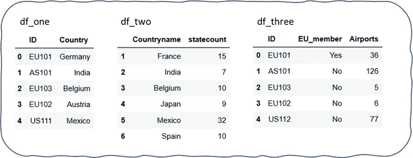
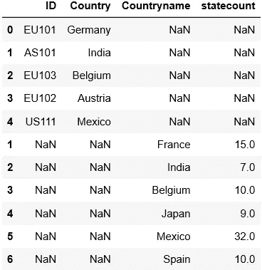
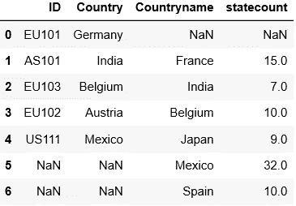
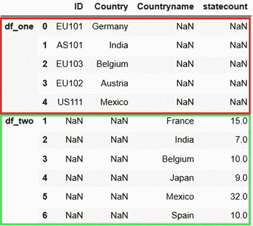
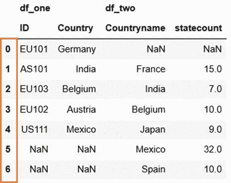
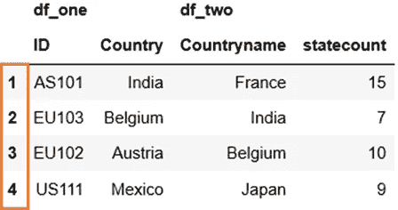
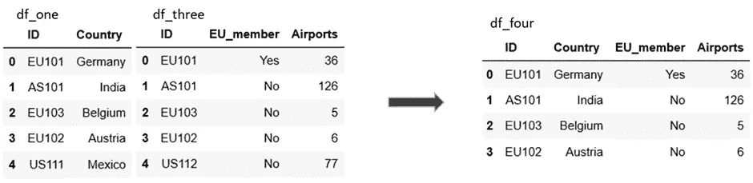
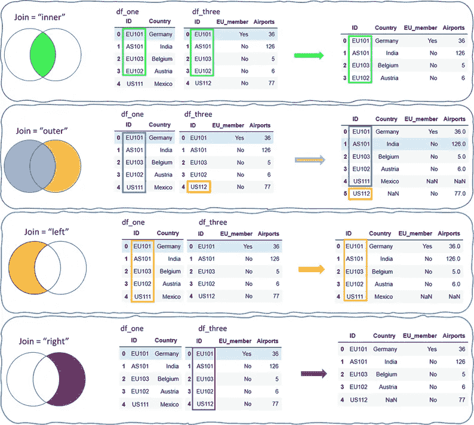

# 加入表格

> 原文：<https://towardsdatascience.com/join-the-tables-ab7fd4fac26b?source=collection_archive---------33----------------------->

## 了解 Python pandas 中的 merge()和 concat()


照片由来自[像素](https://www.pexels.com/photo/white-wooden-table-and-black-chairs-inside-white-green-painted-room-159806/?utm_content=attributionCopyText&utm_medium=referral&utm_source=pexels)的[皮克斯拜](https://www.pexels.com/@pixabay?utm_content=attributionCopyText&utm_medium=referral&utm_source=pexels)拍摄

数据科学项目始于数据。从不同的来源收集所需的数据，对其进行评估、清理和存储，以便进一步分析和建模。

> 数据是数据科学项目的关键要素

然而，在一个项目中有多个数据集是相当混乱的。在数据清理时，需要对所有数据集应用相同的过程，这是一项繁琐的任务。这也可能会导致一些错误。在这种情况下，将所有数据集组合在一起以获得整个数据的单一视图是一个好主意。当原始数据是从不同的文件、工作表、数据表，甚至是从 web 抓取中收集时，这个过程通常是必要的。

[](/web-scraping-make-your-own-dataset-cc973a9f0ee5) [## 网页抓取—制作您自己的数据集

### 从网页中提取数据并将其存储到 excel 中—只需 4 个简单的步骤

towardsdatascience.com](/web-scraping-make-your-own-dataset-cc973a9f0ee5) 

在 Python 中，有两种方法可以组合来自不同数据帧的数据。因此，这就是这两种方法的故事—

> ***熊猫。data frame . merge Vs pandas . concat***

DataFrame 是最常用的 pandas 对象，用于以行和列的形式存储不同数据类型的表格数据。

merge()和 Concat()是 pandas 中组合不同数据帧的两个非常有用的方法

让我们创建三个数据帧， *df_one，df_two，df_three*

```
countries = {'ID':["EU101","AS101","EU103","EU102","US111"],\
             'Country': ["Germany", "India", "Belgium", "Austria",   "Mexico"]}states = {'Countryname': ["France", "India", "Belgium", "Japan", "Mexico","Spain"],\
         'statecount': [15, 7, 10, 9, 32, 10]}europe ={'ID':["EU101","AS101","EU103","EU102","US112"],\
        'EU_member': ["Yes", "No", "No", "No", "No"],\
        'Airports': [36,126,5,6,77]}df_one = pd.DataFrame(countries, index = [0,1,2,3,4])
df_two = pd.DataFrame(states, index = [1,2,3,4,5,6])
df_three = pd.DataFrame(europe, index = [0,1,2,3,4]) 
```



样本数据帧

# 1.Concat()

它沿着一个特定的轴耦合熊猫数据帧。它将数据集按行或列连接在一起。

假设，您想要在行方向上组合三个数据帧 df_one、df_two 和 df_three，以便它们将形成单个数据帧。

使用 Concat()，您只需要在一个列表中传递数据帧的名称。

`df_four = pd.concat([df_one, df_two])`

默认情况下，两个数据帧简单地缝合在一起，一个在另一个下面。两个数据帧中的所有列和行都将保留。



级联数据帧

要并排连接这些表，必须向 concat()添加一个额外的参数`axis = 1`。

`df_four = pd.concat([df_one, df_two], axis = 1)`



简单！！

所有数据帧被连接在一起作为单个数据帧。但是等等，*我怎么知道，哪个数据来自哪个数据帧？？*

熊猫对此有一个答案。Pandas 提供了一个用关键字标记数据帧的选项，这样，在连接之后，您将知道数据帧来自哪里。这种数据标记实际上使得提取对应于特定数据帧的数据变得容易。

`df_four = pd.concat([df_one, df_two], keys=[“df_one”,”df_two”])`



具有源数据帧名称的串联数据帧

在组合来自多个数据帧的数据时，我们确实可以控制在结果数据帧中得到什么。可以使用 Concat()中的`join`参数来实现。在这场争论中，熊猫给了我们两个选择。

1.  `outer`:数据帧的联合

```
df_five = pd.concat([df_one, df_two], axis = 1, join = 'outer',\
                   keys=['df_one', 'df_two'])
```



带有外部连接的 pandas.concat()

对应于所有索引的行保留在结果数据帧中。

1.  `inner`:数据帧的交集

```
df_five = pd.concat([df_one, df_two], axis = 1, join = 'inner',\
                   keys=['df_one', 'df_two'])
```



带有内部连接的 pandas.concat()

在一个`inner`连接中，数据帧`df_one`和`df_two`共有的所有索引都保留在结果数据帧中。默认情况下，熊猫执行沿行的外部连接。关于它的文档信息可以在[这里](https://pandas.pydata.org/pandas-docs/stable/reference/api/pandas.concat.html)找到。

# **2。merge()**

它以数据库风格组合数据帧，即数据帧在公共列或索引上连接。通常，我们处理不同的数据集，这些数据集包含关于同一实体的不同类型的数据。这种数据集通常通过一两个公共列相互链接。

merge()根据公共列中的值组合数据帧。

```
df_four = df_one.merge(df_three)
```



这就是表格合并的方式

如您所见，`df_one`和`df_three`这两个表在两个表中都可用的公共列 *"ID"* 上连接，并且在两个表中对于列 *"ID"* 具有相同值的行将保留在结果表中。merge()自动识别两个表中的公共列。

由于它的定制选项列表很长，merge()被认为是连接表或数据帧的最灵活的方法。

我最常听到的关于 merge()的说法是，

> merge()以 SQL 风格连接表

*你不了解 SQL 或者结构化查询语言？？？*

完全没问题。这里我展示了理解 merge()的最简单的方法。每个人都知道集合论中的维恩图和维恩图的基础知识，如集合的并和交。下面四张图会给你最简单最清晰的 merge()视图。光看颜色，这些图片就一目了然了。

merge()提供了 4 个选项来获得对结果数据集的控制，这些选项可以在 merge()内的 *"how"* 参数中传递，例如，

```
df_one.merge(df_three, how="inner")
```

默认情况下，merge()提供内部连接，因此不需要特别提到它。一个 ***内部*** 连接类似于集合 的 ***交集，而 ***外部*** 连接类似于集合*** 的 ***联合。***

所以，这里有 merge()选项，



这就是 merge()的工作方式

在 merge()中，有一个巨大的可选参数列表，可以在这里进行探索。

***熊猫。DataFrame.join()*** 可以认为是 merge()的一种简单形式，可选参数较少。它确实像 merge()-join 操作一样。与 merge()不同，join()在公共索引*上耦合两个数据帧*。因此，要将两个表或数据帧连接在一起，我们应该在两个数据帧中设置相同的列作为索引。该表格连接选项也可在[文档](https://pandas.pydata.org/pandas-docs/stable/reference/api/pandas.DataFrame.join.html)中找到。

感谢您的时间和阅读！！！

我希望你喜欢这个关于熊猫的简单解释，这是加入数据集的两个重要特征。选择 Concat()还是 merge()完全是我们的选择，但我主要使用 merge()，因为它提供了广泛的选项。如果你喜欢这篇文章，请随时添加反馈，并在 LinkedIn 上与我联系。

[](https://www.linkedin.com/in/surajgurav17/) [## Suraj Gurav -副机械工程师-康耐视公司| LinkedIn

### 查看 Suraj Gurav 在全球最大的职业社区 LinkedIn 上的个人资料。Suraj 有 8 个工作列在他们的…

www.linkedin.com](https://www.linkedin.com/in/surajgurav17/)