# 在 Knowi-Tutorial 中连接来自两个独立 REST APIs 的数据

> 原文：<https://towardsdatascience.com/joining-data-from-two-separate-rest-apis-in-knowi-tutorial-72fc668d3d53?source=collection_archive---------64----------------------->

## 连接和可视化来自不同 REST APIs 的数据，自动查询，并用英语询问您的数据问题。


亚当·诺瓦克斯基在 [Unsplash](https://unsplash.com?utm_source=medium&utm_medium=referral) 上的照片

# 目录

*   [简介](#478c)
*   [设置一个 REST API 作为您的数据源](#7706)
*   [从 REST API 中查询数据](#4a5d)
*   [将您的 REST API 中的数据与另一个 REST API 中的数据结合起来](#38bc)
*   [调度自动 API 调用](#1f86)
*   [可视化您的数据](#7430)
*   [使用基于搜索的分析来查询您的数据](#e5f7)
*   [总结](#5491)

# 介绍

从[REST API](https://www.knowi.com/docs/rest-api.html)中提取数据在当今的分析世界中是一种非常常见的做法，而且理由充分。API 是强大的工具，允许用户的服务器调用另一个服务器，并直接提取大量数据，而无需离开用户的网站或程序。用户还可以设置自动化 API 调用，这允许他们在指定的时间间隔内从外部服务器获取数据。

虽然来自 REST APIs 的大部分数据都是 JSON 格式的，但也有一些数据是 CSV、SQL 或 NoSQL 格式的。Knowi 不仅与 JSON，还与 CSV、SQL 和 NoSQL 数据进行了广泛的本机集成，这使得 Knowi 能够高效地进行 API 调用，并消除繁琐的 ETL 过程。

# 将 REST API 设置为数据源

一旦您登录到您的 [Knowi 试用帐户](http://www.knowi.com/free-trial)，第一步是连接到您的目标 REST API 并确保您已经建立了连接。下面是如何做到这一点:

1.使用屏幕左侧的面板点击“数据源”

2.滚动到底部，在中间的“外部”部分，单击{REST}。

3.确保命名新的数据源。出于本教程的目的，我们称之为“冠状病毒数据源”

4.在右上角输入 API REST 主机的 URL。对于本教程，我们将使用 Github 存储库，其中包含直接来自约翰霍普金斯大学的各种文件。**将此链接用于您的 REST 主机:**

```
[https://raw.githubusercontent.com/CSSEGISandData/COVID-19/master/csse_covid_19_data/csse_covid_19_time_series](https://raw.githubusercontent.com/CSSEGISandData/COVID-19/master/csse_covid_19_data/csse_covid_19_time_series)
```

5.向下滚动到底部，找到标题为“测试连接”的蓝色按钮点击这个，一旦你这样做了，你应该会收到一个警告，在你的页面顶部说“连接成功。”

6.一旦你确定你有一个连接，移到“测试连接”按钮的右边，点击“保存”

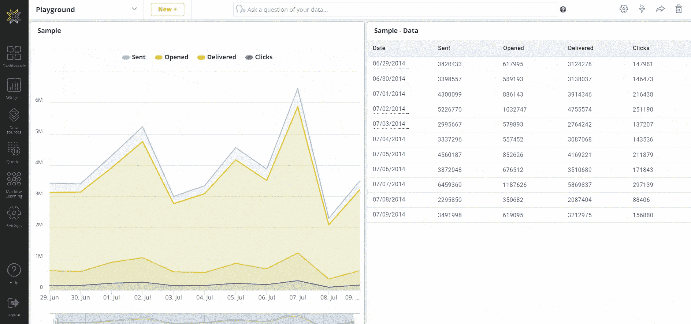

将 REST API 设置为您的数据源(来源—knowi.com)

恭喜你！您已经设置了第一个数据源。

# 从 REST API 查询数据

现在您已经完成了第一个数据源的设置，是时候开始对数据进行查询了。你可以这样做:

1.当您保存完数据源后，您应该会在页面顶部收到一个警告，提示“Datasource Added”。配置查询。点击单词查询。(或者，您可以返回到屏幕左侧的面板，单击“数据源”正下方的“查询”，然后从右上角选择“新查询+”。)

2.在开始任何其他操作之前，请确保将查询命名为 Report Name*，如果在保存数据源后没有直接进入查询，请选择数据源。让我们称这个报告为“API 调用”

3.向下滚动到设置，并在“端点”下添加 API 调用的端点我们将在此使用的端点返回一个大型 CSV 文件，其中包含来自美国每个县的每日确诊新冠肺炎病例。**使用此端点:**

```
/time_series_covid19_confirmed_US.csv
```

4.找到屏幕左下角的蓝色“预览”按钮，然后点击右边的向上小箭头。向上滚动到 100 并点击它，快速预览 100 行数据。

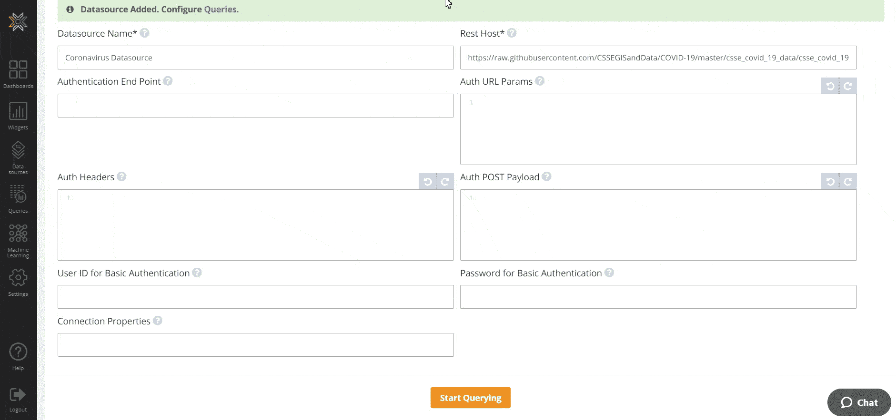

从 REST API 查询数据(来源——knowi.com)

5.我们的数据集对每个日期都有一个单独的列，这不是我们想要的。这意味着我们应该使用 cloud 9ql——Knowi 的强大内置查询语言——来查询我们的数据，并以我们想要的形式呈现出来。向上滚动到“Cloud9QL Query”开始使用。

6.假设我们的最终目标是一个有两列的表:日期和当天美国新确诊的新冠肺炎病例。Cloud9QL 将允许我们通过四个简单的步骤来实现这一点:

1.  反向转置所有列，并添加一个名为“日期”的新列来存储刚刚反向转置的新日期。
2.  选择一个使用 Cloud9QL 的 str_to_date 函数将日期从字符串转换为日期的新列，以及一个作为事例总数的新列。
3.  按日期将我们的数据分组
4.  选择日期和一个新列，该列使用 Knowi 的 delta 函数从当前日期的案例总数中减去前一日期的案例总数。为了执行这些步骤，只需**将以下语法复制并粘贴到您的 Cloud9QL 查询中:**

```
select reverse_transpose(UID,iso2,iso3,code3,FIPS,Admin2,Province_State,Country_Region,Lat,Long_,Combined_key,Population,Date,Cases,*);
select str_to_date(date,MM/dd/yy) as Date, sum(Cases) as Cases
group by date;
select Date, delta(Cases) as Cases
```

7.一旦将该语法粘贴到 Cloud9QL 查询中，返回蓝色的“Preview”按钮，再次预览前 100 行，以确保数据是我们想要的格式。您应该会看到一个包含日期和该日期新新冠肺炎病例数的两列表格。

8.一旦您确认数据是您想要的格式，选择当前预览下方的“数据网格”栏，并将可视化类型更改为“折线图”，以便查看您刚刚预览的 100 行的更引人注目的视图。

9.我们稍后将回到可视化我们的其余数据。现在，单击绿色的“保存并立即运行”按钮保存您的查询。

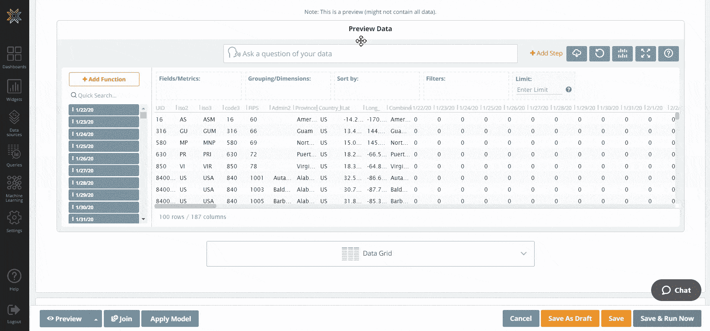

从 REST API 查询数据(来源——knowi.com)

在保存查询并至少运行一次之后，Knowi 使用查询结果创建了一个虚拟数据集，并将该数据集存储在其弹性数据仓库中。每次你运行这个查询时我都会这样做。

# 将您的 REST API 中的数据与另一个 REST API 中的数据连接起来

既然您已经将一个 REST API 设置为数据源并查询了它，那么用另一个做同样的事情应该会更容易。首先，我们将重复设置第一个 REST API 的过程:

1.使用屏幕左侧的面板点击“数据源”

2.点击屏幕右上角的橙色按钮“新数据源+”

3.滚动到底部，在中间的“外部”部分，单击{REST}。

4.确保命名新的数据源。我们称之为“股票市场数据源”

5.在右上角输入 API REST 主机的 URL。我们将使用 [Alpha Vantage](https://www.alphavantage.co/) 的 API 为我们提供实时股票市场数据。**使用这个网址**:

```
[https://www.alphavantage.co](https://www.alphavantage.co)
```

6.向下滚动到底部，找到蓝色的“测试连接”按钮。点击这个，一旦你这样做了，你应该会收到一个警告，在你的页面顶部说“连接成功。”

7.一旦你确定你有一个连接，移到“测试连接”按钮的右边，点击“保存”

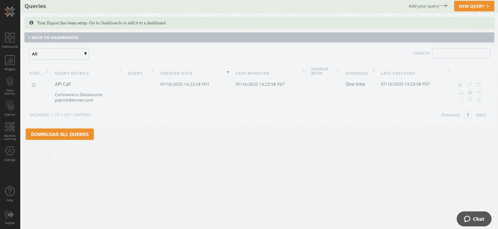

将您的 REST API 中的数据与另一个 REST API 中的数据连接起来(来源——knowi.com)

现在我们已经建立了两个数据源:冠状病毒数据源和股票市场数据源。是时候把我们的股市数据和我们的冠状病毒数据结合起来了。我们是这样做的:

1.返回屏幕左侧的面板，并返回“查询”

2.我们不是创建新的查询，而是将另一个数据源的查询追加到当前查询中，并将新查询中的数据与我们已经拥有的数据连接起来。通过单击现有查询右侧的铅笔图标开始此过程，以便对其进行编辑。

3.打开查询后，滚动到底部，点击蓝色的“加入”按钮。

4.您会注意到出现了一个新的查询构建器。选择刚刚创建的新股票市场数据源作为这部分查询的数据源。

5.向下滚动到查询构建器中的设置，并设置您的端点。我们将使用/query，它让 API 知道我们将查询它的数据。**复制并粘贴，并将其设置为您的终点:**

```
/query
```

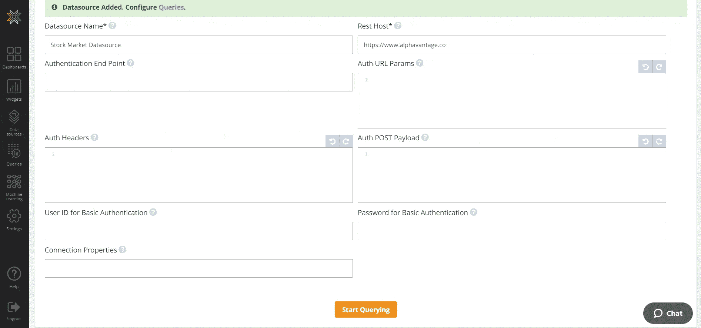

将您的 REST API 中的数据与另一个 REST API 中的数据连接起来(来源——knowi.com)

6.在这种情况下，Alpha Vantage 需要我们希望查询运行的函数、我们希望查询运行的符号、API 键和我们希望查询返回的数据类型。这意味着我们需要在进行 API 调用之前设置我们的 URL 参数。我们希望我们的查询以 CSV 格式从 NASDAQ (NDAQ)返回每日时间序列数据。为了做到这一点，**将下面的语法复制并粘贴到你的 URL 参数中:**

```
function=Time_Series_Daily
&symbol=NDAQ
&apikey=YYTO4FCR5F6DCNE1
&datatype=csv
```

7.单击查询构建器左侧的眼睛图标，仅预览查询的这一部分。如您所见，我们将数据列为“时间戳”，旁边是纳斯达克的开盘价、最高价、最低价和收盘价，以及当天的交易量。

8.向上滚动到您选择第二个数据源的位置，并在您的数据源右侧找到“Join Builder”。单击加入生成器，开始加入过程；Knowi 从每个数据集中检索字段可能需要一些时间。

9.同时，将您的联接类型设置为“内部联接”一旦 Knowi 检索到这些字段，就将“日期”设置为“时间戳”

10.对于本练习，我们只需要三列:日期、当天新冠肺炎案例的数量以及当天纳斯达克的收盘价。为了精简我们的查询，我们将使用 Knowi 的 Cloud9QL Post Query 特性，该特性允许用户在提取和连接所有内容后对他们的数据进行额外的查询。**在您的 Cloud9QL Post 查询中输入以下代码:**

```
select Date, Cases, close as Close
```

11.再次单击“预览”按钮，以确保您获得了所需格式的数据。您应该看到三列:日期、当天的新冠肺炎案例和当天的纳斯达克收盘价。

12.滚动回屏幕右下角，点击“保存并立即运行”

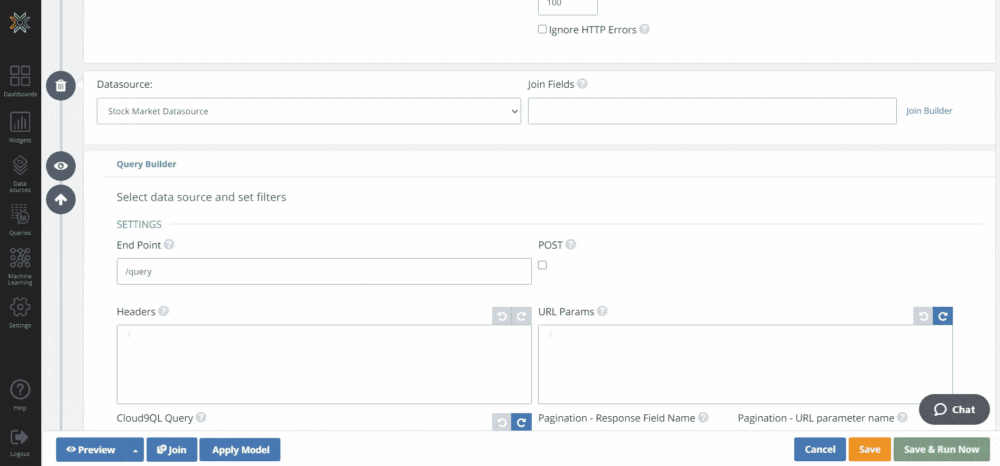

将您的 REST API 中的数据与另一个 REST API 中的数据连接起来(来源——knowi.com)

您刚刚完成了一个查询，该查询调用了两个不同的 API，从每个 API 中提取不同的数据，并将其全部返回到一个表中。干得好！

# 调度自动 API 调用

在我们开始可视化我们的数据之前，重要的是考虑我们想要可视化什么。我们的最终目标是一个仪表板，使我们能够比较纳斯达克股票交易所和新冠肺炎案例之间的趋势，并监控新趋势的出现。我们可以立即设置一个控制面板，使我们能够直观地看到截至今天已经发生的事情，但是这个控制面板会受到限制，因为最新的数据总是来自我们上次手动进行查询的时间。

因为我们希望实时监控事情，所以我们希望设置我们的查询，以便它自动获取新数据，并允许我们在每次打开仪表板时监控最新数据。Knowi 只需三个步骤就可以轻松实现这一过程的自动化。

1.单击查询右侧的铅笔图标，返回到刚刚创建的查询。向下滚动到底部，找到“日程安排”

2.根据您希望进行此 API 调用的频率来配置调度过程。由于收盘价格每天只更新一次，请将您的查询设置为从明天开始每天更新。

3.不要忘记点击绿色的“保存并立即运行”按钮。

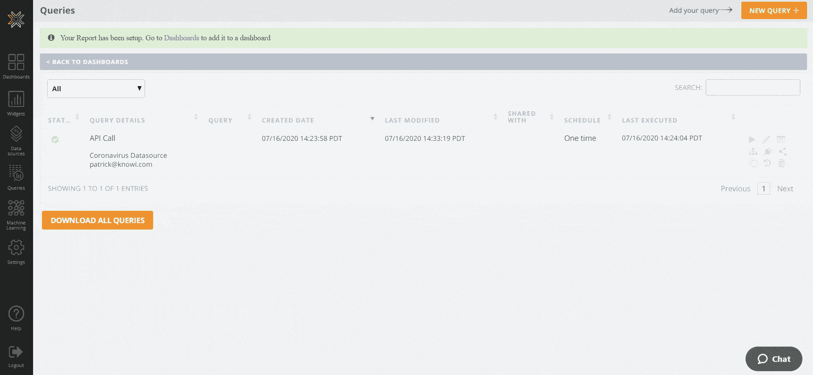

调度自动 API 调用(来源——knowi.com)

您的查询现在设置为每天自动从两个独立的 API 提取数据，并自动连接来自每个 API 的数据。最后一步是为您的数据创建一个可视化，以查看事物如何实时移动。

# 可视化您的数据

即使你以前不好奇随着新冠肺炎在美国的发展，纳斯达克的股票价格是如何变化的，这篇教程可能已经激起了你的好奇心。Knowi 使从我们的数据集创建可视化变得简单，这样我们就可以快速记录任何关键趋势。我们是这样做的:

1.转到左侧面板的顶部，单击“仪表板”单击橙色的“+”按钮，并命名您的仪表板。我们称之为“联合 API 调用可视化”

2.回到左侧面板，在仪表板下，选择“Widgets”在小部件中，您应该会看到您创建的新小部件。点击它并将其拖到您的仪表板上。

3.点击小工具右上角的 3 个点，然后选择“设置”

4.单击“选项”打开选项菜单，向下滚动到选项菜单左侧的“辅助 Y 轴”，然后选择“关闭”这将为纳斯达克股票价格创建一个第二 Y 轴，让你看到它的趋势。

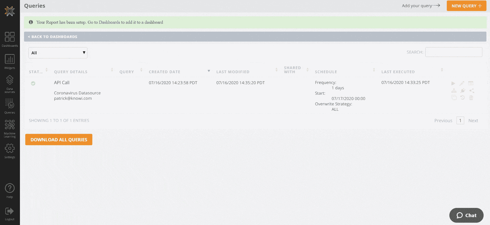

可视化您的数据(来源——knowi.com)

5.使用 Knowi 的可视化设置使您的图表看起来更专业。使用“修改颜色”将新案例更改为#CE0000 并靠近#CECECE，将图例别名更改为更详细地描述数据的名称，并为主要 X 轴和 Y 轴添加标题。

6.在屏幕的右上角，单击橙色的“保存”按钮。

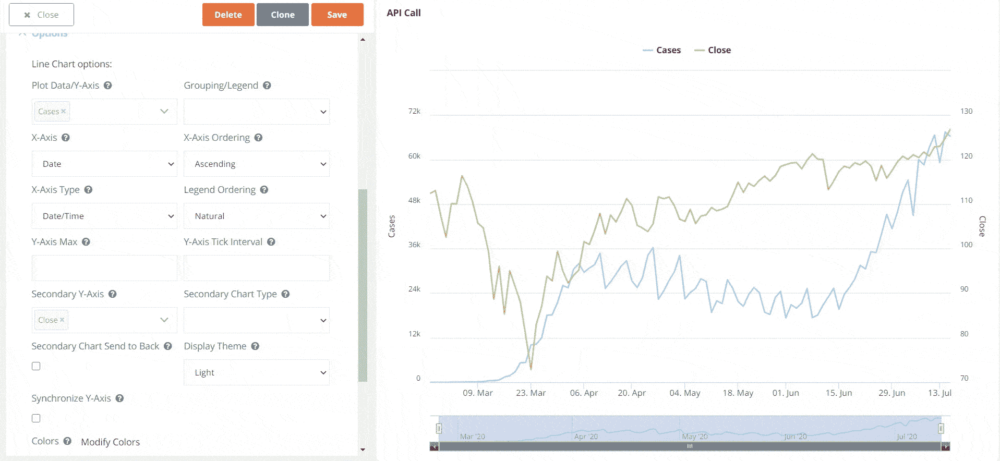

可视化您的数据(来源——knowi.com)

关闭小部件后，您会看到现在已经设置了一个仪表板，可以直观地监控和比较美国和纳斯达克证券交易所新冠肺炎案例的动向。

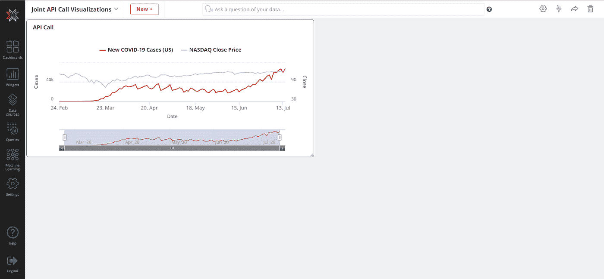

可视化您的数据(来源——knowi.com)

因为您已经将查询安排为自动化日常 API 调用，所以您将能够使用仪表板来监控这两个变量久而久之。

# 使用基于搜索的分析来查询您的数据

现在你已经设置好了你的仪表板，你已经准备好使用 Knowi 的[自然语言处理](https://www.knowi.com/natural-language-bi)能力，通过[基于搜索的分析](https://www.knowi.com/search-based-analytics/)来查询你的数据。您还可以与他人共享您的仪表板，让他们使用基于搜索的分析来查询您的数据——即使他们不熟悉 Knowi。以下是如何对您的数据运行基于搜索的分析:

1.前往部件的右上角，点击 3 个点，然后向下滚动一点，点击“分析”按钮。这将以表格形式显示您的数据。

2.在这里，使用数据上方的搜索栏来询问您的数据问题，并快速获得答案。假设我们希望看到每个数字的周平均值，以便从每日数字中消除一些干扰。我们需要做的就是在我们的搜索栏中键入“显示平均案例，每周平均成交”来查看每周平均数据，以便快速将我们的数据转换为我们想要的格式。

3.现在是时候用这种新格式来可视化我们的数据了。切换到“可视化”，把你的可视化改成折线图。确保将“平均收盘”设置为辅助 y 轴，这样您也可以清楚地看到该变量的变化。

4.前往右上方，点击“克隆”图标。这将创建一个新的小部件，其中包含我们对原始小部件所做的编辑。

5.完成克隆后，单击橙色的“添加到仪表板”按钮。

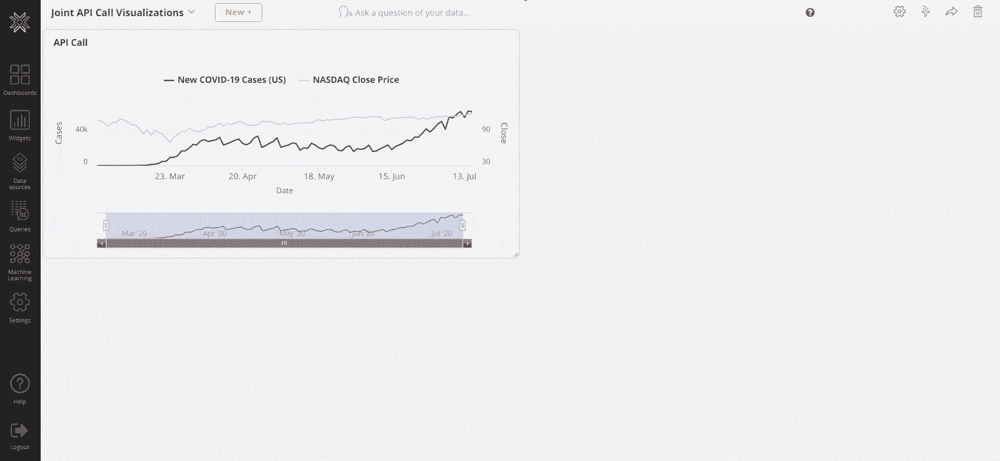

使用基于搜索的分析来查询你的数据(来源——knowi.com)

如你所见，这个过程只需要好奇心和英语基础知识。用简单的英语提出数据问题并返回答案的能力有助于弥合数据科学家和管理层之间的差距，并使讲英语并希望了解更多数据的任何人都可以访问 Knowi 的仪表板。

# 摘要

总的来说，我们只是在 Knowi 中设置了两个独立的 REST API 作为数据源，编写了一个查询来调用每个 REST API 并以可理解的格式返回数据，然后安排该查询每天进行 API 调用并返回新数据。然后，我们从运行查询时创建的数据集创建了一个新的小部件，以及一个新的仪表板，并将新的小部件存储在仪表板中。我们还使用基于搜索的分析来创建一个单独的、更平滑的可视化，向我们显示这两个变量的每周平均值。现在，我们所要做的就是登录我们的 Knowi 帐户，以便监控纳斯达克的股票价格以及美国的新新冠肺炎病例。