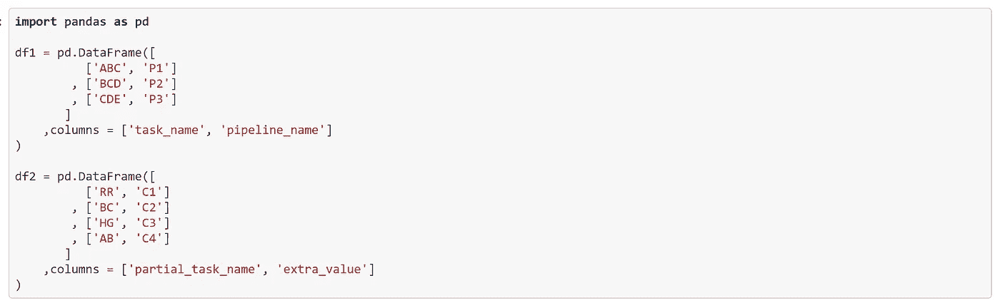
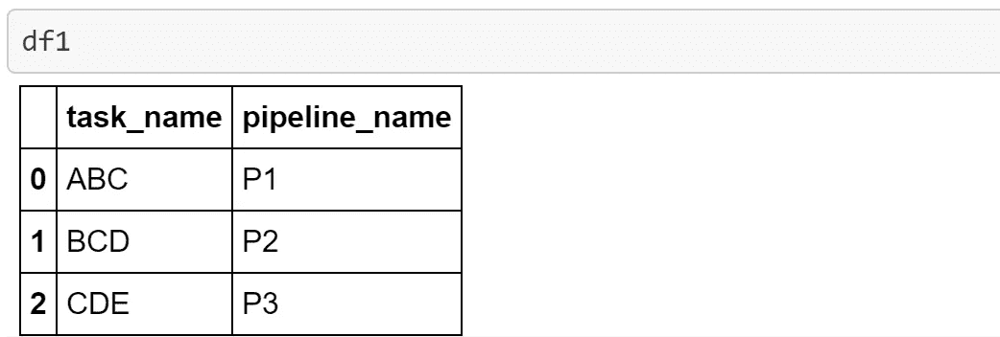
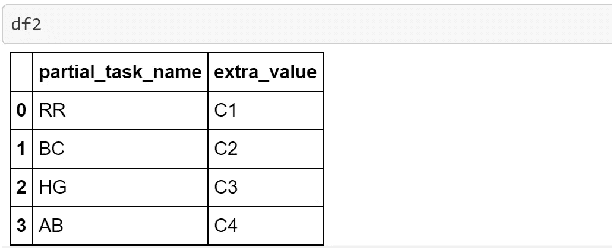
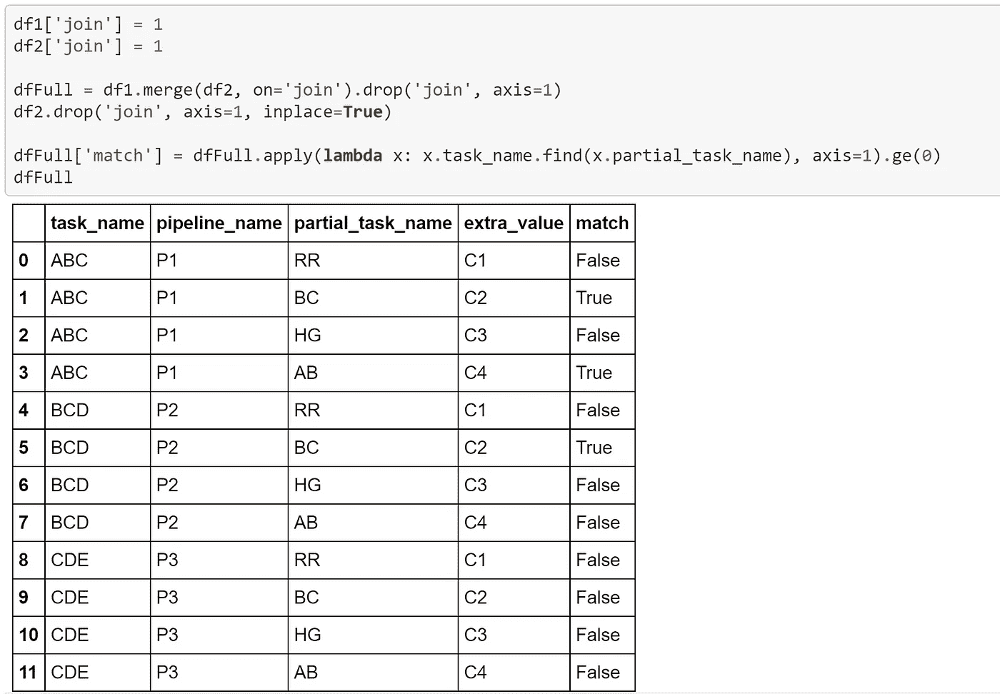
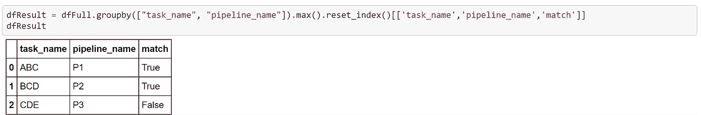
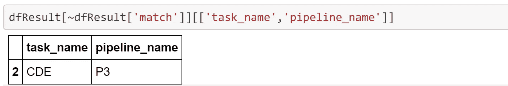
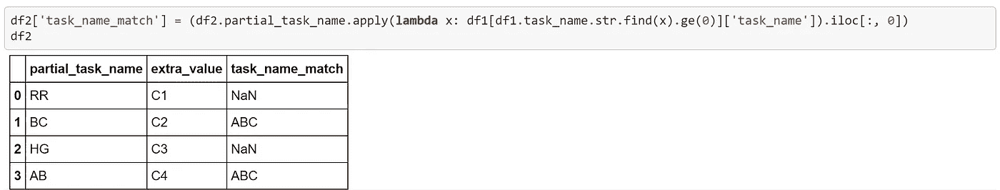
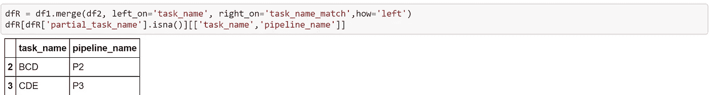
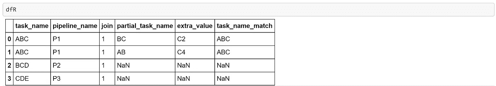

# 用 Python Pandas 连接按子串匹配的数据帧

> 原文：<https://towardsdatascience.com/joining-dataframes-by-substring-match-with-python-pandas-8fcde5b03933?source=collection_archive---------18----------------------->

## 如何使用笛卡尔积连接两个数据帧，其中一个具有全文值，另一个具有子串。


来源 https://getrefe.tumblr.com/[的 REFE](https://getrefe.tumblr.com/)

# 源代码

下一个为 *Jupyter 笔记本*制作的 Python 熊猫代码在 [GitHub](https://github.com/cristiansaavedra/Python-Pandas-Tooltip/tree/master/02%20Join%20two%20Dataframes%20by%20approximate%20column%20string%20matching) 中可用，它回答了这个问题:“哪些任务不匹配？”

# 数据

代码的第一部分创建两个数据帧: **df1** 和 **df2。**



**df1** 数据帧在 **task_name** 列中有任务的完整名称。



并且 **df2** DataFrame 在 **partial_task_name** 列中有一个子串。



看， **partial_task_name** 中的值 **BC** 是 A **BC** 和 **BC** D 的子串，这种情况下预期的结果一定会产生很多行，但是怎么才能得到很多行呢？答案是使用笛卡尔积或交叉连接。

# 连接

要在 Pandas 中做笛卡尔乘积，请执行以下步骤:

1.  在每个数据帧中添加一个具有相同值的虚拟列
2.  通过新列进行联接
3.  删除每个数据帧中的新列

```
df1['**join**'] = 1
df2['**join**'] = 1

dfFull = df1.merge(df2, on='**join**').drop('**join**', axis=1)
df2.drop('**join**', axis=1, inplace=True)
```

# 这场比赛

如果 **partial_task_name** 列在 **task_name** 列中，下一步是在返回的结果数据帧中添加一个新列。我们将使用一个 lambda 和“find”函数，其中结果≥ 0

```
dfFull['match'] = dfFull.apply(lambda x: x.task_name.find(x.partial_task_name), axis=1).ge(0)
```

该产品为 **dfFull** 数据帧



我们按**任务名**、**管道名**做一个分组，得到匹配的最大值**、**进行过滤。



# 好答案

为了知道哪些任务不存在于 **df2** 数据帧中，我们通过**匹配**列进行了一个负过滤:



# 不好的答案

如果我们不使用笛卡尔积，而是尝试在 **df2** 数据帧中添加第一个匹配，然后用 **df1** 数据帧进行左连接



我们正在犯一个常见的错误，那就是它给了我们错误的答案。



因为我们在用第一个搭配的时候， **ABC** 搭配的是 **BC** 而不是 **BCD。**



有一种更通用的技术叫做[近似字符串匹配](https://en.m.wikipedia.org/wiki/Approximate_string_matching)或者通俗地说叫做模糊查找，它也试图解决相似或部分不连续的子字符串。如果是你的情况，你可以试试 **fuzzywuzzy。**

感谢 **Charles Romestant** 给了我写这篇文章的灵感

[快乐码！](https://medium.com/@cristiansaavedra)