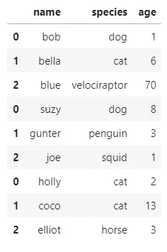

# 使用 Python 的熊猫连接数据集

> 原文：<https://towardsdatascience.com/joining-datasets-with-pythons-pandas-ed832f01450c?source=collection_archive---------36----------------------->

## 如何使用 Pandas 连接、追加和合并数据集


图片来自 PixBay — [Nick115](https://pixabay.com/photos/panda-family-pandas-cute-bamboo-3811734/)

在执行分析时，使用多个数据集的情况并不少见。因此，有大量的方法将这些数据整合在一起。

SQL 将这些操作称为“联接”或“联合”；在其他语言和工具中，您可能会找到类似 Merge 或 LookUp 的功能来完成这项工作。

在本文中，我将介绍一些我们可以用来将数据集与[熊猫](https://pandas.pydata.org/pandas-docs/stable/getting_started/install.html)连接起来的函数。

我将在一个 [Jupyter 笔记本](https://jupyterlab.readthedocs.io/en/stable/getting_started/installation.html)中运行我的代码，我们在示例中唯一需要的是[熊猫](https://pandas.pydata.org/pandas-docs/stable/getting_started/install.html)。

```
import pandas as pd
```

我们将从为示例定义一些虚拟数据开始，为了简化，我将使用列表，但是绝对鼓励您[加载数据集](https://medium.com/python-in-plain-english/reading-data-with-pythons-pandas-2715ff925b1d)。

```
# create 5 lists with the same size
names = ['bob', 'bella', 'blue', 'suzy', 'gunter', 'joe', 'holly', 'coco', 'elliot']species = ['dog', 'cat', 'velociraptor', 'dog', 'penguin', 'squid', 'cat', 'cat', 'horse']age = [1, 6, 70, 8, 3, 1, 2, 13, 3]
weight = [10, 5, 15, 7, 4, 1, 3, 2, 380]color = ['brown', 'black', 'blue', 'black', 'black', 'gray', 'white', 'orange', 'white']
```

定义列表后，我们可以创建数据框。

```
# create 3 data frames with the values from the listsdf1 = pd.DataFrame( {'name': names[:3],
                     'species': species[:3],
                     'age': age[:3]})df2 = pd.DataFrame( {'name': names[3:6],
                     'species': species[3:6],
                     'age': age[3:6]})df3 = pd.DataFrame( {'name': names[6:],
                     'species': species[6:],
                     'age': age[6:]})print(df1, '\n')
print(df2, '\n')
print(df3)
```


三个数据帧

好，我们有三个列和大小相同的数据集。假设我们希望将这些数据分组到一个数据框中。

# 。串联

为此，我们可以使用。concat，这是一个接受数据帧列表并将它们连接成一个数据帧的函数。

```
# .concat to join the dataframes, like a 'union all'
df_list = [df1, df2, df3]
df = pd.concat(df_list)df
```



级联数据帧

很酷，Pandas 匹配了这些列，并毫不费力地返回了一个几乎完美的数据框。

但是如果列名不匹配呢？或者如果我们遗漏了一列呢？

```
# test with mismatching and missing columnsdf1 = pd.DataFrame( {'name': names[:3],
                     'specie': species[:3],
                     'age': age[:3]})df2 = pd.DataFrame( {'name': names[3:6],
                     'species': species[3:6],
                     'age': age[3:6]})df3 = pd.DataFrame( {'name': names[6:],
                     'age - years': age[6:]})print(df1, '\n')
print(df2, '\n')
print(df3)
```


数据帧不匹配

对于“物种”一栏，我在第一个 df 中更改了它的名称，并从最后一个中删除了它；我还把“年龄”重新命名为“年龄——年”。

```
# concat with mismatching and missing columns
df_list = [df1, df2, df3]
df = pd.concat(df_list)df
```


串联不匹配的数据帧

好吧，熊猫。concat 要求列名完全匹配。如果一个列对于数据集来说是唯一的，就像完全连接一样，它会用空值填充空隙。


我用 Sketch.io 制作——知识共享

还有一件事我们需要注意，索引。

由于我们在创建数据框时没有定义唯一索引，Pandas 为我们设置了一些从零开始的默认值，但当我们使用. concat 时，它不会重置它们。


图片来自 PixBay — [Skeeze](https://pixabay.com/photos/panda-cub-wildlife-zoo-cute-china-649938/)

唯一的索引总是一个好主意。在这种情况下，我们可以使用。reset_index 创建一个具有适当值的新列，或者使用。set_index 将其中一列定义为索引。

但是让我们尝试一个更简单的适合我们情况的解决方案。

```
df1 = pd.DataFrame( {'name': names[:3],
                     'species': species[:3],
                     'age': age[:3]})df2 = pd.DataFrame( {'name': names[3:6],
                     'species': species[3:6],
                     'age': age[3:6]})df3 = pd.DataFrame( {'name': names[6:],
                     'species': species[6:],
                     'age': age[6:]})# since we didn't define the indexes when creating the dataframes we can ignore them when concatenatingdf_list = [df1, df2, df3]
df = pd.concat(df_list, ignore_index=True)df
```


级联数据帧重新索引

对于单个参数，我们忽略了索引，并在连接的结果中获得了新的索引。

另一个方便的参数是“keys ”,它允许我们用一个新的索引级别来标识数据源。

```
df1 = pd.DataFrame( {'name': names[:3],
                     'species': species[:3],
                     'age': age[:3]},
                     index = [1,2,3])df2 = pd.DataFrame( {'name': names[3:6],
                     'species': species[3:6],
                     'age': age[3:6]},
                     index = [10,11,12])df3 = pd.DataFrame( {'name': names[6:],
                     'species': species[6:],
                     'age': age[6:]},
                     index = [100,200,300])# we can pass 'keys' which creates another index level to identify the concatenated data frames
df_list = [df1, df2, df3, df1]
df = pd.concat(df_list, keys=['df1', 'df2', 'df3', 'df4'])df
```


添加了索引级别的级联数据帧

默认情况下，。concat 使用列作为键，并将值追加为行。但是如果我们想要将列连接到数据框呢？


图片来自 PixBay — [免费照片](https://pixabay.com/photos/columns-hallway-architecture-greek-801715/)

首先，让我们定义一些要连接的新列。

```
df4 = pd.DataFrame( {'weight': weight,
                     'color': color
                     })
df4
```


带有额外列的数据框

类似地，我们可以将列表直接添加到数据框中，方法是将它们分配给一个列，如下所示:

```
df['color'] = color
```

但是一个数据框可能有很多字段，逐个传递它们并不是最好的选择。

concatenate 函数接受“轴”的参数，这允许我们这样做—连接列。

```
df = pd.concat([df, df4], axis=1)
df
```


级联数据帧

我们还可以改变连接的行为。

让我们尝试将“name”列作为我们的索引，并使用额外的一列创建另一个数据集进行实验。

```
df_list = [df1, df2]
df = pd.concat(df_list)
df.set_index('name', inplace=True)df5 = pd.DataFrame( {'species': species,
                     'age': age,
                     'score': [9,10,10,8,6,9,3,4,10]},
                     index = names)print(df, '\n')
print(df5)
```


更多数据帧

请注意，我们的第一个数据框比第二个数据框的值少。当我们执行内部连接时，它应该只带来索引匹配的行。

```
# by default concat behaves like an outer join, or a union all
# we can change that with the 'join' parameter
df_list = [df, df5]
df = pd.concat(df_list, axis=1, join='inner')
df
```


使用内部连接连接的数据帧


我用 Sketch.io 制作——知识共享

# 。附加

现在让我们看看另一个名为. append 的函数。

此函数的行为与. concat 类似。前面的函数获取多个数据帧，并将它们连接成一个新的数据帧。追加方法将使用现有数据框添加数据。

两者都将返回数据框，但是调用它们的方式不同。您将使用 Pandas.concat()和 DataFrame.append()。

让我们检查一些例子。

```
df1.append(df2)
```


附加到数据帧 1 的数据帧 2

```
df = df1.append(df2)
df = df.append(df3)
print(df, '\n')df = df1.append([df2, df3])
print(df)
```


一个接一个附加的数据帧和附加有列表的数据帧

```
# append a row
df.append(pd.Series(['oliver', 'monkey', 13], index=['name', 'species', 'age']), ignore_index=True) 
```


带有附加行的数据框

# 。合并

太棒了。串联和。追加，我们可以执行我们可能需要的大多数连接。现在让我们检查一个更健壮的名为. merge 的解决方案。


图片来自 Dreamstime

从简单的事情开始，让我们看看如何。merge 执行联接。

我将定义另一个数据框，类似于我们已经在使用的数据框，但是多了一列，少了一条记录。

```
print(df, '\n')df6 = pd.DataFrame( {'name': names[1:],
                     'age': age[1:],
                     'score': [10,10,8,6,9,3,4,10]})
print(df6)
```


更多用于实验的数据帧

Merge 允许我们选择哪个列将成为键；在这种情况下，让我们使用“名称”。

```
merged_df = pd.merge(df, df6, on='name')
merged_df
```


由“名称”列合并的数据框。

与我们之前看到的不同，默认情况下，合并是一个内部连接——这意味着除非另有说明，否则它将只返回两个数据集中匹配的行。

我们还可以注意到，两个数据集中的列是分开的，即使它们包含相同的值。

最后，当我们执行如上所示的内部连接时，两个数据框必须具有相同名称的键列。


图片来自 PixBay — [cocoparisienne](https://pixabay.com/photos/key-close-up-open-door-key-3497145/)

可以选择多个列作为键，就像组合键一样，还可以选择使用哪种连接。

```
merged_df = pd.merge(df, df6, how='left', on=['name', 'age'])
merged_df
```


姓名和年龄字段左侧的数据框已合并。


我用 Sketch.io 制作——知识共享

```
merged_df = pd.merge(df6, df, how='right', on=['name', 'age'])
merged_df
```


姓名和年龄字段右侧的数据框已合并。


我用 Sketch.io 制作——知识共享

太好了！除此之外，合并功能还有助于我们验证和理解正在合并的数据。

```
# 'one_to_one' or ‘1:1’
merged_df = pd.merge(df6, df.append(df1), how='right', on=['name', 'age'], validate='one_to_one')merged_df
```


出错信息

例如，如果数据框不符合您选择的标准，验证参数将引发错误。

其他有用的选项有:

**‘一对多’**或**‘1:m’**—检查左键是否唯一；

**'多对一'**或' **m:1'** —检查右键是否唯一；

“指示器”参数向数据框中添加一列，解释键的关系。

```
merged_df = pd.merge(df6, df.append(df1), how='outer', on=['name', 'age'], indicator=True)merged_df
```


带有指示器列的合并数据框

**如果您将一个字符串传递给指示器参数，它将被用作创建的列的名称。*

我们不需要指定哪一列包含键，因为默认情况下，Pandas 会假设索引是键。

让我们尝试将名称设置为我们的索引，并再次合并这些数据框。

```
df.set_index('name', inplace=True)
df6.set_index('name', inplace=True)print(df)
print(df6)
```


按名称索引的数据框

```
pd.merge(df6, df)
```


按索引合并的数据框

如果我们不希望熊猫重置索引，我们必须使用 right_index 和 left_index 参数。

```
pd.merge(df6, df, how='outer', left_index=True, right_index=True)
```


按索引合并的数据框。

如果我们想一边合并一个索引，另一边合并一个键，我们可以指定 right_on 和 left_on 参数。

它们接受包含键的列名，就像我们之前看到的一样，但是将只应用于特定的一侧，使用另一侧的索引列。

```
pd.merge(df, df6, how='right', right_on='name', left_index=True)
```


由索引和键列合并的数据框。

太好了！我们看到了。串联和。append，连接两个数据框的两个方便的函数。然后我们探索了。合并，一个更好的选择，具有很大的灵活性。


图片来自 PixBay — [PredragKezic](https://pixabay.com/photos/panda-cub-wildlife-zoo-cute-china-1203101/)

熊猫有更多的方法来帮助你处理多个数据集；花时间构建解决问题的逻辑，然后在库中找到已经实现的解决方案，这种情况并不少见。

因此，我鼓励大家看看其他一些功能，例如。比较，。combine_first，and。merge_asof。

感谢阅读我的文章。我希望你喜欢它！

**参考文献:** [用于数据分析的 Python 韦斯·麦金尼](https://www.oreilly.com/library/view/python-for-data/9781449323592/)；
[熊猫—Concat](https://pandas.pydata.org/pandas-docs/stable/reference/api/pandas.concat.html)；
[熊猫——合并](https://pandas.pydata.org/pandas-docs/stable/reference/api/pandas.DataFrame.merge.html)；
[熊猫—追加](https://pandas.pydata.org/pandas-docs/stable/reference/api/pandas.DataFrame.append.html)；
[熊猫——合并、联结、连接、比较](https://pandas.pydata.org/docs/user_guide/merging.html)；