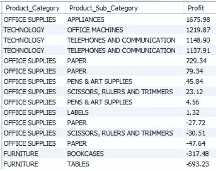

# 连接、视图和 cte:MySQL 工作台

> 原文：<https://towardsdatascience.com/joins-views-and-ctes-mysql-workbench-c1f64d88447f?source=collection_archive---------20----------------------->

## 通过 MySQL Workbench 连接多个表并创建视图和 cte 来分析数据

由[克里斯托弗·高尔](https://unsplash.com/@cgower?utm_source=unsplash&utm_medium=referral&utm_content=creditCopyText)在 [Unsplash](https://unsplash.com/s/photos/technology?utm_source=unsplash&utm_medium=referral&utm_content=creditCopyText) 上拍摄的照片

MySQL 有七个查询命令( **SELECT、FROM、WHERE、GROUP BY、HAVING、ORDER BY 和 LIMIT** )，通过这些命令在数据库中进行数据分析。但是所有这些查询都有助于分析整个数据库中单个表中的数据。在现实世界中，一个数据库包含不止一个表，并且所有这些表都是相互关联的。

为了一次分析多个表上的数据，我们将使用连接、视图和 cte。

> 我们可以在这里下载文章[中使用的数据库。](https://github.com/Kaushik-Varma/SQL)

## **主键和外键**

为了理解连接是如何工作的，我们需要熟悉主键和外键的概念。

主键是唯一定义表的单个字段/列名。该列不应包含任何空值，不应有重复值，并且一个表只能有一个主键。

一个表中的外键引用了另一个表中的列。

让我们看一个简单的例子来更好地理解数据库中的主键和外键。

我们将从数据库中取出两个表。

*   `market_fact_full`

市场 _ 事实 _ 完整表格

*   `prod_dimen`

产品维度表

现在，在`market_fact_full`表中，主键是`Market_fact_id`，外键是`Prod_id`，因为`Prod_id`列用于引用`prod_dimen`表，而`Prod_id`列在产品维度表中充当主键。

# 连接

使用连接从数据库的不同表中检索数据。这些表必须通过使用主键和外键相互关联。

有两种类型的连接:

*   内部连接
*   外部连接

## 内部连接

内部联接选择两个表中的公共列。

如果我们考虑上面的两个表，`market_fact_full`表包含产品的利润和相关信息，而`prod_dimen`表包含产品的类别。

如果我们想找出利润最大的产品类别，我们将使用 **Inner** **Join。**

让我们分析一下代码，

1.  在**选择**，我们试图打印`Product_Category` & `Product_Sub_category`列，它们属于`prod_dimen`表，利润列来自`market_fact_full`表。
2.  现在使用 **from，**首先，我们选择`prod_dimen`表，我们使用**inner join**关键字连接`market_fact_full`表。我们还将把这些表分别称为 **p** & **m** 。
3.  现在，我们必须指定表必须连接哪一列。我们将通过在关键字上使用**并提到列名来实现。**
4.  最后，我们将根据我们的需求为代码提供必要的命令。

现在，对于上面的代码，输出将如下所示。

利润最高的产品类别

使用内部连接，我们可以连接两个以上的表。让我们看看下面的代码，它将三个表连接在一起以获得所需的输出。

我们想了解每种产品的产品类别及其运输方式。为此，我们必须使用三个表`market_fact_full`、`prod_dimen`和`shipping_dimen`。

现在，输出看起来像这样。

内部连接—三个表

## 外部连接

有两种类型的外部联接。

*   左(外)连接
*   右(外)连接

**左连接** 使用左连接，返回左表中的所有值和右表中的匹配值，如果右表中有任何缺失值，则返回 null。

让我们看一个例子，我们需要打印`manu`和`prod_dimen`表中的`manu_name`和`prod_id`列，以查看产品的制造名称。

首先，让我们看看表格是什么样子的，

*   `manu`表

制造表

*   `prod_dimen`表

产品维度表

上面的问题我们用左连接。

输出将是，

制造商名称

通过以上输出，我们可以得出结论，只有 Wipro manufacture 生产产品，其余两家制造商没有生产任何产品。

**右连接** 与左连接类似，右连接返回右表中的所有值和左表中的匹配值。

让我们用左连接的例子。

上面代码的输出是，

产品 id w . r . t .制造商名称

如果我们敏锐地观察上面两个程序，就能发现左连接和右连接的区别。左连接给出所有的制造商名称，而右连接给出所有的产品 id。

类似地，我们可以使用 inner join 和 outer join 关键字连接两个以上的表。

## 视图

视图是不包含任何真实值的虚拟表。假设有一个复杂的查询，我们需要在数据分析中重复使用。我们将创建一个视图，并在需要时随时随地引用该表，而不是频繁地键入该查询。

让我们举个例子，

现在，我们要打印利润超过 1000 英镑的所有订单。为了获得输出，我们将参考上面创建的视图表。

输出是，

这就是我们如何创建视图表并根据我们的需求使用该表。

## CTE

公共表表达式(cte)的功能与视图类似，只有一点不同。可以在数据库中访问视图，因为 cte 只在特定查询中出现。一旦查询被执行，我们就不能再使用 CTE 了。

我们来找出前五名，在那五个产品中，亏损最少，产品基础利润率最高的。

首先，我们将找到排名前 5 的产品

排名前五的产品是，

现在，我们必须从上面的输出中找到最高的产品基本利润。为了获得期望的结果，我们将创建 CTE 并确定最高的产品基本利润。

我们通过使用带有关键字的**创建了最小损失 CTE，它创建了一个包含前 5 个最小损失产品的表，并使用该最小损失表，我们获得了产品基数的最高利润。输出将如下所示，**

一旦我们执行了查询，我们就不能在其他地方使用最小损失 CTE。

# 结论

这就是如何使用联接、cte 和视图来分析数据库中的数据。在现实世界中，大多数时候，我们会更多地使用内连接而不是外连接，更多地使用视图而不是 cte。

一旦我们知道如何使用 **SELECT、FROM、WHERE、GROUP BY、HAVING、ORDER BY 和 LIMIT** 命令，我们必须掌握 **Joins、CTEs 和 Views** 命令。因为我们经常需要同时分析一个数据库中两个以上表上的数据。

**感谢您阅读**和**快乐编码！！！**

# 在这里查看我以前关于 Python 的文章

*   [**数据分析使用基本命令:MySQL Workbench**](/database-design-and-creation-mysql-workbench-488bffa8dbc5)
*   [**探索性数据分析(EDA): Python**](/exploratory-data-analysis-eda-python-87178e35b14)
*   [**假设检验:数据科学**](/hypothesis-testing-data-science-1b620240802c)
*   [**中心极限定理(CLT):数据科学**](/central-limit-theorem-clt-data-science-19c442332a32)
*   [**推断统计:数据分析**](/inferential-statistics-data-analysis-e59adc75c6eb)
*   [**Seaborn:Python**](/seaborn-python-8563c3d0ad41)
*   [**熊猫:蟒蛇**](https://levelup.gitconnected.com/pandas-python-e69f4829fee1)
*   [**Matplotlib:Python**](https://levelup.gitconnected.com/matplotlib-python-ecc7ba303848)
*   [**NumPy: Python**](https://medium.com/coderbyte/numpy-python-f8c8f2bbd13e)

# 参考

*   **MySQL 中的 JOIN 语句:**[https://www . educative . io/edpresso/how-to-use-a-JOIN-statement-in-MySQL](https://www.educative.io/edpresso/how-to-use-a-join-statement-in-mysql)
*   **MySQL 中的视图:**[https://www.guru99.com/views.html](https://www.guru99.com/views.html)
*   **MySQL:**[https://www.tutorialspoint.com/mysql/index.htm](https://www.tutorialspoint.com/mysql/index.htm)
*   **https://www.educba.com/mysql-cte/的 MySQL CTE:**T42