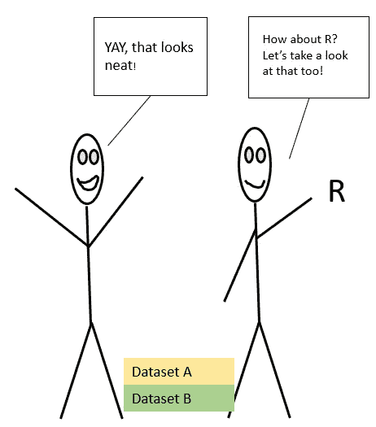

# 用幂 BI 和 R 连接

> 原文：<https://towardsdatascience.com/joins-with-power-bi-bde7de3e2181?source=collection_archive---------34----------------------->

## 连接将一直存在…让我们使它们变得简单


梅尔·普尔在 [Unsplash](https://unsplash.com?utm_source=medium&utm_medium=referral) 上的照片

我已经在我的[第一篇文章](https://medium.com/@The_Data_Kitchen/get-to-know-some-data-set-joins-42e2aa6f5785?source=friends_link&sk=d37f7db7a6c1473198ba89fe3acf1608)中描述了连接的基础。希望对您有所帮助。在本文中，我将向您展示如何使用 Power BI 的 Power Query 以及在 R 中使用 dplyr 来完成这些连接。

Power BI 有一个“点击”类型的 UI(大量使用鼠标),而 R 有一个“输入”界面(大量使用键盘)。

我两样都喜欢，希望你也喜欢。

让我们回到我们的小简笔画——有用吗？


作者图片

让我们开始吧！

让我们加载我们的数据:)两个很小的数据集，但对我们的例子来说很棒。


作者图片

现在它们已经加载，让我们进入电源查询


作者图片

一旦我进入超级查询端，我就会看到我的两个数据集。


作者图片

让我们开始合并查询吧！


作者图片

对于连接的放置要非常小心，顶部数据集位于连接的左侧，底部数据集位于连接的右侧。如果它们排列不当，你会得到相反的结果。

如果你感到困惑——看看我的第一篇[关于左右的文章](https://medium.com/@The_Data_Kitchen/get-to-know-some-data-set-joins-42e2aa6f5785?source=friends_link&sk=d37f7db7a6c1473198ba89fe3acf1608)。


作者图片

一件重要的事情——让我们选择想要加入的列或“连接”。


作者图片

我选择了左外部连接，但它与左连接相同。有许多术语——左手边、第一数据集、数据集 A 等。**在一天结束时，我们希望看到共同的行，以及在比较时没有发现的行**。此外，在这个图像中，只有一个“连接”列。你不仅限于使用它。您也可以选择一个额外的列来支持连接。

在我做出这个选择后，我将得到扩展的选项。

让我们点击扩展按钮。


作者图片

哒哒！


作者图片

这里你可以看到内部连接和左反结果。

让我们简单谈谈 Power Query 上的查询设置窗格。这对我们的例子非常有用。为什么？因为只需一次单击，您就可以返回到合并步骤，并更改您的任何连接选择，如前所述。


作者图片

带您回到这里进行其他连接选择。


作者图片

我明白，这可能看起来过于简单，这里的数据集只有 5 行，没有任何重复，数据类型错误，连接上的打字错误，缺少数据，缺少列..等等，我将在另一篇文章中写更多关于这方面的内容。

请这样想，如果您理解这些基础知识，并且能够在小型数据集上构建查询，Power BI 将会完成繁重的工作。稍作调整后，同样的查询可以从 5 行数据集应用到 50K 行数据集。

嗯……让我们回到简笔画上。



现在让我们看看 r，另一个伟大的工具。

让我们使用“Import data”加载我们的数据和包，并加载 Tidyverse。Tidyverse 是一个 R 包的集合，它使数据争论变得有趣和容易(有时)。

我将使用下面的代码回答我在第一篇文章中提出的同样的问题。只有两条主线，但稍加调整就足够了。

```
library(tidyverse) # loading Tidyverse package -- for dplyr#who is still with the company?Dataset_2007 %>% 
  inner_join(Dataset_2020, c("Name"))#who is no longer working for the company in 2020?Dataset_2007 %>% 
  anti_join(Dataset_2020, c("Name")) #who is new to the company in 2020?Dataset_2020 %>%  anti_join(Dataset_2019,c("Name"))
```

我们来分析一下。


你有它！

有些人使用 Power BI 和 r 来加入基础知识。用 Power BI 点击几下，用 r 编写几行代码。这两者都是数据争论的乐趣。

下一篇文章是关于[使用 Power BI](https://medium.com/@The_Data_Kitchen/functions-in-power-bi-56e9e11e4669?source=friends_link&sk=32f65f6e5196dbd96ed43a53584ad2fc) 中的函数，看看吧！

注意安全，希望你喜欢这篇文章。