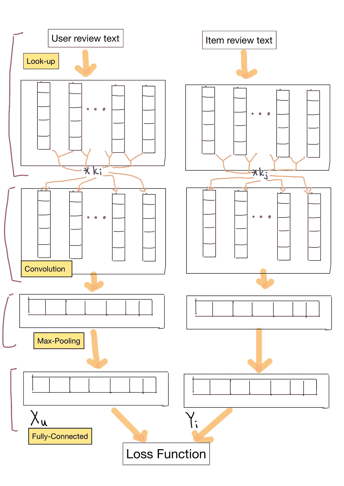
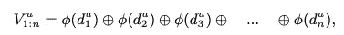
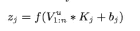
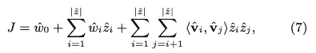
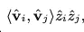
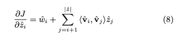
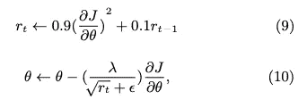
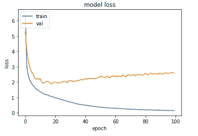

# 使用评论进行推荐的用户和项目的联合深度建模

> 原文：<https://towardsdatascience.com/joint-deep-modeling-of-users-and-items-using-reviews-for-recommendation-50e75d5e10aa?source=collection_archive---------56----------------------->

照片由 [vanitjan](https://www.freepik.com/vanitjan) 在 [Freepik](https://www.freepik.com/free-photo/empty-living-room-with-blue-sofa-plants-table-empty-white-wall-background-3d-rendering_9928644.htm) 上拍摄

如今，推荐系统经常出现在我们的日常生活中，比如网上购物、阅读文章和看电影。人们可以根据自己的兴趣从推荐系统中看到推荐的商品。许多推荐系统使用协同过滤方法，该方法的技术表明，过去有相似偏好的人将来倾向于有相似的选择。挑战在于很少有用户对物品发表评论。该文章关注深度合作神经网络(DeepCoNN)，针对评分预测问题从用户和项目获取评论。

**在本文中，你将学习推荐系统的奇异值分解和截断奇异值分解:**

(1)模型架构

(2)单词表征

(3) CNN 层

(4)共享层

(5)网络培训

(6)对 DeepCoNN 的分析

(7)基线模型

## 模型概述

在深度合作神经网络(DeepCoNN)中，有一个用于学习项目属性和用户行为的评论数据集，以及在最后几层组合的两个并行神经网络。一个网络关注用户的评论以从用户的行为中提取特征，另一个网络主要利用物品的评论以突出物品的属性。

# 模型架构

有两个并行的神经网络，一个用于用户的网络(Netu)和一个用于项目的网络(Neti)，这两个网络合并在最后一层。对于两个网络，输入数据是 Netu 中的用户评论，Neti 中的商品评论，然后是作为输出的评级。

对于也称为查找层的第一层，从用户评论中生成单词嵌入，用于语义提取。接下来，使用卷积层、最大池层和全连接层构建模型，以生成用户和项目的要素。最后，最终的顶层实现了用户和物品之间隐藏的潜在因素的交互。

DeepCoNN 计算 426 目标函数以缩小来自 Netu 和 Neti 输出的潜在因子的评级预测误差。我们将详细介绍 Netu 的过程，同样的过程也适用于 Neti，因为 Netu 和 Neti 具有相同的输入。

情节:模型架构

# 单词表示法

一个单词嵌入 f: M→ N_n .一个把单词字典变换成 N 维分布向量的映射函数。男:单词字典。N_n: n 维分布向量。

利用词的表示来提取评论的语义。评论被转换成单词嵌入矩阵，用于查找层的语义提取。所有用户的书面评论 u 合并成一个文档 d*u_(1-n)共 n 个单词。下面内置一个字向量矩阵 V*u_(1:n):

等式:单词向量

d*u_k:文档 d 的第 k 个单词
d*u_(1:n):查找函数
φ(d*u_k):返回单词
⊕:连接运算符对应的 c 维单词向量

与词袋技术相比，在矩阵 V * u(1:n)中保持了词的顺序

# CNN 图层

CNN 模型包括卷积层、最大池和全连接层。卷积层中有 m 个神经元，通过对用户 u 的单词向量 V*u_(1:n)应用卷积算子来产生新的特征。在卷积层中，每个神经元 j 在大小为 t 的单词窗口上应用滤波器 Kj ∈ n(c*t)。

等式:带内核的卷积层

*:卷积算子
b_j:偏置项
f: relu 激活函数

下面指定了 Relu 激活。具有 ReLU 的深度卷积神经网络的训练周期比 tanh 激活函数快得多。

f(x) = max{0，x}

下面的等式是特征图上的最大池，并从特定内核中提取最大值作为特征。特征图中的最高值是最重要的特征。汇集层可以应用于不同的文本长度。在最大汇集操作之后，卷积结果被转换成固定大小的向量。

o_j = max{z_1，z_2，…，z _(n t+1)}

模型中的多个过滤器生成了各种特征。下面的等式是卷积层的输出向量

O = {o_1，o_2，o_3，…，o_n1 }，

o_n1:卷积层中内核的数量

X_u = f(W × O + g)

max-pooling 层输出到下一个具有权重矩阵 w 的全连接层上式是全连接层的输出 xu ∈ n*(n_2*1)。最后，我们可以从用户和项目 x_u 和 y_i 的 CNN 层获得输出。

# 共享层

作为特征的项目和用户的输出在不同的特征空间中，并且不可比较。共享层被引入到 Netu 和 Neti 之上，以在特征空间中映射它们。单个向量ˇz =(xu，yi)由 Xu 和 yi 连接而成。为了模拟 z 中所有嵌套变量的相互作用，因子分解机(FM)被引入作为相应等级的估计器。下面的等式是给定一批 N 个训练示例 t 的成本。

等式:批量的成本函数

ˇw0:全局偏差
ˇwi:模拟 z 中第 I 个变量的强度

模拟二阶相互作用

# 网络培训

目标是最小化上面指定的成本函数，并且相对于 z 检索导数 J。

等式:成本函数的导数

通过应用链式法则，可以计算不同层中其他参数的导数。利用 N 元组的训练集 T，通过 RMSprop 对混洗小批量进行优化。RMSprop 是为梯度更新方法引入的，它根据梯度的绝对值自适应地管理步长。当 RMSprop 计算梯度范数的平均值时，权重将被更新。下图显示了网络参数集θ的更新规则。

等式:RMSprop 优化函数

λ:学习率
ε:数值稳定性的小附加值

此外，在两个网络的完全连接层之上应用了脱落层，以防止过度拟合。

# DeepCoNN 分析

## 词序保持

常见的是，推荐系统在用户评论上应用主题建模来建模用户或项目。潜在的主题变量使用单词袋技术，忽略了单词的顺序。然而，对于文本建模应用程序来说，考虑单词的顺序是至关重要的。DeepCoNN 与单词嵌入一起应用，以创建单词嵌入，同时保持单词的顺序，但不使用主题建模方法。因此，卷积层提供了一种在文本建模中表征单词顺序的技术。

## 在线学习

许多推荐系统注意到可伸缩性和处理项目的动态池。对于推荐系统来说，时间敏感性是在线学习潜在因素的一个具有挑战性的任务。DeepCoNN 可根据训练数据的数据可伸缩性进行调整，并且该模型可以灵活地用神经网络中的新数据进行训练和更新。从历史数据中更新项目或用户的潜在因素是独立的。主题建模不包括考虑时间因素和数据更新。

## 基线模型

矩阵分解(MF)和概率矩阵分解(PMF)被应用于推荐系统中的评论数据集。此外，大多数推荐系统使用主题建模来支持用户评论。为了比较推荐系统和主题建模，选择了 4 种深度学习模型:潜在狄利克雷分配模型(LDA)、协同主题回归模型(CTR)、主题隐藏因子模型(HFT)和深度推荐系统。推荐系统将引入最新的深度推荐系统——协同深度学习(CDL)。为了改进模型预测，除了 MF 和 PMF 以外，所有基线都在模型中加入了审查信息。在所有的协同过滤方法中，MF 是最流行的一种。输入数据集是评级矩阵，MF 将估计两个低秩矩阵来预测评级。交替最小二乘(ALS)技术用于最小化目标函数。

PMF:该模型应用了用户和项目潜在因素的高斯分布。

LDA:潜在狄利克雷分配是一种流行的主题建模算法。它用于从每个项目的一组评论中学习主题分布。为每个项目的潜在特征提取学习的主题分布。为了优化评分预测精度，通过梯度下降更新每个用户的潜在特征。

CTR:协作主题回归也被应用，并在用户感兴趣或不感兴趣的单类协作过滤问题上表现良好。

HFT:隐藏因素作为主题被应用于主题分布，以从用户或项目评论中提取潜在因素。在实验中，基于项目的主题分发比用户主题分发具有更好的性能。

CDL:协作深度学习的特点是堆叠去噪自动编码器和 PMF 的贝叶斯公式。自动编码器和 PMF 与自动编码器的中间层相连。

# python 代码的实践经验

# 数据描述:

数据是从 Amazon review 数据集中提取的，带有杂志订阅的子类别。[将](http://deepyeti.ucsd.edu/jianmo/amazon/index.html)链接到数据源。数据集中有各种列，如评论(评级、文本、有用性投票)、产品元数据(描述、类别信息、价格、品牌和图像特征)和链接(也查看过/也购买过的图表)。

# DeepCoNN 建模

对于建模方法，DeepConn 模型是卷积神经网络模型，它在 Pytorch 模型中实现。此外，模型的优化是 adam 优化器，损失度量是通过 MSE 评估的。

# 数据预处理

从 Magazine_Subscriptions.json，我们在评论数据集上实现了一些预处理步骤，如过滤标点符号，保留单词和字符，排除 nan 和 null 值，以及过滤长度大于 1 的单词。在数据集中，有用户多次对相同的产品留下评论。输入数据集也被从相同的 userid 和 itemid 的重复行中排除，因此模型将具有相同的所有条目和用户的评论数据的输入长度。

## 添加用户和项目功能

在 user_reviews 表中，索引被设置为 userID 和 productID 以及用户评论的列。另一个表是 movie_reviews 表，索引设置为 userID 和 productID 以及电影评论列。数据集还添加了两个附加功能，一个是用户评论列，另一个是电影评论列。

## 单词嵌入

单词嵌入是手套嵌入的输入，每个单词的向量大小为 200。手套嵌入是一种无监督的学习方法，通过单词的共现来分组单词，以生成单词向量。相似性度量是通过两个单词向量之间的欧几里德距离(或余弦相似性)来计算的。相似的单词放在附近，而没有相似语义的单词放在更远的地方。对于用户和项目的评论数据集，用手套嵌入和 pad 值向量输入单词。用户和项目的评论用相同大小的向量填充。

## DeepConn 型号:

对于模型输入，输入的数据结构的嵌入大小为 200，用户序列长度为 61，项目序列长度为 45。有两个独立的数据输入，一个是具有(1910，6，200)的 3d 形状的项目评论输入矩阵，另一个是具有(1910，20，200)的 3d 形状的用户评论输入矩阵。标签是评级栏。该模型根据 80%的输入数据进行训练，并根据 20%的验证数据进行测试。

DeepConn 模型有 1 个卷积层，内核大小为 3，滤波器大小为 2。下一层是 max-pooling 层的输入，以从每个内核中提取最大值作为特征。然后，将特征展平并转发到密集层进行模型预测。最后一层结合了来自项目评审和用户评审矩阵的输入。将组合的特征带入模型，模型将特征和输入连接到最后的密集层。优化函数是 Adam，损失函数是模型评估指标的均方误差。

## 评估图:

该模型在 100 个时期上用 80%的训练数据分割进行训练，并在 20%的测试数据集上进行测试。训练损失在 0.1514 左右持续下降，测试损失达到 2.6 左右。测试损耗在 60 个周期后变得稳定。

图:训练和测试数据集的损失性能

## 最后

*   评论数据集的特点是通过一个映射函数将单词字典转换成 n 维分布向量，从而实现单词的嵌入。单词嵌入是手套嵌入的输入，手套嵌入是一种无监督的学习方法，通过单词的共现来分组单词以生成单词向量。
*   CNN 模型包括卷积层、最大池和全连接层。卷积层中有 m 个神经元，它们通过对单词向量应用卷积算子来产生新的特征。max-pooling 图层从要素地图中提取最高值作为最重要的要素。汇集层可以应用于不同的文本长度。在最大汇集操作之后，卷积结果被转换成固定大小的向量。
*   作为特征的项目和用户的输出在不同的特征空间中，并且不可比较。共享层被引入到 Netu 和 Neti 之上，以在特征空间中映射它们。单个向量ˇz =(xu，yi)由 Xu 和 yi 连接而成。为了对 z 中的所有嵌套变量交互进行建模，因子分解机(FM)被引入作为相应评级的估计器，它将两个评论的特征连接起来，并在其上对下一个密集层应用点函数。

## 模型优势

*   深度合作神经网络(DeepCoNN)是一种使用文本评论对用户行为和项目属性进行建模的方法。存在从共享层连接的两个并行网络，使得用户和项目表示的交互可以预测评级。
*   评论由 Glove 转化为词嵌入，以语义和评论情感为特征。DeepCoNN 可以通过利用评论来缓解稀疏性问题。

> 这是推荐系统主题的结尾

# 参考

*   使用评论对用户和项目进行联合深度建模
    [https://dl.acm.org/doi/pdf/10.1145/3018661.3018665](https://dl.acm.org/doi/pdf/10.1145/3018661.3018665)
*   使用用于推荐的评论对用户和项目进行联合深度建模 Github 知识库
    【https://github.com/richdewey/DeepCoNN 
*   手套嵌入
    [https://nlp.stanford.edu/projects/glove/](https://nlp.stanford.edu/projects/glove/)