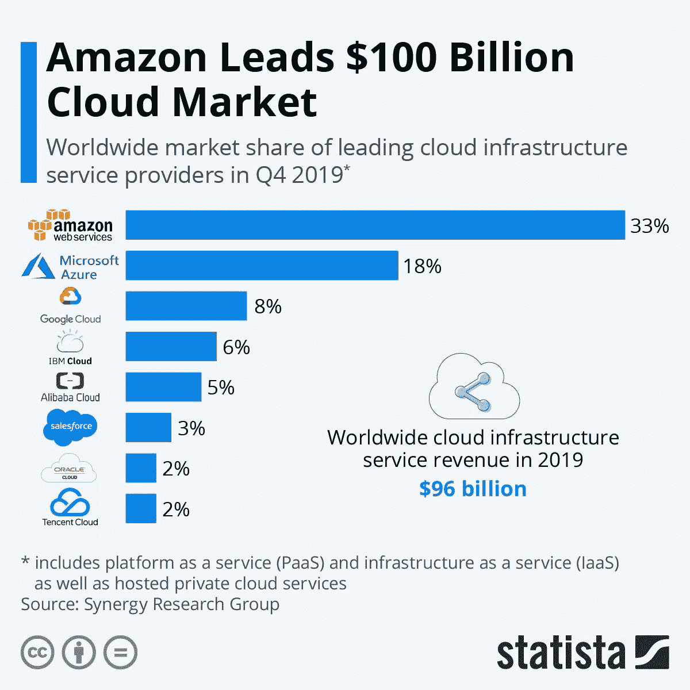

# 云计算之旅:如何成为 AWS 认证解决方案架构师

> 原文：<https://towardsdatascience.com/journey-into-the-clouds-how-to-become-a-aws-certified-solution-architect-719cae167e70?source=collection_archive---------7----------------------->

【来源:Pexelbay】

作为一名 IT 解决方案架构师，我一直有兴趣将自己的知识从应用扩展到基础设施，因此我决定准备参加亚马逊 Web 服务认证解决方案架构师助理考试，这是 IT 行业最重要、最受广泛认可的 T2 证书之一。我想分享我成功准备考试的方法，从而在这个过程中帮助其他人。

# **为什么选择 AWS 解决方案架构？**

审视过去 10 年的企业 IT 行业趋势，有一些高增长的领域[继续扩张并奖励工程人才:**云基础设施**、**数据分析**和**安全**。尽管一个人可以通过认证进入数据分析和安全领域，但除非他拥有多年的经验，特别是在数据科学方面，至少拥有两年的 STEM 硕士学位，最好是应用数学、计算机科学或统计学专业，否则财务和专业回报并不显著。由于顶级平台供应商的优秀公开文档和我将在下面分享的全套教育资源，云基础架构有一个更平坦的倾斜和更低成本的学习曲线。](https://www.cio.com/article/3235944/hiring-the-most-in-demand-tech-jobs-for-2018.html)

AWS 客户的广度[来源:AWS]

此外，考虑一下**云计算**不可避免的进步，因为基于传统硬件和软件的传统数据中心由于其资本支出基础、灵活性和技术停滞而衰落。正如 Gartner 的 2019 年[报告](https://www.gartner.com/en/newsroom/press-releases/2018-10-17-gartner-says-global-it-spending-to-grow-3-2-percent-in-2019)所建议的，各种规模的组织都在将工作负载迁移到云。数据中心支出从 2017 年的 6%增长放缓至 2019 年的不到 2%；服务器采购在 2019 年下降了 1%，预计在未来*五年*内每年将进一步*下降* 3%。与此同时，包括云计算在内的 IT 服务支出的增长速度是 2017 年的两倍，从 2017 年的 4%上升到 2019 年的近 5%。

云平台支出趋势[来源:Statista]

此外，人们必须评估云计算供应商，以了解在哪里进行专业下注。截至 2020 年 2 月，亚马逊网络服务(AWS)、微软 Azure 和谷歌云平台是这一领域无可争议的领导者。AWS 于 2006 年推出，已经领先其竞争对手，例如 **AWS** 在 2019 年拥有 33%的市场份额，并且每年增长超过 35%。相比之下，2010 年诞生的 Azure 现在已经达到 18%的市场份额，而 2013 年开始的 GCP 已经达到 8%的市场份额。此外，今年有报道称，泄露的谷歌备忘录暗示，如果 Alphabet 不能在市场上排名第一或第二，它可能会在 2024 年之前退出云平台领域。

最后，**解决方案架构**代表了 IT 劳动力市场中最适合适应 IT 行业不断变化的领域。魔鬼总是在细节中，但是架构是与业务一致的概念和逻辑活动，云计算使人们能够更好地推理和组装计算、存储、数据和网络乐高积木，以设计更好的分布式系统来解决业务问题。将所有这些放在一起，专注于顶级云平台(如 AWS)的解决方案架构不仅会产生良好的业务和常识，而且会令人愉快，因为您正在对组织产生战略影响，并与各种利益相关者进行互动。因此，云解决方案架构师的[工资](https://www.icertglobal.com/top-10-highest-paying-certifications-to-target-in-2020/detail)与上述其他领域不相上下，并且[工作岗位](https://www.cio.com/article/3235944/hiring-the-most-in-demand-tech-jobs-for-2018.html)比上述其他领域更加丰富也就不足为奇了。

# **在工作中使用 AWS，在家里做实验。**

没有什么能代替你在工作中接触现实世界的项目，你会在某些领域获得深度；然而，许多 AWS 服务用户指南都有 10 分钟的教程和半真实的样本，可以拓宽你的知识面，扩大你的舒适区。这一步骤将持续进行，可能需要一年时间，这大约是您可以参加 AWS 考试之前的最低经验量，也是 AWS 服务免费层可以为个人或公司帐户持续的时间长度。

*   [https://aws.amazon.com/getting-started/tutorials/](https://aws.amazon.com/getting-started/tutorials/)

# **遵循 AWS 证书培训课程。**

阅读 **RDS** 、 **EC2** 、 **Route 53** 、 **SQS** 、 **VPC** 的**常见问题**。阅读关于 AWS **架构良好的框架**及其支柱的白皮书；然后，确保您能够设计出平衡并满足其成本、性能、可靠性、操作和安全性限制的技术解决方案。记下手写笔记并绘制图表，以加强您对材料的理解，并构建一个关于 AWS 组件如何组合在一起的强大心理模型。采取免费的 AWS 数字培训视频系列。这个步骤需要一(1)个月。

*   [https://aws.amazon.com/certification/certification-prep/](https://aws.amazon.com/certification/certification-prep/)
*   [https://aws.amazon.com/architecture/well-architected/](https://aws.amazon.com/architecture/well-architected/)
*   [https://www.aws.training/Details/Curriculum?id=20685](https://www.aws.training/Details/Curriculum?id=20685)

# 参加 Ryan Kroonenburg 的 Udemy 课程。

50 万人在 Udemy 上了 Ryan Kroonenburg 的解决方案架构师助理课程。我强烈推荐这门课程，因为 Ryan 是一个优秀的沟通者，云专家的材料是最新的和全面的，模拟 AWS 考试的两个模拟测试非常值得课程本身的价格，根据正在进行的 Udemy 折扣和促销活动，价格从 11.99 美元到 149.99 美元不等。这个步骤需要一(1)个月。

*   [https://www . udemy . com/course/AWS-certified-solutions-architect-associate/](https://www.udemy.com/course/aws-certified-solutions-architect-associate/)

# **阅读教程道场和数云培训发布的婴儿床笔记**

Tutorials Dojo 和 Digital Cloud Training 发布的婴儿床笔记和备忘单非常出色，结合了非凡的广度和深度。它们涵盖了考试中出现的所有主要 AWS 服务，并简化了考试准备期间的复习过程。从这些笔记中获取额外的手写笔记，以补充早期的 AWS 材料，并进一步巩固您的记忆。这一步需要两(2)周时间。

*   [https://tutorialsdojo . com/AWS-certified-solutions-architect-associate/](https://tutorialsdojo.com/aws-certified-solutions-architect-associate/)
*   [https://digital cloud . training/certification-training/AWS-solutions-architect-associate/](https://digitalcloud.training/certification-training/aws-solutions-architect-associate/)

# **参加 AWS 和 Udemy 模拟考试**

我建议在参加真正的考试之前，至少参加 3 次全程模拟考试。Ryan 的 Udemy 课程有两次这样的考试。你也可以花大约 20 美元从 AWS 购买一个官方的实践考试。不过最好的一套练习考试是乔恩·邦森在 Udemy 上主持的 6 套练习考试，价格为 12.99-39.99 美元。Ryan 和 Jon 的考试都包含对正确和错误答案的详细解释，他们的考试报告有助于确定你的优势和劣势。这一步需要两(2)周时间。一旦你经常获得 75%以上的分数，你也应该报名参加考试。

*   [https://www . udemy . com/course/AWS-certified-solutions-architect-associate-Amazon-practice-exams](https://www.udemy.com/course/aws-certified-solutions-architect-associate-amazon-practice-exams)
*   [https://www.aws.training/certification?src=exam-prep](https://www.aws.training/certification?src=exam-prep)

# **期末考试复习**

在正式考试前的最后一周，我建议再参加一次练习考试，多复习一遍笔记，得到锻炼和休息，和家人朋友一起放松，这样你在参加考试的时候就充满了信心。

[来源:Supushpitha Atapattu @ Pexelbay]

人生没有成功的捷径。如果你能投资至少三(3)个月和大约 80 美元参加两门 Udemy 课程和 AWS 实践考试，请放心，你会像我一样通过 AWS 解决方案架构师助理考试。我希望这篇文章能帮助 IT 社区的其他人达到他们的职业目标。祝你好运，让我知道你的想法！

*欣赏文章？关注我的* [*中*](https://medium.com/@bishr_tabbaa) *和* [*推特*](https://twitter.com/bishr_tabbaa) *了解更多更新。*