# 理解厚尾分布

> 原文：<https://towardsdatascience.com/journey-to-tempered-stable-distribution-part-1-fat-tailed-distribution-958d28bc20c?source=collection_archive---------12----------------------->

## 迈向稳定的分销之旅#1

## 多胖才算胖？

嗨，我是卢先生

T 何系列《钢化稳定分布之旅》旨在帮助人们了解厚尾分布中的一种:**钢化稳定分布**。因此，本文档的目的是介绍和解释一些概念和工具，这些概念和工具是理解利用调和稳定分布来达到他们自己的目的所必需的。我不会深入每一种厚尾分布的本质，而是试图用一种直观的方式解释相关的统计和数学概念/问题，并在金融中有所应用。我希望有一个有用的外卖给所有不同背景的读者。欢迎通过本文档末尾的电子邮件提出任何问题。

*   第 0 部分:为什么是缓和稳定(TS)分布？[ [点击](https://medium.com/@corr.roh/why-tempered-stable-distribution-no-math-equations-5c91bb64e4e9)
*   **Part1:什么是厚尾分布？**
*   第二部分:无限可分分布？【[点击](https://medium.com/@corr.roh/infinitely-divisible-distribution-586b18c63670)

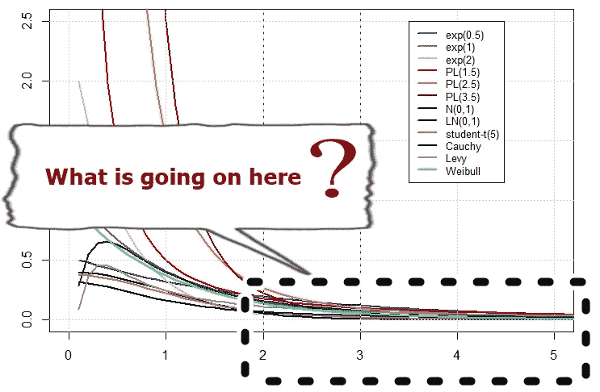

在第 1 部分中，我们讨论随机变量具有**“厚尾”**分布意味着什么。

## 远吗？胖？

为了理解厚尾现象，我们需要回答以下两个问题。

> 1.多远才算远？
> 2。多胖才算胖？

要谈尾巴，我们需要确定多远才算远，才能决定离中间多远才算远，才能说它是‘尾巴’。换句话说，尾巴从哪里开始？**看情况！不幸的是，没有单一的答案。**

考虑正态分布。注意有两条尾巴:右边和左边。例如，如果我们想用一个标准差来描述分布的“右”尾，那么阴影部分指的是正态分布的右尾。

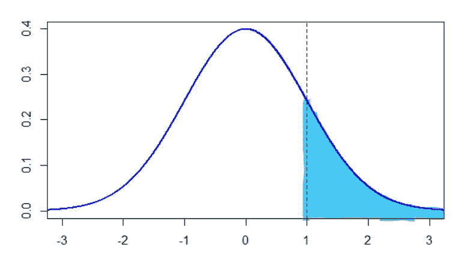

图。一

**形式上**，我们可以这样描述尾巴:

*   右尾:P(X>x)
*   左尾:P(X≤-x)

对于一个**大的**值‘x’。现在，我们知道了“尾巴”的概念。

```
**[R codes for Tail]**
#For normal distribution with value 'x=a'
a=1
1-pnorm(a) #right tail
pnorm(-a)  #left tail
```

## 每个分布都有尾巴吗？

想想[0，1]上的均匀分布。它有尾巴吗？在这个[博客](https://blogs.sas.com/content/iml/2014/10/13/fat-tailed-and-long-tailed-distributions.html)中，它说不是每个发行版都有尾巴。

> 如果你想要“尾部的行为”来描述当“x”变大时 pdf 的特征，那么有界分布没有尾部。然而，尾部的一些特征是可以量化的。特别是，通过使用极限和渐近行为，你可以定义重尾的概念。 [SAS 博客](https://blogs.sas.com/content/iml/2014/10/13/fat-tailed-and-long-tailed-distributions.html)

我将在下面解释(指数)有界/无界分布。到了那里请提醒自己制服发放！

## 我们为什么要关心分配的“尾部”部分？

分布的尾部一直是风险管理的主要关注点。例如，收益或损失分布的两个最常用的风险度量是 ***【风险值】*** 和 ***【预期亏空】***

## 为什么损失不还？

*   损失实际上是负(-)回报
*   将极限取负无穷大是不直观的。所以我们取返回值的负值，也就是说，将分布翻转到 y 轴上。

*看看 VaR 和 ES 这两个量和‘尾巴’有什么关系就知道了。不需要理解它们背后的数学或含义。*

****

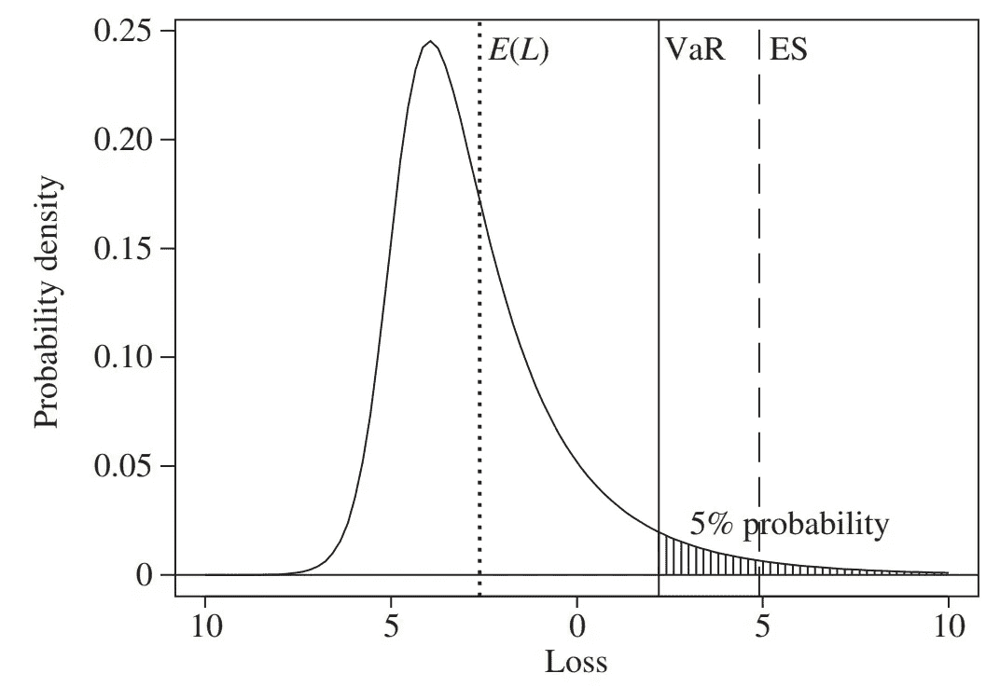

图。2 //资料来源:Ch2，量化风险管理(以下简称 QRM ),作者麦克尼尔等人

考虑损失的分布， **L** ，相当于**(负)回报**，在给定的持有期内。为了便于理解，我们假设明天损失的随机变量遵循正态分布:


然后，我们可以通过以下方式计算 VaR:

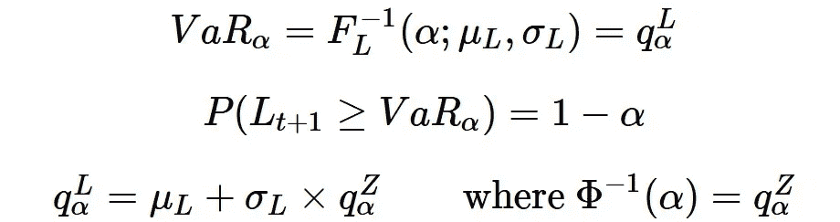

来源:埃里克·齐沃特的课堂笔记

**通过第二条线，我们可以很容易的检查出 VaR 只是一个与胖尾相关的量。**关于风险值的更多细节，请查看《量化风险管理:概念、技术和工具》一书的第二章，以及 Eric Zivot 在他网站上的讲座笔记。

```
**[R codes for VaR]**alpha = 0.95 #significant level
VaR.alpha = qnorm(alpha, mu, sigma)
VaR.alpha = mu + sigma*qnorm(alpha, 0, 1)
```

同样，我们可以看到**预期短缺**是一个与分布尾部相关的量:

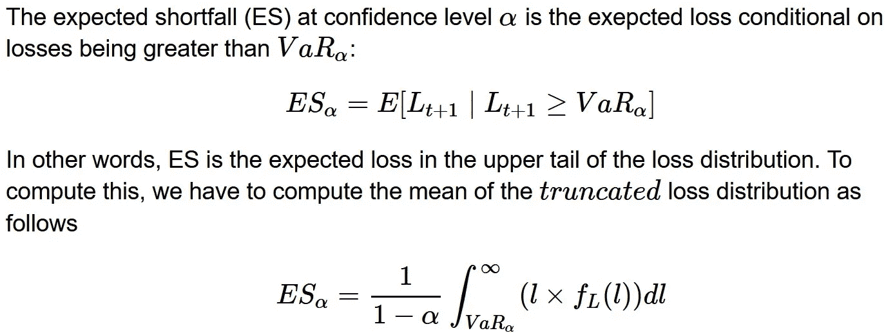

来源:埃里克·齐沃特的课堂笔记

在第四行中，它表示“ES 是损失分布的上“**尾“**中的预期损失”。类似于 VaR，在正态分布的情况下，现在计算 ES 很方便，因为它只是一个截尾正态分布的**均值。**

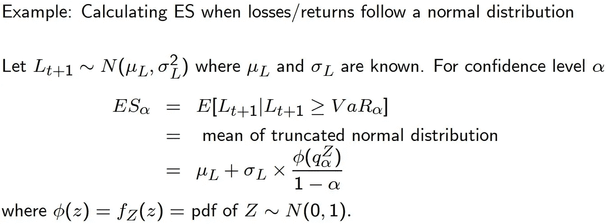

来源:埃里克·齐沃特的课堂笔记

```
**[R codes for ES]**
alpha = 0.95
q.alpha.z = qnorm(alpha)
ES.alpha = mu + sigma*(dnorm(q.alpha.z)/(1-alpha))
```

如果有人好奇我们为什么除以 1 — *α，*这只是一个**归一化常数(或比例因子)**以确保截断损失分布的积分为 1，这是概率分布的一个要求。

回到“尾部”的故事，我只想强调尾部分布被广泛用作风险管理工具。

## 多胖才算胖？多重才算重？

既然我们弄清楚了分布中的‘尾巴’是什么，用在什么地方，现在就该说说‘肥’的部分了。我们都知道正态分布没有厚尾。相反，我们被教导在对金融回报序列建模时使用 student-t 分布和对数正态分布来考虑“厚尾”特性。但是我们需要知道肥尾的定义。不幸的是，*脂肪*这个词没有统一的定义。

我将试着解释英语、图形和数学的**语言中的胖尾巴。希望你至少喜欢这三个中的一个。**

# 在英语中，

*   重尾分布具有比指数分布更重的尾部(Bryson，1974)
*   当尾部比指数分布衰减得更慢时，称分布具有重尾。

# 为什么是指数？

使用指数分布作为参考是很方便的。指数分布的 pdf 以“指数”方式快速接近零。也就是说，pdf 的尾部**看起来像(但表现不同于)**指数分布。

# 用图表的语言来说，

我将向您展示 4 个不同的图表，显示在一组不同分布的最右侧尾部发生的情况，如下所示:

*   指数分布
*   幂律分布
*   正态分布
*   对数正态分布
*   学生 t 分布
*   柯西分布
*   征税分布
*   威布尔分布

我不会解释每一个发行版。相反，让我们欣赏一下这些分布图，感受一下尾部的情况。第一个图形显示了整个图形中“x”位于[0，5]中的部分

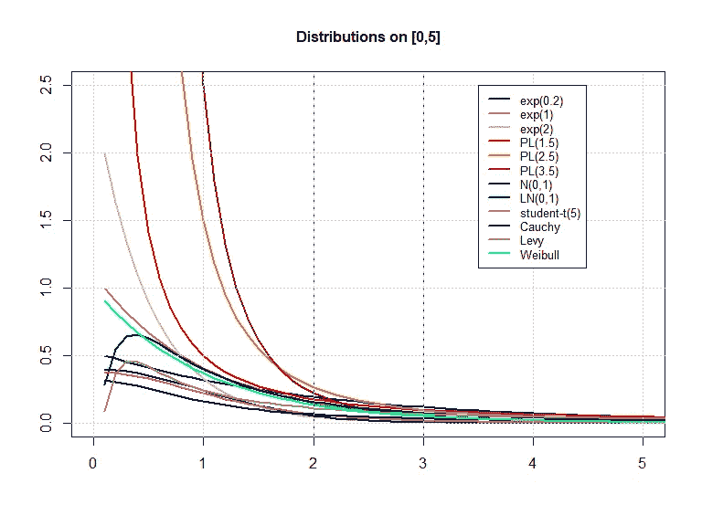

图。5，文档末尾提供了该图的 R 代码

根据上面的图 5，我们无法判断尾巴的行为。但是，这里有一些事情值得一提

*   正态分布、student-t 分布和柯西分布都是双尾分布。所有其他的都是单尾分布
*   对于 PL(2.5)和 PL(3.5)，在 x=1.7 附近有一个交叉点，说明 PL(2.5)的尾部较粗。

让我们看看当 x 位于[5，8]时是什么样子。请注意，y 轴上的值会变得更小。

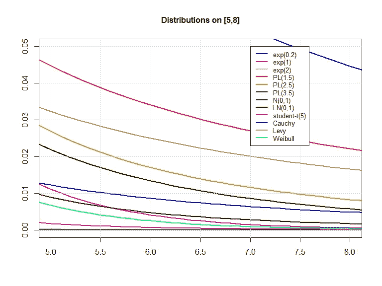

图。6

## 问:你在这个图表中看到了什么？

答:最上面的线会有最粗的尾巴！(但也不尽然！！！)你就知道为什么了！

在此之前，让我们检查一下上面图 6 中的重要事实。

*   当 x=5 时，正态和 exp(2)分布在 0 附近爬行。尤其对于正态分布，其 5 标准差的 pdf 值为 0.000001486 (=pnorm(5))。这大约是柯西分布的 8000 倍。换句话说，在柯西分布下，5 sigma 事件发生的可能性是正态分布的 8000 倍。
*   在图 6 中，请记住 exp(0.2)分布位于对数正态分布和幂律分布之上。请检查在扩展“x”值的范围后，它是如何在下图中反转的。

让我们看看当 x 位于[8，100]时是什么样子。同样，请注意 y 轴上的值会变得小得多。

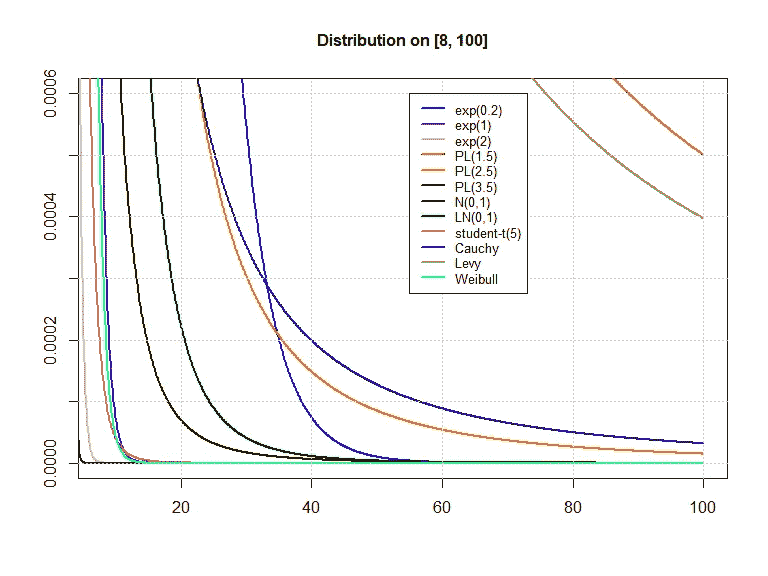

图。七

*   请注意，蓝线 exp(0.2)在穿过另外两条线 PL(2.5)和 Cauchy 时衰减很快。**这就是“衰减慢于指数分布”的含义**
*   看到“x”等于 100 附近发生的情况令人惊讶。其 PL(1.5)的 pdf 值为 0.0005。难怪对于 PL(1.5)，一阶矩和二阶矩(均值和方差)都是无穷大。这方面的详细信息将在下一篇文档中介绍。敬请期待！

# 让我们放大 y 轴来详细看看它是如何表现的！

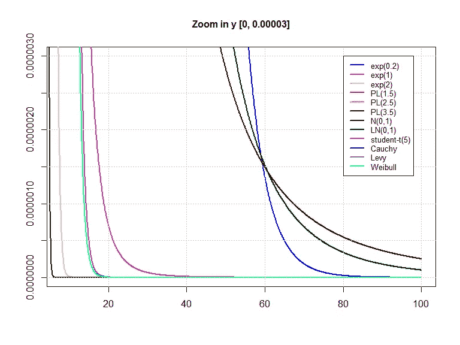

图。8

*   令人惊讶的是，蓝线 exp(0.2)通过穿过 PL(3.5)和 LN(0，1)而减小。此外，我们可以看到 LN(0，1)比 PL(3.5)衰减得更快，因为它穿过 PL(3.5)并在它下面。
*   PL(1.5)、PL(2.5)和 Levy 分布甚至没有显示在该图中。

# 在数学语言中，

## **‘重’vs‘胖’**

厚尾分布是重尾分布的一个子类。这意味着尽管每一个厚尾分布都是重尾分布，但反过来就不成立(例如，威布尔分布)。根据杰伊·泰勒的[讲义](https://math.la.asu.edu/~jtaylor/teaching/Spring2016/STP421/lectures/stable.pdf)，他用以下方式区分了胖子和胖子。

# 重尾的定义

*   如果尾部是“非”**指数有界的**，则称分布有一个**右重尾**

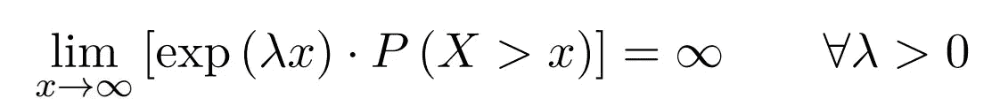

等式 1

我们可以解读为，当‘x’变大时，指数增长的速度快于重右尾上概率下降的速度。花点时间想想吧！

看看它是如何与英语定义联系起来的。

*   比指数衰减慢的概率分布函数被称为**右重尾。**

## 当指数有界时。

如果重的右尾不够重，即，当“x”趋向无穷大时，它衰减得非常快，那么等式 1 收敛到零。一个明显的例子是我们上面讨论的[0，1]上的均匀分布。一旦‘X’超过 1，X 大于 1 的概率变为零，因此它是指数有界的。另一个流行的例子是正态分布。设 X 为标准常态。画出一系列不同λ值的图表

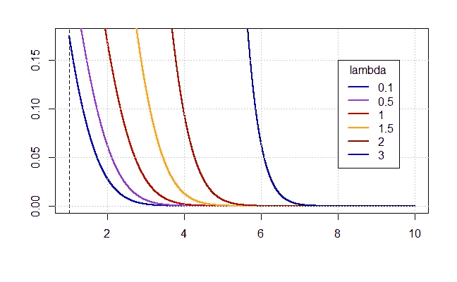

图。3

我们可以看到它收敛到零，所以正态分布的尾部是指数有界的。

```
**[R codes for Figure. 3]** f_exp = function(x, lambda){return (exp(lambda*x))
cdf_normal = function(x) pnorm(x)
ccdf_normal = function(x) {1-cdf_normal(x)}xs = seq(1,10,length=10000)
plot(xs, f_exp(xs,0.1)*ccdf_normal(xs), type='l', xlab='',ylab='', col='blue', lwd=2)
abline(v=1, lty = 'dashed')
lines(xs,f_exp(xs,0.5)*ccdf_normal(xs), col='purple', lwd=2)
lines(xs,f_exp(xs,1)*ccdf_normal(xs), col='red', lwd=2)
lines(xs,f_exp(xs,1.5)*ccdf_normal(xs), col='orange', lwd=2)
lines(xs,f_exp(xs,2)*ccdf_normal(xs), col='darkred', lwd=2)
lines(xs,f_exp(xs,3)*ccdf_normal(xs), col='darkblue', lwd=2)
grid()
legend(8, 0.15, 
       legend=c("0.1", "0.5","1","1.5","2","3"), title = "lambda",
       col=c("blue",'purple', "red",'orange','darkred','darkblue'), lwd=2, cex=1)
```

# 胖尾的定义

*   如果有一个称为尾部指数的正指数(α),则称分布有一个右厚尾(T1)


“~”的意思是不变的。或者说尾部与幂律成正比。准确地说，它的意思如下。

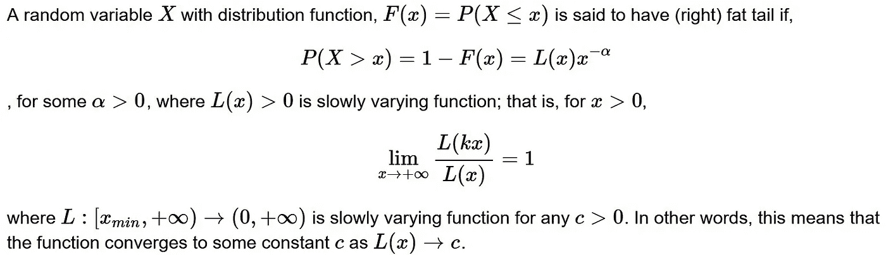

来源:[ [点击](http://tuvalu.santafe.edu/~aaronc/courses/7000/csci7000-001_2011_L2.pdf)，[ [点击](https://arxiv.org/abs/2001.10488)

如果数学对你来说很难，你可以跳过。

因此，厚尾分布的尾部遵循幂律(x 的负α次方)。对于那些不熟悉幂律的人来说，现在不用担心。想想当α等于 2 时的图形。

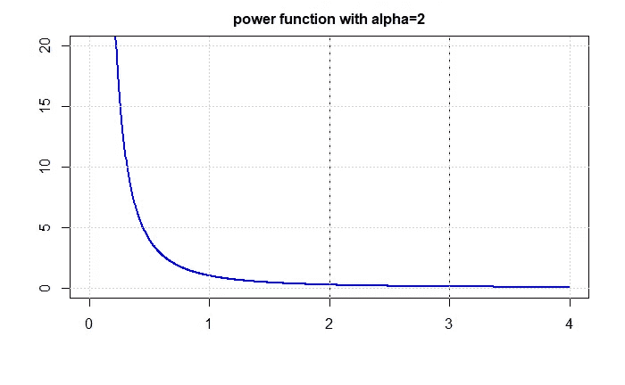

图。四

提醒自己，尾部看起来类似于我们在上面的图 5-8 中看到的幂律。我将在本系列的[第 2 部分]中更详细地解释幂定律。

# 摘要

我们在本文中直观地、图形化地和数学地讨论了“厚尾”这个概念。要理解“缓和的稳定分布”，就必须对厚尾有一个基本的了解。希望这份文件有助于提高你的理解。如果你有任何问题，请在下面评论。我希望你对接下来会发生什么感到好奇。下一次，我会带着[回到炼成稳定分布的旅程【部分。2:无限可分分布]](https://medium.com/@corr.roh/infinitely-divisible-distribution-586b18c63670) "

```
**[R Codes of Figure. 5]**
f_exp = function(x, lambda, xmin) {lambda*exp(-lambda*(x-xmin))}
f_power = function (x, k, x_min) {
            C = (k-1)*x_min^(k-1)
            return (C*x^(-k))
            }
f_cauchy = function(x) dcauchy(x)
f_levy = function(x) dlevy(x) # required package: 'rmulti'
f_weibul = function(x) dweibull(x,shape=1)
f_norm = function(x) dnorm(x)
f_lnorm = function(x) dlnorm(x)
f_t = function(x) dt(x,5)
xs = seq(0.1,100,length=1000)plot(xs, f_exp(xs,0.5,0.1),type='l',xlab='',ylab='', col='blue', lwd=2,
     main='Distributions on [0,5]', cex.main=1,
     xlim=c(0,5),
     ylim=c(0,2.5))
lines(xs,f_exp(xs,1,0.1), col='purple', lwd=2)
lines(xs,f_exp(xs,2,0.1), col='bisque3', lwd=2)
lines(xs,f_power(xs,1.5, 1), col='red', lwd=2)
lines(xs,f_power(xs,2.5, 1), col='orange', lwd=2)
lines(xs,f_power(xs,3.5, 1), col='darkred', lwd=2)
lines(xs,f_norm(xs),col='black', lwd=2)
lines(xs,f_lnorm(xs), col='darkgreen', lwd=2)
lines(xs,f_t(xs),  col='deeppink', lwd=2)
lines(xs, f_cauchy(xs), col='darkblue', lwd=2)
lines(xs, f_levy(xs), col='azure4', lwd=2)
lines(xs, f_weibul(xs), col='springgreen', lwd=2)
abline(v=2, lty = 'dashed')
abline(v=3, lty = 'dashed')
grid()
legend(3.5, 2.5, 
       legend=c("exp(0.2)", "exp(1)", 'exp(2)', "PL(1.5)", 'PL(2.5)', 'PL(3.5)', 'N(0,1)','LN(0,1)','student-t(5)','Cauchy','Levy','Weibull'),
       col=c("blue",'purple', 'bisque3',"red",'orange','darkred', 'black','darkgreen','deeppink','darkblue', 'azure4','springgreen'), lwd=2, cex=0.8)
```

## 参考资料:

[1]杰伊·泰勒，重尾分布(2013)，讲义，

[2] Eric Zivot，风险度量(2013)，课堂讲稿

[3] Aaron Clauset，复杂系统的推理、模型和模拟(2011)，讲义

[4][https://blogs . SAS . com/content/IML/2014/10/13/fat-tailed-and-long-tailed-distributions . html](https://blogs.sas.com/content/iml/2014/10/13/fat-tailed-and-long-tailed-distributions.html)

我还为上面所有的参考文献添加了超链接。请查阅参考资料了解详细信息。如果有我错过的任何事情，我将稍后更新参考。

感谢您阅读本文档。如果你觉得这份文件有用，别忘了与你的朋友分享。